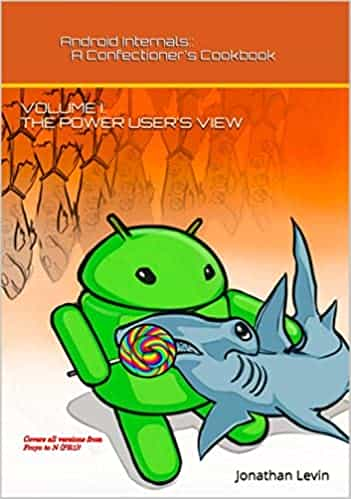

# Android Internals: Power User's View

Author: Jonathan Levin  (Author)

## Overview

Android Internals::A Confectioner's Cookbook is the first time the inner workings of the world's most popular operating system have been documented! Without going into the lengthy code, it presents the logic and flow of Android's various components using detailed illustrations, verbose annotations and hands-on experiments! Volume I takes the power user's point of view - the utilities and functionality accessible through adb shell. In particular, we explore: Partitions and Filesystems The Boot Process Init and its configuration files The native daemons in /system/bin The framework service architecture and servicemanager, Monitoring through Linux interfaces, and of course Security. All versions of Android - up to and including the upcoming Nougat - are covered, with examples taken from the wide gamut of Android Devices - Nexi, Samsung Galaxy S series, NVidia Shield, Amazon Kindle, HTC One M9, and the Android Emulator. This is the first in a multi-volume series, aiming to explore Android down to its last class. Stay tuned for Volume II - The Programmer's View - which picks up where the Power User's View ends, and dives deeper still into the frameworks, input, audio, video and network architecture... wading through the inevitable quagmire of code.

## Cover

