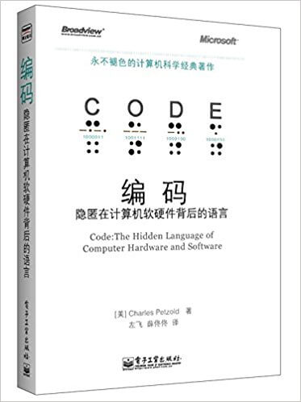

# Code: The Hidden Language of Computer Hardware and Software

Author: Charles Petzold

## Content

Petzold begins Code by discussing older technologies like Morse code, Braille, and Boolean logic, which he uses to explain vacuum tubes, transistors, and integrated circuits. He noted that "very smart people" had to go down the "dead ends" of mechanical computers and decimal computing before reaching a scalable solution—namely, the electronic, binary computer with a von Neumann architecture. The book also covers more recent developments, including topics like floating point math, operating systems, and ASCII.

The book focuses on "pre-networked computers" and does not cover concepts like distributed computing because Petzold thought that it would not be as useful for "most people using the Internet", his intended audience. Specifically, he said in an interview that his "main hope" in writing Code was to impart upon his readers a "really good feeling for what a bit is, and how bits are combined to convey information".

## Cover

