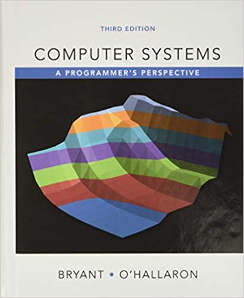

# Computer Systems: A Programmer's Perspective

Author: Randal Bryant (Author), David O'Hallaron (Author)

## Overview

This book (CS:APP3e) is the third edition of a book that stems from the introductory computer systems course we developed at Carnegie Mellon University, starting in the Fall of 1998, called "Introduction to Computer Systems" (ICS). The presentation is based on the following principles, which aim to help the students become better programmers and to help prepare them for upper-level systems courses:

* Students should be introduced to computer systems from the perspective of a programmer, rather from the more traditional perspective of a system implementer. What does this mean?

* Students should get a view of the complete system, comprising the hardware, operating system, compiler, and network.

* Students learn best by developing and evaluating real programs that run on real machines.

We cover data representations, machine level representations of C programs, processor architecture, program optimizations, the memory hierarchy, linking, exceptional control flow (exceptions, interrupts, processes, and Unix signals), virtual memory and memory management, system-level I/O, basic network programming, and concurrent programming. These concepts are supported by series of fun and hands-on lab assignments. See the manuscript Preface for more details.

## Cover

