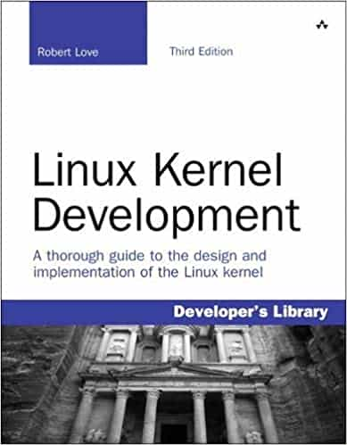

# Linux Kernel Development

Author: Robert Love  (Author)

## Book description

*Linux Kernel Development* details the design and implementation of the Linux kernel, presenting the content in a manner that is beneficial to those writing and developing kernel code, as well as to programmers seeking to better understand the operating system and become more efficient and productive in their coding.

The book details the major subsystems and features of the Linux kernel, including its design, implementation, and interfaces. It covers the Linux kernel with both a practical and theoretical eye, which should appeal to readers with a variety of interests and needs.

The author, a core kernel developer, shares valuable knowledge and experience on the 2.6 Linux kernel. Specific topics covered include process management, scheduling, time management and timers, the system call interface, memory addressing, memory management, the page cache, the VFS, kernel synchronization, portability concerns, and debugging techniques. This book covers the most interesting features of the Linux 2.6 kernel, including the CFS scheduler, preemptive kernel, block I/O layer, and I/O schedulers.

The third edition of Linux Kernel Development includes new and updated material throughout the book:

* An all-new chapter on kernel data structures
* Details on interrupt handlers and bottom halves
* Extended coverage of virtual memory and memory allocation
* Tips on debugging the Linux kernel
* In-depth coverage of kernel synchronization and locking
* Useful insight into submitting kernel patches and working with the Linux kernel community

## Cover

