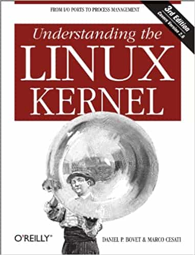

# Understanding the Linux Kernel

Author: Daniel P. Bovet  (Author), Marco Cesati  (Author)

## Overview

In order to thoroughly understand what makes Linux tick and why it works so well on a wide variety of systems, you need to delve deep into the heart of the kernel. The kernel handles all interactions between the CPU and the external world, and determines which programs will share processor time, in what order. It manages limited memory so well that hundreds of processes can share the system efficiently, and expertly organizes data transfers so that the CPU isn't kept waiting any longer than necessary for the relatively slow disks.

The third edition of *Understanding the Linux Kernel* takes you on a guided tour of the most significant data structures, algorithms, and programming tricks used in the kernel. Probing beyond superficial features, the authors offer valuable insights to people who want to know how things really work inside their machine. Important Intel-specific features are discussed. Relevant segments of code are dissected line by line. But the book covers more than just the functioning of the code; it explains the theoretical underpinnings of why Linux does things the way it does.

This edition of the book covers Version 2.6, which has seen significant changes to nearly every kernel subsystem, particularly in the areas of memory management and block devices. The book focuses on the following topics:

- Memory management, including file buffering, process swapping, and Direct memory Access (DMA)
- The Virtual Filesystem layer and the Second and Third Extended Filesystems
- Process creation and scheduling
- Signals, interrupts, and the essential interfaces to device drivers
- Timing
- Synchronization within the kernel
- Interprocess Communication (IPC)
- Program execution

*Understanding the Linux Kernel* will acquaint you with all the inner workings of Linux, but it's more than just an academic exercise. You'll learn what conditions bring out Linux's best performance, and you'll see how it meets the challenge of providing good system response during process scheduling, file access, and memory management in a wide variety of environments. This book will help you make the most of your Linux system.

## Cover

