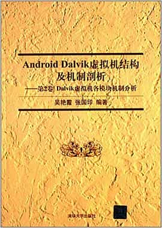

# Android Dalvik virtual machine structure and mechanism analysis

Author: Wu Yanxia / Zhang Guoyin

## Overview

This book is a scenario-based in-depth analysis of Android source code, with extensive contents, mainly from the overall structure of Dalvik virtual machine, obtaining and compiling the source code of Dalvik virtual machine, using source code analysis aids, parsing .dex files and Dalvik bytecode format, introducing the system tools under Dalvik virtual machine and executing Dalvik virtual machine. This article is intended to help readers understand the architecture of the Dalvik VM from a macro perspective, and to provide readers interested in reading the source code of the Dalvik VM with the necessary introductory guidance.

## Cover

