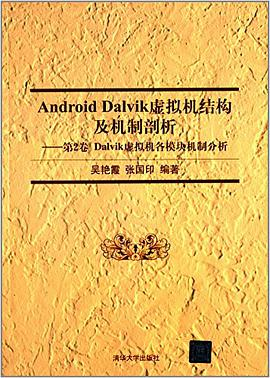

# Android Dalvik虚拟机结构及机制剖析

Author: 吴艳霞 / 张国印

## Overview

是一本以情景方式对Android的源代码进行深入分析的书，内容广泛，主要从Dalvik虚拟机整体结构、获取和编译Dalvik虚拟机的源码、源码分析辅助工具使用、.dex文件及Dalvik字节码格式解析、Dalvik虚拟机下的系统工具介绍及Dalvik虚拟机执行流程简述等方面进行阐述，帮助读者从宏观上了解Dalvik虚拟机的架构设计，为有兴趣阅读Dalvik虚拟机源码的读者提供必要的入门指导。

## Cover

