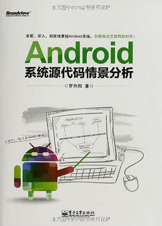

# Android系统源代码情景分析

Author: 罗升阳

## Overview

在内容上，本书结合使用情景，全面、深入、细致地分析Android系统的源代码，涉及到Linux内核层、硬件抽象层（HAL）、运行时库层(Runtime)、应用程序框架层(Application Framework)以及应用程序层(Application)。

在组织上，本书将上述内容划分为初识Android系统、Android专用驱动系统和Android应用程序框架三大篇章。初识Android系统篇介绍了参考书籍、基础知识以及实验环境搭建；Android专用驱动系统篇介绍了Logger日志驱动程序、Binder进程间通信驱动程序以及Ashmem匿名共享内存驱动程序；Android应用程序框架篇从组件、进程、消息以及安装四个维度来对Android应用程序的框架进行了深入的剖析。

通过上述内容及其组织，本书能使读者既能从整体上把握Android系统的层次结构，又能从细节上去掌握每一个层次的要点。

## Cover

