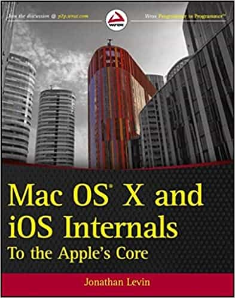

# Mac OS X and iOS Internals: To the Apple’s Core

Author: Jonathan Levin  (Author)

## Overview

Powering Macs, iPhones, iPads and more, OS X and iOS are becoming ubiquitous. When it comes to documentation, however, much of them are shrouded in mystery. Cocoa and Carbon, the application frameworks, are neatly described, but system programmers find the rest lacking. This indispensable guide illuminates the darkest corners of those systems, starting with an architectural overview, then drilling all the way to the core.

- Provides you with a top down view of OS X and iOS
- Walks you through the phases of system startup—both Mac (EFi) and mobile (iBoot)
- Explains how processes, threads, virtual memory, and filesystems are maintained
- Covers the security architecture
- Reviews the internal Apis used by the system—BSD and Mach
- Dissects the kernel, XNU, into its sub components: Mach, the BSD Layer, and I/o kit, and explains each in detail
- Explains the inner workings of device drivers

From architecture to implementation, this book is essential reading if you want to get serious about the internal workings of Mac OS X and iOS.

## Cover

