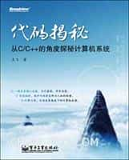

# 代码揭秘

Author: 左飞

## Overview

本书从程序设计角度出发，以C/C++为描述语言，以Visual C++为形式工具，将隐藏在代码背后的关于计算机组成原理、计算机操作系统等方面的机制和知识娓娓道来，不仅让读者知其然，更要让读者知其所以然。并让这些知识再反作用于编程实践，从而帮助读者写出更适合机器优化的高质量代码。揭开代码背后鲜为人知的秘密，具体说来，全书主要讨论了包括计算机底层编码、内存与指针、计算机指令与代码系统、函数调用的机制、多级存储系统、线程与进程的概念以及代码优化等多个方面的话题。

## Cover

