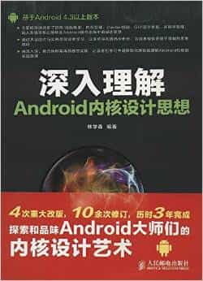

# 深入理解Android内核设计思想

Author: 林学森

## Overview

《深入理解Android内核设计思想》适用于Android 4.3以上的版本。全书从操作系统的基础知识入手，全面剖析进程/线程、内存管理、Binder机制、GUI显示系统、多媒体管理、输入系统等核心技术在Android中的实现原理。书中讲述的知识点大部分来源于工程项目研发，因而具有较强的实用性，希望可以让读者“知其然，更知其所以然”。全书分为编译篇、系统原理篇、应用原理篇、系统工具篇共4篇22章，基本涵盖了参与Android开发所需具备的知识，并通过大量图片与实例来引导读者学习，以求尽量在源代码分析外为读者提供更易于理解的思维方式。

《深入理解Android内核设计思想》既适合Android系统工程师，也适合于应用开发工程师来阅读提升Android开发能力。读者可以在《深入理解Android内核设计思想》潜移默化的学习过程中更深刻地理解Android系统，并将所学知识自然地应用到实际开发难题的解决中。

## Cover

