# Lab 1: Packet Sniffing and Wireshark

In reality, e-discovery (digital forensics) is the process of <u>obtaining, preserving, analyzing and presenting</u> evidence of computer intrusion, sabotage, fraud, attack and other crimes in a manner consistent with legal norms by using computer software and hardware technologies. The forensics-related topics in CTF are the process of obtaining the flags placed by the questioner by analyzing the files containing relevant records and traces, such as traffic packets, log files, disk memory images, etc. Forensics-related topics are characterized by a large amount of information, and it may take a very long time to analyze them one by one, so it is essential to master efficient analysis methods.

This section will introduce three common forensic scenarios in CTF, namely <u>traffic analysis, memory image forensics and disk image forensics</u>, the reader needs to master the pre-requisite knowledge including computer network basics, file system basics and operating system basics.

## Traffic Analysis

### Wireshark and Tshark

A traffic packet is generally a traffic file in PCAP format obtained by traffic crawling of a network device on a computer using tools such as tcpdump. The graphical tool Wireshark and its command line tool Tshark can analyze such traffic packets. Wireshark is free software (official website is https://www.wireshark.org/) and supports the analysis of multiple protocols and also supports the traffic capture function.

The interface of Wireshark is shown in Figure 9-3-1. After loading the traffic packet you can see the network traffic, protocols and status are distinguished by color, click on a traffic to see the details of the traffic. Enter the filter expression in the filter field to filter the traffic and see the required network traffic. If you want to filter network traffic for the FTP protocol, enter the FTP expression to see the results (see Figure 9-3-2).

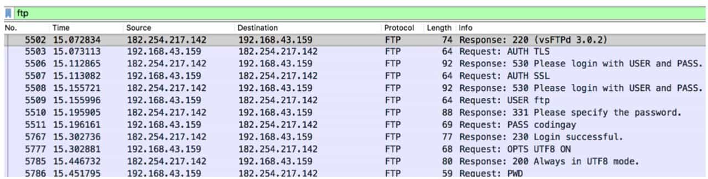

Tshark is a command-line tool for Wireshark. Wireshark builds the metadata of traffic packets in memory, so Tshark is useful for analyzing huge traffic packets and can significantly improve performance. Tshark's command-line parameters are very complex, and the details of how to use them can be found at https://www.wireshark.org/ docs/man-pages/tshark.html for details. An example of filtering FTP protocols in the same traffic packets as the previous section is shown in Figure 9-3-3.

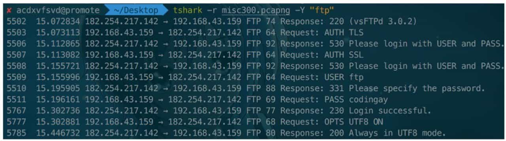

### Traffic analysis common operations

Wireshark's "Statistics" menu allows you to view the general status of traffic packets, such as which protocols are included, which IP addresses are involved in the session, and so on. Figure 9-3-4 and Figure 9-3-5 show the protocol hierarchy statistics and session statistics, respectively. These two functions can help us quickly locate the point that needs to be analyzed, because the traffic analysis in CTF often has a lot of interference traffic, and the traffic required by the questioner is usually obtained in the LAN or a specific few hosts, by viewing the traffic information can greatly save the time to find the traffic that needs to be analyzed.

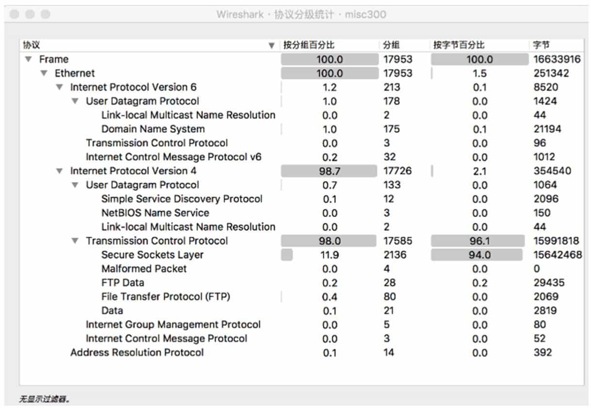

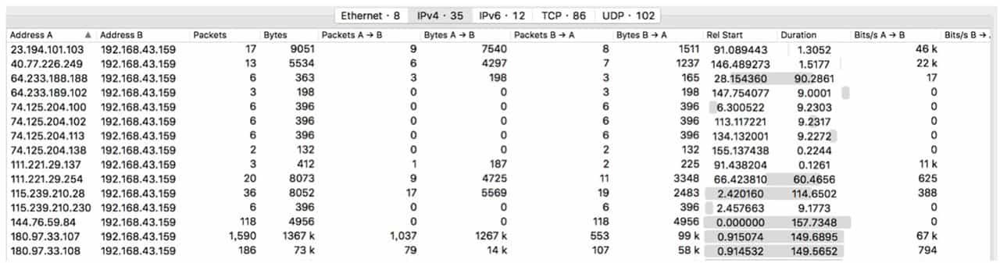

The most widely used transport layer protocol in computer networks is TCP, which is a connection-oriented protocol that allows both transmitting parties to ensure transparent transmission and only care about the data they get. However, in the actual transmission process, TCP traffic can be sliced into many small datagrams due to the MTU, making it inconvenient to analyze. To address this situation, Wireshark provides the ability to trace TCP streams. By selecting a datagram and right-clicking on "Trace TCP Stream", you can obtain all the data transmitted by both parties in the TCP session for further analysis, see Figure 9-3-6.

For common protocols such as HTTP, Wireshark provides an export object function (in the "File" menu) that makes it easy to extract information such as files sent during transmission. Figure 9-3-7 shows the export function for HTTP objects.

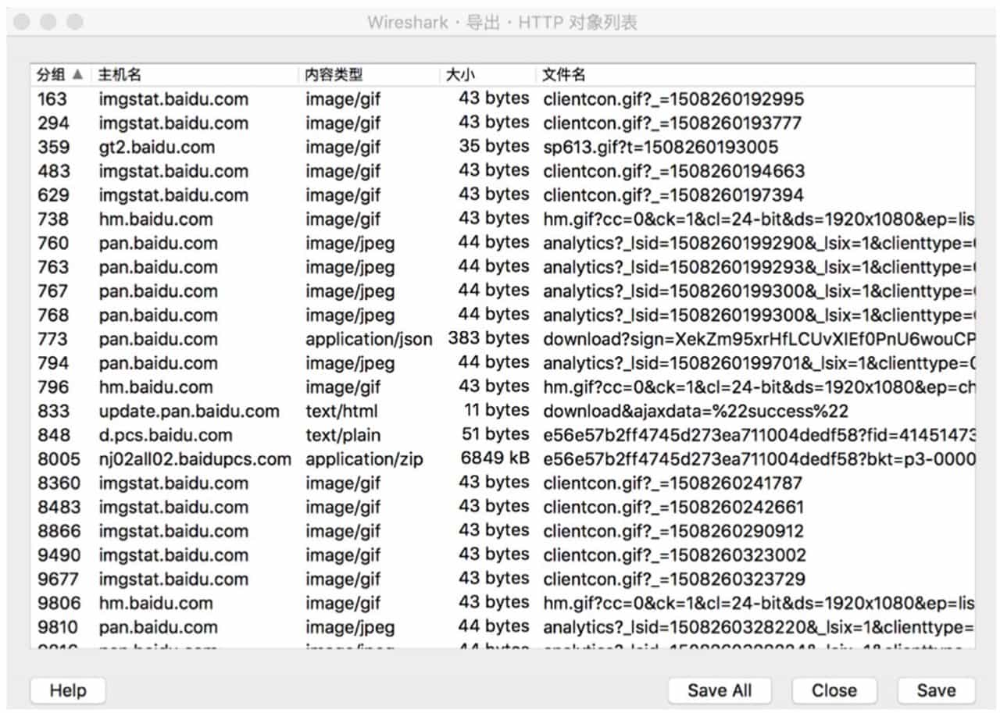

Sometimes the traffic packets that need to be analyzed are almost always encrypted traffic for the SSL protocol, and if the SSL key log can be obtained from another location in the topic, then Wireshark can be used to attempt to decrypt the traffic. The Wireshark parsable SSL key log file is shown below.

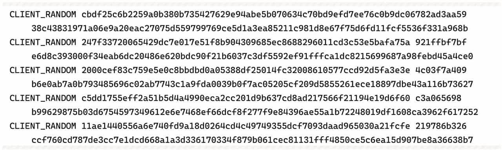

After obtaining this form of key log, we can open Wireshark's preferences, select the SSL protocol in the "Protocol" option, and then fill in the path to the key file in "(Pre)-Master-Secret Log Filename" (see Figure 9-3-8), and then decrypt some of the SSL traffic.

Due to the complexity of network protocols, there are far more places where data can be hidden than just the normal transmission flow. Therefore, when analyzing network traffic packets, if no breakthrough can be found from the data transmitted in the normal way, then it is necessary to focus on some protocols that look abnormal in the traffic packets and carefully examine the fields to observe whether there is any imprint of hidden data. Figure 9-3-9 and Figure 9-3-10 are examples of using the length of ICMP datagram to hide information in a foreign CTF competition.

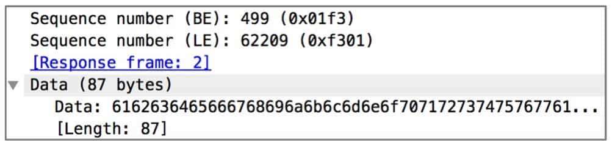

### Analysis of special kinds of traffic packages

There are some special kinds of traffic analysis in CTF, and the traffic package provided in the title is not network traffic, but other types of traffic. This section will introduce the analysis method of USB keyboard and mouse traffic.

USB traffic packets in Wireshark are shown in Figure 9-3-11. In CTF, we only need to focus on USB Capture Data, that is, the acquired USB data, according to the form of data can determine the different USB devices. Detailed documentation about USB data can be obtained from the official USB website, such as https://www.usb.org/sites/default/files/documents/hut1_12v2.pdf and https://usb.org/sites/default/files/ documents/hid1_11.pdf.

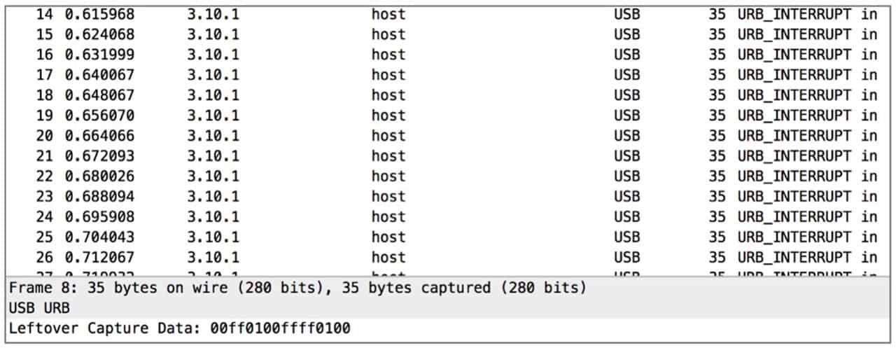

The USB keyboard datagram has 8 bytes each time, and the specific meaning is shown in Table 9-3-1.

Since it is usually pressed one key at a time during normal use, you only need to pay attention to the key combination status of byte 0 and the key code of byte 2. See Table 9-3-2 for the meaning of the 8-bit key combination in byte 0.

The USB mouse datagram is 3 bytes, see Table 9-3-3 for the specific meaning.

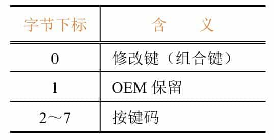

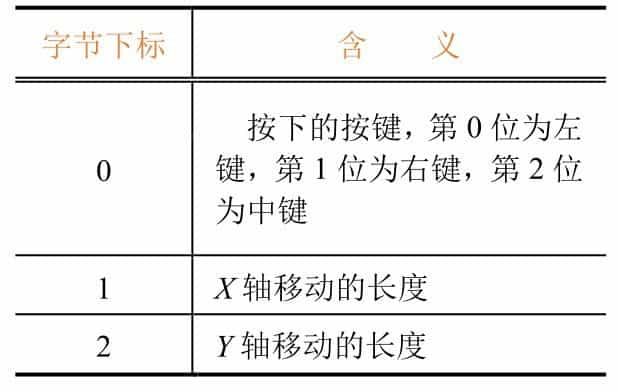

The partial mapping table for the keyboard keys is shown in Figure 9-3-12 (from the official USB documentation), the full mapping table can be found on the official USB website.

For a USB traffic packet, the Tshark tool can easily obtain the pure data fields: tshark-r filename.pcapng-T fields-e usb.capdata
After obtaining the data, according to the previous meaning, using languages such as Python, you can write scripts to restore the information and get it for further analysis.

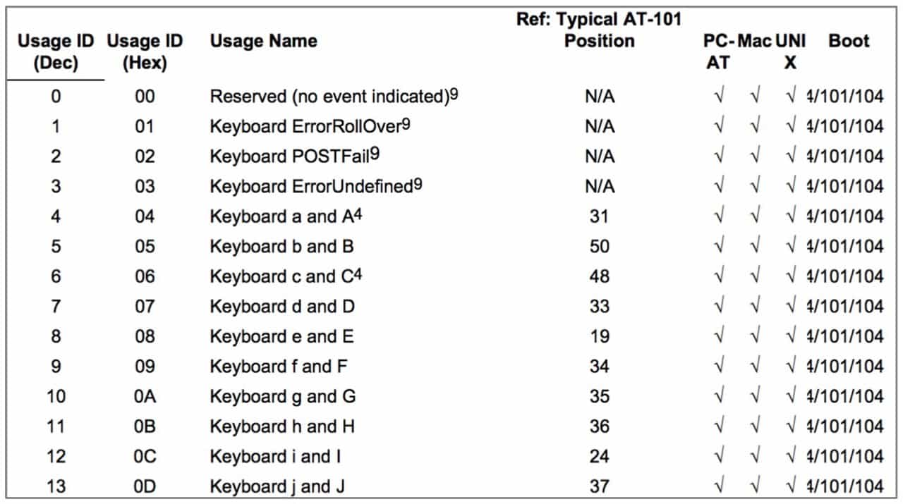

### Summary of traffic packet analysis

In CTF, there are a variety of traffic packet analysis topics, and the above is just a brief introduction to the common test points and basic solution ideas. If you encounter other types of questions, the reader also needs to be familiar with the corresponding protocols to analyze where information may be hidden.

## Memory Image Forensics

### Introduction to memory image forensics

Memory forensics questions in CTF take the form of providing a complete memory image or a core dump file, and participants should analyze information such as the processes being executed in memory to solve what they need. Memory forensics often works in conjunction with other forensics, and a common framework is Volatility, an open source professional memory forensics tool from the Volatility Open Source Foundation that supports memory image analysis for Windows, Linux, and other operating systems.

### Common operations for memory image forensics

When we get a memory image, we first need to determine the basic information of the image, the most important of which is to determine what kind of operating system the image is. volatility tool provides the basic analysis of the image, using the imageinfo command to get the image information, see Figure 9-3-13.

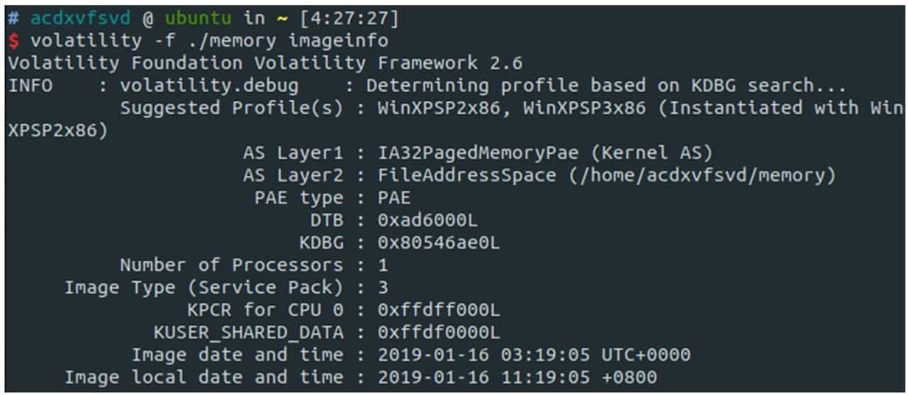

Once we have the image information, we can use a specific configuration file to analyze the image. Volatility provides many commands for analyzing processes, such as pstree, psscan, pslist, etc. These commands vary in strength and output. Figure 9-3-14 shows the process information obtained using psscan.

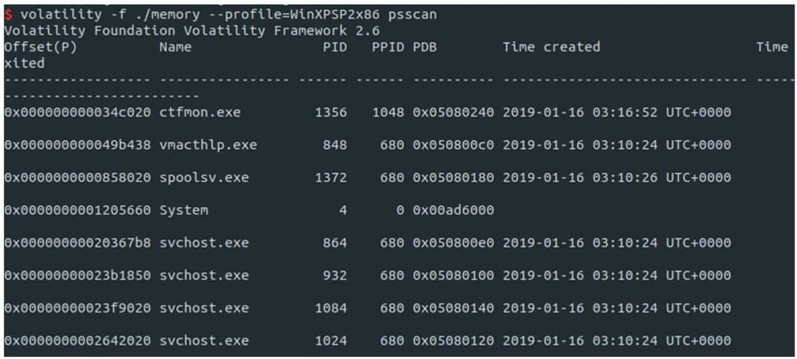

In addition, the filescan command can scan open files, as shown in Figure 9-3-15. When a suspicious file or process in memory is identified, the relevant data can be exported using the dumpfile and memdump commands, and then the exported data can be binary analyzed. the Screenshot function can obtain a screenshot of the system at this moment, see Figure 9-3-16.

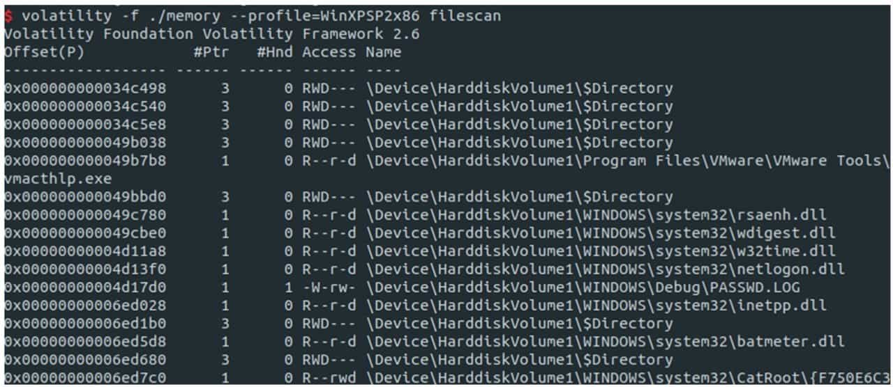

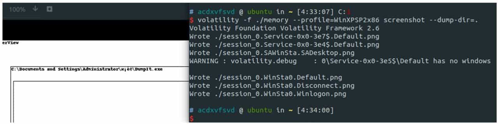

For different systems, Volatility supports many unique features, such as support for getting text directly from an open Notepad process under Windows, or Dumping out information such as password hash values contained in memory about Windows logins.

Volatility supports third-party plugins, and there are many developers who have developed powerful plugins such as https://github.com/superponible/volatility-plugins. When the commands that come with the framework don't meet your needs, look for a good plugin.

### Memory Image Forensics Summary

For memory forensics topics, we can easily solve them if we are familiar with the common commands of Volatility tools and can analyze the extracted files in combination with other types of knowledge (e.g. image steganography, zip analysis, etc.).

## Disk image forensics

### Introduction to disk image forensics

Disk forensics questions in CTF typically provide a disk image in an unknown format, and participants need to analyze the usage traces left by the user to find hidden data. Since disk forensics is a file-based analysis, it often appears alongside other directions that examine forensics and are closer to real forensics work. Compared to memory forensics, disk forensics is generally more informative, although it is relatively easy to locate specific usage traces of users because it contains more information. Disk forensics generally does not require specialized software, unless it is a disk image in some special format, such as VMWare's VMDK or Encase's EWF.

### Common operations for disk image forensics

Similar to memory forensics, the first step in disk forensics is to determine the type of disk and mount it, which can be done with the file command that comes with UNIX/Linux, see Figure 9-3-17.

After confirming the type, you can use the "fdisk-l" command to view the volume information on the disk and get the type, offset, etc. of each volume, see Figure 9-3-18. Then you can mount the disk image using the "mount" command. mount The format of the command is as follows.

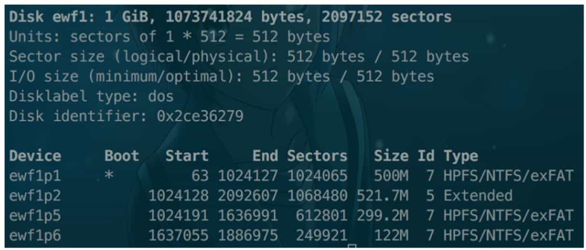

For local file mounts, the "loop" item is included, and if it is a multi-partition image as described above, then the "offset" item should be added and its value specified. If the file system is not natively supported by the system, then you need to install the relevant driver, such as NTFS-3g driver for mounting NTFS file system under Linux. The successfully mounted folder is shown in Figure 9-3-19.

Once the image is mounted, the questioner must have operated on the file system when creating the image, so you can follow the common forensic steps to analyze the file system usage traces. For example, the ".bash_history" file in the Linux file system and the Recent folder under Windows will have a history of operations on the file system, see Figure 9-3-20.

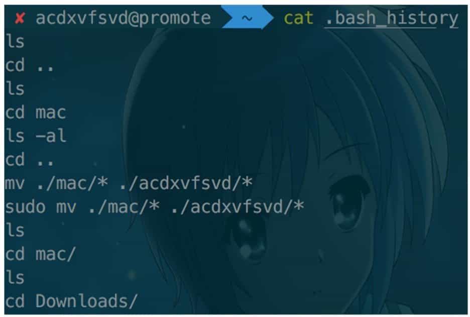

Once the suspicious file is obtained, it can be extracted for binary analysis. In most cases, the suspicious file itself will use other information hiding techniques, such as steganography.

There are also disk image forensic type questions that focus on the unique features of certain file systems, such as inode recovery in EXT series file systems, FAT table recovery in FAT series file systems, snapshot features and nanosecond timestamp features of APFS file systems, etc. When you encounter a bottleneck in the analysis of a file, you may want to understand the characteristics of the file system itself to find a breakthrough.

### Disk image forensics summary

Disk forensics questions are actually similar to memory forensics questions and are often combined with compressed package analysis, image steganography, and other types of questions. As long as the participant is familiar with common images, can determine the type of image and mount or extract the file, and with a certain understanding of the file system, he or she can successfully solve hard disk forensics related questions.

## Summary

With the continuous development of CTF, Misc type questions examine a wider and wider range of knowledge points, and become more and more difficult compared to the simple picture steganography of a few years ago. Due to the limitation of space, this chapter only briefly introduces several sets of questions that appear more frequently in the CTF. As written in the introduction of this chapter, in high quality competitions, in addition to the set of questions introduced in this chapter, participants often encounter many novel questions, which either examine the depth and breadth of the participants' knowledge, or examine the participants' ability to learn quickly. These require the participants to have certain computer expertise, as well as the need to search and read a lot of information with the help of search engines, and to solve the topics through rapid learning.

## Assignment

### (1-Easy) Sign in

What's a CTF? Join our QQ Group to get the flag!

### (2-Medium) HTTP code 206

Flag? Flag!

`Flag format: flag{xxxxxxxx}`

Download attachment: [fenxi.pcapng](../assets/fenxi.pcapng)

### (3-Hard) Time-based SQL Injection

In fact this isn't a Web challenge.

`Flag format: flag{xxxxxxxx}`

Download attachment: [sql.pcapng](../assets/sql.pcapng)

