# Attack with Defense

Attack with Defense 是 CTF 攻防比赛模式。区别于传统的 Jeopardy 解题模式，AWD 更注重时效性，且对参赛选手的攻击、防御技能均有所要求。

## 定义

AWD 中有如下定义：

- **比赛**：指从开始到结束的一整场比赛过程。
- **轮**：指一个单独的时间区间，分数计算的最小周期，一般为 10 分钟。 一场比赛由许多轮组成，可以理解为：`总轮数 = 比赛总时长 / 单轮时长`。
- **选手**：指比赛的参赛队伍，通常是一个 3-5 人的团队。
- **题目**：比赛的试题，对应着传统 Jeopardy 模式中的一道道题目。
- **靶机**：AWD 模式中，对于每一道题目，每个选手都会有一个自己的独立靶机，上面运行着这个题目的环境。
- **Check**：为了检测选手的靶机服务以及功能是否能够正常运行，主办方会不定期运行 Check，（通常是一段自动请求并验证的脚本）用以检测服务可用性。检测到服务不可用，功能不全的靶机，其所属队伍将被扣分。（Check 的存在，是为了防止选手故意删站，或部署通防来使得攻击方无法对其靶机进行攻击，从而达到所谓“绝对的防御”）
- **服务宕机 / CheckDown**：指选手的靶机服务不可用，或功能不全。



## 比赛过程



### 比赛开始前

- 每个参赛选手均会拿到自己的比赛平台账号，登录账号即可进入平台，可查看公告信息。
- 比赛开始前，选手无法查看自己的靶机信息。

### 比赛开始

- 选手可以查看自己的靶机信息，其中包括靶机的 IP 地址，靶机 SSH 账号及密码。
- 第一轮开始。

### 新的一轮开始

- 所有的靶机状态恢复为正常。
- 倒计时重置

### 一轮进行中

1. **攻击成功**

成功利用其他队伍靶机上的漏洞，获取到对方靶机上的 Flag 并提交，即攻击成功。此时，被攻击的队伍的靶机将显示为“被攻陷”状态。

1. **被攻陷**

当靶机上的 Flag 被其他队伍提交时，该靶机将显示为“被攻陷”状态。

1. **被检测到服务宕机（CheckDown）**

当 Check 脚本运行后，检测到靶机服务不可用或功能不全，则该靶机将显示为“宕机”状态。

### 一轮结束时

- 结算上一轮各队伍得失分数，并更新排行榜。

## 分数结算规则

> 这里假设在 Cardinal 配置文件中，攻击失分为 50 分，宕机失分为 50 分。

### 被攻击失分

被攻击的靶机，将减去 50 分。

### 攻击得分

在该轮中成功攻击该靶机的所有队伍，一起平分该靶机扣分时失去的的分数。得分加到各自相应题目的靶机上。

例如：John 攻击了 Alice 的 Web1 靶机；Mashiro 攻击了 Alice 的 Web1 靶机。

则 Alice 的 Web1 靶机 -50 分。John 和 Mashiro 各自的 Web1 靶机平分这减去的 50 分。即 John 和 Mashiro 每人 +25 分。

此时全部队伍的加分与扣分之和，依然为零。

### 宕机（CheckDown）失分

被 Check 检测到服务宕机的靶机，将减去 50 分。

### 服务正常得分

在该轮中题目服务正常的靶机，平分该题目下，所有宕机靶机失去的分数。

例如：John、Alice、Mashiro 的 Pwn2 靶机被检测判定为服务宕机，Asuna、Emiria 的 Pwn2 靶机一直服务正常。

则 John、Alice、Mashiro 的 Pwn2 靶机各 -50 分。Asuna 和 Emiria 的 Pwn2 靶机平分这减去的 150 分。即 Asuna 和 Emiria 每人各 +75 分。

此时全部队伍的加分与扣分之和，依然为零。

## 比赛安排

比赛时间在12月19日，下午16:20开始，至晚21:00结束。

比赛安排分为两段：

* 题目测试与修复环节：下午16:20 - 18:10，可以查看题目与修复，可以设计脚本，可以登录自己的服务器，但不会计分。
* 攻防环节：下午19:00 - 21:00，可以开始提交题目flag，此阶段将会分为20轮（每一轮6分钟），每一轮每一队的flag将会更新，可以提交其他队伍的flag。

队伍环境：每一支队伍将会拥有一个靶机环境，其中有五种不同的服务，通过端口与外界通信，也可以通过其他队伍靶机环境的端口访问其他队伍的服务，并进行攻击。如果要对自己的服务进行修复，需要通过SSH服务端口登录，示例代码为：

```bash
$ ssh ctf@<ip> -p<port>
```

比赛分数：

* 基础分数，对于每个靶机，每个题目的初始分数为1,000分，即每支队伍的初始分数为5,000分，随着比赛进行，分数会上升或下降。
  * 会不会出现负分？会，每一轮的宕机/攻陷分数分别为50分，倘若此轮同时触发宕机与攻陷，则会导致此轮丢失100分，在共计20轮中，有可能出现负分。
* 奖励分数，对于每支队伍，将会考虑本学期CTF周作业的奖励题目与对应的分数，本学期共计有10个奖励题目，每一题将会为队伍增加10%的总分（若多名队员通过了同一个奖励题目，则不会对本题叠加），最高可以累计+100%总分。
* 分数上限与下限，初试分数为最大分数的50%，即合法的分数区间是0至10,000分，将会映射到0至130分，对应总评中的AWD部分得分。低于0分或高于10,000分不会导致总评低于0分或高于130分。
  * 在达到10,000分后是否可以继续得分？当然可以，尽管不会令自己队伍的总评分数更高，但可以得到内心的大满足。

比赛禁止的规则：

* 禁止直接对平台进行攻击，例如DDoS拒绝服务，或使得服务无法正常使用的其他方式。
* 禁止分享其他队伍的flag，或约定交换彼此的flag，等取得不公正优势的方式。
* 禁止对其他选手进行拒绝服务攻击，或其他使得其他选手无法维护服务/参与攻击的方式。
* 禁止主动将自己队伍的flag告知其他队伍，没有内鬼。

比赛允许的规则：

* 向已取得shell的靶机写入不死马，或其他获得后门的程序。
* 通过内网嗅探进行流量分析，对payload进行逆向以取得思路。
* 为自己的服务部署通防或防火墙，拦截恶意请求，并放行检测服务的数据。
* 使用物理攻击，通过badUSB获得其他队伍攻击机的权限。

如果遇到了难以界定合法性的攻击方法，可以在比赛时提出意见。