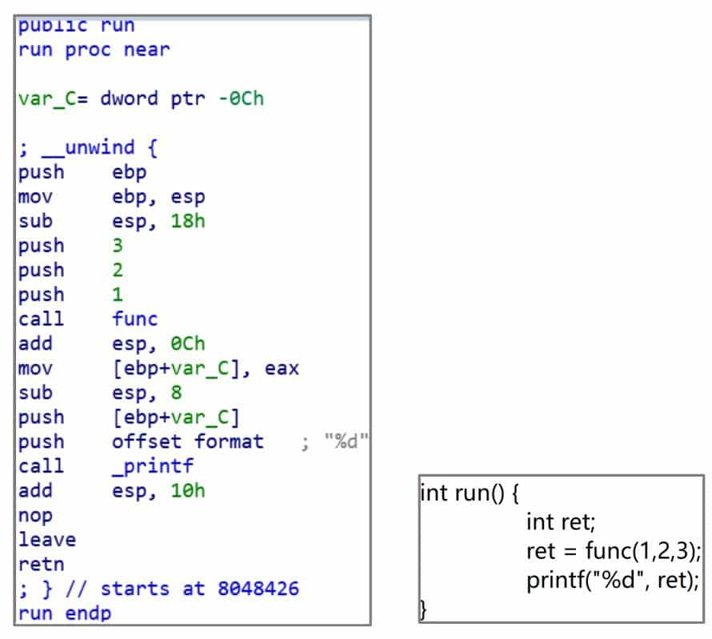
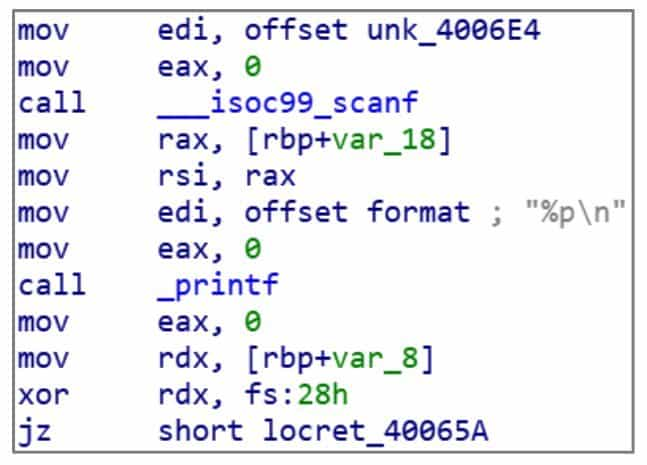
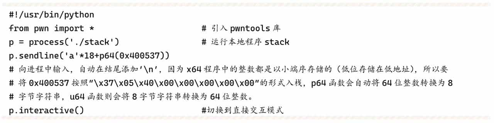
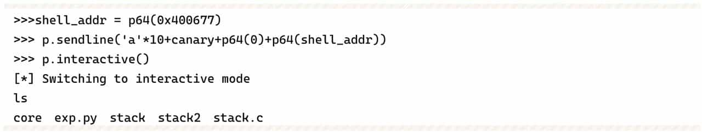

# Lab 2: Secure Coding and Buffer Overflows

Students may be confused about the term "PWN". Because "PWN" does not mean something specific like Web or CRYPTO. In fact, "PWN" is an onomatopoeic word that represents the "bang" sound of a hacker gaining access to a computer through a vulnerability attack, and there is also a theory that "PWN" comes from the word "own" that controls a computer. There is also a theory that "PWN" comes from the word "own" which controls the computer. In short, the method or process of gaining access to a computer through a binary vulnerability is known as PWN.

## PWN Basics

### What is PWN

In CTF, PWN is mainly used to obtain flags by exploiting vulnerabilities in a program to cause memory corruption in order to obtain the shell of a remote computer. a more common form of PWN topic is to put an executable program written in C/C++ running on a target server, and the participant interacts with the server with data through the network. Because of the general vulnerability in the topic, an attacker can construct a program that sends malicious data to the remote server, causing the remote server program to execute the code the attacker wishes, thus taking control of the remote server.

### How to learn PWN

Reverse engineering is the basis of PWN, and the knowledge structure of both is similar. Therefore, sometimes binary security is used to refer to both reverse engineering and PWN. the threshold of entry to binary security is relatively high, requiring participants to study and accumulate for a long period of time and have a certain knowledge base before they can get started. This leads many beginners to give up before getting started. To get started in PWN, a certain foundation in reverse engineering is essential, which in turn leads to a further scarcity of PWN participants.

The purpose of this chapter is to lead the student to get started, so it will focus on PWN vulnerability exploitation techniques. The part about the basics cannot be introduced in detail due to the limitation of space. If the student does not understand the process of learning, you can spend some time to understand the basics, and then go back to consider how to solve, it may be clear.

The core knowledge of binary security consists of four main categories.

**1. Programming language and compilation principle**

Usually, the PWN topics in CTF will be written in C/C++ language. In order to write attack scripts, learning a scripting language like Python is also a must. In addition, the possibility of writing PWN questions in languages other than C/C++, such as Java or Lua, cannot be ruled out. Therefore, it is necessary for the participants to have a wide exposure to some mainstream languages.
For reverse engineering, how to decompile better and faster is a challenge. Whether it is manual disassembly or writing automated code analysis and vulnerability mining tools, knowledge of compilation principles is very beneficial.

**2. Assembly Language**

Assembly language, the core of reverse engineering, is also the first hurdle that PWN beginners have to face. If you get involved in the field of binary, assembly language is not bypassed. Only by understanding how the CPU works from the bottom can you understand why, through program vulnerabilities, an attacker can make the program execute the code set.

**3. Operating system and computer architecture**

The operating system, the core software running on the computer, is often the target of attackers PWN. To understand exactly how a program is executed and how it performs a variety of tasks, participants must learn about operating systems and computer architecture. In the CTF, many exploits and techniques also require the use of some features of the operating system to reach. Also, knowledge of operating systems is necessary to reverse and understand a program.

**4. Data structures and algorithms**

Programming is always about data structures and algorithms. If you want to understand the logic of program execution, it is necessary to understand the algorithms and data structures used.

The above is not so much the core of binary security as it is the core knowledge of computer science. If we compare various vulnerability techniques to various moves in martial arts novels, this knowledge is the "internal" martial arts. Moves are easy to learn and limited, but the road to improve their "internal" is endless. The important thing to improve their own binary level is not to learn a variety of fancy use of skills, but to spend time to learn the basics.

Unfortunately, some programmers and information security practitioners are often in a hurry to learn all kinds of vulnerability exploitation techniques. These core elements of computer science are not studied seriously instead. Students who sincerely hope to achieve good results in the CTF, and in the real reality of vulnerability mining, these basic content is often more important than a variety of exploitation techniques. Do not fall into the trap of only learning various PWN techniques by "building a platform out of sand".

### Linux Basics

Most of the PWN topics in the current CTF use the Linux platform, so it is necessary to master the relevant Linux basics. The following is an introduction to the content of Linux that is closely related to PWN utilization.

#### System and function calls in Linux

Like 32-bit Windows programs, 32-bit Linux programs follow the principle of stack balancing during operation, with ESP and EBP as stack pointer and frame pointer registers and EAX as return value. Based on the source code and compiled results (see Figure 6-1-1), it can be seen that the argument passing follows the traditional `cdecl` calling convention, i.e., function arguments are put on the stack from right to left, and the function arguments are cleared by the caller.



64-bit Linux programs, on the other hand, use the `fast call` calling method for passing parameters. The main difference between the 64-bit version compiled from the same source code and 32-bit is that the first six parameters of the function are passed in order using the RDI, RSI, RDX, RCX, R8, R9 registers, and if there are extra parameters, then the same stack is used for passing as in 32-bit, see Figure 6-1-2.


The PWN process also often requires direct calls to API functions provided by the operating system. Unlike in Windows, where the system API is called using the "win32 api" function, Linux is also characterized by its concise system calls.

In the 32-bit Linux operating system, the system call requires the execution of the `int 0x80` soft interrupt instruction. At this point, `eax` stores the system call number, and the parameters of the system call are stored in EBX, ECX, EDX, ESI, EDI, EBP registers in turn. The return result of the call is stored in EAX. In fact, the system call can be regarded as a special function call, but using the `int 0x80` instruction instead of the call instruction. the function address in the call instruction becomes the system call number stored in EAX, and the parameters are passed using registers instead. Compared to the 32-bit system, the 64-bit Linux system call instruction becomes syscall, the registers for passing parameters become RDI, RSI, RDX, R10, R8, R9, and the system call corresponding to the system call number is changed. An example for the read system call is shown in Figure 6-1-3.


There are only 300+ system calls available for the Linux operating system, and the number may increase in the future with the kernel version update, but it is quite streamlined compared to Windows' hefty API. As for the call number and the parameters that should be passed to each system call, the reader can consult the Linux help manual.

#### ELF file structure

The executable file format under Linux is ELF (Executable and Linkable Format), similar to the PE format of Windows. The ELF header includes the ELF magic code, the computer architecture in which the program is running, the program entry, etc. It can be read by the "readelf-h" command and is generally used to find the entry point of some programs. The ELF file consists of several sections (sections), in which various data are stored. The sections in ELF are used to store a variety of data, including: 

❖ .text section - holds all the code needed to run a program. 

❖ .rdata section - holds unmodifiable static data used by the program, such as strings. 

❖ .data section - holds data that can be modified by a program, such as global variables that have been initialized in C, etc. 

❖ .bss section - used to store program modifiable data, which, unlike .data, is not initialized and therefore does not occupy ELF space. Although the .bss section exists in the section header table, there is no corresponding data in the file. The system does not request an empty block of memory for the actual .bss section until after the program starts execution. 

❖ The .plt section and the .got section - these two sections are needed in conjunction with the program to call functions in the dynamic link library (SO file) to get the address of the called function.

Due to the extensibility of the ELF format, it is even possible to create custom sections when compiling a linked program.ELF can actually include a lot of content unrelated to program execution, such as program version, Hash, or some symbolic debugging information. However, the operating system does not parse the information in ELF when executing an ELF program, but rather the ELF header and Program Head Table. The purpose of parsing the ELF header is to determine the instruction set architecture, ABI version, and other system support information of the program, and to read the program entry. Then, Linux parses the Program Head Table to determine which program segments need to be loaded. The program header table is actually an array of Program Head structures, each of which contains information about the segment's description. Like Windows, Linux also has a memory mapping file feature. When executing a program, the operating system needs to load the specified contents of the ELF file into the specified location in memory according to the segment information specified in the program header table. Therefore, the content of each program header mainly includes the segment type, its address in the ELF file, which address to load into memory, segment length, memory read/write attributes, etc.

For example, the memory read/write attribute of the segment that holds code in ELF is readable and executable, while the segment that holds data is readable and writable or read-only, etc. Note that some segments may not have corresponding data content in the ELF file, such as uninitialized static memory. In order to compress the ELF file, only one field will exist in the program header table, and the operating system will perform the memory request and zero setting operations. The operating system also does not care about the exact contents in each segment, but simply loads each segment as required and points the PC pointer to the program entry.

Here some people may be confused about the relationship between sections and segments and their difference, but in fact both are just two forms of explaining the data in ELF. Just like a person has multiple identities, ELF uses both segment and section formats to describe a piece of data, only with a different focus. The operating system doesn't need to care about the specific function of the data in ELF, it just needs to know which piece of data should be loaded into which piece of memory and the read/write properties of the memory, so it will divide the data according to segments.

A compiler, debugger, or IDA needs to know what the data represents, so it parses the data by sections. Usually, sections are more subdivided than segments, e.g. .text, rdata are often divided into a segment. Some sections that are purely used to describe additional information about the program and have nothing to do with program operation will not even have a corresponding segment and will not be loaded into memory during program operation.

#### Vulnerability Mitigation Measures under Linux

Modern operating systems use a number of means to mitigate the risk of a computer being attacked by a vulnerability, which are collectively referred to as vulnerability mitigation measures.

**1. NX**

NX protection, also known as DEP in Windows, is the setting of permissions on program memory at the granularity of pages through the Memory Protect Unit (MPU) mechanism of modern operating systems, with the basic rule that writable and executable permissions are mutually exclusive. Therefore, it is not possible to execute arbitrary code directly using shellcode in a program with NX protection enabled. All memory that can be modified to write shellcode is not executable, and all code data that can be executed is not modifiable.

NX protection is enabled by default in GCC and can be turned off by adding the "-z execstack" parameter at compile time.

**2. Stack Canary**

Stack Canary protection is a protection mechanism designed specifically for stack overflow attacks. Since the main goal of stack overflow attack is to overwrite the return address of the high bit of the function stack by overflow, the idea is to write a word-length random data before the function starts execution, that is, before the return address, and check whether the value is changed before the function returns, if it is changed, it is considered that a stack overflow has occurred. The program will terminate directly.

GCC uses Stack Canary protection by default, and the way to turn it off is to add the "-fno-stack-protector" parameter at compile time.

**3. ASLR (Address Space Layout Randomization)**

The purpose of ASLR is to randomize the stack address of the program and the load address of the dynamic link library, which are not read/write executable unmapped memory between these addresses to reduce the attacker's knowledge of the program memory structure. In this way, even if the attacker has laid out the shellcode and can control the jump, it still cannot execute the shellcode because the memory address structure is unknown.

ASLR is a system-level protection mechanism, and is turned off by modifying the contents of the /proc/sys/kernel/randomize_va_space file to 0.

**4. PIE**

Very similar to ASLR protection, the purpose of PIE protection is to allow randomized loading of the address of the executable ELF, thus making the memory structure of the program completely unknown to the attacker and further improving the security of the program.

GCC is compiled with PIE enabled by adding the parameter "-fpic-pie". Newer versions of GCC have PIE enabled by default, and can be turned off by setting "-no-pie".

**5. Full Relro**

Full Relro protection is related to the Lazy Binding mechanism under Linux, and its main function is to prohibit the reading and writing of the .GOT.PLT table and some other related memory, thus preventing attackers from writing to the .GOT.PLT table to carry out attack exploitation means.

GCC enables Full Relro by adding the parameter "-z relro".

#### Role of GOT and PLT

.GOT.PLT and .PLT are two special sections that are usually present in ELF files. ELF compilation cannot know the load address of dynamic link libraries such as libc. If a program wants to call a function in a dynamically linked library, it must use .GOT.PLT and .PLT in conjunction to complete the call.

In Figure 6-1-4, call_printf does not jump to the location of the actual _printf function. Because the program does not determine the address of the printf function at compile time, this call instruction actually jumps to the _printf entry in the .PLT table through a relative jump. Figure 6-1-5 shows the .PLT entries corresponding to _printf. All external dynamic link library functions used in ELF will have corresponding .PLT entries.




The .PLT table is also a piece of code that retrieves an address from memory and jumps to it. The address is the actual address of _printf, and the place where the actual address of the _printf function is stored is the .GOT.PLT table in Figure 6-1-6.


.PLT table is actually an array of function pointers, which holds the addresses of all external functions used in ELF. The initialization of the .GOT.PLT table is done by the operating system.

Of course, due to the very special Lazy Binding mechanism of Linux. .GOT.PLT table is initialized during the first call to the function in ELF without Full Rello enabled. That is, a function must have been called before the real address of the function is stored in the .GOT.PLT table. The Lazy Binding mechanism is not discussed here, interested students can check the relevant information by themselves.

.GOT.PLT and .PLT are useful for PWN? .PLT can directly call some external function, which will be of great help in the subsequent introduction of stack overflow. Second, since .GOT.PLT usually stores the address of a function in libc, you can get the address of libc by reading .GOT.PLT in the exploit, or control the execution flow of the program by writing . GOT.PLT for vulnerability exploitation is very common in CTF.

## Integer overflow

Integer overflow is a relatively simple element in PWN, of course, it does not mean that the topic of integer overflow is relatively simple, just that integer overflow itself is not very complex, the situation is less. But integer overflow itself is not exploitable, and needs to be combined with other means to achieve the purpose of exploitation.

### Integer operations

Computers do not store infinitely large integers, and the values represented by integer types in computers are only a subset of natural numbers. For example, in a 32-bit C program, the length of the unsigned int type is 32 bits, and the largest number that can be represented is 0xffffffff. If this number is added by 1, the result 0x100000000 will exceed the range that can be represented by 32 bits, and only the lower 32 bits can be intercepted, and eventually the number will become 0. This is unsigned overflow.

There are 4 kinds of overflow cases in computers, taking 32-bit integers as an example.

❖ Unsigned overflow: The unsigned number 0xffffffff plus 1 becomes 0.

❖ Unsigned underflow: The unsigned number 0 minus 1 becomes 0xffffffff.

❖ Signed overflow: The case where the signed positive number 0x7fffffff plus 1 becomes negative 0x80000000, i.e., decimal-2147483648.

❖ Unsigned underflow: the case where the signed negative number 0x80000000 minus 1 becomes positive 0x7fffffff.

In addition to this, direct conversion of signed numbers to unsigned numbers can result in abrupt changes in the size of integers. For example, the binary representation of the signed number -1 and the unsigned number 0xffffffff is the same, and a direct conversion of the two can cause the program to produce unintended effects.

### How integer overflows are used

Although integer overflows are simple, they are not actually simple to exploit. Unlike memory corruptions such as stack overflows, which can be directly exploited by overwriting memory, integer overflows often require some conversion to overflow. There are two common conversions.

**1. integer overflow into buffer overflow**

An integer overflow can mutate a very small number into a very large number. For example, an unsigned underflow can turn a smaller number representing the buffer size into a very large integer by subtraction. This results in a buffer overflow.

Another case is to bypass some length checks by entering a negative number. For example, some programs will use signed numbers to represent length. Then a negative number can be used to bypass the length limit check. Most system APIs use unsigned numbers to represent length, so the negative number will become a large positive number and lead to overflow.

**2. integer overflow to array overrun**

The idea of array overrun is very simple. In C, the operation of array indexing is achieved by simply adding the array pointer to the index, and does not check the bounds. Therefore, a very large index will access the data after the array, and if the index is negative, then it will also access the memory before the array.

Usually, integer overflows to array bounds are more common. In the process of array indexing, the array index is also multiplied by the length of the array element to calculate the actual address of the element. In the case of an array of type int, for example, the array index needs to be multiplied by 4 to calculate the offset. If the bounds check is bypassed by passing in a negative number, then normally only the memory before the array can be accessed. However, since the index is multiplied by 4, it is still possible to index the data after the array or even the entire memory space. For example, to index the contents at 0x1000 bytes after the array, just pass in the negative number -2147482624, which is expressed as 0x80000400 in hexadecimal numbers, and then multiply it by the element length 4, which is 0x00001000 due to the unsigned integer overflow result. as you can see, array overruns are easier to exploit compared to integer overflows to buffer overflows.

## Stack Overflow

The stack is a simple and classical data structure whose main feature is the use of first-in, last-out (FILO) access to the data on the stack. Generally, the last data placed on the stack is called the top of the stack, and the location where it is stored is called the top of the stack. The operation of storing data on the stack is called push, and the operation of removing data from the top of the stack is called pop. For more details about the stack, please refer to the data structure related materials.

Since the sequence of function calls is such that the first function called returns last, the stack is ideal for storing intermediate variables and other temporary data used during the operation of a function.

Currently, most major instruction architectures (x86, ARM, MIPS, etc.) support stack operations at the instruction set level and are designed with special registers to hold the top-of-stack addresses. In most cases, putting data on the stack will cause the top of the stack to grow from the high to the low address of memory.

**1. Stack Overflow Principle**

Stack overflow is one of the buffer overflows. Local variables of a function are usually stored on the stack. If these buffers overflow, it is a stack overflow. The most classic way to exploit stack overflow is to overwrite the return address of a function in order to hijack the control flow of the program.

The x86 architecture typically uses the instruction call to call a function and the instruction ret to return. when the CPU executes the call instruction, it first puts the address of the next instruction of the current call instruction on the stack and then jumps to the called function. When the called function needs to return, it only needs to execute the ret instruction, and the CPU will come out with the address of the top of the stack and assign it to the EIP register. This address, which is used to tell the called function where it should return to the calling function, is called the return address. Ideally, the address taken out is the address deposited by the previous call to call. This allows the program to return to the parent function and continue execution. The compiler will always make sure that even if the child function uses the stack and modifies the top of the stack, it will restore the top of the stack to the state it was in when it first entered the function before the function returns, thus ensuring that the return address fetched will not be incorrect.


Use the following command to compile the program of Example 6-3-1, turn off address randomization and stack overflow protection.

```
gcc -fno-stack-protector stack.c -o stack -no-pie
```

Run the program, debug with IDA, after entering 8 A, exit vuln function, the program executes ret instruction, the stack layout is shown in Figure 6-3-1. At this time, the top of the stack is saved 0x400579 that return address, after executing ret instruction, the program will jump to the location of 0x400579. Note that there is a string of 0x414141414141414141 above the return address, which is the 8 A's just entered. Since the get function does not check the length of the input data, it can increase the input until the return address is covered. From Figure 6-3-1, you can see that the return address is 18 bytes away from the first A. If you input more than 19 bytes, the return address will be overwritten.

Analyzing this program with IDA, we can learn that the location of the shell function is 0x400537, and our purpose is to make the program jump to this function so as to execute system ("/bin/sh") to get a shell.

In order to facilitate the input of some non-visible characters (such as address), here used to answer the PWN topic very useful tool pwntools, code comments will explain some of the commonly used functions, more specific instructions please refer to the official documentation.


The attack script is as follows.



Use IDA to attach to the process for trace debugging, just to the location of ret, the return address has been overwritten to 0x400537, continue to run the program will jump to the shell function, so as to obtain the shell (see Figure 6-3-2).


**2. Stack protection technology**

Stack overflows are very difficult to exploit and very harmful. In order to alleviate the growing security problems caused by stack overflows, compiler developers introduced the Canary mechanism to detect stack overflow attacks.

Canary translates to canary in Chinese. The Canary protection mechanism is similar to this, by inserting a random number in front of the stack where rbp is stored, so that if an attacker uses a stack overflow vulnerability to overwrite the return address, it will also overwrite the Canary. The compiler adds a piece of code before the function ret instruction that will check if the value of Canary has been overwritten. If it is rewritten, an exception is thrown directly, interrupting the program and thus preventing the attack from occurring.

But this method is not always reliable, as in Example 6-3-2.


Enable stack protection at compile time.

```
gcc stack2.c -no-pie -fstack-protector-all -o stack2
```

When vuln function enters, it will take the value of Canary from fs:28, put it into the location of rbp-8, compare the value of rbp-8 with the value in fs:28 before the function exits, and if it is changed, call \_\_stack_chk_fail function, output error message and exit the program (see Figure 6-3-3 and Figure 6-3-4).


But this program will print the input string before the vuln function returns, which will leak the Canary on the stack and thus bypass the detection. Here you can control the length of the string to just connect to the Canary, which will make the Canary and the string printed together by the puts function. Since the lowest byte of the Canary is 0x00, an extra character needs to be sent to overwrite 0x00 in order to prevent it from being truncated by 0.


In the next input, the leaked canary can be written to the original address and then continue to overwrite the return address:



The above example illustrates that even if the compiler has protection enabled, you still need to pay attention to prevent stack overflow when writing the program, otherwise it may be exploited by attackers, which can have serious consequences.

**3. Dangerous functions where stack overflows often occur**

By looking for dangerous functions, we can quickly determine if a program may have a stack overflow and where the stack overflow is located. The common dangerous functions are as follows.

❖ Input: gets(), which reads a line directly up to the newline character '\n', while '\n' is converted to '\x00'; scanf(), which formats a string in which %s does not check the length; vscanf(), as above.

❖ Output: sprintf(), writes the formatted content to the buffer, but does not check the buffer length.

❖ String: strcpy(), stops when '\x00' is encountered, does not check the length, often prone to single-byte write 0 (off by one) overflow; strcat(), same as above.

**4. Available stack overflow coverage locations**

There are usually three types of stack overflow override locations available:

① Override the function return address, the previous examples are controlled by overriding the return address program.

② Overwrite the value of the BP register saved on the stack. The function will be called to save the stack site first, and then restore it when it returns, as follows (take x64 program as an example) When called.


When returning: If the BP value on the stack is overwritten, the BP value of the main caller function will be changed after the function returns, and when the main caller function returns to the line ret, the SP will not point to the original return address location, but the BP location after being modified.

③ Depending on the realistic execution, overwriting the content of a specific variable or address may lead to some logic vulnerabilities.

## Assignment

### KFC crazy Thursday

On sale!

This challenge must create a dynamic docker and connect via domain or DNS.

1. Outside university `nc 116.7.234.225 port`

2. inside university `nc 10.20.55.12 port`

### Buffer overflow in heap

A heap of the heap.

This challenge must create a dynamic docker and connect via domain or DNS.

1. Outside university `nc 116.7.234.225 port`

2. inside university `nc 10.20.55.12 port`

### Love kernel

(None)

`nc 103.102.44.94 8306`