# Lab 3: Secure Coding and Format-String Vulnerability

## Formatted String Vulnerability

### Basic Principles of Formatted String Vulnerability

The commonly used formatted output functions in C are as follows:

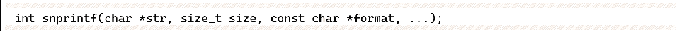

Their usage is similar, and this section uses printf as an example. In C, the conventional usage of printf is:

where the first parameter of the function with %d, %s, and other placeholders is called a formatted string, and the placeholders are used to specify how the output parameter values are formatted.

The syntax of the placeholders is:

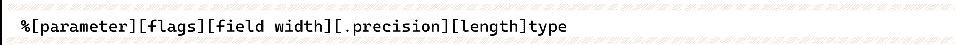

parameter can be ignored or for n$, n means that this placeholder is the first parameter passed in.

flags can be zero or more, mainly including:

❖ +- always indicates a '+' or '-' for a signed value, ignores the sign of positive numbers by default, and applies only to numeric types.

❖ Space - output of signed numbers is prefixed with 1 space if there is no plus or minus sign or 0 characters are output.

❖ --Left justified, default is right justified.

❖ # - For 'g' and 'G', the trailing 0 is not removed to indicate precision; for 'f', 'F', 'e', 'E', 'g', and 'G', the decimal point is always output; for 'o', 'x', and 'X', the prefix 0, 0x, and 0X are output before the non-zero value to indicate the number system, respectively.

❖ 0- in front of the width option, indicating padding with 0.

field width gives the minimum width of the displayed value, which is used to fill a fixed width when outputting. If the actual number of output characters is less than the field width, it will be filled according to left-aligned or right-aligned, and the negative sign is interpreted as left-aligned flag. If the domain width is set to "\*", the value of the corresponding function parameter is the current domain width.

precision usually specifies the maximum length of the output, depending on the specific formatting type:

❖ For integer values of d, i, u, x, and o, the minimum number of digits, with any shortfall being filled with zeros on the left.

❖ For floating-point values of a, A, e, E, f, and F, the number of digits displayed to the right of the decimal point.

❖ For floating-point values of g, G, refers to the maximum number of significant digits.

❖ For the string type of s, it refers to the upper limit of the output bytes.

If the domain width is set to "\*", the value of the corresponding function parameter is the precision current domain width.

length indicates the length of the floating-point argument or integer argument:

❖ hh-matches an integer argument of size int8 (1 byte).

❖ h-Matches an integer argument of size int16 (2 bytes).

❖ l-matches integer parameters of size long for integer types, double for floating point types, wchar_t pointer parameters for string s types, and wint_t parameters for character c types.

❖ ll-matches integer parameters of size long long.

❖ L-matches integer parameters of size long double.

❖ z-Matches integer parameters of size_t size.

❖ j-Matches integer parameters of size intmax_t.

❖ t-matches an integer parameter of size ptrdiff_t.

The type representation is as follows:

❖ d, i-Signed decimal int values.

❖ u-Decimal unsigned int value.

❖ f, F-Decimal double values.

❖ e, E-double value, the output form is "[-]d.ddd e[+/-]ddd" in decimal.

❖ g, G-double values, with f or e format automatically selected depending on the size of the value.

❖ x, X-hexadecimal unsigned int values.

❖ o-Octal unsigned int value.

❖ s-A string ending in \x00.

❖ c-A char type character.

❖ p-void\* pointer type value.

❖ a, A-double type hexadecimal representation, i.e., "[-]0xh.hhhh p±d", with the exponent part in the form of decimal representation.

❖ n-Writes the number of characters that have been successfully output to the variable referred to by the corresponding integer pointer parameter.

❖ %-'%' literal value, does not accept any flags, width, precision or length.

If the formatted string of printf in the program is controllable, the printf function will take data from the register or stack corresponding to the location of the argument as an argument to read or write even if the corresponding argument is not filled in at the time of the call, which can easily result in arbitrary address reading and writing.

### Basic Exploitation of Formatted String Vulnerability

The formatted string vulnerability allows for arbitrary memory reads and writes. Since function parameters are passed through the stack, the data on the stack can be leaked using "%X$p" (X is an arbitrary positive integer). Moreover, if you can control the data on the stack, you can write the address you want to leak on the stack in advance, and then use "%X$p" to output the address you want to leak as a string.

In addition, since "%n" can write the number of characters that have been successfully output to the variable indicated by the corresponding integer pointer parameter, it is possible to arrange the address of the memory you want to write on the stack in advance. Then you can write to any memory by using "%Yc%X$n" (Y is the data you want to write).

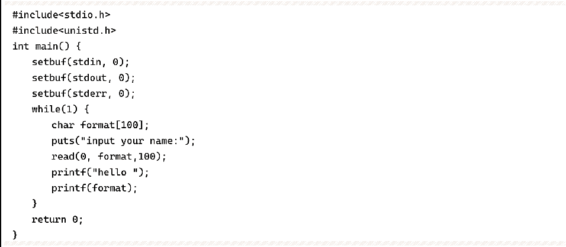

Compile the program in Example 6-5-1 with the following command:

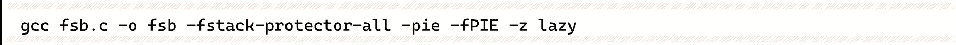

Set a breakpoint at printf, when RSP is exactly where we entered the string, i.e., the 6th argument (the first 5 arguments and formatted string of 64-bit Linux are passed by registers), and we enter "AAAAAAAAA%6$p".

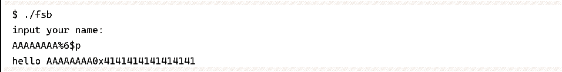

The program does output the 8 A's entered as pointer variables, and we can use this to leak information first.

The stack contains the return address pressed in before \_\_libc\_start\_main calls \_\_libc\_csu\_init (see Figure 6-5-1), and based on this address, we can calculate the base address of libc, which can be calculated at the location of the 21st argument; similarly, \_start is at the location of the 17th argument, through which we can calculate the base address of the fsb program. The base address of the fsb program can be calculated by using it.

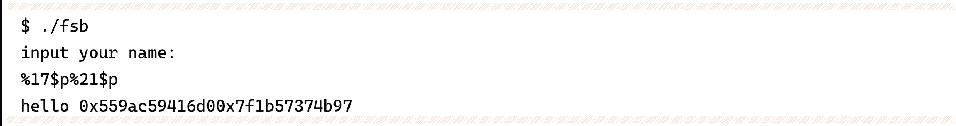

Once you have the libc base address, you can calculate the address of the system function, and then modify the address of the printf function in the GOT table to the address of the system function. The next time you execute printf(format), you will actually execute system(format) and enter format as "/bin/sh" to get the shell. use the script as follows.

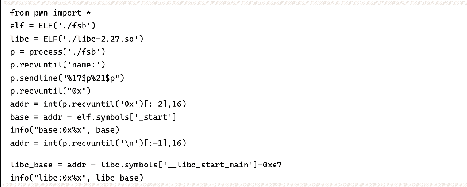

The script splits system's address (6 bytes) into 3 words (2 bytes) because if you output more than one int-type byte at a time, printf will output several gigabytes of data, which may be very slow when attacking a remote server, or cause a broken pipe (broken pipe). Note that in 64-bit programs, the address often accounts for only 6 bytes, that is, the high 2 bytes must be "\x00", so the 3 addresses must be placed at the end of the payload, and not at the top. Although placed at the top, the offset is better calculated, but printf output string is up to "\x00", the "\x00" in the address will truncate the string, after the placeholder used to write the address will not take effect.

### How to use formatted strings that are not on the stack

Sometimes the input string is not stored on the stack, so there is no way to directly address the stack to control the printf arguments, which is a relatively complicated situation.

Because the program has the operation of pressing rbp onto the stack when calling a function or putting some pointer variables on the stack, there will be many pointers on the stack that hold the address on the stack, and it is easy to find three pointers p1, p2, p3, forming a situation where p1 points to p2 and p2 points to p3, then we can first use p1 to modify the lowest 1 byte of p2, which can make p2 point to p3 pointer 8 bytes of Any 1 byte and modify it, so that p3 can be modified byte by byte to become any value, indirectly controlling the data on the stack.

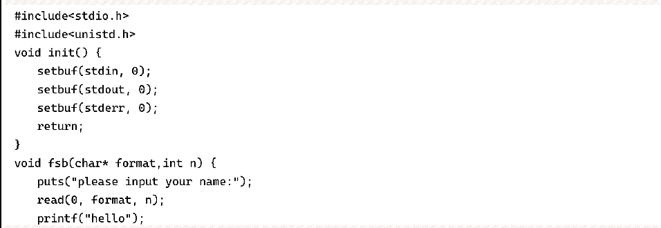

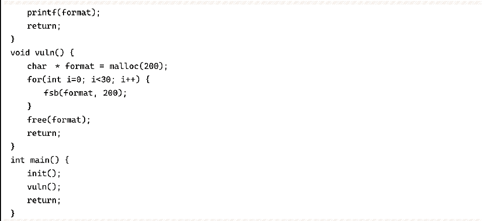

Compile the program of Example 6-5-2 with the following command:

Set a breakpoint at printf, at this point the stack distribution is shown in Figure 6-5-2. The pointer saved at 0x7ffffffee030 points to 0x7ffffffee060, and the pointer saved at 0x7ffffffee060 points to 0x7ffffffee080, which satisfies the above requirements. These three pointers are at printf No. 10, 16, and 20 arguments. The program requests a block of memory to hold the input string before the loop executes 30 times of input and output, which will be released at the end of the loop and then exits the program. We can change the value at 0x7ffffffee080 to the address of the free function item in the GOT table, and change the function pointer there to the address of the system function. This way, when executing free (format), what is actually executed is system (format), just type "/bin/sh" to get the shell.

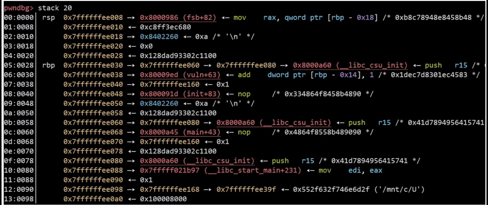

The complete script is as follows:

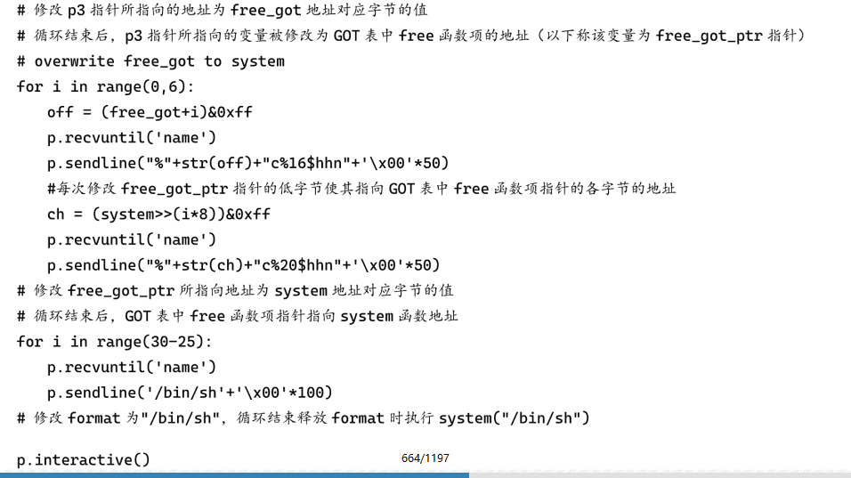

### Some special uses of formatted strings

Formatting strings sometimes encounters some rare placeholders, such as "\*" to take the value of the corresponding function argument as the width, printf ("%*d", 3, 1) to output " 1".

As in Example 6-5-3, guessing the sum of two numbers, you can get the shell after guessing right. not considering the case of blasting, although the formatted string can leak the value of these two numbers, but the input is before the leak, after the leak has been unable to modify the guessed value, so you must use this opportunity to fill in the sum of a and b directly to num, which requires the use of placeholder "\*".

Set a breakpoint at printf(buf), at this point the data on the stack is shown in Figure 6-5-3. a and b numbers (0x1b2d and 0xc8e3 respectively) are in the 8th and 9th argument positions, and num_ptr is in the 11th argument position. a and b numbers are used as two output widths, and the number of characters output is the sum of a and b. Then use "% n" is written into num to achieve the effect of num==a+b.

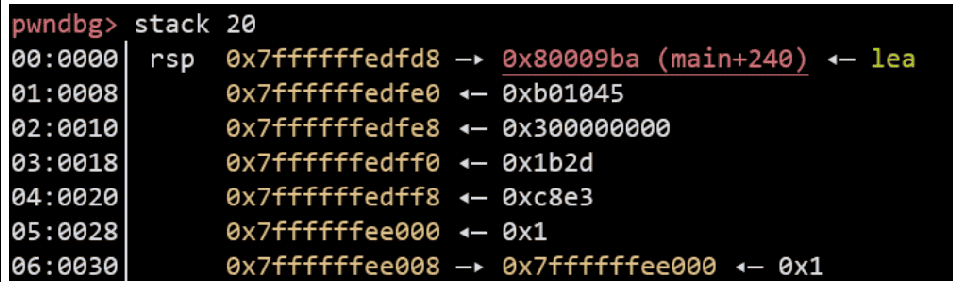

The script is as follows:

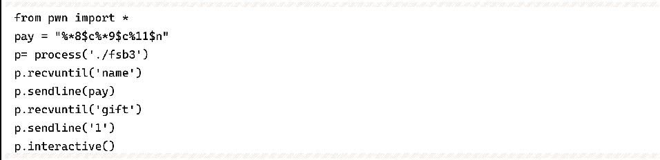

### Formatted Strings Summary

Formatted strings utilize ultimately arbitrary address reading and writing, and a program that can do arbitrary address reading and writing is not far from full control.

Sometimes programs turn on the Fortify protection mechanism so that all printf() is replaced by \_\_printf\_chk() when the program is compiled. The difference between the two is as follows:

❖ When using positional arguments, you must use all arguments in the range and cannot print discontinuously using positional arguments. For example, to use "%3$x", you must use both "%1$x" and "%2$x".

❖ A formatted string containing "%n" cannot be located at a writable address in memory.

While it is difficult to write to arbitrary addresses at this point, it is possible to exploit arbitrary address reads for information leakage, which can be used in conjunction with other vulnerabilities.