# Lab 4: Scanning, Reconnaissance, and Penetration Testing

In the traditional CTF online competition, Web class is one of the main types of questions, compared to binary, reverse and other types of questions, participants do not need to master the underlying knowledge of the system; compared to cryptography, miscellaneous issues, does not require a particularly strong programming skills, so it is easier to start. web class topics common types of vulnerabilities include injection, XSS, file inclusion, code execution, upload, SSRF, etc. This chapter will introduce the CTF online vulnerabilities.

This chapter will introduce various common Web vulnerabilities in the CTF online competition, and through the analysis of relevant examples, the reader will have a relatively comprehensive understanding of the CTF online competition Web topics as much as possible. However, the classification of Web vulnerabilities is very complicated, so we hope that readers can learn about them on the Internet while reading this book, so that they can learn from one example to improve their own abilities.

According to the frequency of vulnerabilities, the complexity of vulnerabilities, we will be divided into Web class topics into introductory, advanced, and expansion of the three levels of introduction. When explaining each level of vulnerability, we supplemented with relevant example problem analysis, so that readers can more intuitively understand the impact of different vulnerabilities in the CTF online competition Web class topics, from the shallow to deep understanding of Web class topics, clear their own skill deficiencies, so as to achieve the purpose of making up. This chapter starts from the "Getting Started" level and introduces the three most common types of vulnerabilities in the Web category, namely information gathering, SQL injection, and arbitrary file reading vulnerabilities.

## Pivotal information gathering

### The importance of information gathering

As the old saying goes, "If you know yourself and your enemy, you will never lose a hundred battles". In the Web category of the CTF online competition, information gathering covers a wide range of topics, including backup files, directory information, Banner information, etc. This requires participants to have a lot of experience or to use some scripts to help them find information and exploit vulnerabilities in the topic. This section will describe as much as possible the information collection contained in the Web category of the CTF online competition, and will also recommend some open source tools and software that have been tested by the authors.

Because most of the information gathering is the use of tools (git leaks may involve the application of git commands), this chapter may not have much technical detail. At the same time, because there are more kinds of information gathering, this chapter will cover as much as possible, so please understand if there are any shortcomings; at the end, it will reflect the importance of information gathering through practical examples of competitions.

### Classification of information gathering

Preliminary information gathering on the topic may have a very important role in solving the topic of CTF online competition. The following will talk about the basic information gathering from three aspects: sensitive directory, sensitive backup file, and Banner identification, and how to discover the direction of solving the problem in CTF online competition.

#### Sensitive Directory Leakage

Through sensitive directory leakage, we can often obtain the source code and sensitive URL addresses of websites, such as the backend address of websites, etc.

**1. git leakage**

[Vulnerability Introduction] git is a mainstream distributed version control system, developers often forget the .git folder in the development process, leading to attackers can obtain all the information in the .git folder that developers have submitted This allows attackers to access all the source code committed by the developer through the information in the .git folder, which may lead to the server being compromised by the attack.

**(1) Conventional git leaks Conventional git leaks:**

without any other operations, the participant can obtain the website source code or flags by using ready-made tools or scripts written by themselves. Here is a recommended tool: https://github.com/denny0223/scrabble, the use of which is also very simple.

```git
./scrabble http://example.com/
```

Build the Web environment locally by yourself, see Figure 1-1-1.

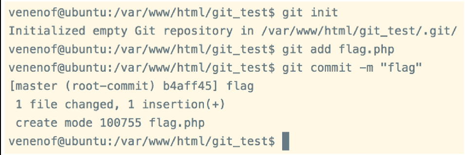

Run the tool, you can get the source code, get the flag, see Figure 1-1-2.

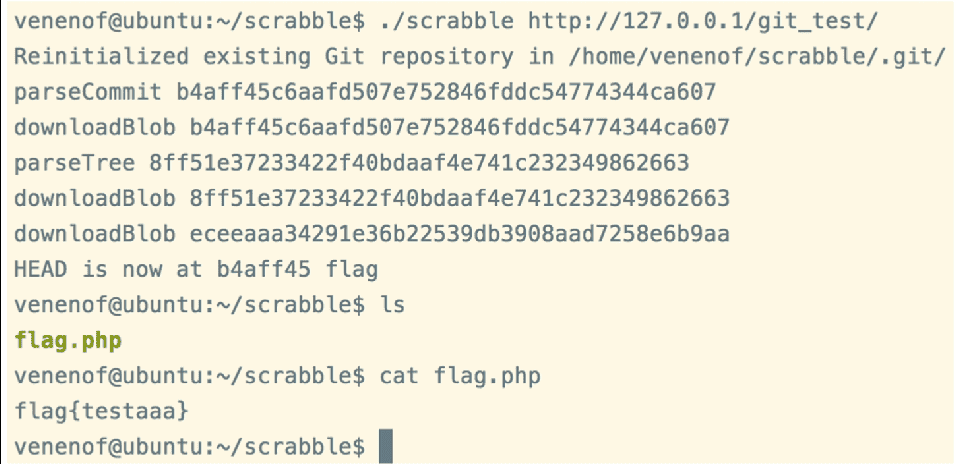

**(2) git rollback**

As a version control tool, git records every commit, so when there is a git leak, the flag (sensitive) file may be deleted or overwritten in the revision, then we can use git's "git reset" command to restore to the previous version. See Figure 1-1-3 for a local web environment.


We first use the scrabble tool to get the source code, and then use the "git reset--hard HEAD^" command to jump to the previous version (in git, the current version is represented by HEAD, and the previous version is HEAD^) to get the source code, see Figure 1-1-4.

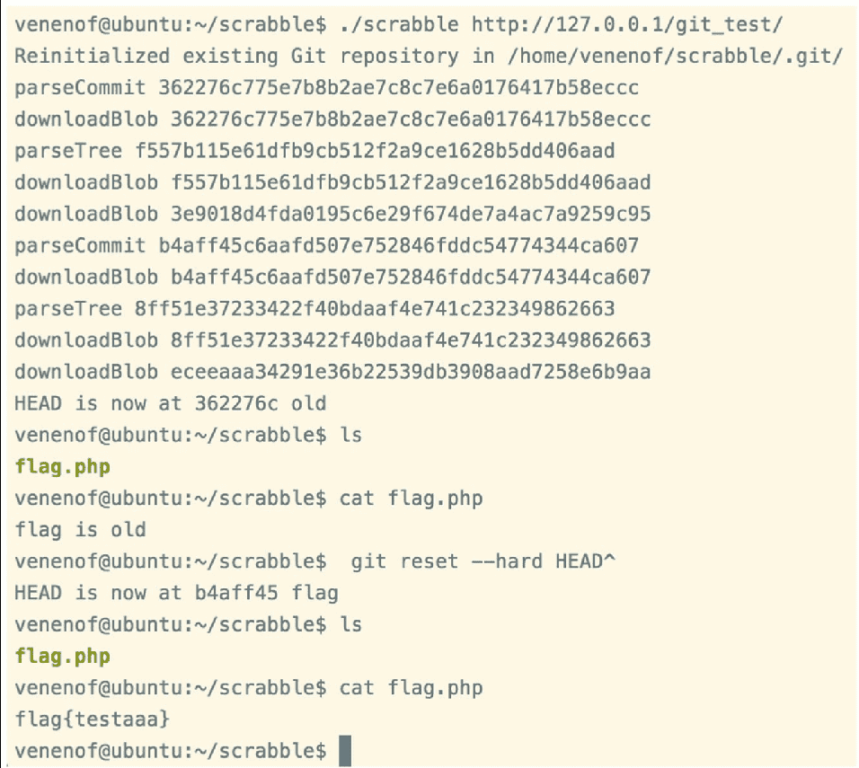

In addition to using "git reset", a simpler way to see what files have been modified by each commit is to use the "git log-stat" command, and then use "git diff HEAD commit-id" to compare the changes between the current version and the commit you want to see.

**(3) git branches**

Each time you commit, git automatically strings them together into a timeline, which is a branch. And git allows multiple branches, thus allowing users to separate work from the main development thread so that it doesn't interfere with it. If no new branches are created, then there is only one timeline, i.e., only one branch, which defaults to the master branch in git. So the flags or sensitive files we are looking for may not be hidden in the current branch, so using the "git log" command will only find the changes made on the current branch, but not the information we want, so we need to switch branches to find the files we want.

Most off-the-shelf git leaks do not support branches, so if you need to restore code from another branch, you often need to extract the files by hand, so here is an example of the more powerful GitHacker (https://github.com/WangYihang/GitHacker) tool. Just run the command "python GitHacker.py http://127.0.0.1:8000/.git/". Once you run it, you'll see the folder you created locally, but if you run "git log--all" or "git branch-v", you'll only see the master branch. If you run "git reflog", you can see some checkout records, see Figure 1-1-5.

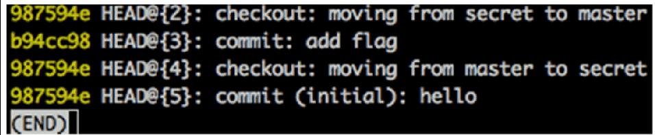

As you can see, there is a secret branch in addition to the master branch, but the automation tool only restores the information of the master branch, so you need to manually download the head information of the secret branch and save it to .git/refs/heads/secret (execute the command "wget http:// 127.0.0.1:8000/.git/refs/heads/secret"). After restoring the head information, we can reuse some of the GitHacker code to automate the branch restoration process. As you can see in GitHacker's code, he downloads the object file first, then uses git fsck to detect it, and continues to download the missing file. Here you can directly reuse the fixmissing function that detects missing files and restores them. Let's comment out the last part of the program that calls main and change it to the following code.

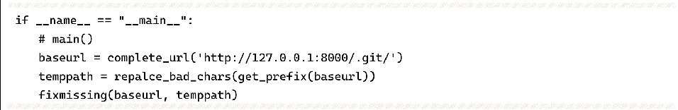

If you run "python GitHacker.py" again, go to the folder you created, and run "git log--all" or "git branch-v" command, you will be able to recover the secret branch information, find the corresponding commit hash from the git log, and execute the command "git diff HEAD b94c" (b94c is the first 4 bits of the hash) to get the flag, see Figure 1-1-6.


**(4) Other uses of git leaks**

In addition to the common exploit of viewing the source code, the leaked git may also contain other useful information, such as the .git/config folder may contain access_token information, which allows access to other repositories of this user.

**2. SVN vulnerability**

SVN (subversion) is the source code version management software, the main reason for SVN source code vulnerability is the administrator's irregular operation to expose the SVN hidden folder to the external network environment, you can use the .svn/entries or wc.db file to obtain the server source code and other information. Here we recommend two tools: https://github.com/kost/dvcs-ripper and Seay-svn (source code backup vulnerability exploit tool for Windows).

**3. HG leak**

When initializing the project, HG will create a .hg hidden folder under the current folder, which contains information such as code and branch modification records. Here is a recommended tool: https://github.com/kost/dvcs-ripper.

**4. Summary of experience**

Whether it is .git these hidden files or sensitive backend folders like admin in practice, the key lies in the power of the dictionary, and the reader can do secondary development on the basis of certain tools to meet their needs. Here is a recommended open source directory scanning tool: https://github.com/maurosoria/dirsearch.

CTF online competitions often have problems with redirects of one kind or another. For example, as soon as you visit .git, it will return 403, at this time try to visit .git/config, if there are file content returned, it means that there is a git leak, and vice versa, generally does not exist. In SVN leaks, the source code is usually crawled in the entries, but sometimes there are cases where the entries are empty, then pay attention to the existence of the wc.db file or not, and you can get the source code in the pristine folder through the checksum there.

#### Sensitive backup files

Through some sensitive backup files, we can often get the source code of a file, or the whole directory of a website, etc.

**1. gedit backup files**

Under Linux, after saving with the gedit editor, a file with the suffix "~" will be generated in the current directory, whose contents are the contents of the file just edited. Assuming that the name of the file you just saved is flag, the file name is flag ~, see Figure 1-1-7. Access this file with "~" through your browser to get the source code.


vim is currently the most used Linux editor. When a user is editing a file but quits unexpectedly (e.g., when connecting to the server via SSH, you may encounter an unexpected exit due to a command line jam caused by insufficient network speed in the process of editing a file with vim), a backup file will be generated in the current directory with the following file name format

```
.filename.swp
```

This file is used to backup the contents of the buffer, i.e. the contents of the file at the time of exit, see Figure 1-1-8.

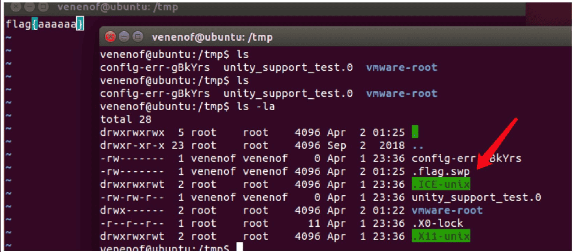

For the SWP backup file, we can use the "vim-r" command to restore the contents of the file. Here we simulate the execution of "vim flag" command first, and then close the client directly, a .flag.swp file will be generated in the current directory. To restore the SWP backup file, first create a flag file in the current directory, and then use the "vim-r flag" command to get the contents edited during the accidental exit, see Figure 1-1-9.

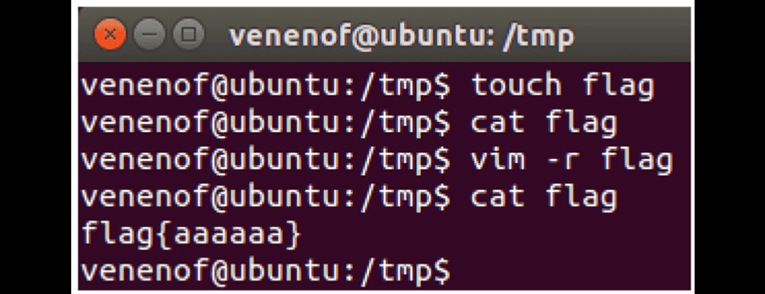

Regular files rely on the saturation of dictionaries, whether in CTF competitions or in the real world, we will encounter some classic and recognizable files, so that we can better understand the site. Here are just a few simple examples, the specific needs of the reader to collect records by heart.

❖ robots.txt: record some directory and CMS version information.

❖ readme.md: Record CMS version information, some even have Github address.

❖ www.zip/rar/tar.gz: It is often the source code backup of the website.

**4. Summary of experience**

In the process of CTF online competition, the questioner will often operate and maintain the question online, and sometimes various situations will lead to the generation of SWP backup files, so the reader can write real-time monitoring scripts to monitor the question service during the competition.

The backup file generated by vim in the first unexpected exit is *.swp, the one in the second unexpected exit is *.swo, the one in the third exit is *.swn, and so on. vim's official manual also has backup files of type *.un.filename.swp.

Also, in a real-world environment, backups of a website may often be a zip archive of the website domain.

#### Banner recognition

In CTF online competition, the Banner information (some basic information displayed by the server to the outside world) of a website has a very important role in solving the problem, and players can often use the Banner information to get ideas for solving the problem. For example, when we know that the website is written with ThinkPHP web framework, we can try the relevant historical vulnerability of ThinkPHP framework. Or when we learn that the site is a Windows server, then we can try based on the characteristics of Windows when testing for upload vulnerabilities. Here are the two most common ways to identify Banner.

**1. collect your own fingerprint library**

Github has a large number of formed and publicly available CMS fingerprint library, readers can find their own, and at the same time can draw on some formed scanners to identify the site.

**2. Use existing tools**

We can use the Wappalyzer tool (see Figure 1-1-10), which also provides a well-formed Python library with the following usage.

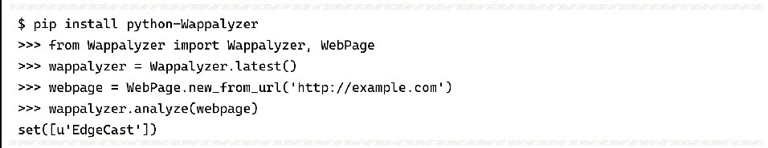


In the data directory, the apps.json file is its rule base, and readers are free to add it according to their needs.

**3. Summary of experience**

In the server Banner information detection, in addition to the two common identification methods mentioned above, we can also try to enter some random URLs, and sometimes we can find some information through 404 pages and 302 bounce pages. For example, a ThinkPHP website with debug option turned on will show the version of ThinkPHP on some error pages.

### From information gathering to topic resolution

The following is a replay of a CTF range race scenario to show how to go from information gathering to getting flags.

**1. Environment information**

❖ Windows 7.

❖ PHPstudy 2018 (with directory traversal turned on).

❖ DedeCMS (Weaving Dream CMS, member registration not turned on).

**2. Solution steps**

By visiting the website, according to the observation and Wappalyzer's prompt (see Figure 1-1-11 and Figure 1-1-12), we can find that this is DedeCMS built on Windows, and visiting the default backend directory is found to be 404, see Figure 1-1-13.

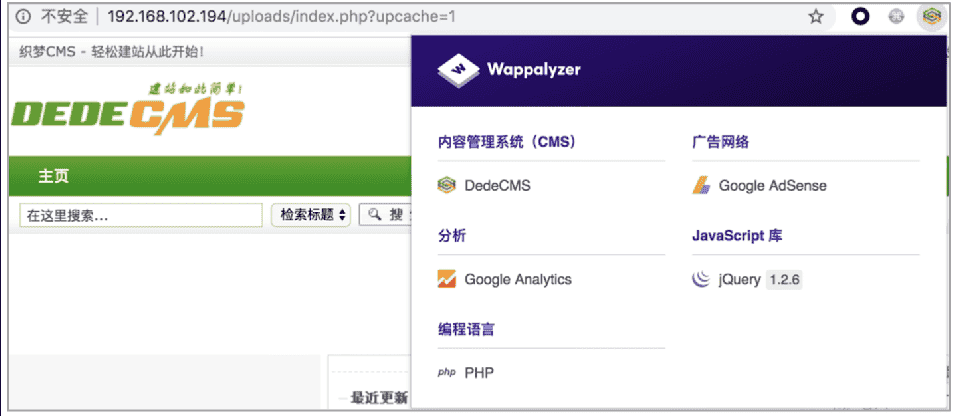

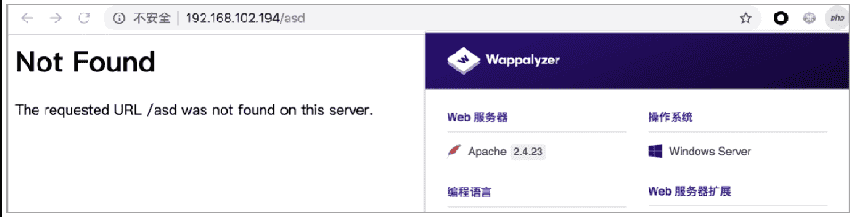

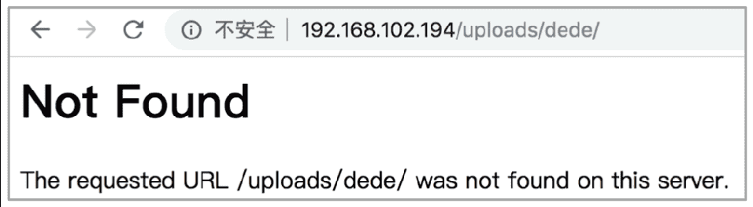

At this point we can associate DedeCMS on Windows server there is a backend directory blasting vulnerability (the cause of the vulnerability is not described here, the reader can check), we run the local blasting script, get the directory zggga111, see Figure 1-1-14.

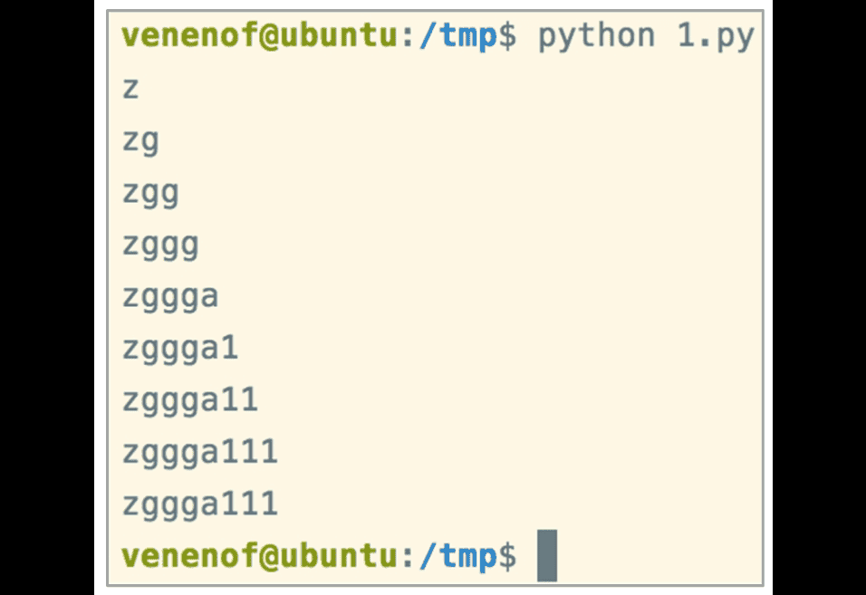

However, after testing, we found that the member registration function is turned off, which means we cannot use the member password reset vulnerability to reset the administrator password. What should we do? In fact, in DedeCMS, as long as the administrator has logged in the background, there will be a corresponding session file in the data directory, and this topic happens not to close the directory traversal, see Figure 1-1-15. so we can get the administrator's session value, modify the cookie through editcookie, so as to successfully enter the background, see Figure 1- 1-16.

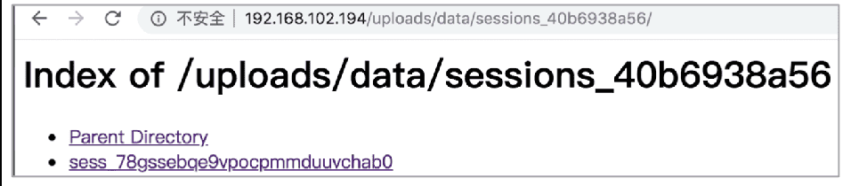

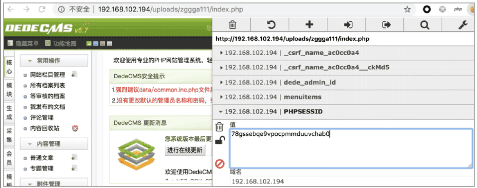

Then insert a piece of malicious code in the template's tag source fragment management to execute any command, see Figure 1-1-17 and Figure 1-1-18.


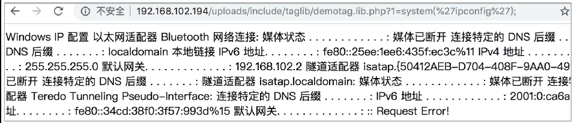

**3. Summary**

This example can reflect the importance of information gathering in two ways.

❖ One is the information of the server, for Windows server, the probability means we go to find some vulnerability of CMS on it.

❖ The second is the final RCE (Remote Command/Code Execute) through the characteristics of the CMS website itself combined with directory traversal without knowing the password and being unable to reset it.

