# Lab 5: Reverse Engineering and Obfuscation

Reverse engineering is a technical process of analyzing and studying a target product in reverse, so as to deduce and derive design elements such as processing flow, organization, functional performance specifications, etc., in order to produce a product with similar but not identical functions. In CTF, reverse engineering generally refers to software reverse engineering, i.e., analyzing the executable file that has been compiled, studying the behavior and algorithm of the program, and then using it as a basis to calculate the flags that the questioner wants to hide.

## Reverse Engineering Basics

### Overview of Reverse Engineering

Generally, the reverse engineering topic in CTF is in the form of: the program receives an input from the user, and carries out a series of verification algorithms in the program, and if it passes the verification, it will indicate success, at which time the input is the flag. these verification algorithms can be mature encryption and decryption scheme, or can be the author's own algorithm. For example, a mini-game uses the user's input as the operation step of the game to judge, etc. These types of topics require participants to have certain algorithmic skills, thinking skills, and even association skills.

This section will introduce the basics needed to get started with CTF inverse topics and introduce common tools, assuming the reader has some basic knowledge of C.

### Executable files

The object of software reverse engineering analysis is a program, i.e., one or more executable files. The following is a brief introduction to the formation process of executable files and common executable file types, so that readers can have a preliminary knowledge of them.

**1. The formation process of executable files (compilation and linking)**

For readers who are new to this area, it is crucial to form a proper understanding and sense of executable files. Again, as something created by human civilization, executable files are not generated directly as if by magic, but through a series of steps.

The vast majority of normal executables are generated by compiling a high-level language. In general, these processes occur when compiling:

<1> The user takes a set of source code written in a high-level language as input to the compiler.

<2> The compiler parses the input and generates the corresponding assembly code for each source code file.

<3> The assembler receives the compiler-generated assembly code and continues to perform assembly operations, temporarily storing each copy of the generated machine code in the respective object file.

<4> Now multiple object files have been generated, but the final goal is to generate an executable file. So the linker gets involved, interconnecting the scattered object files and processing them into a complete program. Then, according to the format of the executable file, it fills in various parameters specifying the running environment of the program and finally forms a complete executable file.

In the actual environment, there is more or less information loss in each step of the process due to the need to consider the size of the generated executable, the runtime performance of the executable, and the protection of information. For example, the comment information in the source code is generally discarded in the compilation stage, the label (label) name in the assembly code may be discarded in the assembly, and the symbolic information such as function name and type name may be discarded in the linking.

Reverse requires the use of knowledge and experience to restore some of this information, and thus restore all or part of the program flow to achieve various purposes of the analyst.

**2. Executable files in different formats**

In practice, due to historical legacy and competition between companies, etc., the various files generated in each step described above will have multiple file formats. For example, Windows systems use PE (Portable Executable) executables, while Linux systems use ELF (Executable and Linkable Format) executables. Since both executable formats are developed from COFF (Common File Format) format, various concepts in the file structure are very similar.

PE file consists of DOS header, PE file header, section table and data of each section; meanwhile, if you need to refer to external dynamic link library, there is import table; if you can provide functions to other programs to dynamically.

The ELF file consists of the ELF header, section data, section table, string segment, and symbol table.

Sections are logical divisions of sections in a program, usually with specific names, such as .text or .code for code sections, .data for data sections, etc. At runtime, the sections of an executable are loaded into various locations in memory, and one or more sections are mapped into a Segment for ease of management and to save overhead. Segments are divided according to the permissions (read, write, execute) required for this part of memory. If an illegal operation is performed in the corresponding segment, such as a write operation in a code segment that can only be read and executed, a Segmentation Fault is generated.

Since the basic format details of PE and ELF are fully disclosed and there are a lot of mature tools for parsing and modifying them, we will not explain these format details in detail here.

### Assembly Language Basics

After parsing the file, the reverser is confronted with a large piece of machine code, which is directly generated by the assembly language.

The following is an introduction to the key concepts of assembly language, so that readers can quickly understand assembly language.

**1. Registers, memory and addressing**

Register is a part of CPU, which is a high-speed storage component with limited storage capacity, used to temporarily store instructions, data and addresses. A typical IA-32 (Intel Architecture, 32-bit), or x86 architecture processor contains the following registers that are explicitly visible in instructions:

❖ General-purpose registers EAX, EBX, ECX, EDX, ESI, EDI.

❖ Top-of-stack pointer register ESP, bottom-of-stack pointer register EBP.

❖ Instruction counter EIP (holds the address of the next address of the next instruction to be executed).

❖ Segment registers CS, DS, SS, ES, FS, GS.

For the x86-64 architecture, based on these registers above, the prefix E is changed to R to mark 64 bits, and eight general-purpose registers, R8 to R15, are added. In addition, for the 16-bit case, the prefix E is removed altogether. 16-bit, there are certain restrictions on the use of registers, which will not be repeated in this book since they are not mainstream now.

For general-purpose registers, the program can use all of them or only part of them. The corresponding helpers for different parts of the registers are shown in Figure 5-1-1, where the naming rules for splitting R8 to R15 are R8d (low 32 bits), R8w (low 16 bits) and R8b (low 8 bits).

There is also a flag register in the CPU, where each bit indicates the value of the corresponding flag bit. The commonly used flag bits are as follows.

❖ AF: Auxiliary Carry Flag, set to 1 when the result of the operation is entered in the third bit.

❖ PF: Parity Flag, set to 1 when the lowest valid byte of the operation result has an even number of ones.

❖ SF: Sign Flag, set to 1 when the sign bit of the sign shaping is 1, representing that it is It means it is a negative number.

❖ ZF: Zero Flag, set to 1 when the operation result is all zeros.

❖ OF: Overflow Flag, set to 1 when the operation result is a signed number and overflows.

❖ CF: Carry Flag, set to 1 when the operation result is fed above the highest bit, used to determine the overflow of unsigned numbers.

The CPU can operate not only on registers, but also on memory cells, so there are many different addressing methods. Table 5-1-1 shows the different addressing methods of CPU, examples and the corresponding operation objects.

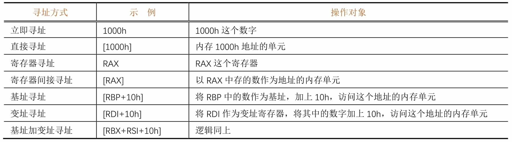

It is easy to see that "[]" is equivalent to the "\*" operator in C (indirect access).

In the x86/x64 architecture, the four addressing methods, namely register indirect addressing, base addressing, variable addressing, and base plus variable addressing, are almost identical in terms of the functions they achieve, but there are semantic differences. In the 16-bit era, these four addressing methods cannot be mixed. In modern compilers, the compiler will choose the appropriate addressing method based on semantics and optimization.

**2. x86/x64 assembly language**

The x86/x64 assembly language exists in two display/writing styles, Intel and AT&T, and this chapter will unify the Intel style.

What is machine code? What is assembly language? Machine code is a binary instruction executed directly on the CPU, and assembly language is a kind of helper for machine language, assembly language and machine code are one-to-one correspondence. Machine code varies according to CPU architecture. The most common CPU architectures for CTF and usual are x86 and x86-64 (x64).

The basic format of x86/x64 assembly instructions is as follows.

Where the presence or absence and form of operands is determined by the type of operand. Due to space limitation, this section cannot describe the format and functions of various instructions in an exhaustive manner. Table 5-1-2 gives the forms, functions, and corresponding high-level language writing methods of several common instructions. Entry-level CTF participants do not need to master how to write assembly language programs fluently, but only need to master the common instructions described below and be able to read and understand them when they encounter them.

There are many conditional jump instructions in assembly language, and they will jump conditionally depending on the flag bits. A cmp instruction for comparison often exists before the conditional jump instruction and will set the flag bit accordingly based on the result of the comparison (the effect on the flag bit is equivalent to the sub instruction).

Table 5-1-3 shows the common conditional jump instructions and the cmp and flag bits they are based on.

**3. Disassembly**

While high-level languages often require a complex compilation process, the assembly process simply translates the assembly statements directly into the corresponding machine code and places the statements directly adjacent to each other. Therefore, we can easily translate the machine code back to assembly language, and such a process is called disassembly.

As mentioned in Section 5.1.2, the assembly process also has information loss. Although we can easily parse and restore the content of a given instruction, we must know which data is machine code before we can parse it accordingly. The von Neumann architecture blurs the boundary of distinction between code and data, and jump tables, pools of constants (ARMs), ordinary constant data, and even malicious interference data may be interspersed in code sections. Therefore, simply and directly parsing instructions down one by one in succession is often problematic. We need to know the correct starting position of the instruction (e.g., label, which is used to indicate a location of the program for jumping and addressing) to guide the disassembly tool to parse the code correctly.

As mentioned above, the label information is lost during the assembly process. Because the label is used to identify the jump position, it determines where the program is likely to be executed when it is executed, i.e., where the assembly statement starts. Therefore, restoring the correct label information is essential to correctly restore the program execution flow.

In spite of the missing information, we can still successfully restore the program flow by using some algorithms. Two known algorithms are described below: **the linear scan disassembly algorithm** and **the recursive descent disassembly algorithm**.

The linear scan disassembly algorithm is simple and brute-force, parsing instructions one after another directly from the beginning of the code segment until the end. The disadvantage is that once data is inserted into the segment, all subsequent disassembly results are wrong and useless.

Instead of simply parsing the instructions and displaying them, the recursive descent disassembly algorithm is a new algorithm created after discovering the problems with the linear scan disassembly algorithm, which tries to speculate how the program will be executed after each instruction is executed. For example, a normal instruction will execute directly to the next one after execution, an unconditional jump instruction will immediately jump to the target location, a function call instruction will temporarily jump out and return to continue execution, a return instruction will terminate the current execution process, and a conditional jump instruction may split into two paths that go to different locations under different conditions. The engine first matches some known patterns (patterns) to the starting position, then traces the execution of the program one by one according to the execution pattern of the instructions, and finally disassembles the program completely.

**4. Calling convention**

As the size of the software increases, the number of developers continues to increase, the relationship between functions synchronization becomes more and more complex, if each developer uses different rules to pass function parameters, the program will often be a variety of unbelievable errors, the program maintenance costs will become very large. For this reason, after the advent of compilers, some conventions, called calling conventions, were created for compilers to specify the passing of arguments between functions. The common calling conventions are as follows.

(1) Calling convention for x86 32-bit architecture

❖ \_\_cdecl: parameters are pressed onto the stack in order from right to left, and when the call is finished, the caller is responsible for cleaning up these pressed parameters and placing the return value in EAX. The vast majority of C programs for x86 platforms use this convention.

❖ \_\_stdcall: The arguments are also pressed onto the stack from right to left, and the caller is responsible for cleaning up the pressed arguments after the call, with the return value also placed in EAX.

❖ \_\_thiscall: A calling convention optimized specifically for class methods, which places the this pointer of the class method in the ECX register and then presses the rest of the arguments onto the stack.

❖\ _\_fastcall: A calling convention made for speeding up calls by placing the 1st argument in ECX, placing the 2nd argument in EDX, and then pressing the subsequent arguments onto the stack from right to left.

(2) Calling convention for x86 64-bit architecture

❖ Microsoft x64 bit (x86-64) calling convention: used on Windows, the first 4 parameters are put into the 4 registers RDI, RSI, RDX, RCX in turn, and then the remaining parameters are pressed into the stack from right to left.

❖ SystemV x64 calling convention: used on Linux, MacOS, two more registers than Microsoft's version, use the 6 registers RDI, RSI, RDX, RCX, R8, R9 to pass the first 6 parameters, and press the rest on the stack from right to left.

**5. Local variables**

When writing programs, programmers often use local variables. But in assembly there are only registers, stacks, writable segments and heaps, where should the local variables of a function exist? It is important to note that local variables are "volatile": once the function returns, all local variables become invalid. Given this property, local variables are stored on the stack, and each time a function is called, the program allocates a section of space on the stack to store the local variables.

Each function, when called, creates such a region for local variables, a region for storing return addresses, and a region for arguments, see Figure 5-1-2. The program calls the function one layer deeper, and each function's own region is stacked on the stack one layer at a time.

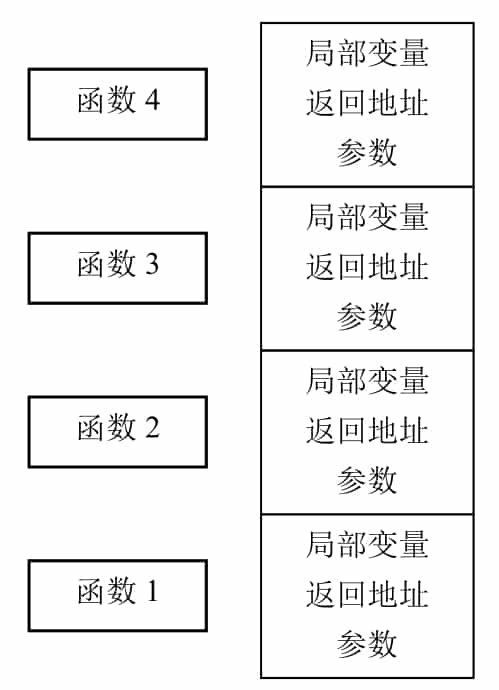

People call this area of each function itself a frame, and because these frames are on the stack, they are also called stack frames. However, the memory area of the stack is not necessarily fixed, and the location of the stack frames can vary with each call's path, so how can local variables be referenced correctly?

While the contents of the stack will always keep changing as it goes in and out of the stack, the offset of each local variable in a function relative to the stack frame of that function is fixed. So a register can be introduced to specifically store the location of the current stack frame, i.e., ebp, called the frame pointer. The program assigns ebp to a location in the middle of the stack frame during the function initialization phase, so that all local variables can be referenced with ebp. Since the parent function on the upper level also has to use ebp, it is necessary to save ebp at the beginning of the function and then assign ebp to the value of its own stack frame, such a flow is the classic combination in assembly code.

The stack frame of each function now consists of four parts: local variables, the value of the parent stack frame, the return address, and the parameters. It can be seen that ebp, after initialization, actually points to the location where the address of the parent stack frame is stored. Therefore, \*ebp forms a chain table representing a chain of function calls at one level.

With the development of compilation technology, the compiler can also refer to local variables by tracking the location of the stack at the time of each instruction execution, thus directly crossing over ebp and using the stack pointer esp instead. This saves the time needed to save ebp each time and adds a general-purpose register, thus improving program performance.

So now there are two kinds of functions: those with frame pointers, and those optimized without frame pointers. Modern analysis tools (e.g. IDA Pro, etc.) will use advanced stack pointer tracing methods to target these two types of functions so that local variables are handled correctly.

### Introduction to common tools

This section introduces the tools commonly used in software reverse engineering, the specific use of tools will be described in subsequent sections.

**1. IDA Pro**

IDA (Interactive DisAssembler) Pro (hereinafter referred to as IDA) is a powerful executable analysis tool, including but not limited to x86/x64, ARM, MIPS and other architectures, PE, ELF and other formats of executable files for static analysis and dynamic debugging. IDA integrated Hex-Rays Decompiler, which provides decompiling functions from assembly language to C pseudocode, can greatly reduce the workload when analyzing the program, its interface is shown in Figure 5-1-3 and Figure 5-1-4.

**2. OllyDbg and x64dbg**

OllyDbg is an excellent debugger for Windows 32-bit environment and its most powerful feature is its extensibility. Many developers have developed plug-ins for it with various functions that can bypass many software protection measures. However, OllyDbg is no longer available in the 64-bit environment, and many people have therefore turned to x64dbg.

The interfaces of OllyDbg and x64dbg are shown in Figure 5-1-5 and Figure 5-1-6.

**3. GNU Binary Utilities**

The GNU Binary Utilities (binutils) is a chain of tools provided by GNU for binary file analysis. the tools included are shown in Table 5-1-4. Figure 5-1-7 and Figure 5-1-8 show examples of simple applications of the tools in binutils.

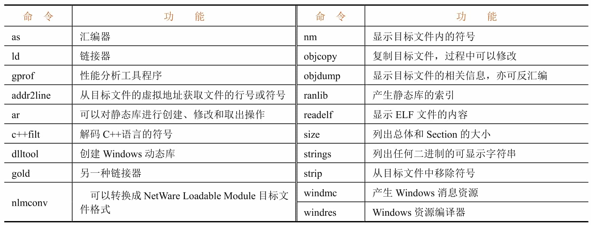

**4. GDB**

GDB (GNU Debugger) is a command-line debugger provided by GNU, with powerful debugging functions and source-level debugging support for programs containing debugging symbols, as well as support for writing extensions using the Python language, and the extension plug-ins generally used are gdb-peda, gef or pwndbg. Figure 5-1-10 shows the command line interface when using the gef plugin.

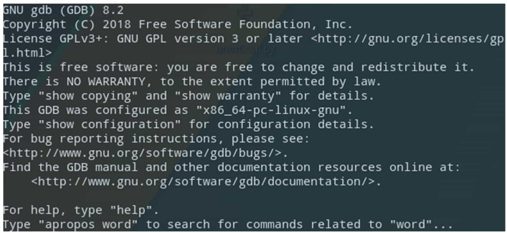

## Static Analysis

The most basic method of reverse engineering is static analysis, i.e., instead of running the binary program, various information such as machine instructions in the program files are analyzed directly. At present, the most commonly used tool for static analysis is IDA Pro. This section introduces the general method of static analysis based on the use of IDA Pro.

### Getting Started with lDA

The code file required for this section is 1-helloworld.

**1. open the file**

IDA Pro is one of the industry's most mature and advanced disassembly tools, using a recursive descent disassembly algorithm, this section will initially introduce the use of IDA Pro.

IDA's interface is very simple, after installation will pop up the license agreement (License) window, follow the interface prompts to enter the Quick Start interface, see Figure 5-2-1.

In the interface, click the "New" button, and in the pop-up dialog box to select the file to open, you can also click the "Go" button, and then drag and drop the file into the open interface, or by clicking the " Previous" button, double-click the list item, etc. to quickly open the previously opened file.

Note that you need to select the correct architecture version (32bit/64bit) before opening the file. Users can use tools such as file to view the architecture information of the file, but a more convenient solution is to open a random architecture of IDA, and then you can know the architecture information of the file when loading, see Figure 5-2-2, IDA shows that the file is an x86-64 architecture ELF64 file, so switch to the 64bit version of IDA to open again, after opening the pop-up will be "Load a new file" dialog box.

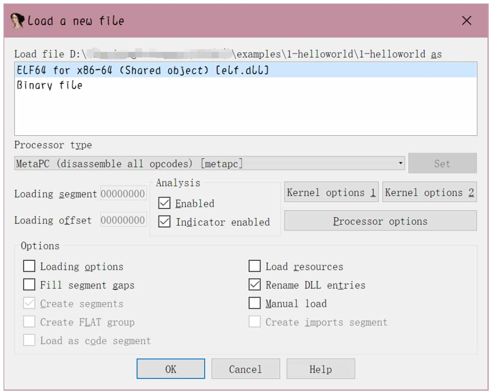

**2. Load a file**

The options in the "Load a new file" dialog box are mainly for advanced users, beginners can use the default settings, do not need to change, click the "OK" button, load the file into the IDA. Click the "No" button to enter the normal disassembly interface. At this point, IDA will generate a database (IDB) for the file, the entire file required content into it, see Figure 5-2-3. later analysis will no longer need to access the input file, the various changes to the database will also be independent of the input file.

The interface in Figure 5-2-3 is divided into several parts, which are described below.

❖ Navigation bar: Shows the distribution of different types of data (ordinary functions, code of undefined functions, data, undefined, etc.) of the program.

❖ Main window of disassembly: Displays the result of disassembly, control flow diagram, etc., which can be dragged, selected, etc.

❖ Function window: displays all function names and addresses (drag the scroll bar below to see them), and can be filtered by Ctrl+F key combination.

❖ Output window: display the log of IDA during running, you can also enter commands in the input box below and execute them.

❖ Status Indicator: Showing as "AU: idle" means IDA has finished the automated analysis of the program.

In the disassembly window, use the right-click menu or the shortcut key space to switch between control flow diagram and text interface disassembly, see Figure 5-2-4.

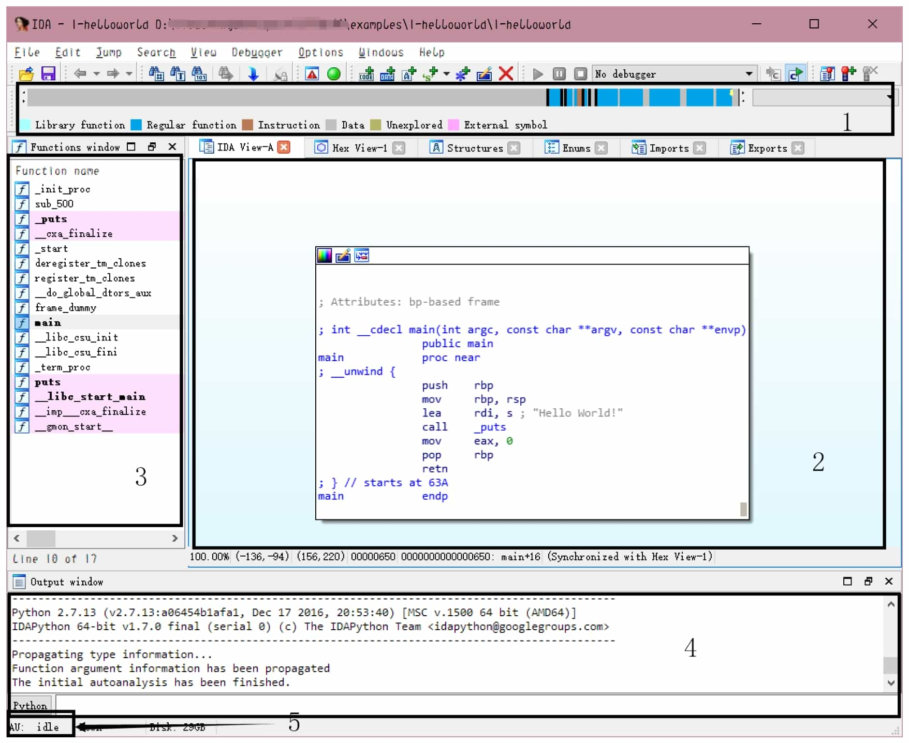

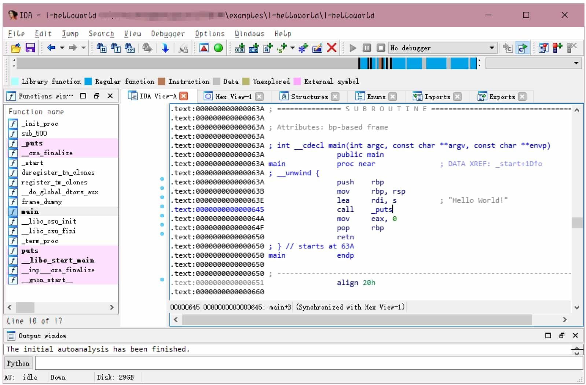

**3. Data Type Operation**

One of the highlights of IDA is that the user can freely control the flow of disassembly through interface interaction. In the process of loading the file, IDA has done its best to automatically define the type of a large number of locations for the user, such as IDA correctly labeled most of the data in the code segment as code type and disassembled it, and labeled some of the locations in the special segment as 8-byte integer qword. however, IDA's ability is limited and generally does not correctly label all data types, and the user can correct the problems with IDA by correctly defining the type of a 1-byte or segment area for better disassembly work.

Lower versions of IDA do not have an undo function, so you need to be careful before operating and to master the opposite operation corresponding to these operations.

The user can distinguish the type of data in a location by the color of the address. The location marked as code, its address will be shown in black; the location marked as data, gray display; undefined data type location will be shown in yellow, black box location that is the different color address, see Figure 5-2-5.

The following are some of the shortcut keys for the defined data types. When using these shortcut keys, you need to have the focus (cursor) on the corresponding line in order for them to take effect.

❖ U (Undefine) key: This is to cancel the existing data type definition in a place, and a confirmation dialog box will pop up.

❖ D (Data) key: i.e., make a certain position into data. IDA to prevent misuse, if the operation of defining data will affect the location of the existing data type, IDA will pop up a confirmation dialog box; if the operation of location and its vicinity are completely Undefined, the confirmation dialog box will not pop up.

❖ C (Code) key: i.e., make a location into a command. The timing of the confirmation dialog pop-up is also similar to the D key. After being defined as a command, IDA will automatically use this as the starting position for recursive descending disassembly.

Above are the basic shortcuts for defining data. To cope with the increasing complexity of data types, IDA also has various built-in data types, such as arrays, strings, etc.

❖ A (ASCII) key: It will define a string type ending with "\0" starting from this position, see Figure 5-2-6.

❖ * key: Define this as an array, and then a dialog box will pop up to set the properties of the array.

❖ O (Offset) key: Define this as an address offset, see Figure 5-2-7.

**4. Function Operation**

In fact, disassembly is not completely continuous, but rather a patchwork of scattered individual functions. Each function has local variables, calling conventions and other information, and control flow diagrams can only be generated and displayed in terms of functions, so it is also very important to define functions correctly. IDA also has operations for handling functions.

❖ Delete a function: After selecting a function in the function window, press Delete.

❖ Define a function: After selecting the corresponding line in the disassembly window, press P.

❖ Modify function parameters: Select and press the Ctrl+E key combination in the function window, or press Alt+P key combination inside the function in the disassembly window.

After defining the function, IDA can perform many function-level analyses, such as call convention analysis, stack variable analysis, function call parameter analysis, etc. These analyses are of direct and great help to restore the high-level semantics of disassembly.

**5. Navigation**

Although it is possible to switch between different functions by mouse clicks, as the size of the program increases, it seems unrealistic to use this way to locate them. î IDA has the function of navigation history, similar to Explorer and browser history, which allows you to go back or forward to a certain browsing place.

❖ Go back to the previous location: shortcut Esc.

❖ Go forward to the next location: shortcut Ctrl+Enter.

❖ Jump to a specific location: shortcut G, then you can enter the address/already defined name.

❖ Jump to a particular zone: shortcut Ctrl+S, and then you can select the zone.

**6. Type manipulation**

IDA has developed a type analysis system to handle various data types (function declarations, variable declarations, structure declarations, etc.) of C/C++ language and allows users to specify them freely. This definitely makes the reduction of disassembly more accurate. Select the variable, function and press Y, "Please enter the type declaration" dialog box, enter the correct C type, IDA can parse and automatically apply the type.

**7. IDA mode of operation**

IDA shortcut key design has a certain pattern, so we can strengthen the memory of the shortcut key, so that the reverse speed faster and more comfortable.

Here are some operation patterns and learning techniques summarized in the usual practice.

❖ Various operations in IDA's disassembly window will have different functions when selected and when unselected. For example, the operation corresponding to the shortcut key C can specify the scan area for recursive descending disassembly when the disassembly window is selected.

❖ Some of the shortcut keys in IDA's disassembly window have different functions when used multiple times. For example, the shortcut key O will resume the first operation when used a second time on the same location.

❖ IDA's right-click shortcut menu will be labeled with various shortcut keys.

❖ IDA's dialog box buttons can be replaced by mouse clicks by pressing their initials (e.g. the "Yes" button can be replaced by mouse clicks by pressing the Y key).

We can master these patterns to quickly learn IDA shortcuts, and basically do not need to press the control keys (Ctrl, Alt, Shift) shortcut features make IDA operation more interesting.

**8. IDAPython**

IDAPython is a Python environment built into IDA, you can perform a variety of database operations through the interface, it can now execute most of the C++ functions in the IDA SDK and all IDC functions, it can be said to have both the convenience of IDC and the power of the C++SDK.

Press Alt+F7 key combination, or select "File→Script file" menu command, you can execute Python script files; output window also has a Python Console box, you can temporarily execute Python statements; press Shift+F2 key combination, or Select the "File→Script command" menu command to open the script panel, and change "Scripting language" to "Python ", you can get a simple editor, see Figure 5-2-8.

**9 IDA's other functions**

IDA's menu bar "View→Open subviews" can open various types of windows, see Figure 5-2-9.

Strings window: press Shift+F12 to open it, see Figure 5-2-10, you can identify the strings in the program, double-click to locate the target string in the disassembly window.

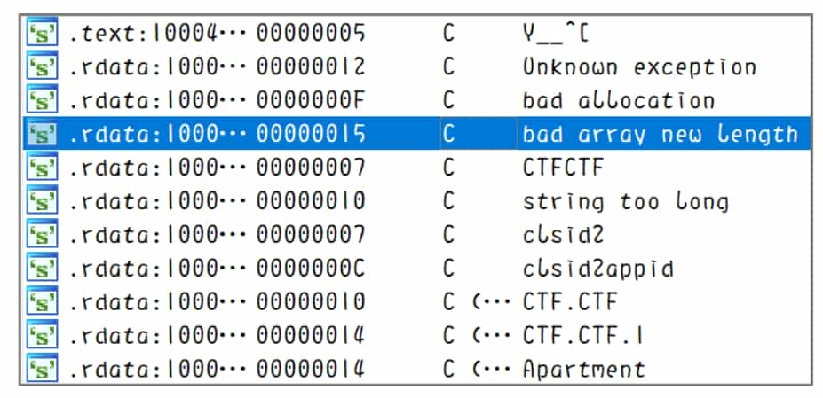

Hexadecimal window: Opened by default, you can press F2 to modify the data in the database, and press F2 again to apply the changes after modification.

### Getting Started with HexRays Decompiler

The basic operations of IDA introduced in section 5.2.1 are to allow IDA to correctly identify the data types and functions of a location. These operations partially restore the information loss caused by the linker and assembler mentioned in the executable (see section 2.4.7). The decompiler presented in this section will try to restore the information loss caused by the compiler and continue to restore the functions composed of these assembly instructions to a read-friendly form. Therefore, getting the decompiler to work correctly requires the correct definition of data types and the correct identification of functions.

This section introduces HexRays Decompiler (HexRays for short), the world's most advanced and sophisticated decompiler that is publicly available. HexRays runs as a plug-in to IDA and is developed by the same company as IDA and has a strong connection to IDA. hexRays makes full use of the function local variables and data types determined by IDA, and generates C-like pseudocode after optimization. Users can browse the generated pseudocode, add comments, rename identifiers, modify variable types, switch the data display format, etc.

**1. generate pseudocode**

To use this plug-in, you need to let it generate pseudocode. The operation required to generate pseudocode is very simple, just locate the target function in the disassembly window and press the F5 key. Once the plug-in is running, a window will open showing the decompiled pseudocode, see Figure 5-2-11. Selecting the list of functions on the left side allows you to switch to a different function without returning to the disassembly window.

When the cursor moves to identifiers, keywords, and constants, the same content in other positions will be highlighted for easy viewing and operation.

**2. Pseudocode Composition**

The pseudocode generated by HexRays has a certain structure. After decompiling each function, the first line is the prototype of the function, then the declaration area of local variables, and finally the statements of the function.

The upper part of this is the variable declaration area. Sometimes the area for larger functions can be too long to read and can be collapsed by clicking "Collapse declaration".

Note that the comments following each local variable actually represent the location of that variable. This information will make it easier to understand the behavior of the corresponding assembly code.

In addition, most of the variable names in the pseudocode are automatically generated and may vary from machine to machine or from version to version of IDA.

**3. Modify Identifiers**

Looking at the IDA generated pseudocode 2-simpleCrackme.c (see Figure 5-2-12), you can see that HexRays is very powerful and has automatically named many variables. However, the names of these variables have no real meaning, and as the size of the function becomes larger, meaningless variable names will seriously affect the analysis efficiency. Therefore, HexRays provides users with the ability to change the name of an identifier: move the cursor to the identifier and press N to bring up the Change Name dialog box, enter a legal name in the input box, and click the OK button. The modified pseudo-code is easier to read and analyze.

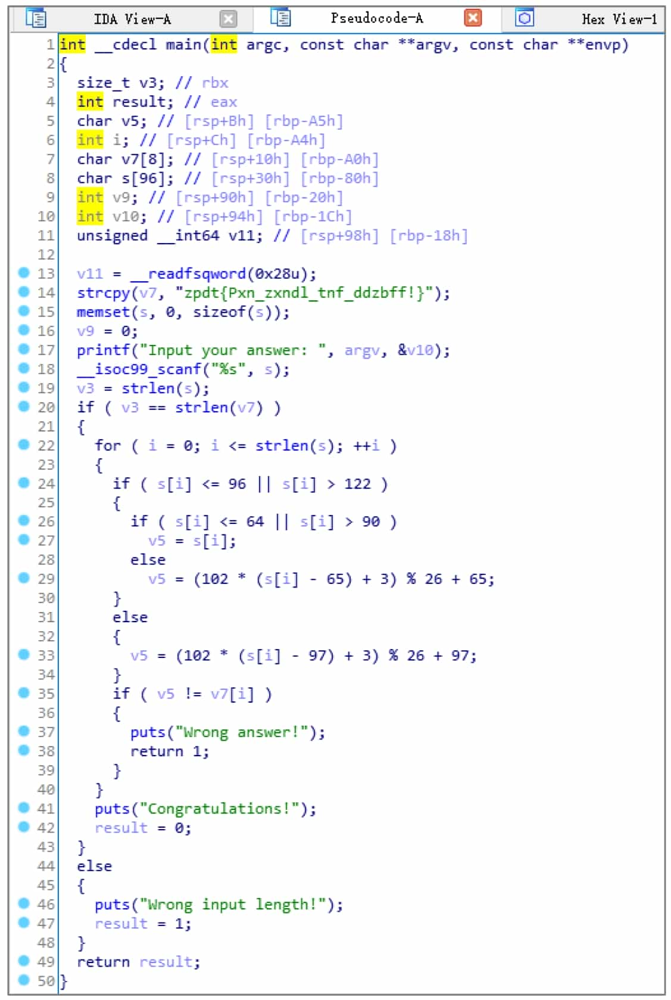

Note: IDA generally allows the use of identifiers in line with the C language syntax, but will be used as a reservation of certain prefixes, in the manual specification of the name, such a prefix can not be used, please readers are prompted to change the name after being prompted for errors.

**4. switch the data display format**

After renaming, the 2-simpleCrackme.c pseudocode has been restored to be similar to the source code (see Figure 5-2-12). However, many constants are not displayed in the correct format, for example, 0x66 in the source code becomes decimal number 102, and 'a' and 'A' are converted to their ASCII counterparts of decimal numbers 97 and 65.

HexRays is not powerful enough to automatically label these constants, but HexRays provides the ability to display constants into various formats. Move the cursor over a constant and right-click to select the corresponding format in the pop-up shortcut menu, see Figure 5-2-13.

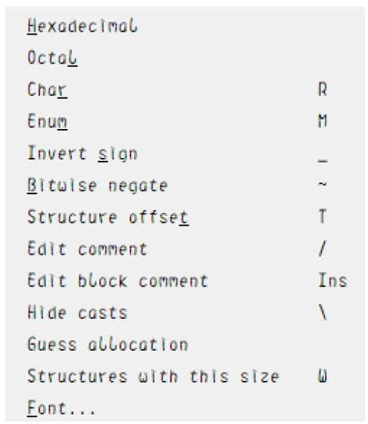

❖ Hexadecimal: Hexadecimal display, with the shortcut key H, can convert various other display formats back to numbers.

❖ Octal: Octal display.

❖ Char: Converts constants to a format shaped like 'A', the shortcut key is R.

❖ Enum: Converts a constant to a value in an enumeration, the shortcut key is M.

❖ Invert sign: convert a constant to a negative number by its complement, the shortcut key is \_.

❖ Bitwise negate: Invert the constant by bit, like ~0xF0 in C language, the shortcut key is ~.
After the manual operation to convert some display format, the decompiled pseudocode is more consistent with the source code, see Figure 5-2-14.

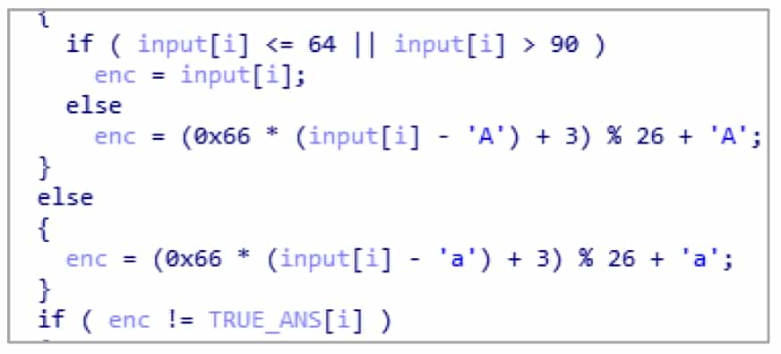

HexRays shortcuts are sometimes not triggered, try using the right-click shortcut menu when it fails.

**5. Modifying Variable Types**

The companion file to this section is 2-simpleCrackme_O3. After compiler optimization, the difficulty of recovering the semantics increases exponentially. Even though HexRays are extremely powerful, they often have problems in the face of complex compiler optimizations.

This section uses the executable generated by compiling with the GCC compiler with the O3 optimization switch turned on. The same source code undergoes a complex compiler optimization process and the resulting pseudocode can change quite a bit, see Figure 5-2-15.

The pseudocode converts some constants at the beginning to display format, which is the middle part of the string in the program stored as dword and qword, respectively. In fact, the original string assignment operation has become 128-bit floating-point assignment + 64-bit qword assignment + 32-bit dword assignment. HexRays thus identifies the string array as three variables: v6 of type \_\_m128i, v7 of \_\_int64, and v8 of int, resulting in poor readability of the pseudocode generated later.

Hint: byte-1 byte integer type, 8 bits, char, \_\_int8.

word-2 byte integer, 16 bits, short, \_\_int16.

dword-4-byte integer, 32 bits, int, \_\_int32.

qword-8-byte integer, 64 bits, \_\_int64, long long.

The variables v6, v7, v8 are actually entire arrays of strings. If the user can correctly specify the type of the variables, the accuracy and readability of decompiling will be greatly improved.

HexRays makes full use of the type analysis system of IDA introduced earlier. Press Y on the identifier of the type to be modified to bring up a dialog box to modify the type. For this program, according to the calculation, the 3 variables should actually be a char array of length 28 (16+8+4) starting with v6, so its corresponding C type declaration is char[28] (the identifier can be omitted in the type declaration).

Then move the cursor to v6, press Y, type "char[28]", and a confirmation dialog box will pop up whether to overwrite the subsequent variables, click the "Yes" button.

Rename these variables again, and you can get the readable pseudo-code, see Figure 5-2-16.

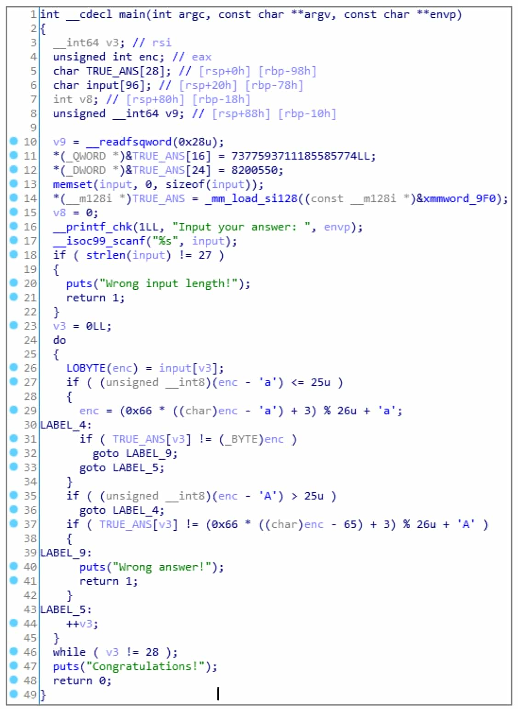

HexRays supports not only type modification of local variables, but also parameter types, function prototypes, global variable types, and so on. In fact, HexRays supports not only these simple types, but also C types such as structures and enumerations. Press Shift+F1 key combination to bring up the Local Types window, from which you can manipulate various types of C: press Insert, or right-click to bring up the Add Type dialog box, see Figure 5-2-17, from which you can enter a type that conforms to the simple syntax of C, and then IDA will parse and store the type. In addition, press Ctrl+F9 key combination or select "File→Load File→Parse C header file" menu command, you can load the C language header file.

After adding custom types, HexRays will automatically perform the corresponding parsing operations according to the types when setting variable types, such as displaying access to structures, displaying enumerations, etc.

Various cases of type recognition errors may occur during the reverse process, and we need to use our experience in C programming to set variables such as structures, normal pointers, structure pointers, and integers correctly.

In general, HexRays can increase the length of a variable by force (e.g., char[28] as mentioned above), but when changing a long variable to a short one, the alarm will often be "Sorry, can not change variable type" (e.g., change char[28] above to char[27]), so you need to be careful when changing a long variable to a shorter one. If you inadvertently modify the error, you can delete the function and then define the function to reset the various information of the function

**6. Complete the analysis**

After fine-tuning the pseudo-code to a level suitable for your reading, you can start the analysis. Obviously, this program implements the imitation projection cipher, and the method of finding the inverse is very simple, so I will not repeat it, and ask the reader to complete the decryption by himself.