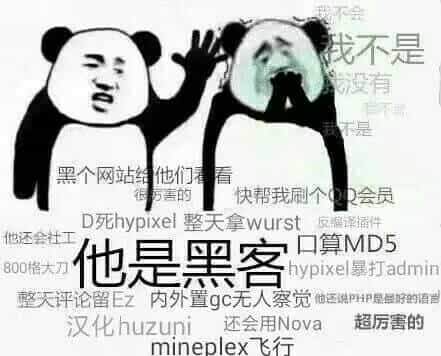

# Week 1 CTF Introduction and Forensics

## Introduction to CTF

Capture The Flags, or CTFs, are a kind of computer security competition.

Teams of competitors (or just individuals) are pitted against each other in a test of computer security skill.

Very often CTFs are the beginning of one's cyber security career due to their team building nature and competitive aspect. In addition, there isn't a lot of commitment required beyond a weekend.


Figure: CTFs on the CTFtime website.

These contests run every month by various organizations and universities across the globe. These contests can be arranged in the 3 styles:

1. Jeopardy 
2. Attack & Defense 
3. Mixed Style 

Most of the CTFs are online, while some of them (usually finals) are offline. The most famous CTF is the **DEF CON CTF**, which is held every August annually.

In our semester, every lab would have several CTF challenges in Jeopardy format. By the end of this semester, yet another AWD (Attack & Defense) CTF would be hold.

## Categories

In Jeopardy format CTFs, there are usually 5 categories:

* **Forensics**

  Forensics is the art of recovering the digital trail left on a computer. There are plenty of methods to find data which is seemingly deleted, not stored, or worse, covertly recorded.

* **Cryptography**

  Cryptography is the reason we can use banking apps, transmit sensitive information over the web, and in general protect our privacy. However, a large part of CTFs is breaking widely used encryption schemes which are improperly implemented. The math may seem daunting, but more often than not, a simple understanding of the underlying principles will allow you to find flaws and crack the code.

  The word “cryptography” technically means the art of writing codes. When it comes to digital forensics, it’s a method you can use to understand how data is constructed for your analysis.

* **Web Exploitation**

  Websites all around the world are programmed using various programming languages. While there are specific vulnerabilities in each programming langage that the developer should be aware of, there are issues fundamental to the internet that can show up regardless of the chosen language or framework.

  These vulnerabilities often show up in CTFs as web security challenges where the user needs to exploit a bug to gain some kind of higher level privileges.

* **Reverse Engineering**

  Reverse Engineering in a CTF is typically the process of taking a compiled (machine code, bytecode) program and converting it back into a more human readable format.

  Very often the goal of a reverse engineering challenge is to understand the functionality of a given program such that you can identify deeper issues.

* **Binary Exploitation**

  Binaries, or executables, are machine code for a computer to execute. For the most part, the binaries that you will face in CTFs are Linux ELF files or the occasional windows executable. Binary Exploitation is a broad topic within Cyber Security which really comes down to finding a vulnerability in the program and exploiting it to gain control of a shell or modifying the program's functions.

Some other categories growing up in recent years, like IoT (Internet of Thing) and AI.

## Forensics

An important part of Forensics is having the right tools, as well as being familiar with the following topics:

* File Formats
* EXIF data
* **Wireshark & PCAPs**
  * Wireshark traffic analysis
* Steganography
* *(Optional) Disk Imaging*

## File Formats

File Extensions are not the sole way to identify the type of a file, files have certain leading bytes called *file signatures* which allow programs to parse the data in a consistent manner. Files can also contain additional "hidden" data called *metadata* which can be useful in finding out information about the context of a file's data.

### File Signatures

**File signatures** (also known as File Magic Numbers) are bytes within a file used to identify the format of the file. Generally they’re 2-4 bytes long, found at the beginning of a file.

#### What is it used for?

Files can sometimes come without an extension, or with incorrect ones. We use file signature analysis to identify the format (file type) of the file. Programs need to know the file type in order to open it properly.

#### How do you find the file signature?

You need to be able to look at the binary data that constitutes the file you’re examining. To do this, you’ll use a hexadecimal editor. Once you find the file signature, you can check it against file signature repositories [such as Gary Kessler’s](http://www.garykessler.net/library/file_sigs.html).

#### Example


The file above, when opened in a Hex Editor, begins with the bytes `FFD8FFE0 00104A46 494600` or in ASCII `ˇÿˇ‡ JFIF` where `\x00` and `\x10` lack symbols.

Searching in [Gary Kessler’s](http://www.garykessler.net/library/file_sigs.html) database shows that this file signature belongs to a `JPEG/JFIF graphics file`, exactly what we suspect.

### Extensions vs Signature

File extension is used to uniquely describe a format of a particular file **whereas file signature is the header information that is present in each file**.

Some operating systems (Windows like) use file extension to bind with applications to open the file, while some other operating systems check file signature in the header to guess the file format (file command in Unix).

#### What about MIME?

A media type (also known as a Multipurpose Internet Mail Extensions or MIME type) is **a standard that indicates the nature and format of a document, file, or assortment of bytes**. It is defined and standardized in IETF's RFC 6838.

This type is identified in HTTP packets and **DO NOT** stipulate the real file format. For example, a MIME type `image/jpg` means the transferred data **LIKELY** to be a JPEG image, but user can post a `plain text` or `anything` in real body.

#### Example

```
            ┌────────────────┐
            │                │
            │   HTTP packe   │
            │                │
            │ MIME:image/jpg │
            │                │
A ───────── │  ┌──┐          │ ─────────► B
            │  │  │          │
            │  │  │flag.jpg  │
            │  └─┬┘          │
            │    │           │
            └────┼───────────┘
                 │
                 │
                 ▼
            ┌────────────────┐
            │GIF89a\xc8\x00  │
            │\x96\x00\xf7\x00│
            │...             │
            └────────────────┘
```

The file signature is `GIF8` while the file extension is `.jpg`, with the MIME type `image/jpg` during HTTP transmission.

The given file is a GIF image instead of JPEG file.

## Metadata

Metadata is data about data. Different types of files have different metadata. The metadata on a photo could include dates, camera information, GPS location, comments, etc. For music, it could include the title, author, track number and album.

### What kind of file metadata is useful?

Potentially, any file metadata you can find could be useful.

### How do I find it?

One of our favorite tools is exiftool, which displays metadata for an input file, including: - File size - Dimensions (width and height) - File type - Programs used to create (e.g. Photoshop) - OS used to create (e.g. Apple)

Run command line: `exiftool(-k).exe [filename]` and you should see something like this:


### Example

Let's take a look at File A's metadata with exiftool:

File type


Image description


Make and camera info


GPS Latitude/Longitude


## Timestamps

Timestamps are data that indicate the time of certain events (MAC): - Modification – when a file was modified - Access – when a file or entries were read or accessed - Creation – when files or entries were created

### Types of timestamps

- Modified
- Accessed
- Created
- Date Changed (MFT)
- Filename Date Created (MFT)
- Filename Date Modified (MFT)
- Filename Date Accessed (MFT)
- INDX Entry Date Created
- INDX Entry Date Modified
- INDX Entry Date Accessed
- INDX Entry Date Changed

### Why do we care?

Certain events such as creating, moving, copying, opening, editing, etc. might affect the MAC times. If the MAC timestamps can be attained, a timeline of events could be created.

### Timeline Patterns

There are plenty more patterns than the ones introduced below, but these are the basics you should start with to get a good understanding of how it works, and to complete this challenge.

    

### Examples

We know that the BMP files fileA and fileD are the same, but that the JPEG files fileB and fileC are different somehow. So how can we find out what went on with these files?


By using time stamp information from the file system, we can learn that the BMP fileD was the original file, with fileA being a copy of the original. Afterward, fileB was created by modifying fileB, and fileC was created by modifying fileA in a different way.

Follow along as we demonstrate.

We’ll start by analyzing images in AccessData FTK Imager, where there’s a Properties window that shows you some information about the file or folder you’ve selected.

   

Here are the extracted MAC times for fileA, fileB, fileC and fileD: *Note, AccessData FTK Imager assumes that the file times on the drive are in UTC (Universal Coordinated Time). I subtracted four hours, since the USB was set up in Eastern Standard Time. This isn’t necessary, but it helps me understand the times a bit better.*


Highlight timestamps that are the same, if timestamps are off by a few seconds, they should be counted as the same. This lets you see a clear difference between different timestamps. Then, highlight oldest to newest to help put them in order.

         

Identify timestamp patterns.


## Wireshark

[Wireshark](http://www.wireshark.com/) is a network protocol analyzer which is often used in CTF challenges to look at recorded network traffic. Wireshark uses a filetype called PCAP to record traffic. PCAPs are often distributed in CTF challenges to provide recorded traffic history.

### Interface

Upon opening Wireshark, you are greeted with the option to open a PCAP or begin capturing network traffic on your device.


The network traffic displayed initially shows the packets in order of which they were captured. You can filter packets by protocol, source IP address, destination IP address, length, etc.


In order to apply filters, simply enter the constraining factor, for example 'http', in the display filter bar.


Filters can be chained together using '&&' notation. In order to filter by IP, ensure a double equals '==' is used.


The most pertinent part of a packet is its data payload and protocol information.


### Decrypting SSL Traffic

By default, Wireshark cannot decrypt SSL traffic on your device unless you grant it specific certificates.

#### High Level SSL Handshake Overview

In order for a network session to be encrypted properly, the client and server must share a common secret for which they can use to encrypt and decrypt data without someone in the middle being able to guess. The SSL Handshake loosely follows this format:

1. The client sends a list of availble cipher suites it can use along with a random set of bytes referred to as client_random
2. The server sends back the cipher suite that will be used, such as TLS_DHE_RSA_WITH_AES_128_CBC_SHA, along with a random set of bytes referred to as server_random
3. The client generates a pre-master secret, encrypts it, then sends it to the server.
4. The server and client then generate a common master secret using the selected cipher suite
5. The client and server begin communicating using this common secret

#### Decryption Requirements

There are several ways to be able to decrypt traffic.

- If you have the client and server random values *and* the pre-master secret, the master secret can be generated and used to decrypt the traffic
- If you have the master secret, traffic can be decrypted easily
- If the cipher-suite uses RSA, you can factor *n* in the key in order to break the encryption on the encrypted pre-master secret and generate the master secret with the client and server randoms


## Steganography

Steganography is the practice of hiding data in plain sight. Steganography is often embedded in images or audio.

You could send a picture of a cat to a friend and hide text inside. Looking at the image, there’s nothing to make anyone think there’s a message hidden inside it.


You could also hide a second image inside the first.


### Steganography Detection

So we can hide text and an image, how do we find out if there is hidden data?


FileA and FileD appear the same, but they’re different. Also, FileD was modified after it was copied, so it’s possible there might be steganography in it.

FileB and FileC don’t appear to have been modified after being created. That doesn’t rule out the possibility that there’s steganography in them, but you’re more likely to find it in fileD. This brings up two questions:

1. Can we determine that there is steganography in fileD?
2. If there is, what was hidden in it?

### LSB Steganography

File are made of bytes. Each byte is composed of eight bits.


Changing the least-significant bit (LSB) doesn’t change the value very much.


So we can modify the LSB without changing the file noticeably. By doing so, we can hide a message inside.

#### LSB Steganography in Images

LSB Steganography or *Least Significant Bit* Steganography is a method of Steganography where data is recorded in the lowest bit of a byte.

Say an image has a pixel with an RGB value of (255, 255, 255), the bits of those RGB values will look like

| 1    | 1    | 1    | 1    | 1    | 1    | 1    | 1    |
| :--- | :--- | :--- | :--- | :--- | :--- | :--- | :--- |
|      |      |      |      |      |      |      |      |

By modifying the lowest, or least significant, bit, we can use the 1 bit space across every RGB value for every pixel to construct a message.

| 1    | 1    | 1    | 1    | 1    | 1    | 1    | 0    |
| :--- | :--- | :--- | :--- | :--- | :--- | :--- | :--- |
|      |      |      |      |      |      |      |      |

The reason Steganography is hard to detect by sight is because a 1 bit difference in color is insignificant as seen below.


#### Example

Let’s say we have an image, and part of it contains the following binary:


And let’s say we want to hide the character y inside.

First, we need to convert the hidden message to binary.


Now we take each bit from the hidden message and replace the LSB of the corresponding byte with it.


And again:


And again:


And again:


And again:


And again:


And again:


And once more:


Decoding LSB steganography is exactly the same as encoding, but in reverse. For each byte, grab the LSB and add it to your decoded message. Once you’ve gone through each byte, convert all the LSBs you grabbed into text or a file. (You can use your file signature knowledge here!)

### What other types of steganography are there?

Steganography is hard for the defense side, because there’s practically an infinite number of ways it could be carried out. Here are a few examples: - LSB steganography: different bits, different bit combinations - Encode in every certain number of bytes - Use a password - Hide in different places - Use encryption on top of steganography

## Blind Watermark

Blind watermark is a kind of technique to embed one picture or string to another image. Just like the regular watermark, but the blind watermark cannot be detected by using human eyes. The transformed image is indistinguishable from the origin one.

Furthermore, blind watermark should be able to bypass different types of processing of image. For example, rotating the picture should not broke the blind watermark. Some modern researches are focusing on the strong transform of the image, such like film the image from another screen.

### Example

#### encode:

original image
[](https://github.com/linyacool/blind-watermark/blob/master/ori.png)

watermark
[](https://github.com/linyacool/blind-watermark/blob/master/watermark.png)

```
python encode.py --image ori.png --watermark watermark.png --result res.png
```

result
[](https://github.com/linyacool/blind-watermark/blob/master/res.png)

#### decode:

```
python decode.py --original ori.png --image res.png --result extract.png
```

watermark
[](https://github.com/linyacool/blind-watermark/blob/master/extract.png)

## Hex Editor

A hexadecimal (hex) editor (also called a binary file editor or byte editor) is a computer program you can use to manipulate the fundamental binary data that constitutes a computer file. The name “hex” comes from “hexadecimal,” a standard numerical format for representing binary data. A typical computer file occupies multiple areas on the platter(s) of a disk drive, whose contents are combined to form the file. Hex editors that are designed to parse and edit sector data from the physical segments of floppy or hard disks are sometimes called sector editors or disk editors. A hex editor is used to see or edit the raw, exact contents of a file. Hex editors may used to correct data corrupted by a system or application. A [list of editors](http://forensicswiki.org/wiki/Tools#Hex_Editors) can be found on the forensics Wiki. You can download one and install it on your system.

### Example

Open fileA.jpg in a hex editor. (Most Hex editors have either a “File > Open” option or a simple drag and drop.)


When you open fileA.jpg in your hex editor, you should see something similar to this:


Your hex editor should also have a “go to” or “find” feature so you can jump to a specific byte.

## Exercise

Every lab we will have 2 or 3 challenges about the topics this week. But in case the difficulty of the challenge, only the first 2 challenges are required. But if you want to fight CTF so hard, you can try the third one. Solving the third one would give you extra points for this lab and some prizes as well.

For finishing the challenges, you may click this site: [COMPASS CTF Platform](https://compass.ctfd.io/) and find the category `CS315`. Other challenges are for CTF team members, but you also can finish them freely. After uploading the flag on the platform, you also need to upload a writeup to blackboard system to grade.

The `writeup` is a file to describe how you solve the challenges and you need also post flag in it. **The writeup would use to grade** and in case you forget to submit the writeup, during the argue procedure, we would check the submission in platform.

### Example writeup

```
(5 pt) Congratulations!
Now in order to check whether you are a robot, you need to submit this flag to show that you are a real human!
flag{w31com3_t0_CS315_c0Urs3!!!}
```

The flag you submit should be `flag{w31com3_t0_CS315_c0Urs3!!!}`, and the example writeup probably be:

```
Writeup.md
I am a human so I copied the flag and submit it.
Here is the flag:
flag{w31com3_t0_CS315_c0Urs3!!!}
```

### (5 pt) What is so called stream?

The network is so bad that I can't even send TCP stream through Internet. Wondering if I can use "UDP streams"...

[capture.pcap](file/chall1-1.pcap)

Try to find `flag` in this file, the flag format is: `picoCTF{***}`

*Hint1: Wireshark may be useful.*

### (5 pt) HTTPS with secret sauce

Solved the network problem yesterday, but I found some guy was sniffing my network traffic. I need to be careful to protect my flag. Decide to use HTTPS to submit my flag to `web01.fruitinc.xyz`.



By the way, upload my **super☆secret☆file** to network disk.

[capture.pcapng](file/chall1-2.pcapng)

[pre-master secret.txt](file/chall1-2.log)

Try to find `flag` in this file, the flag format is: `flag{y2***}`

### (BONUS 5 pt) Bytes through network

That hacker still got my flag! Fine, I'm going to send my file byte by byte. Besides, combined with my knowledge of **programming, encryption, and stenography** I'm going to fight the final round. WE ARE IN THE ENDGAME NOW.

[capture.pcapng](file/chall1-3.pcapng)

Try to find `flag` in this file, the flag format is: `flag{***}`

*This challenge is extremely hard. The winner will get a badge for solving this.*

