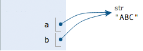
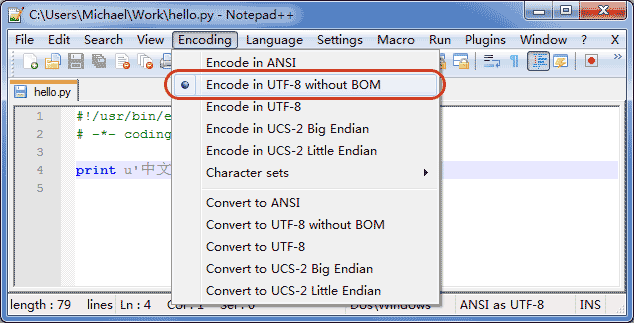
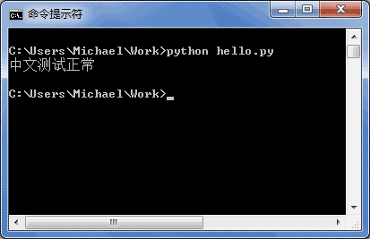
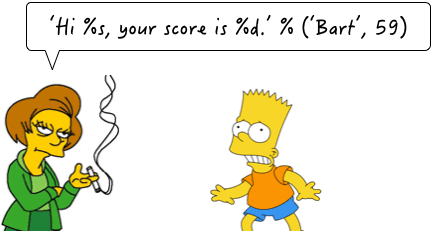
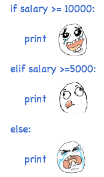

# Python Programming Quick Guide - Syntax

> https://www.liaoxuefeng.com/wiki/1016959663602400/1017063413904832
>
> https://docs.python.org/3/tutorial/index.html

## Python Basics

Python is a computer programming language. A computer programming language is different from the natural language we use every day. The biggest difference is that natural languages are understood differently in different contexts, and a computer must ensure that the program written in the programming language must not be ambiguous if it is to perform its tasks according to the programming language. Python is no exception.

Python's syntax is relatively simple, indented, and written like the following.

```
# print absolute value of an integer:
a = 100
if a >= 0:
    print(a)
else:
    print(-a)
```

Statements starting with `#` are comments, which are for human eyes and can be anything, and are ignored by the interpreter. Every other line is a statement, and when the statement ends with a colon `:`, the indented statement is considered a block of code.

Indentation has advantages and disadvantages. The advantage is that it forces you to write formatted code, but there is no rule about whether the indent is a few spaces or a tab. by convention, you should always stick to the 4-spaces indent.

Another advantage of indentation is that it forces you to write less indented code, and you will tend to split a long piece of code into several functions to get less indented code.

The downside of indentation is that the "copy-paste" feature is disabled, which is the worst part. When you refactor your code, the pasted code has to be rechecked for correct indentation. In addition, it's hard for the IDE to format Python code the way it formats Java code.

Finally, be sure to note that Python programs are case-sensitive, and if you write the wrong case, the program will report an error.

### Summary

Python uses indentation to organize blocks of code, so be sure to follow the convention and stick to a 4-space indent.

In the text editor, you need to set up the automatic conversion of tabs to 4 spaces to make sure you don't mix tabs and spaces.

## Data types and variables

### Data types

A computer is, as the name implies, a machine that can do mathematical calculations, so it is logical that computer programs can handle all kinds of numerical values. However, computers can handle much more than just numeric values. They can also handle text, graphics, audio, video, web pages, and a wide variety of other data, and different data requires different data types to be defined. In Python, the data types that can be handled directly are as follows.

#### integers

Python can handle integers of any size, including negative integers of course, represented in programs exactly as they are written in mathematics, for example: `1`, `100`, `-8080`, `0`, and so on.

Since computers use binary, it is sometimes easier to represent integers in hexadecimal, which is represented by the `0x` prefix and 0-9, a-f, for example: `0xff00`, `0xa5b4c3d2`, and so on.

For very large numbers, such as `10000000000`, it is difficult to count the number of zeros. python allows numbers to be separated by `_`, so writing `10_000_000_000` is exactly the same as `10000000000`. Hexadecimal numbers can also be written as `0xa1b2_c3d4`.

#### floating point numbers

Floating point numbers, also known as decimals, are called floating point numbers because the position of the decimal point of a floating point number is variable when expressed in scientific notation, for example, 1.23x109 is exactly the same as 12.3x108. Floating point numbers can be written mathematically, such as `1.23`, `3.14`, `-9.01`, and so on. But for very large or small floating point numbers, they must be expressed in scientific notation, replacing 10 with e. 1.23x109 is `1.23e9`, or `12.3e8`, 0.000012 can be written as `1.2e-5`, and so on.

Integers and floating point numbers are stored differently inside the computer, and integer operations are always exact (is division also exact? Yes!) ), while floating-point operations may have rounding errors.

#### strings

A string is any text enclosed in single quotes `'` or double quotes `"`, such as `'abc'`, `'xyz'`, etc. Note that `''` or `""` itself is just a representation, not part of a string, so the string `'abc'` has only the 3 characters `a`, `b`, `c`. If `'` itself is also a character, then it can be enclosed in `""`, for example, `"I'm OK"` contains the 6 characters `I`, `'`, `m`, space, `O`, and `K`.

What if the string contains both `'` and `"` inside? You can use the escape character `\` to identify it, for example.

```
'I\'m \"OK\"!'
```

The content of the string represented is:

```
I'm "OK"!
```

The escape character `\` can escape many characters, such as `\n` for line feeds, `\t` for tabs, and the character `\` itself should be escaped, so the character represented by `\\` is `\`. You can use `print()` on Python's interactive command line to print the string to see.

```
>>> print('I\'m ok.')
I'm ok.
>>> print('I\'m learning\nPython.')
I'm learning
Python.
>>> print('\\\n\\')
\
\
```

If there are many characters inside the string that need to be escaped, you need to add a lot of `\`. For simplicity, Python also allows `r''` to indicate that the string inside `''` is not escaped by default, so you can try it yourself at

```
>>> print('\\\t\\')
\       \
>>> print(r'\\\t\\')
\\\t\\
```

If there are many newlines inside the string, it is not good to read them in one line with `\n`. For simplicity, Python allows to use `'''...''' ` format to represent multiple lines of content, try it yourself:

```
>>> print('''line1
... line2
... line3''')
line1
line2
line3
```

The above is typed within the interactive command line, note that when typing multiple lines, the prompt changes from `>>>`  to `...`,  prompting you to continue typing on the previous line, note that `...`  is a prompt, not part of the code: `.

```ascii
┌────────────────────────────────────────────────────────┐
│Command Prompt - python                           _ □ x │
├────────────────────────────────────────────────────────┤
│>>> print('''line1                                      │
│... line2                                               │
│... line3''')                                           │
│line1                                                   │
│line2                                                   │
│line3                                                   │
│                                                        │
│>>> _                                                   │
│                                                        │
│                                                        │
│                                                        │
└────────────────────────────────────────────────────────┘
```

When the terminator `'''` and the brackets `)` have been entered, the statement is executed and the result is printed.

If written as a program and saved as a `.py` file, it would be.

```
print('''line1
line2
line3''')
```

The multi-line string `'''...'''`  can also be used with `r` in front, please test it yourself at:

```
# -*- coding: utf-8 -*-
print(r'''hello,\n
world''')
```

#### Boolean values

Boolean values are identical to the representation of Boolean algebra. A Boolean value has only two values, `True`, `False`, either `True` or `False`. In Python, a Boolean value can be expressed directly as `True`, `False` (please note the case), or it can be calculated by Boolean operations as follows.

```
>>> True
True
>>> False
False
>>> 3 > 2
True
>>> 3 > 5
False
```

Boolean values can be operated on with `and`, `or` and `not`.

The `and` operation is a sum operation, and the result of the `and` operation is `True` only if all are `True`.

```
>>> True and True
True
>>> True and False
False
>>> False and False
False
>>> 5 > 3 and 3 > 1
True
```

The `or` operation is an or operation, and as long as one of them is `True`, the result of the `or` operation is `True`.

```
>>> True or True
True
>>> True or False
True
>>> False or False
False
>>> 5 > 3 or 1 > 3
True
```

The `not` operation is a non-operation; it is a monadic operator that turns `True` into `False` and `False` into `True`.

```
>>> not True
False
>>> not False
True
>>> not 1 > 2
True
```

Boolean values are often used in conditional judgments, e.g.

```
if age >= 18:
    print('adult')
else:
    print('teenager')
```

#### Null values

A null value is a special value in Python, denoted by `None`. `None` cannot be interpreted as `0`, because `0` is meaningful, and `None` is a special null value.

In addition, Python provides a variety of data types, such as lists and dictionaries, and also allows the creation of custom data types, which we will continue to talk about later.

### Variables

The concept of a variable is basically the same as the equation variable in middle school algebra, except that in computer programs, variables can be not only numbers, but also arbitrary data types.

Variables are represented in the program by a variable name, which must be a combination of upper and lower case English, numbers, and `_`, and cannot start with a number, for example.

```
a = 1
```

The variable `a` is an integer.

```
t_007 = 'T007'
```

The variable `t_007` is a string.

```
Answer = True
```

The variable `Answer` is a Boolean value `True`.

In Python, the equal sign `=` is an assignment statement that can assign any data type to a variable, the same variable can be assigned repeatedly, and it can be a different type of variable, for example.

```
# -*- coding: utf-8 -*-
a = 123 # a is an integer
print(a)
a = 'ABC' # a becomes a string
print(a)
```

This type of language where the type of the variable itself is not fixed is called a *dynamic language*, and its counterpart is a *static language*. Static languages must specify the variable type when defining a variable, and will report an error if the type does not match when assigning a value. For example, Java is a static language, and the assignment statement is as follows (// indicates a comment)

```
int a = 123; // a is an integer type variable
a = "ABC"; // Error: You cannot assign a string to an integer variable
```

Dynamic languages are more flexible compared to static languages for this reason.

Please don't equate the equal sign of an assignment statement with the equal sign of mathematics. For example, the following code.

```
x = 10
x = x + 2
```

If you understand `x = x + 2` mathematically, that is not true anyway. In the program, the assignment statement first calculates the expression `x + 2` on the right side, gets the result `12`, and then assigns it to the variable `x`. Since the previous value of `x` was `10`, after reassignment, the value of `x` becomes `12`.

Finally, it is also important to understand how variables are represented in computer memory. When we write:

```
a = 'ABC'
```

Here the Python interpreter does two things.

1. creates a string `'ABC'` in memory.
2. creates a variable named `a` in memory and points it to `'ABC'`.

It is also possible to assign a variable `a` to another variable `b`, an operation that actually points the variable `b` to the data pointed to the variable `a`, as in the following code.

```
# -*- coding: utf-8 -*-
a = 'ABC'
b = a
a = 'XYZ'
print(b)
```

Is the last line printing out the contents of variable `b` as `'ABC'` or as `'XYZ'`? If understood in a mathematical sense, one would incorrectly conclude that `b` is the same as `a` and should also be `'XYZ'`, but in fact, the value of `b` is `'ABC'`, so let's execute the code line by line to see what is really happening.

Executing `a = 'ABC'`, the interpreter creates the string `'ABC'` and the variable `a`, and points `a` to `'ABC'`.


Executing `b = a`, the interpreter creates the variable `b` and points `b` to the string `'ABC'` pointed to by `a`.



Executing `a = 'XYZ'`, the interpreter creates the string `XYZ' and changes the pointing of `a` to `'XYZ'`, but `b` does not change.


So, the final result of printing the variable `b` will naturally be `'ABC'`.

### Constants

A constant is a variable that cannot be changed, for example, the common mathematical constant π is a constant. In Python, constants are usually represented by all-caps variable names.

```
PI = 3.14159265359
```

But the fact is that `PI` is still a variable, and Python has no mechanism at all to ensure that `PI` won't be changed, so using all-caps variable names for constants is just a customary usage, and if you must change the value of the variable `PI`, no one can stop you.

Finally, an explanation of why division by integers is also exact. In Python, there are two kinds of division, one of which is `/`.

```
>>> 10 / 3
3.3333333333333335
```

`/` The result of the division calculation is a floating point number, even if two integers are exactly divisible, and the result is a floating point number.

```
>>> 9 / 3
3.0
```

Another type of division is `//`, called floor division, where the division of two integers remains an integer:

```
>>> 10 // 3
3
```

You read that right, the floor of an integer divided by `//` is always an integer, even if the division is not exhaustive. To do exact division, use `/` and you're done.

Because `//` division takes only the integer part of the result, Python also provides a remainder operation that gives you the remainder of the division of two integers by.

```
>>> 10 % 3
1
```

Whether an integer does `//` division or takes a remainder, the result is always an integer, so the result of integer arithmetic is always exact.

### Summary

Python supports a variety of data types, and within the computer, any data can be thought of as an "object", and variables are used in programs to point to these data objects.

Assigning `x = y` to a variable is to point the variable `x` to the real object that the variable `y` points to. Subsequent assignments to the variable `y` *do not affect* the pointing of the variable `x`.

Note: Python's integers have no size limit, while some languages have size limits for integers based on their storage length, for example, Java limits 32-bit integers to `-2147483648`-`2147483647`.

Python's floating point numbers also have no size limit, but beyond a certain range, they are directly represented as `inf` (infinity).

## String and encoding

### Character encoding

As we have already talked about, strings are also a data type, but what is special about strings is that there is also an encoding problem.

Because computers can only process numbers, if you want to process text, you must first convert the text to numbers before you can process it. The earliest computers were designed with 8 bits (bit) as a byte (byte), so the largest integer that a byte can represent is 255 (binary 1111111111 = decimal 255), and to represent larger integers, more bytes must be used. For example, the largest integer that can be represented by two bytes is `65535` and the largest integer that can be represented by four bytes is `4294967295`.

Since the computer was invented by the Americans, only 127 characters were first encoded into the computer, that is, upper and lower case English letters, numbers and some symbols, this code table is called `ASCII` code, for example, the code for upper case letter `A` is `65` and the code for lower case letter `z` is `122`.

But to deal with Chinese, obviously, one byte is not enough, at least two bytes are needed, and it should not conflict with ASCII, so China has developed `GB2312` encoding, which is used to encode Chinese.

As you can imagine, there are hundreds of languages in the world, Japan coded Japanese into `Shift_JIS`, Korea coded Korean into `Euc-kr`, and each country has its own standard, so there will be inevitable conflicts, and as a result, there will be garbled codes in the mixed text of multiple languages.


As a result, the Unicode character set was created. Unicode unifies all languages into one set of encodings so that there will be no more problems with garbled code.

The Unicode standard has evolved, but the most commonly used is the UCS-16 encoding, which uses two bytes to represent a character (four bytes are needed if very remote characters are to be used). Unicode is directly supported by modern operating systems and most programming languages.

Now, run through the differences between ASCII and Unicode encoding: ASCII encoding is 1 byte, while Unicode encoding is usually 2 bytes.

The letter `A` is `65` in decimal and `01000001` in binary with ASCII encoding.

The character `0` in ASCII encoding is `48` in decimal and `00110000` in binary, noting that the character `'0'` is different from the integer `0`.

The Chinese character `中` is beyond the scope of ASCII encoding and is `20013` in decimal and `01001110 00101101` in binary using Unicode encoding.

You can guess that if you encode the ASCII-encoded `A` in Unicode, you just need to make up the 0 in front of it, so the Unicode encoding of `A` is `00000000 01000001`.

A new problem arises again: if you unify it into Unicode, the messy code problem disappears from now on. However, if all the text you write is basically in English, Unicode encoding requires twice as much storage space as ASCII encoding, which is very uneconomical in terms of storage and transmission.

Therefore, in the spirit of saving, `UTF-8` encoding, which converts Unicode encoding into `variable-length encoding`, has emerged. Only very rare characters are encoded as 4-6 bytes. If the text you are transferring contains a large number of English characters, using UTF-8 encoding saves space.

| Encoding | ASCII    | Unicode           | UTF-8                      |
| :--- | :------- | :---------------- | :------------------------- |
| A    | 01000001 | 00000000 01000001 | 01000001                   |
| 中   | x        | 01001110 00101101 | 11100100 10111000 10101101 |

From the table above, you can also find that UTF-8 encoding has the added benefit that ASCII encoding can actually be seen as part of UTF-8 encoding, so a large amount of legacy software that only supports ASCII encoding can continue to work under UTF-8 encoding.

Having figured out the relationship between ASCII, Unicode and UTF-8, we can summarize the way character encoding works in common for computer systems nowadays.

In the computer memory, Unicode encoding is used uniformly, and when it needs to be saved to the hard disk or needs to be transferred, it is converted to UTF-8 encoding.

When editing with Notepad, UTF-8 characters read from a file are converted to Unicode characters in memory, and when editing is complete, Unicode is converted to UTF-8 and saved to the file when saving.


When browsing the web, the server converts the dynamically generated Unicode content to UTF-8 before transferring it to the browser.


So you see a lot of web pages with something like `<meta charset="UTF-8" />` on the source code, indicating that the page is encoded exactly in UTF-8.

### Python's strings

With the headache of character encoding out of the way, let's look at Python strings.

In the latest version of Python 3, strings are encoded in Unicode, meaning that Python's strings support multiple languages, such as

```
>>> print('包含中文的str')
包含中文的str
```

For the encoding of individual characters, Python provides the `ord()` function to obtain an integer representation of the character, and the `chr()` function to convert the encoding to the corresponding character:

```
>>> ord('A')
65
>>> ord('中')
20013
>>> chr(66)
'B'
>>> chr(25991)
'文'
```

If you know the integer encoding of the characters, you can also write `str` in hexadecimal like this.

```
>>> '\u4e2d\u6587'
'中文'
```

The two ways of writing are exactly equivalent.

Since Python's string type is `str`, represented in memory as Unicode, a character corresponds to a number of bytes. If you want to transfer it over the network or save it to disk, you need to change `str` to `bytes` in bytes.

Python represents data of type `bytes` in single or double quotes prefixed with `b` as follows.

```
x = b'ABC'
```

Be careful to distinguish between `'ABC'`, which is `str`, and `b'ABC'`, which occupies only one byte for each character of `bytes`, although the content is displayed the same as the former.

The `str` in Unicode can be encoded to the specified `bytes` by the `encode()` method, e.g.

```
>>> 'ABC'.encode('ascii')
b'ABC'
>>> '中文'.encode('utf-8')
b'\xe4\xb8\xad\xe6\x96\x87'
>>> '中文'.encode('ascii')
Traceback (most recent call last):
  File "<stdin>", line 1, in <module>
UnicodeEncodeError: 'ascii' codec can't encode characters in position 0-1: ordinal not in range(128)
```

Pure English `str` can be encoded with `ASCII` as `bytes`, the content is the same, and `str` containing Chinese can be encoded with `UTF-8` as `bytes`. The `str` containing Chinese cannot be encoded with `ASCII` because the Chinese encoding range exceeds the range of `ASCII` encoding, Python will report an error.

In `bytes`, bytes that cannot be displayed as ASCII characters are displayed with `\x##`.

Conversely, if we read a stream of bytes from the network or from a disk, the data read is `bytes`. To change `bytes` to `str`, the `decode()` method is used.

```
>>> b'ABC'.decode('ascii')
'ABC'
>>> b'\xe4\xb8\xad\xe6\x96\x87'.decode('utf-8')
'中文'
```

If `bytes` contains bytes that cannot be decoded, the `decode()` method will report an error.

```
>>> b'\xe4\xb8\xad\xff'.decode('utf-8')
Traceback (most recent call last):
  ...
UnicodeDecodeError: 'utf-8' codec can't decode byte 0xff in position 3: invalid start byte
```

If there are only a small number of invalid bytes in `bytes`, you can pass `errors='ignore'` to ignore the erroneous bytes.

```
>>> b'\xe4\xb8\xad\xff'.decode('utf-8', errors='ignore')
'中'
```

To calculate how many characters `str` contains, you can use the `len()` function.

```
>>> len('ABC')
3
>>> len('中文')
2
```

The `len()` function counts the number of characters in `str`, if replaced with `bytes`, the `len()` function counts the number of bytes.

```
>>> len(b'ABC')
3
>>> len(b'\xe4\xb8\xad\xe6\x96\x87')
6
>>> len('中文'.encode('utf-8'))
6
```

As you can see, 1 Chinese character will usually occupy 3 bytes after UTF-8 encoding, while 1 English character will occupy only 1 byte.

When manipulating strings, we often encounter the interconversion of `str` and `bytes`. To avoid garbling problems, you should always use UTF-8 encoding for `str` and `bytes` conversions.

Since Python source code is also a text file, when your source code contains Chinese, be sure to specify saving as UTF-8 when you save the source code. When the Python interpreter reads the source code, in order for it to read it in UTF-8, we usually write these two lines at the beginning of the file.

```
#!/usr/bin/env python3
# -*- coding: utf-8 -*-
```

the first line comment is to tell the Linux/OS X system that this is a Python executable and that Windows systems will ignore the comment.

The second comment line is to tell the Python interpreter to read the source code in UTF-8 encoding, otherwise, the Chinese output you write in the source code may be garbled.

Asserting UTF-8 encoding does not mean that your `.py` file is UTF-8 encoded; you must and do make sure that the text editor is using UTF-8 without BOM encoding.



If the `.py` file itself uses UTF-8 encoding and also declares `# -*- coding: utf-8 -*-`, opening a command prompt to test will display Chinese properly.



### Formatting

The last common problem is how to output a formatted string. We often output something like `'Hello dear xxx! Your phone bill for month xx is xx and your balance is xx'` and strings like that, and the contents of xxx are changing based on variables, so an easy way to format strings is needed.



In Python, the formatting used is the same as in C, implemented with `%`, as an example.

```
>>> 'Hello, %s' % 'world'
'Hello, world'
>>> 'Hi, %s, you have $%d.' % ('Michael', 1000000)
'Hi, Michael, you have $1000000.'
```

As you may have guessed, the `%` operator is used to format strings. Inside a string, `%s` means replace with a string, `%d` means replace with an integer, and there are several `%? ` placeholder, followed by several variables or values, the order should correspond well. If there is only one `%? `, the parentheses can be omitted.

Common placeholders are.

| Placeholders | Replacement Content     |
| :----- | :----------- |
| %d     | Integer         |
| %f     | Float       |
| %s     | String       |
| %x     | Hex Integer |

Among other things, formatting integers and floating-point numbers also allows you to specify whether to complement zeros and the number of integer and fractional digits.

```
# -*- coding: utf-8 -*-
print('%2d-%02d' % (3, 1))
print('%.2f' % 3.1415926)
```

If you're not quite sure what to use, `%s` always works, and it will convert any data type to a string: the

```
>>> 'Age: %s. Gender: %s' % (25, True)
'Age: 25. Gender: True'
```

There are times when the `%` inside a string is a normal character. This time it is necessary to escape it and use `%%` to represent a `%`.

```
>>> 'growth rate: %d %%' % 7
'growth rate: 7 %'
```

### format()

Another way to format a string is to use the string's `format()` method, which will replace the placeholders `{0}`, `{1}` ...... within the string in order with the passed arguments, although this is much more cumbersome to write than %:.

```
>>> 'Hello, {0}, 成绩提升了 {1:.1f}%'.format('小明', 17.125)
'Hello, 小明, 成绩提升了 17.1%'
```

### f-string

The last way to format strings is to use strings starting with `f`, called `f-string`, which differs from normal strings in that strings that contain `{xxx}` are replaced with the corresponding variable:

```
>>> r = 2.5
>>> s = 3.14 * r ** 2
>>> print(f'The area of a circle with radius {r} is {s:.2f}')
The area of a circle with radius 2.5 is 19.62
```

In the above code, `{r}` is replaced by the value of the variable `r`, `{s:.2f}` is replaced by the value of the variable `s`, and the `.2f` after `:` specifies the formatting parameter (i.e., two decimal places are retained), so the result of the replacement of `{s:.2f}` is `19.62`.

### Summary

Python 3's strings use Unicode, which directly supports multiple languages.

When `str` and `bytes` are converted to each other, the encoding needs to be specified. The most common encoding is `UTF-8`, and Python certainly supports other encodings, such as encoding Unicode to `GB2312`.

```
>>> '中文'.encode('gb2312')
b'\xd6\xd0\xce\xc4'
```

However, this approach is purely self-defeating. If you have no special business requirements, please keep in mind to use only `UTF-8` encoding.

Formatting strings can be tested easily and quickly with Python's interactive environment.

### Reference source code

[the_string.py](https://github.com/michaelliao/learn-python3/blob/master/samples/basic/the_string.py)

## Using lists and tuples

### lists

One of Python's built-in data types is a list, an ordered collection of elements that can be added and removed at any time.

For example, listing the names of all the students in a class can be represented by a list.

```
>>> classmates = ['Michael', 'Bob', 'Tracy']
>>> classmates
['Michael', 'Bob', 'Tracy']
```

The variable `classmates` is a list, and the number of elements in the list can be obtained using the `len()` function.

```
>>> len(classmates)
3
```

Use the index to access the element at each position in the list, remembering that the index starts at `0`.

```
>>> classmates[0]
'Michael'
>>> classmates[1]
'Bob'
>>> classmates[2]
'Tracy'
>>> classmates[3]
Traceback (most recent call last):
  File "<stdin>", line 1, in <module>
IndexError: list index out of range
```

Python will report an `IndexError` error when the index is out of range, so make sure the index doesn't go out of bounds, and remember that the index of the last element is `len(classmates) - 1`.

To fetch the last element, in addition to calculating the index position, you can also use `-1` for the index and fetch the last element directly at.

```
>>> classmates[-1]
'Tracy'
```

And so on, you can obtain the penultimate one, the penultimate one.

```
>>> classmates[-2]
'Bob'
>>> classmates[-3]
'Michael'
>>> classmates[-4]
Traceback (most recent call last):
  File "<stdin>", line 1, in <module>
IndexError: list index out of range
```

Of course, the penultimate one is out of bounds.

A list is a mutable ordered table, so it is possible to append elements to the end of a list.

```
>>> classmates.append('Adam')
>>> classmates
['Michael', 'Bob', 'Tracy', 'Adam']
```

It is also possible to insert an element into a specified position, such as the position with index number `1`.

```
>>> classmates.insert(1, 'Jack')
>>> classmates
['Michael', 'Jack', 'Bob', 'Tracy', 'Adam']
```

To delete the element at the end of a list, use the `pop()` method.

```
>>> classmates.pop()
'Adam'
>>> classmates
['Michael', 'Jack', 'Bob', 'Tracy']
```

To delete the element at the specified position, use the `pop(i)` method, where `i` is the index position.

```
>>> classmates.pop(1)
'Jack'
>>> classmates
['Michael', 'Bob', 'Tracy']
```

To replace an element with another element, you can directly assign it to the corresponding index position.

```
>>> classmates[1] = 'Sarah'
>>> classmates
['Michael', 'Sarah', 'Tracy']
```

The data types of the elements inside the list can also be different, e.g.

```
>>> L = ['Apple', 123, True]
```

A list element can also be another list, e.g.

```
>>> s = ['python', 'java', ['asp', 'php'], 'scheme']
>>> len(s)
4
```

Note that `s` has only 4 elements, where `s[2]` is again a list, which is easier to understand if you split it up.

```
>>> p = ['asp', 'php']
>>> s = ['python', 'java', p, 'scheme']
```

To get `'php'` you can write `p[1]` or `s[2][1]`, so `s` can be seen as a two-dimensional array, similarly there are three-dimensional and four-dimensional ...... arrays, but they are rarely used.

If a list contains not a single element, it is an empty list, which has length 0.

```
>>> L = []
>>> len(L)
0
```

### tuple

Another kind of ordered list is called a tuple: tuples. tuples are very similar to lists, but tuples cannot be modified once they are initialized, for example, they also list the names of classmates.

```
>>> classmates = ('Michael', 'Bob', 'Tracy')
```

Now, the tuples classmates cannot be changed, and it has no methods like append(), insert(). You can use `classmates[0]`, `classmates[-1]` as normal, but you cannot assign to another element.

What is the point of immutable tuples? Because tuples are immutable, the code is safer. If possible, try to use a tuple instead of a list.

The tuple trap: When you define a tuple, the elements of the tuple must be identified at the time of definition, e.g.

```
>>> t = (1, 2)
>>> t
(1, 2)
```

To define an empty tuples, you can write `()` as follows:

```
>>> t = ()
>>> t
()
```

However, to define a tuples with only 1 element, if you define it like this.

```
>>> t = (1)
>>> t
1
```

It's not the tuple that is defined, it's the number `1`! This is because the parentheses `()` can represent both tuple and parentheses in a mathematical formula, which creates ambiguity, so Python specifies that in this case, the calculation is done by parentheses, and the result is naturally `1`.

Therefore, tuples with only 1 element must be defined with a comma `,` to disambiguate.

```
>>> t = (1,)
>>> t
(1,)
```

Python also adds a comma `,` when displaying tuples with only 1 element, so that you don't misinterpret them as parentheses in the mathematical sense.

Finally, look at a "mutable" tuples.

```
>>> t = ('a', 'b', ['A', 'B'])
>>> t[2][0] = 'X'
>>> t[2][1] = 'Y'
>>> t
('a', 'b', ['X', 'Y'])
```

This tuple is defined with 3 elements, `'a'`, `'b'` and a list. How come it changed later?

Don't worry, let's first look at the definition of the tuples contain three elements: ``a'', ``b'' and a list.


When we modify the elements `'A'` and `'B'` of the list to `'X'` and `'Y'`, the tuples become:


On the surface, the elements of the tuples do change, but in fact, it is not the elements of the tuples that change, but the elements of the lists. tuples do not change the lists they point to in the beginning to other lists, so the so-called "unchanging" of tuples means that each element of the tuples points to the same list forever. The tuple's so-called "invariant" means that each element of the tuple points to the same element forever. That is, if you point to `'a'', you cannot change it to point to `'b'', and if you point to a list, you cannot change it to point to another object, but the list itself is mutable!

After understanding the "pointing to the same", how to create a tuple whose content also remains the same? Then we must ensure that each element of the tuple itself can not change.

### Summary

lists and tuples are Python's built-in ordered collections, one mutable and one immutable. Choose to use them as needed.

### Reference source code

[the_list.py](https://github.com/michaelliao/learn-python3/blob/master/samples/basic/the_list.py)

[the_tuple.py](https://github.com/michaelliao/learn-python3/blob/master/samples/basic/the_tuple.py)

## Conditional Judgment

### Conditional Judgment

The computer can do many automated tasks because it can make its own conditional judgments.

For example, entering the user's age and printing different things depending on the age is implemented in a Python program with the `if` statement.

```
age = 20
if age >= 18:
    print('your age is', age)
    print('adult')
```

According to Python's indentation rules, if the `if` statement is judged to be `True`, the two lines of the indented print statement are executed, otherwise, nothing is done.

You can also add an `else` statement to `if`, meaning that if `if` is judged to be `False`, don't execute the `if` content and go ahead and execute the `else`.

```
age = 3
if age >= 18:
    print('your age is', age)
    print('adult')
else:
    print('your age is', age)
    print('teenager')
```

Be careful not to underwrite the colon `:`.

Of course the above judgement is very rough, it is perfectly possible to make a more detailed judgement with `elif`:

```
age = 3
if age >= 18:
    print('adult')
elif age >= 6:
    print('teenager')
else:
    print('kid')
```

`elif` is short for `else if`, and it is perfectly possible to have more than one `elif`, so the full form of the `if` statement is:

```
if <条件判断1>:
    <执行1>
elif <条件判断2>:
    <执行2>
elif <条件判断3>:
    <执行3>
else:
    <执行4>
```

The execution of the `if` statement has a feature that it judges from top to bottom. If `True` is made on a certain judgment, after executing the statement corresponding to that judgment, the remaining `elif` and `else` are ignored. So, please test and explain why the following program prints `teenager`.

```
age = 20
if age >= 6:
    print('teenager')
elif age >= 18:
    print('adult')
else:
    print('kid')
```

The `if` judgment condition can also be abbreviated, for example by writing.

```
if x:
    print('True')
```

As long as `x` is a non-zero value, a non-empty string, a non-empty list, etc., it is judged to be `True`, otherwise it is `False`.

### Reconsider input

Finally, let's look at a problematic conditional judgment. Many students will use `input()` to read the user's input, so that they can enter it themselves and the program runs more interestingly: `input()`.

```
birth = input('birth: ')
if birth < 2000:
    print('00前')
else:
    print('00后')
```

Entering `1982` resulted in the following error.

```
Traceback (most recent call last):
  File "<stdin>", line 1, in <module>
TypeError: unorderable types: str() > int()
```

This is because the data type returned by `input()` is `str`, which cannot be compared directly with an integer and must first be converted from `str` to an integer. Python provides the `int()` function to do this.

```
s = input('birth: ')
birth = int(s)
if birth < 2000:
    print('00前')
else:
    print('00后')
```

Run it again and you will get the correct result. But what if you type `abc`? Again, you will get an error message.

```
Traceback (most recent call last):
  File "<stdin>", line 1, in <module>
ValueError: invalid literal for int() with base 10: 'abc'
```

It turns out that the `int()` function reports an error when it finds a string that is not a legal number, and the program exits.

How do you check for and catch program runtime errors? We'll talk about errors and debugging later.

### Summary

Conditional judgments allow the computer to make its own choices, Python's if... .elif... ...else is very flexible.

Conditional judgments match from the top down, executing the corresponding block when the condition is met, and subsequent elifs and else's are no longer executed.



### Reference source code

[do_if.py](https://github.com/michaelliao/learn-python3/blob/master/samples/basic/do_if.py)

## Loop

### Loop

To calculate 1+2+3, we can simply write the expression.

```
>>> 1 + 2 + 3
6
```

To calculate 1+2+3+... +10, you can barely write it.

However, to calculate 1+2+3+... +10,000, it's impossible to write the expression directly.

In order for the computer to compute thousands of iterations, we need loop statements.

Python has two kinds of loops, a for... .in loops that iterate through each element of a list or tuple in turn, see the example.

```
names = ['Michael', 'Bob', 'Tracy']
for name in names:
    print(name)
```

Executing this code will print each element of `names` in turn.

```
Michael
Bob
Tracy
```

So the `for x in ...`  loop is a statement that substitutes each element into the variable `x` and then executes the indented block.

Another example is if we want to calculate the sum of integers from 1 to 10, we can use a `sum` variable to do the accumulation.

```
sum = 0
for x in [1, 2, 3, 4, 5, 6, 7, 8, 9, 10]:
    sum = sum + x
print(sum)
```

If you want to calculate the sum of integers from 1 to 100, it is a bit difficult to write from 1 to 100. Fortunately, Python provides a `range()` function that can generate a sequence of integers, which can be converted to a list by the `list()` function. for example, the sequence generated by `range(5)` is a sequence of integers less than 5 starting from 0.

```
>>> list(range(5))
[0, 1, 2, 3, 4]
```

`range(101)` will generate a sequence of integers from 0-100, calculated as follows.

```
# -*- coding: utf-8 -*-
sum = 0
for x in range(101):
    sum = sum + x
print(sum)
```

Please run the above code yourself to see if the result is the 5050 that Gauss students mentally calculated back then.

The second type of loop is the while loop, which keeps looping as long as the conditions are met, and exits the loop when the conditions are not met. For example, if we want to calculate the sum of all odd numbers within 100, we can use a while loop to do the following.

```
sum = 0
n = 99
while n > 0:
    sum = sum + n
    n = n - 2
print(sum)
```

Inside the loop, the variable `n` keeps decreasing itself until it becomes `-1`, when the while condition is no longer met and the loop exits.

### break

In a loop, the `break` statement can exit the loop early. For example, to have looped to print the numbers 1 to 100.

```
n = 1
while n <= 100:
    print(n)
    n = n + 1
print('END')
```

The code above prints out 1 to 100.

To end the loop early, you can use the `break` statement.

```
n = 1
while n <= 100:
    if n > 10: # When n = 11, the condition is met and the break statement is executed
        break # The break statement will end the current loop
    print(n)
    n = n + 1
print('END')
```

As you can see from the above code, after printing out 1~10, `END` is printed immediately afterwards and the program ends.

It can be seen that the function of `break` is to end the loop early.

### continue

During the loop, you can also skip the current loop and start the next one directly with the `continue` statement.

```
n = 0
while n < 10:
    n = n + 1
    print(n)
```

The above program prints 1 to 10. However, if we want to print only odd numbers, we can skip certain loops with the `continue` statement.

```
n = 0
while n < 10:
    n = n + 1
    if n % 2 == 0: # If n is an even number, execute the continue statement
        continue # The continue statement will continue directly to the next loop, and the subsequent print() statement will not be executed
    print(n)
```

Executing the above code, you can see that it no longer prints 1 to 10, but 1, 3, 5, 7, and 9.

You can see that the purpose of `continue` is to end the current loop early and start the next one directly.

### Summary

Loops are an effective way to get the computer to do repetitive tasks.

The `break` statement can exit the loop directly during the loop, while the `continue` statement can end the current round of loops early and start the next round directly. Both of these statements usually *must* be used in conjunction with the `if` statement.

*Be especially careful* not to abuse the `break` and `continue` statements. `break` and `continue` can cause the code execution logic to bifurcate too much and be prone to errors. Most loops do not require the use of `break` and `continue` statements, and both of the above examples can be done by rewriting the loop condition or modifying the loop logic to remove the `break` and `continue` statements.

In some cases, if the code is written in a problematic way, the program will fall into a "dead loop", that is, a loop that goes on forever. In this case, you can use `Ctrl+C` to exit the program or force the Python process to end.

Please try to write a dead loop program.

### Reference source code

[do_for.py](https://github.com/michaelliao/learn-python3/blob/master/samples/basic/do_for.py)

[do_while.py](https://github.com/michaelliao/learn-python3/blob/master/samples/basic/do_while.py)

## Using dict and set

### dict

Python has built-in support for dictionaries: dict, also known as dictionary or map in other languages, uses key-value storage and is extremely fast to find.

For example, suppose you want to find the corresponding grades based on the names of your classmates, and if you implement it with lists, you need two lists.

```
names = ['Michael', 'Bob', 'Tracy']
scores = [95, 75, 85]
```

Given a name, to find the corresponding score, you have to find the corresponding position in names and then take out the corresponding score from scores, the longer the list, the longer it takes.

If we use a dict, we only need a "name" - "score" comparison table, and we can find the scores according to the names directly, no matter how big the table is, the search speed will not be slow. Write a dict in Python as follows.

```
>>> d = {'Michael': 95, 'Bob': 75, 'Tracy': 85}
>>> d['Michael']
95
```

Why is dict lookup so fast? Because the principle of dict implementation is the same as looking up a dictionary. Suppose the dictionary contains 10,000 Chinese characters, and we want to look up a certain word, one way is to turn the dictionary backward from the first page until we find the word we want, this method is the method of finding elements in the list, the larger the list is, the slower the search is.

The second way is to look up the page number corresponding to the word in the index table of the dictionary (e.g., the part number table), and then turn directly to that page and find the word. No matter which word you are looking for, this search is very fast and does not slow down as the size of the dictionary increases.

Given a name, such as `'Michael'`, dict can internally calculate the "page number" of `Michael`, which is the memory address where the number `95` is stored, and take it out directly, so it is very fast.

As you can guess, this key-value storage method, when you put it in, you must calculate the storage location of the value according to the key, so that when you take it, you can get the value directly according to the key.

The method of putting data into dict, in addition to the initialization specified, can also be put in by key.

```
>>> d['Adam'] = 67
>>> d['Adam']
67
```

Since a key can only correspond to a value, putting a value to a key multiple times will flush out the previous value.

```
>>> d['Jack'] = 90
>>> d['Jack']
90
>>> d['Jack'] = 88
>>> d['Jack']
88
```

If the key does not exist, dict will report an error.

```
>>> d['Thomas']
Traceback (most recent call last):
  File "<stdin>", line 1, in <module>
KeyError: 'Thomas'
```

To avoid the error that the key does not exist, there are two ways, one is to determine whether the key exists by `in`.

```
>>> 'Thomas' in d
False
```

The second is through the `get()` method provided by dict, which can return `None` if the key does not exist, or the value specified by itself.

```
>>> d.get('Thomas')
>>> d.get('Thomas', -1)
-1
```

Note: Python's interactive environment does not show the result when `None` is returned.

To delete a key, use the `pop(key)` method, and the corresponding value will also be deleted from the dict.

```
>>> d.pop('Bob')
75
>>> d
{'Michael': 95, 'Tracy': 85}
```

Be sure to note that the order of storage inside a dict has no relation to the order in which the keys are placed.

Compared with list, dict has the following features.

1. the speed of lookup and insertion is extremely fast and does not slow down with the increase of keys.
2. it takes up a lot of memory and wastes a lot of memory.

On the contrary, list has the following features.

1. the search and insertion time increases with the increase of elements.
2. takes up little space and wastes little memory.

So, dict is a way to trade space for time.

dict can be used in many places where high-speed lookup is needed, and it is almost ubiquitous in Python code. It is very important to use dict correctly, and the first thing to keep in mind is that the key of dict must be **immutable object**.

This is because dict calculates the storage location of value based on key, and if each time the same key is calculated the result is different, then the dict is completely confused internally. This algorithm for calculating the location by key is called a hash algorithm (Hash).

To ensure the correctness of the hash, the object that is the key cannot change. In Python, strings, integers, etc. are immutable and can therefore be safely used as keys, whereas lists are mutable and cannot be used as keys.

```
>>> key = [1, 2, 3]
>>> d[key] = 'a list'
Traceback (most recent call last):
  File "<stdin>", line 1, in <module>
TypeError: unhashable type: 'list'
```

### set

A set is similar to a dict in that it is also a set of keys, but does not store values. since keys cannot be duplicated, there are no duplicate keys in a set.

To create a set, a list is provided as the input set.

```
>>> s = set([1, 2, 3])
>>> s
{1, 2, 3}
```

Note that the passed parameter `[1, 2, 3]` is a list, and the displayed `{1, 2, 3}` just tells you that there are 3 elements inside this set, 1, 2, 3, and the displayed order does not indicate that the set is ordered.

Duplicate elements are automatically filtered in the set.

```
>>> s = set([1, 1, 2, 2, 3, 3])
>>> s
{1, 2, 3}
```

Elements can be added to the set by the `add(key)` method, which can be repeated, but will not have the effect of.

```
>>> s.add(4)
>>> s
{1, 2, 3, 4}
>>> s.add(4)
>>> s
{1, 2, 3, 4}
```

Elements can be removed by the `remove(key)` method.

```
>>> s.remove(4)
>>> s
{1, 2, 3}
```

set can be seen as a mathematically unordered and non-repetitive set of elements, so that two sets can be intersected, merged, etc. in the mathematical sense.

```
>>> s1 = set([1, 2, 3])
>>> s2 = set([2, 3, 4])
>>> s1 & s2
{2, 3}
>>> s1 | s2
{1, 2, 3, 4}
```

The only difference between set and dict is that there is no corresponding value stored, but the principle of set is the same as dict, so it is also not possible to put mutable objects into it, because there is no way to determine whether two mutable objects are equal, and there is no guarantee that there will be "no duplicate elements" inside the set. Try putting a list into set and see if you get an error.

### Re-discuss immutable objects

As we said above, str is an immutable object, while list is a mutable object.

For mutable objects, such as list, the contents of list will change if list is manipulated, for example.

```
>>> a = ['c', 'b', 'a']
>>> a.sort()
>>> a
['a', 'b', 'c']
```

And for immutable objects, such as str, what about operations on str.

```
>>> a = 'abc'
>>> a.replace('a', 'A')
'Abc'
>>> a
'abc'
```

Although the string has a `replace()` method, and it does turn out to be `'Abc'`, the variable `a` still ends up being `'abc'`, so how should we understand it?

Let's change the code to the following.

```
>>> a = 'abc'
>>> b = a.replace('a', 'A')
>>> b
'Abc'
>>> a
'abc'
```

The thing to always keep in mind is that `a` is the variable, and `'abc'` is the string object! There are times when we often say that the content of the object `a` is `'abc'`, but what we really mean is that `a` itself is a variable, and it is the content of the object it points to that is `'abc'`.

```ascii
┌───┐                  ┌───────┐
│ a │─────────────────>│ 'abc' │
└───┘                  └───────┘
```

When we call `a.replace('a', 'A')`, the call to method `replace` actually acts on the string object `'abc'`, and the method, despite its name `replace`, does not change the content of the string `'abc'`. Instead, the `replace` method creates a new string `'Abc'` and returns it, and if we use the variable `b` to point to that new string, it is easy to understand that the variable `a` still points to the original string `'abc'`, but the variable `b` points to the new string `'Abc'`.

```ascii
┌───┐                  ┌───────┐
│ a │─────────────────>│ 'abc' │
└───┘                  └───────┘
┌───┐                  ┌───────┐
│ b │─────────────────>│ 'Abc' │
└───┘                  └───────┘
```

So, for immutable objects, calling any method on the object itself will not change the content of the object itself. Instead, these methods create new objects and return them, thus ensuring that the immutable object itself is always immutable.

### Summary

Using a key-value storage structure for dict is very useful in Python. It is important to choose immutable objects as keys, and the most common key is a string.

While tuple is an immutable object, try putting `(1, 2, 3)` and `(1, [2, 3])` into a dict or set and interpret the results.

### Reference source code

[the_dict.py](https://github.com/michaelliao/learn-python3/blob/master/samples/basic/the_dict.py)

[the_set.py](https://github.com/michaelliao/learn-python3/blob/master/samples/basic/the_set.py)