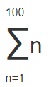
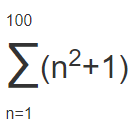
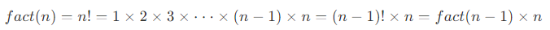

# Python Programming Quick Guide - Functions

## Function

We know that the formula for calculating the area of a circle is

S = πr^2

When we know the value of radius `r`, we can calculate the area according to the formula. Suppose we need to calculate the area of 3 circles of different sizes.

```
r1 = 12.34
r2 = 9.08
r3 = 73.1
s1 = 3.14 * r1 * r1
s2 = 3.14 * r2 * r2
s3 = 3.14 * r3 * r3
```

When there is a regular repetition of the code, you need to beware that writing `3.14 * x * x` each time is not only troublesome, but, if you want to change `3.14` to `3.14159265359`, you have to replace it all.

With functions, instead of writing `s = 3.14 * x * x` every time, we write the more meaningful function call `s = area_of_circle(x)`, and the function `area_of_circle` itself only needs to be written once, so it can be called multiple times.

Basically all high-level languages support functions, and Python is no exception. not only can Python be very flexible in defining functions, but it has many useful functions built in itself that can be called directly.

### Abstraction

Abstraction is a very common concept in mathematics. As an example.

Calculating the sum of a series, e.g., `1 + 2 + 3 + ... + 100`, is very inconvenient to write, so mathematicians invented the summation symbol ∑, which can be written as `1 + 2 + 3 + ... + 100` is written as.



This abstract notation is very powerful because we see that ∑ can be understood as a summation, rather than reducing to a low-level addition operation.

Moreover, this abstract notation is scalable, e.g.



Reduced to addition it becomes.

(1 x 1 + 1) + (2 x 2 + 1) + (3 x 3 + 1) + ... + (100 x 100 + 1)

As you can see, abstraction allows us to think directly at a higher level, without caring about the underlying concrete computational process.

Writing computer programs is the same, and functions are one of the most basic ways of abstracting code.

## Calling functions

Python has a lot of useful functions built in that we can call directly.

To call a function, you need to know the name of the function and its arguments, for example, the function `abs` that finds the absolute value has only one argument. The documentation can be viewed directly from Python's official website at

http://docs.python.org/3/library/functions.html#abs

You can also view the help information for the `abs` function at the interactive command line via `help(abs)`.

To invoke the `abs` function.

```
>>> abs(100)
100
>>> abs(-20)
20
>>> abs(12.34)
12.34
```

Calling a function with the wrong number of arguments passed in will report a `TypeError` error, and Python will tell you explicitly that `abs()` has and only has 1 argument, but gives two.

```
>>> abs(1, 2)
Traceback (most recent call last):
  File "<stdin>", line 1, in <module>
TypeError: abs() takes exactly one argument (2 given)
```

If the number of arguments passed in is correct, but the argument type is not accepted by the function, a `TypeError` error is also reported and the error message is given: `str` is the wrong argument type.

```
>>> abs('a')
Traceback (most recent call last):
  File "<stdin>", line 1, in <module>
TypeError: bad operand type for abs(): 'str'
```

And the `max` function `max()` can take any number of arguments and return the largest one.

```
>>> max(1, 2)
2
>>> max(2, 3, 1, -5)
3
```

### Data type conversions

Python's built-in common functions also include data type conversion functions, such as the `int()` function that converts other data types to integers:

```
>>> int('123')
123
>>> int(12.34)
12
>>> float('12.34')
12.34
>>> str(1.23)
'1.23'
>>> str(100)
'100'
>>> bool(1)
True
>>> bool('')
False
```

A function name is actually a reference to a function object, and it is possible to assign the function name to a variable, which is equivalent to giving the function an "alias".

```
>>> a = abs # Variable a points to the abs function
>>> a(-1) # So you can also call the abs function from a
1
```

## Define function

In Python, to define a function you use the `def` statement, write the function name, the parentheses, the arguments in the parentheses, and the colon `:` in that order, then, write the function body in an indented block, and the return value of the function is returned with the `return` statement.

Let's take a custom `my_abs` function for absolute values as an example.

```
# -*- coding: utf-8 -*-
def my_abs(x):
    if x >= 0:
        return x
    else:
        return -x

print(my_abs(-99))
```

Please test it yourself and call `my_abs` to see if the returned result is correct.

Note that when the statements inside the function body are executed, once they reach `return`, the function is executed and the result is returned. Thus, very complex logic can be implemented inside functions through conditional judgments and loops.

If there is no `return` statement, the function will also return the result when it finishes executing, but the result will be `None`. `return None` can be abbreviated to `return`.

When defining functions in the Python interactive environment, note that Python will show a `... ` prompt. When you finish defining the function you need to press enter twice to get back to the `>>>` prompt.

```ascii
┌────────────────────────────────────────────────────────┐
│Command Prompt - python                           - □ x │
├────────────────────────────────────────────────────────┤
│>>> def my_abs(x):                                      │
│...     if x >= 0:                                      │
│...         return x                                    │
│...     else:                                           │
│...         return -x                                   │
│...                                                     │
│>>> my_abs(-9)                                          │
│9                                                       │
│>>> _                                                   │
│                                                        │
│                                                        │
└────────────────────────────────────────────────────────┘
```

If you have already saved the function definition of `my_abs()` as an `abstest.py` file, then you can start the Python interpreter in the current directory of that file and import the `my_abs()` function with `from abstest import my_abs`, noting that `abstest` is the file name (without the `. py` extension).

```ascii
┌────────────────────────────────────────────────────────┐
│Command Prompt - python                           - □ x │
├────────────────────────────────────────────────────────┤
│>>> from abstest import my_abs                          │
│>>> my_abs(-9)                                          │
│9                                                       │
│>>> _                                                   │
│                                                        │
│                                                        │
│                                                        │
│                                                        │
│                                                        │
│                                                        │
│                                                        │
└────────────────────────────────────────────────────────┘
```

The usage of `import` is described in detail in the subsequent section Modules.

### Empty functions

If you want to define an empty function that doesn't do anything, you can use the `pass` statement.

```
def nop():
    pass
```

The `pass` statement doesn't do anything, so what's the point? Actually `pass` can be used as a placeholder, for example, if you haven't figured out how to write the code for a function yet, you can put a `pass` first so that the code can run.

`pass` can also be used in other statements, such as.

```
if age >= 18:
    pass
```

Missing `pass`, the code will run with syntax errors.

### Parameter checking

When calling a function with the wrong number of arguments, the Python interpreter will automatically check for it and throw `TypeError`: 

```
>>> my_abs(1, 2)
Traceback (most recent call last):
  File "<stdin>", line 1, in <module>
TypeError: my_abs() takes 1 positional argument but 2 were given
```

But if the argument type is wrong, the Python interpreter can't check it for us. Try the difference between `my_abs` and the built-in function `abs`.

```
>>> my_abs('A')
Traceback (most recent call last):
  File "<stdin>", line 1, in <module>
  File "<stdin>", line 2, in my_abs
TypeError: unorderable types: str() >= int()
>>> abs('A')
Traceback (most recent call last):
  File "<stdin>", line 1, in <module>
TypeError: bad operand type for abs(): 'str'
```

The built-in function `abs` checks for parameter errors when improper parameters are passed in, while the `my_abs` we defined has no parameter checking and will cause an error in the `if` statement with a different error message than `abs`. So, this function definition is not good enough.

Let's modify the definition of `my_abs` to do an argument type check and allow only arguments of integer and floating point types. The data type check can be implemented with the built-in function `isinstance()`.

```
def my_abs(x):
    if not isinstance(x, (int, float)):
        raise TypeError('bad operand type')
    if x >= 0:
        return x
    else:
        return -x
```

With the addition of parameter checking, the function can throw an error if the wrong type of parameter is passed in.

```
>>> my_abs('A')
Traceback (most recent call last):
  File "<stdin>", line 1, in <module>
  File "<stdin>", line 3, in my_abs
TypeError: bad operand type
```

Error and exception handling will be covered later.

### Returning multiple values

Can a function return more than one value? The answer is yes.

For example, in a game where you often need to move from one point to another, given the coordinates, displacement and angle, you can calculate the new coordinates as follows.

```
import math

def move(x, y, step, angle=0):
    nx = x + step * math.cos(angle)
    ny = y - step * math.sin(angle)
    return nx, ny
```

The `import math` statement indicates that the `math` package is imported and allows subsequent code to reference the `sin`, `cos` and other functions in the `math` package.

Then, we can get both the return values.

```
>>> x, y = move(100, 100, 60, math.pi / 6)
>>> print(x, y)
151.96152422706632 70.0
```

But in fact this is only an illusion, and the Python function still returns a single value:

```
>>> r = move(100, 100, 60, math.pi / 6)
>>> print(r)
(151.96152422706632, 70.0)
```

The original return value is a tuple! However, in syntax, returning a tuple can omit the parentheses, and multiple variables can receive a tuple at the same time, assigned to the corresponding value by position, so Python's function returns multiple values is actually returning a tuple, but it's easier to write.

### Summary

When defining a function, you need to determine the function name and the number of arguments.

If necessary, you can first check the data types of the arguments.

`return` can be used inside the function body to return the result of the function at any time.

If the function is executed and there is no `return` statement, it automatically `returns None`.

The function can return multiple values at the same time, but it is actually a tuple.

### Reference source code

[def_func.py](https://github.com/michaelliao/learn-python3/blob/master/samples/function/def_func.py)

## Parameters of a function

When defining a function, we name and locate the parameters and the interface definition of the function is complete. For the caller of the function, it's enough to know how to pass the right arguments and what value the function will return; the complex logic inside the function is encapsulated and the caller doesn't need to understand it.

Python's function definitions are very simple, but very flexible. In addition to the normal definition of mandatory arguments, you can also use default, variable, and keyword arguments, making the function definition an interface that not only handles complex arguments, but also simplifies the caller's code.

### positional parameters

Let's start by writing a function that calculates x2:

```
def power(x):
    return x * x
```

For the `power(x)` function, the argument `x` is a position parameter.

When we call the `power` function, we must pass in one and only one parameter `x`.

```
>>> power(5)
25
>>> power(15)
225
```

Now, what if we want to calculate x3? We can define another `power3` function, but what if we want to calculate x4, x5 ......? We can't define an infinite number of functions.

It may have occurred to you that you can modify `power(x)` to `power(x, n)` to compute xn, and to do so, say.

```
def power(x, n):
    s = 1
    while n > 0:
        n = n - 1
        s = s * x
    return s
```

For this modified `power(x, n)` function, any nth power can be computed as follows.

```
>>> power(5, 2)
25
>>> power(5, 3)
125
```

The modified `power(x, n)` function has two parameters: `x` and `n`, both of which are positional parameters. When the function is called, the two values passed in are assigned to the parameters `x` and `n` in order of position.

### Default parameters

The new `power(x, n)` function definition is fine, however, the old calling code fails because we added an argument, causing the old code to fail to call properly because of a missing argument: the

```
>>> power(5)
Traceback (most recent call last):
  File "<stdin>", line 1, in <module>
TypeError: power() missing 1 required positional argument: 'n'
```

Python's error message is clear: the call to the function `power()` is missing a positional argument `n`.

This is where the default parameter comes into play. Since we often calculate x2, it is perfectly acceptable to set the default value of the second argument, n, to 2.

```
def power(x, n=2):
    s = 1
    while n > 0:
        n = n - 1
        s = s * x
    return s
```

Thus, when we call `power(5)`, it is equivalent to calling `power(5, 2)`.

```
>>> power(5)
25
>>> power(5, 2)
25
```

For other cases where `n > 2`, n must be passed explicitly, such as `power(5, 3)`.

As you can see from the above example, default parameters can simplify function calls. When setting default parameters, there are a few things to keep in mind.

One is that the mandatory parameters come first and the default parameters come second, otherwise Python's interpreter will report an error (think about why the default parameters can't be placed in front of the mandatory parameters).

Second, how to set the default parameters.

When a function has more than one parameter, put the parameters that change a lot in front and the parameters that change a little in the back. The parameter with small changes can then be used as the default parameter.

What are the benefits of using default parameters? The biggest benefit is that it reduces the difficulty of calling the function.

For example, let's write a function to register a first grade student and pass in two parameters `name` and `gender`.

```
def enroll(name, gender):
    print('name:', name)
    print('gender:', gender)
```

In this way, the `enroll()` function is called with only two parameters passed in.

```
>>> enroll('Sarah', 'F')
name: Sarah
gender: F
```

What if I want to continue passing in information such as age, city, etc.? This would make calling the function much more complicated.

We can set age and city as default parameters.

```
def enroll(name, gender, age=6, city='Beijing'):
    print('name:', name)
    print('gender:', gender)
    print('age:', age)
    print('city:', city)
```

In this way, most students are not required to provide their age and city when registering, but only the two required parameters.

```
>>> enroll('Sarah', 'F')
name: Sarah
gender: F
age: 6
city: Beijing
```

Only students who do not match the default parameters will be required to provide additional information.

```
enroll('Bob', 'M', 7)
enroll('Adam', 'M', city='Tianjin')
```

As you can see, the default arguments reduce the difficulty of function calls, and once more complex calls are needed, more arguments can be passed to achieve them. Whether it is a simple call or a complex call, the function only needs to define one.

When there are multiple default parameters, the call can either provide the default parameters in order, such as calling `enroll('Bob', 'M', 7)`, meaning that, in addition to the two parameters `name`, `gender`, the last 1 parameter is applied to the parameter `age`, and the `city` parameter, since it is not provided, still uses the default value.

It is also possible to provide partial default parameters out of order. When providing partial default parameters out of order, you need to put the parameter name on. For example, calling `enroll('Adam', 'M', city='Tianjin')` means that the `city` parameter uses the value passed in and the other default parameters continue to use the default values.

Default parameters are useful, but they can fall into a hole if not used properly. The default parameters have one of the biggest pits, as demonstrated below.

First define a function, pass in a list, add an `END` and then return.

```
def add_end(L=[]):
    L.append('END')
    return L
```

When you call it normally, the result seems good:

```
>>> add_end([1, 2, 3])
[1, 2, 3, 'END']
>>> add_end(['x', 'y', 'z'])
['x', 'y', 'z', 'END']
```

When you call with the default parameters, the result is also correct at first:

```
>>> add_end()
['END']
```

However, when `add_end()` is called again, the result is not correct:

```
>>> add_end()
['END', 'END']
>>> add_end()
['END', 'END', 'END']
```

Many beginners are puzzled by the fact that the default argument is `[]`, but the function seems to "remember" the list after adding `'END'` each time.

The reason for this is as follows.

When a Python function is defined, the value of the default parameter `L` is calculated, i.e. `[]`, because the default parameter `L` is also a variable that points to the object `[]`, and each time the function is called, if the content of `L` is changed, the content of the default parameter will change the next time it is called, and will no longer be the `[]` of the function when it is defined.

 One thing to keep in mind when defining default parameters: they must point to invariant objects!

To modify the above example, we can use the invariant object `None` to implement.

```
def add_end(L=None):
    if L is None:
        L = []
    L.append('END')
    return L
```

Now, no matter how many times it is called, there will be no problem:

```
>>> add_end()
['END']
>>> add_end()
['END']
```

Why do we design invariant objects like `str` and `None`? Because once the invariant object is created, the data inside the object cannot be modified, which reduces the errors caused by modifying the data. In addition, because the object is invariant, there is no need to add locks to read the object simultaneously in a multitasking environment, and there is no problem reading it simultaneously at all. When we write a program, if we can design an invariant object, then try to design it as invariant object.

### Variable arguments

Variable parameters can also be defined in Python functions. As the name implies, a variable parameter is a variable number of arguments passed in, from 1, 2 to any number, and 0.

Let's take a math problem as an example, given a set of numbers a, b, c ......, calculate a^2 + b^2 + c^2 + .......

To define this function, we must determine the input parameters. Since the number of parameters is uncertain, we first think that we can pass a, b, c ...... as a list or a tuple, so that the function can be defined as follows.

```
def calc(numbers):
    sum = 0
    for n in numbers:
        sum = sum + n * n
    return sum
```

But to call it, a list or tuple needs to be assembled first:

```
>>> calc([1, 2, 3])
14
>>> calc((1, 3, 5, 7))
84
```

If variable parameters are utilized, the way the function is called can be simplified as follows.

```
>>> calc(1, 2, 3)
14
>>> calc(1, 3, 5, 7)
84
```

So, we change the parameters of the function to variable parameters.

```
def calc(*numbers):
    sum = 0
    for n in numbers:
        sum = sum + n * n
    return sum
```

Defining a variable parameter is simply a matter of adding a `*` sign in front of the parameter compared to defining a list or tuple parameter. Inside the function, the argument `numbers` is received as a tuple, so the function code remains exactly the same. However, the function can be called with any number of arguments, including 0 arguments.

```
>>> calc(1, 2)
5
>>> calc()
0
```

What if I already have a list or tuple and want to call a mutable parameter? This can be done.

```
>>> nums = [1, 2, 3]
>>> calc(nums[0], nums[1], nums[2])
14
```

The problem is that it's too cumbersome, so Python allows you to add a `*` sign in front of a list or tuple and pass the elements of the list or tuple as mutable arguments.

```
>>> nums = [1, 2, 3]
>>> calc(*nums)
14
```

`*nums` means that all elements of the list `nums` are passed in as mutable arguments. This writing style is quite useful and common.

### Keyword arguments

Variable arguments allow you to pass in zero or any number of arguments, which are automatically assembled into a tuple when the function is called, while keyword arguments allow you to pass in zero or any number of arguments with parameter names, which are automatically assembled into a dict inside the function. see the example.

```
def person(name, age, **kw):
    print('name:', name, 'age:', age, 'other:', kw)
```

The function `person` accepts the keyword argument `kw` in addition to the mandatory arguments `name` and `age`. When calling this function, only the mandatory parameters can be passed.

```
>>> person('Michael', 30)
name: Michael age: 30 other: {}
```

Any number of keyword parameters can also be passed in.

```
>>> person('Bob', 35, city='Beijing')
name: Bob age: 35 other: {'city': 'Beijing'}
>>> person('Adam', 45, gender='M', job='Engineer')
name: Adam age: 45 other: {'gender': 'M', 'job': 'Engineer'}
```

What is the use of the keyword argument? It extends the function's functionality. For example, in the `person` function, we are guaranteed to receive the two parameters `name` and `age`, but if the caller would like to provide more parameters, we can receive them as well. Imagine you are doing a user registration function and everything is optional except for the user name and age which are required, using keyword arguments to define this function will satisfy the registration requirement.

Similar to variable parameters, you can also assemble a dict first, and then, convert that dict to a keyword parameter to pass in.

```
>>> extra = {'city': 'Beijing', 'job': 'Engineer'}
>>> person('Jack', 24, city=extra['city'], job=extra['job'])
name: Jack age: 24 other: {'city': 'Beijing', 'job': 'Engineer'}
```

Of course, the above complex call can be written in a simplified way as follows.

```
>>> extra = {'city': 'Beijing', 'job': 'Engineer'}
>>> person('Jack', 24, **extra)
name: Jack age: 24 other: {'city': 'Beijing', 'job': 'Engineer'}
```

`**extra` means that all key-values of the dict `extra` are passed into the `**kw` parameter of the function with keyword arguments, `kw` will get a dict, note that the dict obtained by `kw` is a copy of `extra`, changes to `kw` will not affect `extra` outside the function.

### Naming keyword arguments

For keyword arguments, the caller of a function can pass in any unrestricted keyword argument. As for exactly what is passed in, it needs to be checked inside the function via `kw`.

Still using the `person()` function as an example, we want to check for `city` and `job` parameters.

```
def person(name, age, **kw):
    if 'city' in kw:
        # With city parameter
        pass
    if 'job' in kw:
        # With job parameter
        pass
    print('name:', name, 'age:', age, 'other:', kw)
```

However, the caller can still pass in unrestricted keyword arguments.

```
>>> person('Jack', 24, city='Beijing', addr='Chaoyang', zipcode=123456)
```

If you want to restrict the names of the keyword arguments, you can use named keyword arguments, for example, to receive only `city` and `job` as keyword arguments. The functions defined in this way are as follows.

```
def person(name, age, *, city, job):
    print(name, age, city, job)
```

Unlike the keyword parameter `**kw`, the named keyword parameter requires a special separator `*`, and the parameters following `*` are considered as named keyword parameters.

It is called as follows.

```
>>> person('Jack', 24, city='Beijing', job='Engineer')
Jack 24 Beijing Engineer
```

If a function definition already has a variable argument, the named keyword argument that follows no longer needs a special separator `*`.

```
def person(name, age, *args, city, job):
    print(name, age, args, city, job)
```

Named keyword parameters must be passed with a parameter name, unlike positional parameters. If the parameter name is not passed, the call will report an error.

```
>>> person('Jack', 24, 'Beijing', 'Engineer')
Traceback (most recent call last):
  File "<stdin>", line 1, in <module>
TypeError: person() missing 2 required keyword-only arguments: 'city' and 'job'
```

Due to the missing parameter names `city` and `job` in the call, the Python interpreter treats the first two parameters as positional parameters and passes the last two parameters to `*args`, but the missing named keyword parameter causes an error.

Named keyword arguments can have default values, thus simplifying the call.

```
def person(name, age, *, city='Beijing', job):
    print(name, age, city, job)
```

Since the named keyword parameter `city` has a default value, it can be invoked without passing the `city` parameter.

```
>>> person('Jack', 24, job='Engineer')
Jack 24 Beijing Engineer
```

When using named keyword arguments, take special care to add a `*` as a special separator if there are no variable arguments. If `*` is missing, the Python interpreter will not recognize positional and named keyword arguments.

```
def person(name, age, city, job):
    # Missing *, city and job are considered as location parameters
    pass
```

### Parameter combinations

To define functions in Python, you can use mandatory parameters, default parameters, variable parameters, keyword parameters, and named keyword parameters, all five of which can be used in combination. However, please note that the order of parameter definition must be: mandatory parameters, default parameters, variable parameters, named keyword parameters, and keyword parameters.

For example, to define a function with several of these parameters.

```
def f1(a, b, c=0, *args, **kw):
    print('a =', a, 'b =', b, 'c =', c, 'args =', args, 'kw =', kw)

def f2(a, b, c=0, *, d, **kw):
    print('a =', a, 'b =', b, 'c =', c, 'd =', d, 'kw =', kw)
```

When the function is called, the Python interpreter automatically passes in the corresponding arguments according to their positions and names.

```
>>> f1(1, 2)
a = 1 b = 2 c = 0 args = () kw = {}
>>> f1(1, 2, c=3)
a = 1 b = 2 c = 3 args = () kw = {}
>>> f1(1, 2, 3, 'a', 'b')
a = 1 b = 2 c = 3 args = ('a', 'b') kw = {}
>>> f1(1, 2, 3, 'a', 'b', x=99)
a = 1 b = 2 c = 3 args = ('a', 'b') kw = {'x': 99}
>>> f2(1, 2, d=99, ext=None)
a = 1 b = 2 c = 0 d = 99 kw = {'ext': None}
```

The most amazing thing is that with a tuples and dict you can also call the above functions.

```
>>> args = (1, 2, 3, 4)
>>> kw = {'d': 99, 'x': '#'}
>>> f1(*args, **kw)
a = 1 b = 2 c = 3 args = (4,) kw = {'d': 99, 'x': '#'}
>>> args = (1, 2, 3)
>>> kw = {'d': 88, 'x': '#'}
>>> f2(*args, **kw)
a = 1 b = 2 c = 3 d = 88 kw = {'x': '#'}
```

So, for any function, you can call it by something like `func(*args, **kw)`, regardless of how its arguments are defined.

Although it is possible to combine up to 5 arguments, do not use too many combinations at the same time, otherwise the function interface is poorly understandable.

### Summary

Python's functions have a very flexible argument form, allowing both simple calls and very complex arguments to be passed in.

The default argument must be an immutable object; if it's a mutable object, the program will run with a logic error!

Note the syntax for defining mutable and keyword arguments.

`*args` is a mutable parameter, args receives a tuples.

`**kw` is a keyword argument, kw receives a dict.

And the syntax of how to pass variable and keyword arguments when calling a function.

Variable parameters can be passed either directly: `func(1, 2, 3)` or by assembling a list or tuple first and then passing it through `*args`: `func(*(1, 2, 3))`.

Keyword arguments can either be passed directly: `func(a=1, b=2)`, or assembled first in a dict and then passed in via `*kw`: `func(**{'a': 1, 'b': 2})`.

Using `*args` and `**kw` is the customary way of writing Python, but of course other parameter names can be used, but it is better to use the customary usage.

Named keyword arguments are intended to limit the parameter names that can be passed in by the caller, while providing default values.

Don't forget to write the separator `*` when defining named keyword parameters without mutable parameters, otherwise the definition will be a positional parameter.

### Reference source code

[var_args.py](https://github.com/michaelliao/learn-python3/blob/master/samples/function/var_args.py)

[kw_args.py](https://github.com/michaelliao/learn-python3/blob/master/samples/function/kw_args.py)

## Recursive functions

Inside a function, other functions can be called. If a function calls itself internally, that function is recursive.

As an example, let's calculate the factorial `n! = 1 x 2 x 3 x ... x n`, represented by the function `fact(n)`, it can be seen that



So, `fact(n)` can be expressed as `n x fact(n-1)`, with special treatment required only for n=1.

Thus, `fact(n)` is written out recursively as.

```
def fact(n):
    if n==1:
        return 1
    return n * fact(n - 1)
```

The above is a recursive function. Try:

```
>>> fact(1)
1
>>> fact(5)
120
>>> fact(100)
93326215443944152681699238856266700490715968264381621468592963895217599993229915608941463976156518286253697920827223758251185210916864000000000000000000000000
```

If we calculate `fact(5)`, we can see the calculation process according to the function definition as follows.

```ascii
===> fact(5)
===> 5 * fact(4)
===> 5 * (4 * fact(3))
===> 5 * (4 * (3 * fact(2)))
===> 5 * (4 * (3 * (2 * fact(1))))
===> 5 * (4 * (3 * (2 * 1)))
===> 5 * (4 * (3 * 2))
===> 5 * (4 * 6)
===> 5 * 24
===> 120
```

Recursive functions have the advantage of being simple to define and logically clear. In theory, all recursive functions can be written as loops, but the logic of loops is not as clear as recursion.

Using recursive functions requires care to prevent stack overflows. In computers, function calls are implemented through a data structure called a stack. Whenever a function call is entered, a layer of stack frames is added to the stack, and whenever the function returns, a layer of stack frames is subtracted from the stack. Since the size of the stack is not infinite, too many recursive calls can cause the stack to overflow. Try `fact(1000)`.

```
>>> fact(1000)
Traceback (most recent call last):
  File "<stdin>", line 1, in <module>
  File "<stdin>", line 4, in fact
  ...
  File "<stdin>", line 4, in fact
RuntimeError: maximum recursion depth exceeded in comparison
```

The solution to recursive call stack overflow is to optimize it by **tail recursion**. In fact, tail recursion has the same effect as a loop, so it is okay to think of a loop as a special kind of tail recursive function.

Tail recursion means that the function itself is called when it returns, and, the return statement cannot contain an expression. In this way, the compiler or interpreter can optimize the tail recursion so that the recursion itself, no matter how many times it is called, only occupies one stack frame and no stack overflow occurs.

The `fact(n)` function above is not tail recursive because `return n * fact(n - 1)` introduces a multiplicative expression. To change to a tail recursive approach, a little more code is needed, mainly to pass the product of each step into the recursive function.

```
def fact(n):
    return fact_iter(n, 1)

def fact_iter(num, product):
    if num == 1:
        return product
    return fact_iter(num - 1, num * product)
```

As you can see, `return fact_iter(num - 1, num * product)` returns only the recursive function itself, `num - 1` and `num * product` are calculated before the function call and do not affect the function call.

The call to `fact(5)` corresponding to `fact_iter(5, 1)` is as follows.

```
===> fact_iter(5, 1)
===> fact_iter(4, 5)
===> fact_iter(3, 20)
===> fact_iter(2, 60)
===> fact_iter(1, 120)
===> 120
```

When tail recursive calls are made, the stack does not grow if optimizations are made, so no matter how many calls are made, it will not cause the stack to overflow.

Unfortunately, most programming languages are not optimized for tail recursion, and neither is the Python interpreter, so even if you change the `fact(n)` function above to a tail recursive approach, it will still result in a stack overflow.

### Summary

The advantage of using recursive functions is that the logic is simple and clear, and the disadvantage is that calls that are too deep can lead to stack overflow.

Languages optimized for tail recursion can prevent stack overflows by tail recursion. Tail recursion is in fact equivalent to looping, and programming languages that don't have looping statements can only implement loops via tail recursion.

Python's standard interpreter is not optimized for tail recursion, and any recursive function has a stack overflow problem.

### Reference source code

[recur.py](https://github.com/michaelliao/learn-python3/blob/master/samples/function/recur.py)