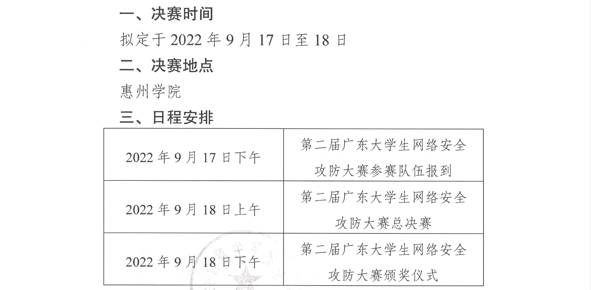

# CTF Week Meeting 2022-07-21

1. Events register.
1. Summer schedule update.
1. Guangdong Province CTF 2nd Final.

## Events register

https://bm.ichunqiu.com/2022qwb

强网杯 6th 7.30 - 7.31

We have 2 teams currently, one has 10 members, the other has 7 members.

Team1: HED

| HED/role | name   |
| -------- | ------ |
| Leader   | 邬一帆 |
| Member   | 金肇轩 |
| Member   | 严文谦 |
| Member   | 陈梓涵 |
| Member   | 巫晓   |
| Member   | 朱嘉楠 |
| Member   | 李烨   |
| Member   | 黎诗玥 |
| Member   | 唐骞   |
| Member   | 刘欣萌 |

Team2: kfccrazythursdayvme50yuan

| role   | name   |
| ------ | ------ |
| Leader | 李照   |
| Member | 刘乐奇 |
| Member | 冯泉弼 |
| Member | 徐延楷 |
| Member | 谢子晟 |
| Member | 孙祎涛 |
| Member | 王乙   |
| Member | 金扬   |

The first team is registered, and the second team is waiting for all the phone numbers to be signed up.

Later today, I will collect some recent challenges and their writeups.

采取在线解题（Jeopardy）模式，主要面向国内高校、企业、机构等网络安全力量，每队不超过10名参赛队员和1名赛队指导。赛题内容主要涉及二进制程序逆向分析、密码分析、智能终端安全、信息隐藏、人工智能等网络安全领域的主要知识与技能，重点考察参赛人员网络安全知识的综合运用能力和网络安全技能的创新实践能力。比赛时间2022年7月30日-31日。

一等奖 第1-3名 3万RMB/队

二等奖 第4-10名 2万RMB/队

三等奖 第11-32名 1万RMB/队

最佳题目奖 共1名 2万RMB/题

优秀题目奖 共6名 5000元RMB/题

竞赛官方QQ群：856775704

## Summer schedule update

The past training:

| Time       | Topic                                       | Introduction                                                 | Material                                                     |
| :--------- | :------------------------------------------ | :----------------------------------------------------------- | :----------------------------------------------------------- |
| June, 26th | CTF Overview & Fun-oriented challenges.     | Learn about what's CTF and how we win a CTF. The attendance of competitions and how to group a team. | [Introduction to CTF.pdf](https://wiki.compass.college/assets/Introduction_to_CTF_2022.pdf) [Sakai page](https://sakai.sustech.edu.cn/portal/site/d0e48f7e-7386-4a47-8611-9e37e069b009) [Kali Linux](https://www.kali.org/) [Linux challenges](https://cmdchallenge.com/) [Linux tutorial](https://linuxtools-rst.readthedocs.io/zh_CN/latest/base/index.html) [Python tutorial](https://yulizi123.github.io/tutorials/python-basic/) |
| July, 3rd  | Web Challenges and Databases (Basics)       | Ability to learn computer networks and hack websites. Know HTTP & HTTPS in protocol, and tools to capture / modify packets. | [Web Basics and Databases.pdf](https://wiki.compass.college/assets/Web_Basics_and_Databases.pdf) [OWASP vulnerabilities](https://owasp.org/www-community/vulnerabilities/) [PHP basics](https://www.tutorialspoint.com/php/index.htm) [HTML MDN](https://developer.mozilla.org/en-US/docs/Web/HTML) [CSS MDN](https://developer.mozilla.org/en-US/docs/Web/CSS) [JavaScript MDN](https://developer.mozilla.org/en-US/docs/Learn/JavaScript) |
| July, 10th | Practice, Solving Web Challenges (Advanced) | Why websites are vulnerable, learn how to crack a website, and solve some web challenges. Find the weakness in the websites and common vulnerabilities. | [Advanced Web Hacking.pdf](https://wiki.compass.college/assets/Web_Challenges_Advanced.pdf) [Linux Basics](https://wiki.compass.college/assets/Linux_Basics.pdf) [BlackHat SSTI PDF](https://wiki.compass.college/assets/EN-Server-Side-Template-Injection-RCE-For-The-Modern-Web-App-BlackHat-15.pdf) [CTF101 Web](https://ctf101.org/web-exploitation/overview/) [Web learning notes](https://websec.readthedocs.io/zh/latest/vuln/index.html) |
| July, 17th | Forensics & Steganography                   | Analyze the file format and hidden information. Packet or network traffic analysis as well. Several skills to check images. | [Forensics_Steganography.pdf](https://wiki.compass.college/assets/Forensics_Steganography.pdf) [CTF 101 Forensics](https://ctf101.org/forensics/overview/) [1earn Forensics](https://github.com/ffffffff0x/1earn/blob/master/1earn/Security/BlueTeam/取证.md) |

The rest training:

| July, 24th  | Modern Cryptography and Mathematics       | Asymmetric cryptography like RSA, ECC. A mathematic definition of security and attacks on modern cryptography. | [Cryptography.pptx](https://wiki.compass.college/assets/Cryptography.pptx) |
| ----------- | ----------------------------------------- | ------------------------------------------------------------ | ------------------------------------------------------------ |
| July, 31st  | Assembly Language and Reverse Engineering | Learn about some CISC knowledge. Use x86_64 as an example to do the assembly. Some reverse engineering skills are involved. | [Reverse.pdf](https://wiki.compass.college/assets/Reverse.pdf) |
| August, 7th | Binary Exploitations                      | PWN challenges. Buffer overflows, shellcodes, ROP, and some pwn challenges. | [Binary Exploitation.pdf](https://wiki.compass.college/assets/Binary Exploitation.pdf) |

This weekend, the engineering department would be powered off. The training schedule for this weekend may be online.

I've invited some 2022 new students to attend the cryptography training this weekend.

## Guangdong Province CTF 2nd

In the past qualification, the HED team has qualified for the final round.

| role   | name   |
| ------ | ------ |
| Leader | 邬一帆 |
| Member | 严文谦 |
| Member | 朱弘   |
| Member | 朱嘉楠 |

Before the competition, we would have several AWD training. The time can be arranged according to your schedule.

* Acceptable time: any time in the summer / Sundays in September.
* Training materials: AWD toolkit & AWD tricks.
* PVP: https://ctf.bugku.com/pvp.html

Better to be offline, in case we can have discussions about AWD.

## Notes

- [ ] AWD toolkit.
- [ ] Register for the 2nd team.
