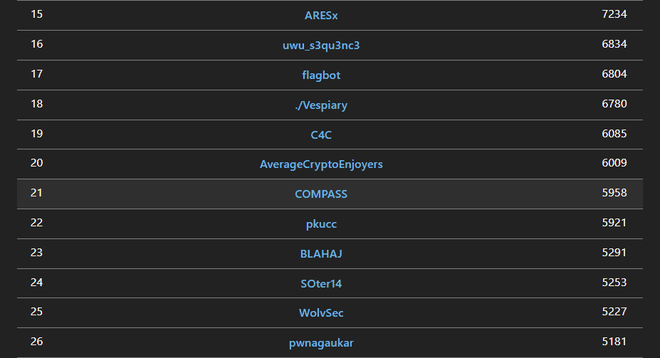

# CTF Week Meeting 2022-07-28

1. QiangWang Cup event update.
1. DiceCTF rank and ctftime team rank.
1. Guangdong CTF 2nd Final notes.
1. Summer schedule.

## QiangWang Cup event update

https://bm.ichunqiu.com/2022qwb

强网杯 6th 7.30 - 7.31

We have 2 teams currently, one has 10 members, the other has 7 members.

Team1: HED

| HED/role | name   |
| -------- | ------ |
| Leader   | 邬一帆 |
| Member   | 金肇轩 |
| Member   | 严文谦 |
| Member   | 陈梓涵 |
| Member   | 巫晓   |
| Member   | 朱嘉楠 |
| Member   | 李烨   |
| Member   | 黎诗玥 |
| Member   | 唐骞   |
| Member   | 刘欣萌 |

Team2: kfccrazythursdayvme50yuan

| role   | name   |
| ------ | ------ |
| Leader | 李照   |
| Member | 刘乐奇 |
| Member | 冯泉弼 |
| Member | 徐延楷 |
| Member | 谢子晟 |
| Member | 孙祎涛 |
| Member | 王乙   |
| Member | 金扬   |

Please join the corresponding notion group to co-operate in the competition.

We have a discord group for voice chat:

* https://discord.gg/Cy2vCpsB

竞赛官方QQ群：856775704

Hope you enjoy this competition!

## DiceCTF rank and ctftime team rank

@Frankss @Monad, we won 21 rank in the DiceCTF 2022.

Yet another win against pkucc and n03tAck QwQ.

The competition has some very interesting challenges and tricks, I'll collect them and publish on the Detroit CTF platform.

In the meanwhile, we got 27.853 ctftime scores. The coutry rank of our team is updated to 21st place.

Congratulations every member! 🎉🎉🎉

## Guangdong CTF 2nd Final notes

We've participated Guangdong CTF 2nd final meeting yesterday.

The key information:

* The final round would be in DAWD (DataCon AWD).
* The players can't reach the inner server.
* The players can push **patch** and **exp** to the server.
* EDR and rootkit are not valid. But WAF is valid.

We may need to try:

* Reverse shell to get the operation privilege in the inner server.
* Anonymous EDR for local service.
* Network traffic analysis and block: replace flag.
* Store a trojan in our own patch and image file.

## Summer schedule update

The past training:

| Time       | Topic                                       | Introduction                                                 | Material                                                     |
| :--------- | :------------------------------------------ | :----------------------------------------------------------- | :----------------------------------------------------------- |
| June, 26th | CTF Overview & Fun-oriented challenges.     | Learn about what's CTF and how we win a CTF. The attendance of competitions and how to group a team. | [Introduction to CTF.pdf](https://wiki.compass.college/assets/Introduction_to_CTF_2022.pdf) [Sakai page](https://sakai.sustech.edu.cn/portal/site/d0e48f7e-7386-4a47-8611-9e37e069b009) [Kali Linux](https://www.kali.org/) [Linux challenges](https://cmdchallenge.com/) [Linux tutorial](https://linuxtools-rst.readthedocs.io/zh_CN/latest/base/index.html) [Python tutorial](https://yulizi123.github.io/tutorials/python-basic/) |
| July, 3rd  | Web Challenges and Databases (Basics)       | Ability to learn computer networks and hack websites. Know HTTP & HTTPS in protocol, and tools to capture / modify packets. | [Web Basics and Databases.pdf](https://wiki.compass.college/assets/Web_Basics_and_Databases.pdf) [OWASP vulnerabilities](https://owasp.org/www-community/vulnerabilities/) [PHP basics](https://www.tutorialspoint.com/php/index.htm) [HTML MDN](https://developer.mozilla.org/en-US/docs/Web/HTML) [CSS MDN](https://developer.mozilla.org/en-US/docs/Web/CSS) [JavaScript MDN](https://developer.mozilla.org/en-US/docs/Learn/JavaScript) |
| July, 10th | Practice, Solving Web Challenges (Advanced) | Why websites are vulnerable, learn how to crack a website, and solve some web challenges. Find the weakness in the websites and common vulnerabilities. | [Advanced Web Hacking.pdf](https://wiki.compass.college/assets/Web_Challenges_Advanced.pdf) [Linux Basics](https://wiki.compass.college/assets/Linux_Basics.pdf) [BlackHat SSTI PDF](https://wiki.compass.college/assets/EN-Server-Side-Template-Injection-RCE-For-The-Modern-Web-App-BlackHat-15.pdf) [CTF101 Web](https://ctf101.org/web-exploitation/overview/) [Web learning notes](https://websec.readthedocs.io/zh/latest/vuln/index.html) |
| July, 17th | Forensics & Steganography                   | Analyze the file format and hidden information. Packet or network traffic analysis as well. Several skills to check images. | [Forensics_Steganography.pdf](https://wiki.compass.college/assets/Forensics_Steganography.pdf) [CTF 101 Forensics](https://ctf101.org/forensics/overview/) [1earn Forensics](https://github.com/ffffffff0x/1earn/blob/master/1earn/Security/BlueTeam/取证.md) |
| July, 24th | Modern Cryptography and Mathematics         | Asymmetric cryptography like RSA, ECC. A mathematic definition of security and attacks on modern cryptography. | [Cryptography.pptx](https://wiki.compass.college/assets/Cryptography.pptx) |

The rest training:

| July, 31st  | Assembly Language and Reverse Engineering | Learn about some CISC knowledge. Use x86_64 as an example to do the assembly. Some reverse engineering skills are involved. | [Reverse.pdf](https://wiki.compass.college/assets/Reverse.pdf) |
| ----------- | ----------------------------------------- | ------------------------------------------------------------ | ------------------------------------------------------------ |
| August, 7th | Binary Exploitations                      | PWN challenges. Buffer overflows, shellcodes, ROP, and some pwn challenges. | [Binary Exploitation.pdf](https://wiki.compass.college/assets/Binary Exploitation.pdf) |

I'm not at the campus currently. The training schedule for this weekend may be online.

The CTF training is hard, but I hope you can learn something new, and enjoy the trip to the cybersecurity.

## Notes

- [ ] Ready for the GD CTF 2nd Final script.
- [ ] Move all the challenges to the Detroit server.
