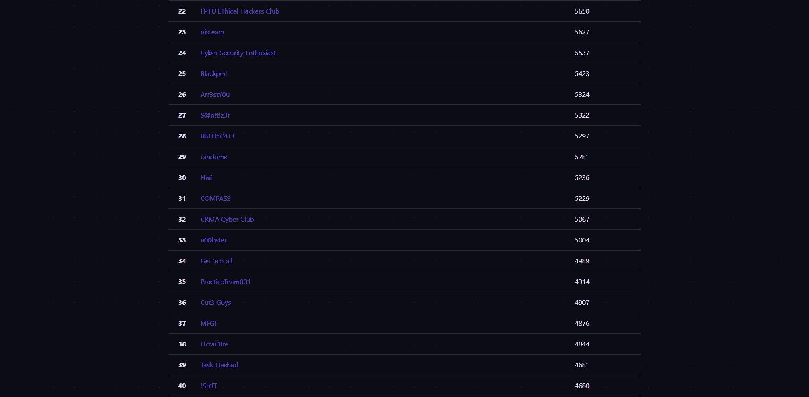

# CTF Week Meeting 2022-03-10

1. Review of the recent competitions.
1. Review of the recent works.
1. Course from the SU team.
1. Competition event for this week.
1. Drunk too much coffee.

## Competition Review

You may notice the awards we've got have been pushed to the wiki.

We have participated in the eCTF for practice last week.

Challenge solving process:

* Forensics 3 / 8
* Crypto 3 / 8
* Misc 5 / 5 AK
* RE-pwn 4 / 5
* OSINT 1 / 8 (Oh God...)
* Web 3 / 3 AK
* Easy peasy 2 /2 AK

The challenges quality is on average.

## Project Review

I've started too many projects in the recent meetings...

### Daily Article Bot

The project aims to publish news, blogs, and writeups from personal websites. Going to follow the steps:

* Catch several websites.
* Telegram bot.
* Mail subscribe link.

I have created the Rust project for the Telegram bot using the following template:

https://github.com/telegram-rs/telegram-bot

The function would be done soon.

If you are interested in the Mail subscribe service's development, please let me know.

### Platform

Thanks to the very brief description of the installing instruction, deploying ctfd-whale is hard.

- [x] Move all the data to the local machine.
- [ ] Establish ctfd-whale.
- [ ] Package all the challenges to the docker image.
- [x] Establish SSL certification.

I'll find it out these days.

### Research Related

Do you remember the Chaff Bug?

https://wiki.compass.college/Paper/Misc/Chaff%20Bugs%20Deterring%20Attackers%20by%20Making%20Software%20Buggier/

In brief: the Chaff is an idea to create hundreds of **fake buffer overflow** points. The work of the attackers is increased by non-vulnerable bugs.

However, SCA (Source Code Analysis), concolic analysis, and Fuzzing can solve this problem.

The PWN challenges from CTF can also be solved by the concolic analysis. The famous `angr` is often used to do the job.

https://angr.io/

We also know the CGC (Cyber Grand Challenge) is major in automated software analysis.

A survey of the Cyber Reasoning System: https://ieeexplore.ieee.org/abstract/document/8411838

I'm going to summarize the research on CRS and SCA.

### Wiki Contact

I've added the contact email address to Wiki.

As well as the weekly meeting address.

https://wiki.compass.college/

## Learn from SU Team

It's all from an article forwarded by Frankss.

https://team-su.github.io/

SU team has achieved the top rank in SUSCTF 2022. SU team is a united team of members in the universities (we are a university team with all of us from SUSTech).

SU team is established in 2016, and be famous in 2022.

The cooperation experience from SU:

* Collaborate with the university club.
* Communication with members, teachers from other teams.
* An experienced member leads a new member.
* Layer management: each orientation has an admin.
* Each member concentration on the specific orientation.
* Reduce the pigeons.
* Solving the challenges with a girlfriend.

I've pm each member to confirm the major orientation.

The communication with the SU team is in the progress. Hopefully, we would talk with them in the future.

## Competition

The 1337UP live CTF (Jeopardy, dynamic score from 500 to 50)

The team size is 4.

https://ctf.intigriti.io/

星期五, 11 三月 2022, 23:00 CST — 星期六, 12 三月 2022, 23:00 CST

The top 3 teams would get cash awards.

The top 10 teams would receive some 1337UP swag.

The top 100 teams would receive a souvenir certificate, and an increased chance to be invited to the private program of the Intigriti.

This is the first 1337UP CTF.

The organizer: Intigriti (Europe's #1 ethical hacking and bug bounty platform)

## Drunk too much coffee

Take care of yourself.

Doing some exercise can be helpful.

I hope COVID-19 will end soon.

## Note

- [x] 进展立即反馈，周会进行总结
- [x] notion模板的改动，比赛负责人
