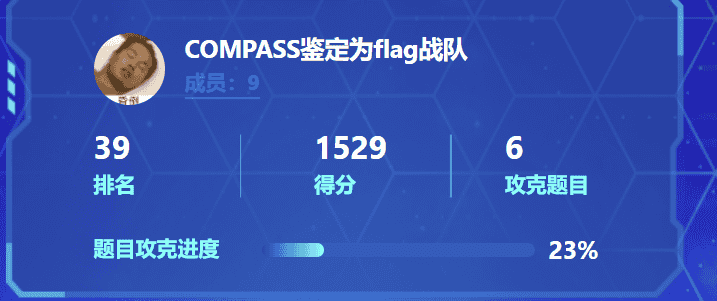

# CTF Week Meeting 2022-03-24

1. Past: Hufu CTF 2022.
1. On going: T3N4CI0US CTF 2022
1. Plan: Line CTF

## Hufu CTF 2022

2022数字中国创新大赛虎符网络安全赛道

时间：2022-03-19 09:00 ~ 2022-03-20 17:00

https://datacon.qianxin.com/competitions/22/introduction

晋级资格：初赛成绩排名前35的队伍（线上初赛成绩排名前20的高校战队+线上初赛成绩排名前15的行业战队）进入决赛，同一集团单位、高校最多只能入围2支战队，每队不超过4人，及一名领队，决赛前队员可更换，但要求参赛选手需是初赛报名人员，并且必须来自同一集团单位或高校，进入总决赛单位/行业战队需提供半年以上的本单位社保证明，各高校战队需提供加盖所在同一高校公章的在读证明，如发现任何作弊、代打行为，将直接取消比赛资格并进行公告。

Misc: 周翰然、陈梓涵、巫晓、朱嘉楠

Web: 金肇轩、严文谦

Re: 邬一帆、朱弘

PWN: 李照、邬一帆

Crypto: 朱嘉楠、周翰然、严文谦

题目整理 & 同步：邬一帆、李照

## T3N4CI0US CTF 2022

The competition is on processing. We have several challenges to solve.

The current rank is #4, 2 challenge (and 20 points for hints) left to be rank 1.

### Web/Robots

Got 2 sub pages: /robots.txt and /hint.html

As the hint goes, we should find /fiag.html, but failed.

Hint: Something's wrong with the word 'fiag'. \<head line\>Password Decryption

### Web/YessYess

Python SSTI injection with filters. The underline, dot, and parenthesis are filtered out.

Could use unicode conversion.

### Misc/pws

Don't know what's the meaning of the file.

### Misc/angry

Got a Base36-like string, don't know what to do next.

### Crypto/1337 Wallet

scrypt-hash decryption without password.

### Forensics/Grizzly

A zip file inside the given picture. Doesn't have the password.

### Forensics/Dobby

The text can be decrypted with string Dobby is not free in flag format, but not the flag.

@Frankss: the picture has some hidden mosaic below after adjusting the height.

### Misc/()

Don't know the meaning of the challenge.

Hint: understand the meaning of `alphabet`.

### OSINT/OSINT NO.3

Don't know what to find.

The store is John & the Juice New York.

### Misc/Where

Not interested in Dolpari's information.

### Misc/flag

The description is to find flag in the Discord server (not the flag in channel description).

### Misc/()2

Similar to the (), don't know what to do.

## Line CTF

The LINE CTF is going to be an exercise competition.

https://score.linectf.me/

Schedule: March 26, 2022, 08:00 AM ~ March 27th, 08:00 AM (UTC+8)

Style: Jeopardy-style (Team Cometition @ Online)

Organizer: Security team at LINE

Discord: https://discord.gg/4aXUwrqD3Z

If you want to participate, please contact me.

## Note

- [ ] 周六进行题目解题的分享。
