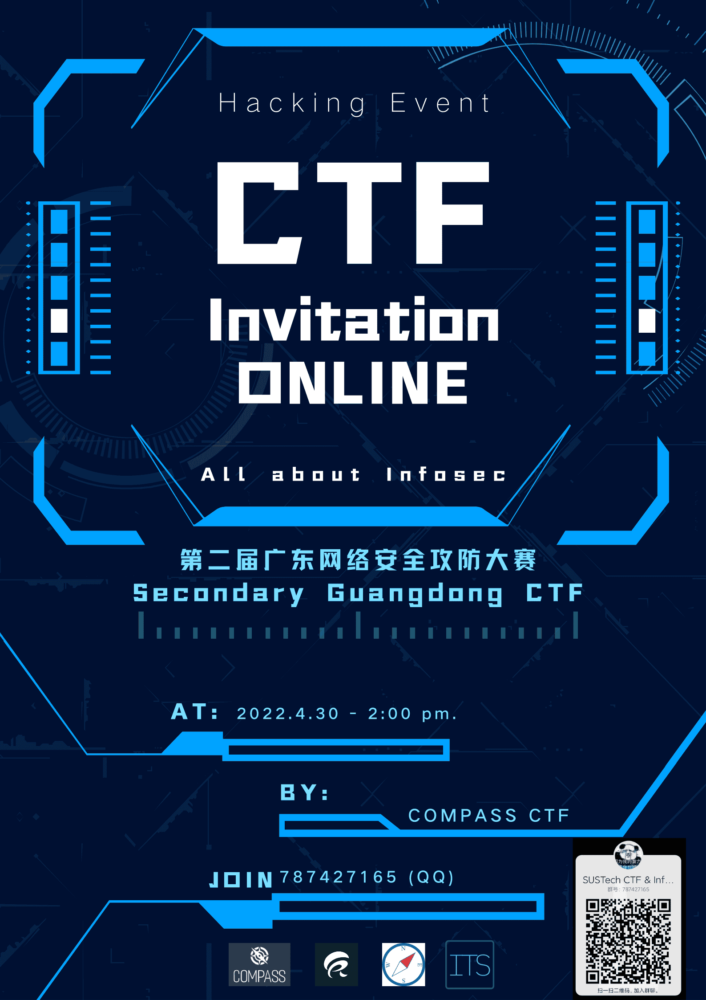

# CTF Week Meeting 2022-04-28

1. Guangdong Province University CTF online talk.
1. Guide book progress.
1. Offline activities re-schedule.

## 第二届广东大学生网络安全攻防大赛

The online talk session would be held on April 30th.

Organizer: COMPASS CTF Team

Co-operator: Computer Research Association

Invitation: all the students from SUSTech

After the talk, we would arrange 2 pieces of training (introduction).

1. Online talk: https://meeting.tencent.com/p/4484894504
2. Training activities: May 7th, May 14th.
3. Competition time: May 21st-22nd.

## Guide Book

<CTF: from Practice to Principle>

Under the thought of this aspect of the difficult, I want to introduce those things you won't know when first solved some challenges. Each chapter of the book would start with some practice knowledge, and end with some *difficult* advanced principles. The whole book would be divided into two parts: basics knowledge that you can learn from simply reading and learning some limited necessary knowledge, and the hard part that you need to read more about the principle, source code, and the details of the techniques.

The volume I is under writing.

**Volume I:**

Chapter 1: introduction to the CTF

Introduction guidance to the competitions, challenges, and the format of the different CTF events. I will talk about the different styles of the CTF, different areas of the CTF, and some of the key attitudes of the CTF. This chapter won't have any technical details about the CTF, but you will learn about the philosophy of the game and the different goals of the events.

Chapter 2: information gathering

The information quantity is so large that most of the time, you may struggle with searching everywhere and get nothing. From searching for the correct knowledge to solve your current faced problems to the sensitive information gathering for the specific organizations, we want to find useful information out of the ocean of garbage information. Information gathering is the basic skill you should master.

Chapter 3: OSINT and sensitive information exposure

...

## Offline Activities

Talked with Frankss.

The current campus team still needs more members.

For every student, we might have 1 - 2 years working in the CTF competitions, and we need to award prizes.

The past half year is highly affected by the COVID-19, and we are learning online (mostly, by ourselves). In the last 5 weeks of this semester, I want to form some offline activities as the last year.

The offline training would have longer time (longer than the past 4 hour training), and we would have weekly challenges (highly encouraged to finish).

Besides, the team would have 2 types of members: active and retired. We want to have a clear list of students who still active to participate competitions.

## Note

- [x] 分享邀请会海报与宣传
- [x] 先完成前两支队伍的报名

