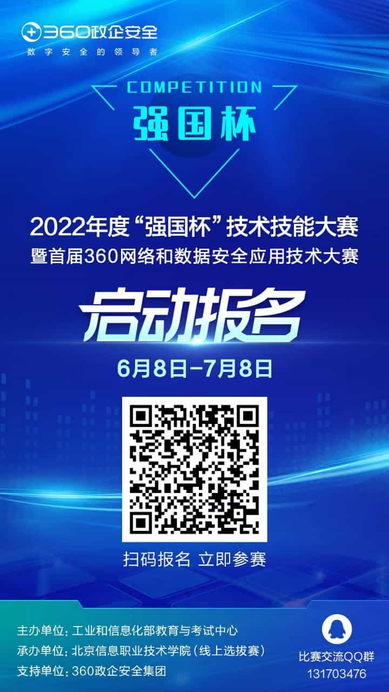

# CTF Week Meeting 2022-06-09

1. Skip the training this week.
1. AWD tool list.
1. (Update) Summer schedule
1. Upcoming events.

## Schedule for this week

Our members are going to have the final exams.

The training schedule for this weekend is skipped.

Hope you have a good grade in your exams!

## AWD tool list

AoiAWD: https://wiki.compass.college/Tool/AWD/AoiAWD/

Auto-AWD: https://wiki.compass.college/Tool/AWD/Auto-AWD/

AWD_auto_attack: https://wiki.compass.college/Tool/AWD/AWD_auto_attack/

awd-submit-flag: https://wiki.compass.college/Tool/AWD/awd-submit-flag/

awd-watchbird: https://wiki.compass.college/Tool/AWD/awd-watchbird/

flower: https://wiki.compass.college/Tool/AWD/flower/

ShellCat: https://wiki.compass.college/Tool/AWD/ShellCat/

## Summer schedule

### tl,dr;

- Training time: from June, 19th to August, 14th.
- Offline training would be held every Sunday from 9 am to 6 pm in 551 Meeting Room, Southern Tower of the Engineering Department.
- Two tiers: basic level and advanced level.
- The qualification exam would be on August 13th and 14th.
- Enjoy your tour of CTF and the infosec.

### Timeline

The time schedule would according to the weekly training topics. Every week, we would have a topic to focus on. During the training time, our timeline is set to the following table.

| Time         | Topic                                   | Introduction                                                 | Material                                                     |
| :----------- | :-------------------------------------- | :----------------------------------------------------------- | :----------------------------------------------------------- |
| June, 19th   | CTF Overview & Fun-oriented challenges. | Learn about what's CTF and how we win a CTF. The attendance of competitions and how to group a team. | [Introduction to CTF.pdf](https://wiki.compass.college/assets/Introduction_to_CTF.pdf) |
| June, 26th   | Linux, Programming, and Toolkit         | Introduce how to operate a Linux system using CLI, and install your environment. Learn how to program with Python. Install the toolkit. | [Linux, Programming, and Toolkit](https://wiki.compass.college/assets/Linux__Programming__CLI.pdf) |
| July, 3rd    | Web Challenges and Databases            | Ability to learn computer networks and hack websites. Know HTTP & HTTPS in protocol, and tools to capture / modify packets. | [Web Challenges and Databases.pdf](https://wiki.compass.college/assets/Web_Challenges_and_Databases.pdf) |
| July, 10th   | Forensics & Steganography               | Analyze the file format and hidden information. Packet or network traffic analysis as well. Several skills to check images. | [Forensics_Steganography.pdf](https://wiki.compass.college/assets/Forensics_Steganography.pdf) |
| July, 17th   | Modern Cryptography and Mathematics     | Asymmetric cryptography like RSA, ECC. A mathematic definition of security and attacks on modern cryptography. | [Cryptography.pptx](https://wiki.compass.college/assets/Cryptography.pptx) |
| July, 24th   | Assembly Language                       | Learn about some CISC knowledge. Use x86_64 as example to do assembly. Some reverse engineering skills are involved. | [Reverse.pdf](https://wiki.compass.college/assets/Reverse.pdf) |
| July, 31th   | Operating Systems                       | Guide to the OS course, learning about modern operating systems from Windows, Linux, to Android. About hardware, process architecture, how OS schedule procedure. | [Operating Systems.pptx](https://wiki.compass.college/assets/Operating Systems.pptx) |
| August, 7th  | Binary Exploitations                    | PWN challenges. Buffer overflows, shellcodes, ROP, and some pwn challenges. | [Binary Exploitation.pdf](https://wiki.compass.college/assets/Binary Exploitation.pdf) |
| August, 13th | Report and Summary                      | Before the final exam, we would have a report week to share your learning and conclusion on the CTF. | TBA                                                          |
| August, 14th | Exam                                    | Brand new challenges to solve this year, and winners would be qualified to the team. | TBA                                                          |

### Exam and the score

The training schedule isn't a course or something you need to rat race to get an A-level score. But, I think taking some grades can be feedback on your learning.

How to join the compass team? Sometimes, joining the CTF competitions can be done by oneself, but usually, we need teamwork to get a better grade in the competitions. You don't want your teammate to be a newbie, right? The exam and the score are used to make sure that every member is great.

Thus, if you find anything that is non-reasonable in our score system, please write an email to me. I would appreciate having your advice.

The scoring system won't have a cap, you can get as many points if you want. However, I don't like the rat race. So, every category would have a percentage in the result.

The final score formula is: `score = weight * sum(percent * log(2, score))`

The categories involves,

- Evaluation of the weekly challenges, and competitions: 30%.
- Remark from the team members: 10%.
- The sharing and the report score: 15%.
- The final exam: 100%.

The weight would be according to your grade. A freshman in the university is less experienced compared with the senior students, but from future learning, a freshman can have more time to improve. The weight is in order to balance the grades.

- Freshman (grade 1): +6%.
- Sophomore (grade 2): +4%.
- Junior (grade 3): +2%.

This is summer training, and we won't have any senior members (they are already graduated).

For example, if you got 3127 in the challenges and competitions, 155 in the remarks, 229 in the report, and 1625 in the final exam. You are a freshman in the university and just finished your first year. The total score would be: `1.06 * (0.3 * 11.610563503925041 + 0.1 * 7.2761244052742375 + 0.15 * 7.839203788096944 + 1 * 10.66622400280318) = 17.016059226486018`.

## Upcoming events

### 强国杯

https://www.qiangguobei.org.cn/

https://www.qiangguobei.org.cn/index/match/detail/id/12.html

Register: starts from 2022-06-08

Online Jeopardy: 2022-07-06

Online region challenges: 2022-07-24 (TBA)

Offline final: 2022-08-31 (TBA)

### 网鼎杯

https://www.wangdingcup.com/

##### 官方资格赛线上报名

6月2日10:00-7月27日20:00

##### 官方资格赛（青龙组）

参赛行业：高等院校，职业院校，无单位挂靠的社会参赛队伍

8月4日9:00-17:00

##### 官方资格赛（玄武组）

参赛行业：科研机构、科技企业、互联网企业、网安企业

8月9日9:00-17:00

##### 半决赛

8月28日

##### 总决赛

8月29日

## Note

- [x] 暑期计划相关的文档整理与情报收集
- [ ] 下学期CS315的内容修改
- [ ] 年底会议有关计算机安全课程&CTF相关的经验总结

