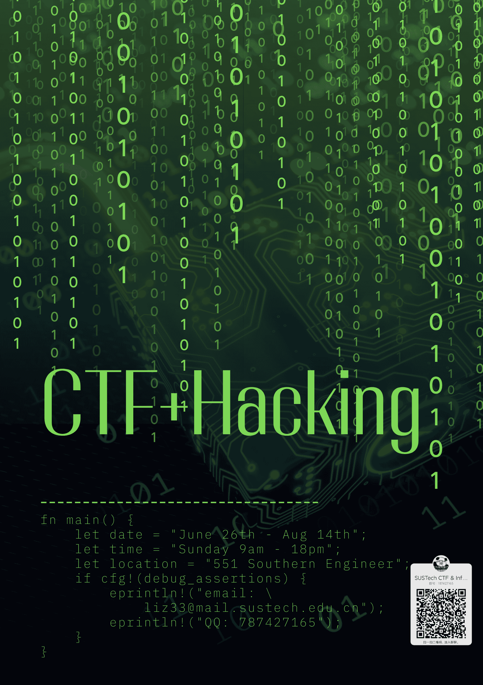

# CTF Week Meeting 2022-06-23

1. The first week of the summer schedule.
1. Upcoming events.

## Summer schedule

The progress isn't good...

* 12110842 刘欣萌
* 12112848 李烨

We have 2 new members for this summer.

I'm working on the advertisement for all students.

## Upcoming events

### Azure Assassin Alliance CTF 2022

2022-06-25 09:00:00——2022-06-27 09:00:00

https://adworld.xctf.org.cn/competition/

本届ACTF 2022是由XCTF联赛的合作单位AAA战队 (Azure Assassin Alliance）组织，由赛宁网安提供技术支持。作为第七届XCTF国际联赛的分站赛，本次比赛将采用在线网络安全夺旗挑战赛的形式，面向全球开放。

此次比赛冠军队伍将直接晋级第七届XCTF总决赛（总决赛具体地点时间待定，将在确定后通知获得资格的国际和国内队伍）。其他参赛的队伍也将获得积分，来竞争XCTF总决赛的其他席位。

* 比赛的邀请会私聊发送给校队成员

## Note

- [ ] 准备本周的训练内容与题目更新

