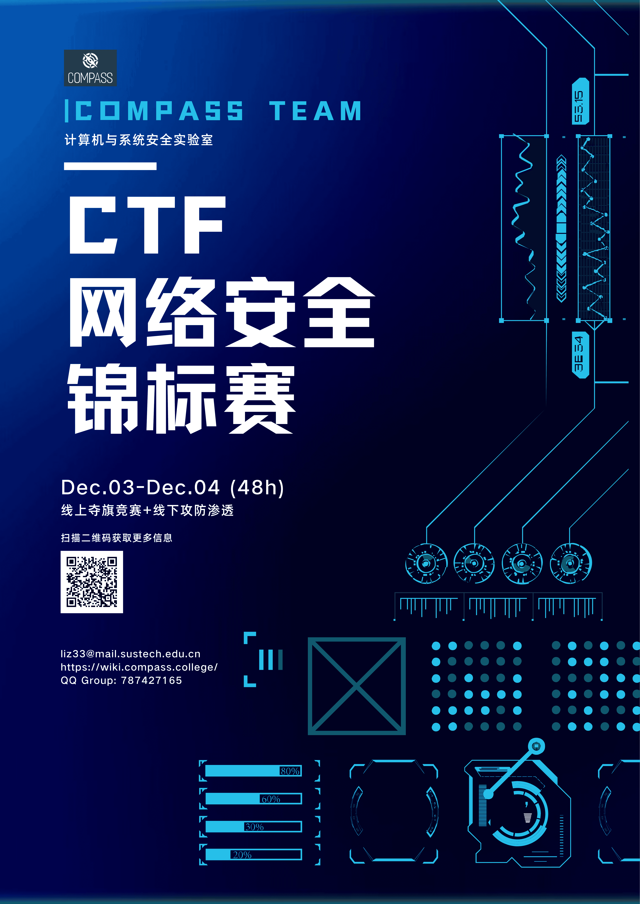

# CTF Week Meeting 2022-11-11

1. Get ready to work on our challenge platform.
1. Cyber Security Tournament on Dec 3rd - Dec 4th.
1. Upcoming events.

## Get ready to work on our challenge platform

Topic: Modern cryptography, ECC, RC4, and AES.

Please please please if you want to share some topics, contact me. I've shared by myself for 3 weeks!

We will cover the modern part of Cryptography including public key encryption, modern symmetric cryptography, and some mathematics knowledge about the cryptography.

If you are interested in the **zero-knowledge proof**, today we have a lecture about that at 4:00 pm in the 551 meeting room.

## Cyber Security Tournament on Dec 3rd - Dec 4th

The idea is a brief now, if you have any challenges want to put in this game, please contact me.

The game includes 2 parts:

* Jeopardy about interesting challenges (easy and fun) during 48 hours online.
* Attack-with-Defense in an interesting environment, an online game server, for 4 hours.

The prize would include an SSD drive with a penetration environment on it.

The game will invite beginners in cybersecurity and everyone who want to have a relaxed weekend. We have 2 goals:

* Provide some interesting events for students, and find our new member.
* Invite talented students to join COMPASS.

## Upcoming events

### SECCON CTF 2022 Quals

Sat, 12 Nov 2022, 13:00 CST — Sun, 13 Nov 2022, 13:00 CST

https://platform.id.seccon.jp/

This year, we will hold an online qualification round and on-site finals.

The finals will be in Tokyo From Feb. 11 to Feb. 12 and have international and domestic divisions.

### 菜狗杯

https://ctf.show/challenges

比赛名称：菜狗杯

比赛时间：2022年11月11日20时，共48小时

比赛类型：个人赛

比赛难度：轻轻松松，量大管饱，没有逆向和pwn

比赛奖品：菜狗(可绿可粉)

非强制规定：有npy人士禁止参加

### CATCTF

[WeChat article link](https://mp.weixin.qq.com/s?__biz=MjM5NDU3MjExNw==&mid=2247508234&idx=1&sn=4c39b2e6267e11fb8fa3c2351ff4411c&chksm=a687533091f0da268f4eeea4027d6022cf34687161a7481598fe2f09d0d723bc0f7bbdceae51&mpshare=1&scene=23&srcid=1111hs1LoYDYYLqMpGeQb5fA&sharer_sharetime=1668151357383&sharer_shareid=e090099e1f84145c26d4ec5fa4a73e51#rd)

Now in the preparation stage, the competition time is undetermined.
