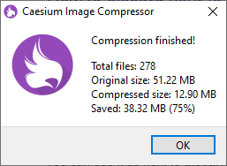
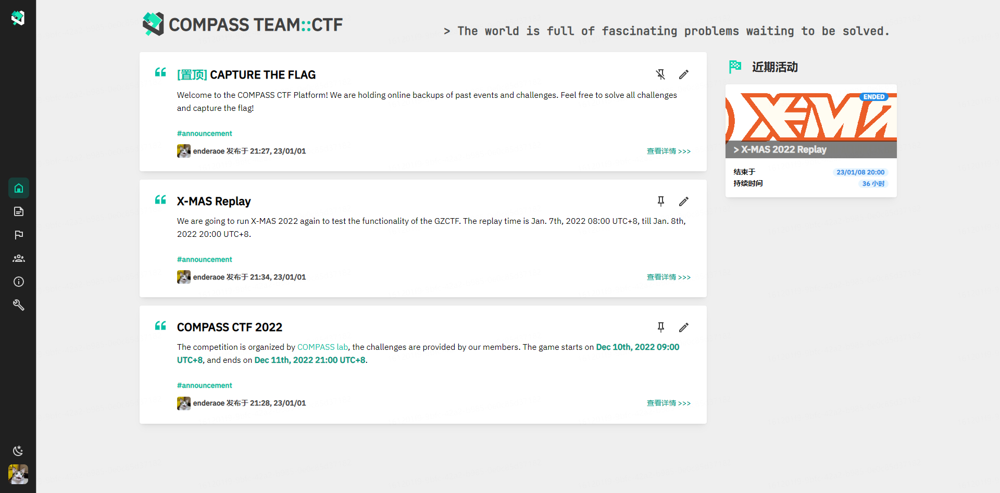
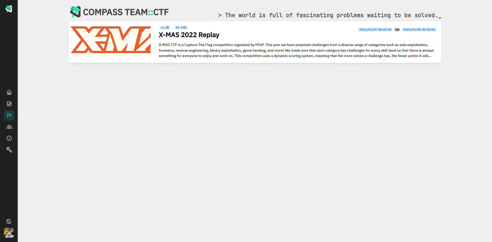

# CTF Week Meeting 2023-01-12

We are happy that we are here in 2023 and thank all members for their efforts in the past year. In the first (actually the second) all-volunteer weekly meeting this year, we will summarize the work and achievements of last year and designate the annual plan for 2023.

## Work progress tracking

1. COMPASS CTF 2022 - 60%
2. Topic: CTF combined with research - 0% brief idea
3. Multi-platform promotion of COMPASS CTF - 22%
4. ~~COMPASS TEAM's public email - 100% done~~
5. Training plan during winter break - 0%
6. Member adjustment - 25%
7. New Platform GZCTF - 43%
8. Wiki page content adjustment - 20% brief idea
9. CTFtime program: go hard and play CTF - 0% brief idea
10. New Member Recruitment - 0% brief idea

## What we discussed this week

1. Weekly meeting restructuring
2. Wiki page file structure revision
3. The 2022 year in Review
4. The 2023 year plan
5. Intra-team practice games and recent matches
6. Call for competition challenges

### 0x1. Weekly meeting restructuring

Perhaps you have noticed that in this weekly meeting, I have restructured the weekly meeting. Based on the results of the previous questionnaire collection, I got some valuable suggestions about the weekly meetings.

In the future, I will still use Markdown to design the document, compared to Latex, although Latex has a better presentation, Markdown saves a lot of time in writing the document, and our time is too precious to waste in compiling and adjusting the document, and I will not use PPT for the weekly meeting. The document for the weekly meeting will follow the following format.

1. Work tracking: Many plans that were once confidently ready to be implemented were not completed due to a lack of progress tracking. In future meetings, I will add a progress tracking section to report on the progress of the work.

2. This week's content discussion: Keeping the style of the previous weekly meeting, I will list the discussion items for this week's weekly meeting, and hope to describe the details of each plan and item in detail while synchronizing the content follow-up. This is the discussion session, I hope everyone can actively give suggestions on the plans and matters, more discussion often means better results.

3. Summary: A final summary of the content of this week's weekly meeting. If you do not have time to attend the weekly meeting discussion and do not intend to read the lengthy details of the discussion items after the weekly meeting, you can quickly follow up on the progress of this week's weekly meeting discussion through the outline and summary of the content discussion.

### 0x2. wiki page file structure revision

I have restructured some of the documents, and the main elements include.

1. archived the CS315 file for 2021 and placed it in the 2021 folder.

2. filed the weekly meeting documents for 2022, divided them into two parts, the first half and the second half, and placed them in different folders.

In addition, some work was done on resizing the images. Git is not a supported binary versioning tool (unlike SVN), our repo is on GitHub, and I am not a paid member of GitHub, so although there is no repository size limit for the free version, I still want to reduce the size of our binary files to reduce the size of our repository I'm not a paid member of GitHub either.

The initial work was to resize all the image files to a fraction of their original size and try not to compromise image quality.

I hope you can pay attention to the following conventions when submitting a Pull Request.

1. All material files (images, attachments, etc.) should be placed under the assets/ folder as much as possible.

2. For uncompressed high-quality images (such as direct screenshots or downloaded originals), please include the `_hd` field after the image name so that I can find the image that needs to be compressed when adjusting it.

Future work related to the wiki.

1. adjust the bilingual language support: Mkdocs natively support multi-language localization, we only used English as a language when creating the wiki, as a first/second language that almost global users know, I considered the convenience. However, our first language is Chinese, and reading English documents is much slower than Chinese documents, I will consider adding Chinese support.

    * Current planned solution: access to DeepL's API to generate a Chinese translation directly. As the Chinese with higher tolerance rate, the level of comprehension through English to Chinese translation will be better.

1. adjust the content structure: wiki content structure today as a CTF all-in-one reference wiki, but there are still many shortcomings. I hope that while providing toolkits, web resource references, and writeups, more categories can be added to facilitate CTF learning.

### 0x3. The 2022 Year in Review

We have achieved some results in FY2022, but we also have some unfinished business.

Memorable accomplishments.

1. We participated in the "Top Geeks" competition held by the Chengdu government and came in 10th place in the finals.

2. We participated in the "Wangding Cup" competition held by the National Internet Information Office and the Ministry of Public Security, and got 8th place in the preliminary round and advanced to the final round.

3. The HED team won first place in the "Winter Competition" of iChunqiu.

4. We participated in the "Student Cyber Security Competition" held by Guangdong Provincial Government and advanced to the final round.

5. In the CTFtime 2022 ranking, the COMPASS team achieved a total score of 83.569, ranking 32nd among Chinese teams.

6. We participated in the "Strong Network Cup" competition held by the State Internet Information Office and the Zhengzhou government, and both teams got the "Strong Network Pioneer" certificate.

Unfortunately, in 2022, we also have some matters that were once planned to go down the drain and remain unfinished. To review our 2022 objectively and fairly, I would like to summarize this part as well.

1. CTF from practice to principles: I was inspired by Prof. Zhang in early 2022 to compile a book about CTF tutorials for true zero-based CTF beginners to make up for the shortcomings of today's CTF tutorial books that are still too difficult and the knowledge coverage fails to construct a big picture of CTF and network security. Unfortunately, so far I have only completed the outline and part of the first chapter of the book, and I hope to continue this work in 2023.

2. Competition planning for new members: This is one of the main tasks of the varsity team, and despite our intensive weekly training, the number of members participating in competitions is still very insufficient. In the weekly meetings, I synchronize the competitions that will be held soon, but few new members intend to participate.

3. Adjustment of the tournament platform: Unfortunately, although I had planned to adjust the topics and functions of the CTFd platform being used and made some rough proposals, this plan did not come to fruition in the end. After testing the new platform on 2023-01-07, I decided to use GZCTF as our new platform and abandon the original CTFd platform. I will transfer our original questions, entry test questions, and other high-quality tournament questions to GZCTF.

4. Cooperation with the Information Center: At the beginning of the establishment of the varsity team, I communicated quite closely with a colleague from the Information Center ITS, would participate in each other's activities, and achieved some results in the construction of the network security. Unfortunately, after several lengthy and boring communications, annoying network problems, and a change in the attitude of the Information Center towards cyber security, ITS did not participate in many of the subsequent events we held. I regret that COMPASS TEAM's attempts to work with the Information Center to improve campus cybersecurity have largely failed, but I will still try to convince ITS to pursue this effort.

### 0x4. The 2023 year plan

We've reached 2023, and in a brand new year, it's time to make a new annual plan.

1. CTFtime race plan: In the new year, I will try not to miss any race that has a CTFtime rating, to raise the visibility of COMPASS TEAM on the biggest international platform in the CTF field, and to move towards DEF CON 31 in August.

2. Membership recruitment: We were very lucky to have two extremely talented new members of the class of 2022 join us before we even started our membership recruitment. In 2023, I will adjust the membership recruitment schedule and invite the best members to join us.

3. Cross-platform science and awareness promotion: I am planning to create COMPASS TEAM social media accounts on multiple platforms, and I have chosen different content strategies for each different platform user group. Social media platforms are a great way to get the word out about our work, and those currently planned include.

    * CSDN/Blog Garden: Reprint wiki content

    * WeChat Public: Vulnerability analysis and summary

    * Pediy (Kanxue) Forum: vulnerability recurrence and research

    * Anquanke: technical summaries and tutorials

    * Tiktok: Network Security Tips

    * Twitter: publicity/results sharing

    * Weibo: Activity dynamics and science popularization

    * Zhihu account: writeup analysis

    * Bilibili account: CTF science and teaching

4. CTF and research content combination: I always aspire to publish academic results, and it is fun to share my brand-new work contribution with others. Before that, I had only done a small amount of scientific work and still knew very little about how to publish a paper. Recently I've been talking with Hongyi Lu about trying to combine CTF content with academic papers. Much of what we are exposed to in CTF (especially in cryptography) seems to be very cutting edge, and I used to think that CTF is not accurate to just reproduce what has already been done. I hope to publish some work in 2023 as I explore the feasibility of combining CTF with research.

### 0x5. Intra-team practice games and recent matches

#### On-Campus Practice: X-MAS CTF 2022 Repeat

Between 2023-01-07 and 2023-01-08, we had an intramural practice session to test the new GZCTF platform, which gave me a very good experience using the platform and confirmed the idea of replacing CTFd with GZCTF.

The beta version of the platform is currently open on port 29998 of the Detroit server. When I finish the container revision and title migration work, I will close the CTFd service on port 80 and move GZCTF to port 80. Meanwhile, the GZCTF data of the test period will be retained.

A fresh start is the best start, I tend to clear the original user data to start from scratch and build a new and better platform. However, if you wish to keep your former account and keep your former solution records, I will also keep the data for you.

For data preservation and migration, please contact email: liz33@mail.sustech.edu.cn, when you send it, you can copy it to Prof. Fengwei Zhang in COMPASS lab: zhangfw@sustech.edu.cn, I will finish the platform migration as soon as possible.

#### idekCTF 2022*

Friday, 13 January 2023, 08:00 CST - Sunday, 15 January 2023, 08:00 CST

A [idekCTF](https://ctftime.org/ctf/700) event.

Official URL: https://ctf.idek.team/

Rating weight: 24.56

**Event organizers**

- [idek](https://ctftime.org/team/157039)

**NOTE**: The start time has been pushed back by 22 hours from what is listed here. The event will begin on Friday, January 13, 2023, at 22:00:00 UTC (1673647200). The event duration is still 48 hours.

idekCTF is an information security CTF competition organized by the idek team and is aimed at high school and university students, with difficult challenges catering to more experienced players. idekCTF will cover the standard Jeopardy-style CTF topics (binary exploitation, reverse engineering, cryptography, web exploitation, and forensics) as well as other, less standard categories.

#### Ugra CTF Quals 2023

Saturday, 14 January 2023, 15:00 CST - Monday, 16 January 2023, 03:00 CST

A [Ugra CTF](https://ctftime.org/ctf/457) event.

Official URL: https://2023.ugractf.ru/

Rating weight: 0.00

**Event organizers**

- [[team Team\]](https://ctftime.org/team/49808)

Ugra CTF Quals 2023 is an open information security competition for beginners. It is a 36-hour online event. Everybody is welcome to participate.

This CTF is organized by [team Team] in a joint effort with the Ugra Research Institute of Information Technologies and Information Technologies and Digital Development Department of the Khanty-Mansiysk Autonomous Okrug — Ugra.

Teams of high school students and others are playing in separate scoreboards, but they will be merged upon uploading to CTFtime.

**Note**: This year's challenges will be a bit easier than usual. If you enjoyed our previous years' Quals, come and join us at [Ugra CTF Open 2023](https://ctftime.org/event/1853) which will be held June 2023.

The official language of Ugra CTF is Russian, but you are welcome to participate even if you don’t speak it. We will try our best to ensure that no task relies on something that can’t be understood by proper use of machine translation.

## Wrap-up

In this week's weekly meeting, we adjusted the format and content format of the weekly meeting conducted after the day to facilitate work progress tracking and planning. I proposed a new planned content adjustment of the Wiki page, hoping to make the Wiki content more suitable for CTF beginners and players' reference.

In addition, we have reviewed the achievements of the 2022 varsity team, and also summarized the regrets and unfinished business of 2022, hoping to inspire us to continue our progress. At the same time, I have prepared many new plans for 2023.

The work on the new platform has been in the planning since the second half of 2022, from trying to adjust the CTFd, and gradually changing to the new platform GZCTF was chosen. In the test conducted last week, the stability and usability of GZCTF were tested, and I plan to change the tournament platform to GZCTF.

Finally, about the recent tournament matters. There will be two competitions this week, both of which are international competitions of CTFtime, and the idekCTF of which has CTFtime score weighting, so I hope students who can learn will participate.

The above is the content of this week's weekly meeting, if you have any comments/suggestions, please feel free to contact me.