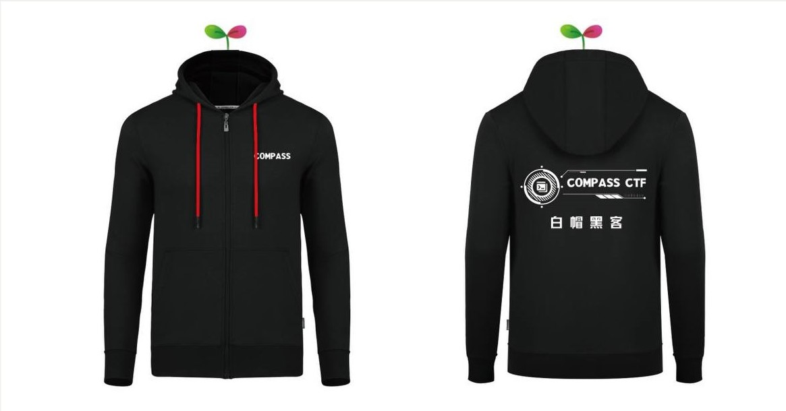

# CTF Week Meeting 2023-03-09

In the first few weeks of the school year, our offline training is on schedule and we have recently been working on the training content with our Hunan University students. The recruitment program is also underway and more new students will be joining us soon. We still want to thank COMPASS Lab for the great support and hope that students will join COMPASS Lab in an excellent environment for innovative experiments and graduate students' choices.

## Work progress tracking

1. <u>COMPASS CTF 2022 - 90%</u>
2. Topic: CTF combined with research - 20%
3. Multi-platform promotion of COMPASS CTF - 20%
4. New Platform GZCTF - 55%
5. <u>Wiki page content adjustment - 60%</u>
6. CTFtime program: play CTF and share - 19%
7. <u>New Member Recruitment - 37.5%</u>
8. Ande Cup CTF game - 13%
9. <u>Remedial content session - 33%
11. CTF from Practice to Principle - 3%
12. National College Student Information Security Contest - 10%

## What we discussed this week

1. COMPASS CTF 2022.
2. Wiki page content adjustment.
3. New Member Recruitment.
5. Upcoming Events.

### 0x1. COMPASS CTF 2022

All of our prizes have been customized and we are about to complete the final awarding part of this competition.

I hope everyone learned and made progress in this competition. Most importantly, I hope all the participants enjoyed the competition!

### 0x2. Wiki page content adjustment

I'm updating the wiki's toolkit directory, uploading all the tools I've used recently, and merging several toolset sites for inclusion. For beginners, you can use the toolset directly to build your environment quickly.

-----

#### Windows10 Penetration Suite Toolkit within Kali Linux

##### System Description

Based on the original Win10 Workstation 21H2 x64 image (not available for ARM devices).

Complete installation of WSL Kali Linux 2022.3.

streamline the software that comes with the system, beautify the fonts and some icons, and moderate optimization.

using single-disk file storage to improve performance.

Recommended runtime environment:

* vmware:16.x (VMware graphics memory 1G)
* Running memory:8G
* Solid State Drive:200G

##### Links

https://github.com/makoto56/penetration-suite-toolkit

#### Kali Linux

**The most advanced Penetration Testing Distribution**

Kali Linux is an open-source, Debian-based Linux distribution geared towards various information security tasks, such as Penetration Testing, Security Research, Computer Forensics, and Reverse Engineering.

The Kali Linux penetration testing platform contains a vast array of tools and utilities. From information gathering to final reporting, Kali Linux enables security and IT professionals to assess the security of their systems.

##### Links

https://www.kali.org/

https://www.kali.org/tools

#### Black Arch Linux

##### About

BlackArch Linux is an [Arch Linux](http://www.archlinux.org/)-based penetration testing distribution for penetration testers and security researchers. The repository contains [2840](https://blackarch.org/tools.html) tools. You can install tools individually or in groups. BlackArch Linux is compatible with existing Arch installs. For more information, see the [installation instructions](https://blackarch.org/downloads.html#install-repo). Also, news is published on our [blog](https://blackarch.org/blog.html).

Please note that BlackArch is a relatively new project. To report bugs and request new tools, please visit the [issue tracker](https://github.com/BlackArch/blackarch/issues) on Github, stop by [Matrix](https://matrix.to/#/#BlackArch:matrix.org), or [email](mailto:team@blackarch.org) us.

The BlackArch Full ISO contains multiple window managers. The BlackArch Slim ISO features the XFCE Desktop Environment. Below you will find screenshots of a few of them.

##### Links

https://blackarch.org/

-----

In addition, the tutorial section of the basic content has been uploaded to the wiki page, and you can now view the basic training section which is being updated, and later I will also update our new topic practice and tournament contact page to the home page.

https://wiki.compass.college/CTF/CTF%20and%20Hacker%20Attitude/

https://wiki.compass.college/CTF/Linux%20Basics/

https://wiki.compass.college/CTF/Python_1/

https://wiki.compass.college/CTF/Python_2/

### 0x3. New Member Recruitment

**计算机科学与技术系COMPASS实验室有关计算机安全与网络安全培训的邀请函**

同学们好，

 为积极响应国家网络空间安全人才战略，加快攻防兼备创新人才培养步伐，提升学生攻防兼备的网络创新实践能力，培养学生的创新意识与团队合作精神，普及信息安全知识，增强学生信息安全意识，提高学生的网络空间安全创新能力与实践技能，推动网络空间安全生态体系的人才培养和产学研用，计算机科学与技术系计算机系统安全实验室（COMPASS lab）与网络安全竞赛校队（COMPASS CTF）邀请同学们参加本科生**计算机安全基础技能培训**暨**网络安全队伍成员招募**活动。

 计算机安全基础技能培训将在线上进行，内容包括：
 \1. 什么是网络安全与黑客精神；

 \2. Linux系OS的安装与使用；

 \3. Python编程基础：数学、网络、与图像处理；

 \4. 密码学基础与Sagemath教学；

 \5. 计算机网络基础与Burp Suite分析网络包；

 \6. 文件格式教程与十六进制编辑器；

 \7. IDA进行ELF/PE可执行文件逆向工程；

 \8. 二进制漏洞利用基础；

 \9. Docker容器安全与容器管理；

 \10. 更多内容正在补充……

 加入SUSTech CTF & Infosec 爱好者联盟群组获取有关活动的更多信息：**787427165**。二维码图片如下。

 **每周日下午14:00-18:00**将会在**工学院南楼551会议室**进行校队成员进阶训练，同样欢迎爱好者参与学习。

 **本周日晚20:00-21:00**将进行线上活动宣传会议，将在腾讯会议进行：**448-489-4504**，或使用链接直接进入会议： https://meeting.tencent.com/p/4484894504 。

 欢迎同学们通过朋友圈、QQ空间等方式进行内容分享及转发，支持大家的宣传协助，**发送朋友圈/说说/其他推广**可在周日线下训练现场领取可可爱爱**小贴纸**一份，**点赞数超过50**可以额外获得**64GB渗透工具包U盘**一份作为礼品。宣传海报如下。

 相关链接：

 \1. COMPASS实验室官方网站： https://compass.sustech.edu.cn/ ；

 \2. COMPASS CTF校队Wiki： https://wiki.compass.college/ ；

 \3. COMPASS CTF线上题目练习平台： http://detroit.sustech.edu.cn/ （校外访问） / http://116.7.234.225/ （校内访问）；

 \4. COMPASS CTF线上赛事平台： [http://detroit.sustech.edu.cn:29998/](http://detroit.sustech.edu.cn/) （校外访问） / [http://116.7.234.225:29998/](http://116.7.234.225/) （校内访问）；

 祝大家学有所成，共同进步。

计算机系统与安全实验室，COMPASS CTF网络安全竞赛队伍

李照

These are the emails that will be sent to all undergraduates, and we are currently fighting with the compasslab email service that sends mass emails, so you will receive similar emails later.

We will start our first online presentation this weekend at 20:00, and we will also record and archive the presentation for later viewing. The content of this event is: CTF introductory guide and hacking spirit.

### 0x4. Upcoming Events

https://mp.weixin.qq.com/s?__biz=MzkyNDA5NjgyMg==&mid=2247495188&idx=1&sn=9883d07a787f36a7de1ce164a5a280af&chksm=c1d9ae4df6ae275b4530724a2ba1ce0524863cc62b26f25bc9c06d1ad74d8430f1b664140086&mpshare=1&scene=23&srcid=0306DosSvZInXqEwrQStS4vj&sharer_sharetime=1678109644023&sharer_shareid=e090099e1f84145c26d4ec5fa4a73e51#rd

https://mp.weixin.qq.com/s/7OKn0HDs6E90TyfQJfjNeA

## Wrap-up

We discussed the wiki page adjustments and the recruitment of newcomers, and the COMPASS CTF 2022 awards will be given out this week. This week's events include the 2023 Digital China Innovation Competition - Digital Talent track, and everyone is invited to participate.