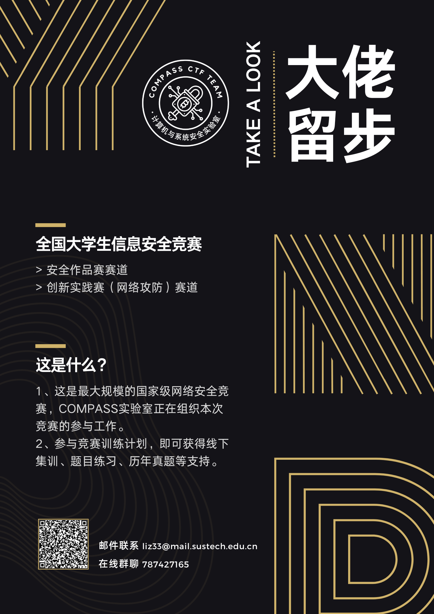

# CTF Week Meeting 2023-05-11

We're gearing up for the upcoming National Competition. We'll also be providing training sessions to sharpen our skills and stay up-to-date with the latest trends in cybersecurity. To make sure that we're all on the same page and fully prepared, I'll be holding individual meetings with each member of the team. Let's work together to take our cybersecurity expertise to new heights!

## Work progress tracking

1. Topic: CTF combined with research - 20%
2. Multi-platform promotion of COMPASS CTF - 30%
3. New Platform GZCTF - 55%
4. <u>Wiki page content adjustment - 100%</u>
5. CTFtime program: play CTF and share - 34%
6. <u>New Member Recruitment - 80%</u>
7. <u>CTF from Practice to Principle - 30%</u>
8. <u>National College Student Information Security Contest - 50%</u>
9. <u>Discussions with Other Universities about National College Student Information Software Competition - 100%</u>
10. **Individual Meetings with our members - 0% brief idea**
11. **COMPASS Infosec Game CTF - 0% brief idea**

## What we discussed this week

1. Invitation and the Register about the National Competition.
2. Individual Meetings with our members.
3. COMPASS Infosec Game CTF.
4. Upcoming Events.

### 0x1. Invitation and the Register about the National Competition



### 0x2. Individual Meetings with our members

During this chapter of the meeting, we will be discussing how we can improve our hacking skills for fun and for the benefit of our team. We'll go through each member's strengths, weaknesses, and areas of interest to better understand how we can collaborate and tackle various challenges more effectively. We'll discuss techniques, tools, and strategies for hacking and explore avenues for earning more opportunities in the field. Whether you're a seasoned hacker or just starting out, this chapter of the meeting will provide you with valuable insights and ideas for enhancing your skills and contributing to the team's success. We will also share tips and resources for staying motivated and engaged in the exciting world of cybersecurity.

I will contact you and arrange time for the meeting.

### 0x3. COMPASS Infosec Game CTF

Before the June, we are going to hold a university competition, that contains both JeoPardy form challenges, and the offline AwD form final round.

```
Dear Students,

We are pleased to announce the COMPASS Infosec Game, a university competition about information security that will be held on [date]. The competition's main objective is to invite CTF players from other universities to participate and showcase their skills in cybersecurity.

As a student of SUSTech, we invite you to partake in this exciting competition. We are offering special prizes and commendations to the winning teams. It is a great opportunity to not only challenge your information security skills and knowledge, but also to represent your university and make new connections with like-minded individuals from other universities.

To register, please contact us with your team and member information before [registration deadline]. Once registered, we will provide you with further details about the competition format, timeline, and logistics.

We look forward to seeing you in action and promoting the growth of information security skills.

Best regards, COMPASS CTF
```

This schedule is under construction.

### 0x4. Upcoming Events

#### *ISCC2023个人挑战赛

比赛链接：https://www.isclab.org.cn/jsrk/

比赛类型：个人赛

报名开始：2023-04-30 08:00

报名截止：2023-05-25 18:00

比赛开始：2023-05-01 08:00

比赛结束：2023-05-25 18:00

其他说明：

QQ群：751684975

#### 东北电力大学NEEPU-CTF 2023 公开赛

比赛链接：http://www.neepusec.fun:8090/

比赛类型：个人赛

报名开始：2023年5月1日

报名截止：2023年5月12日

比赛开始：2023年5月19日 20：00

比赛结束：2023年5月21日 20：00

其他说明：

教务处通知：https://jwc.neepu.edu.cn/info/1014/2513.htm QQ群：700517227

#### 第十六届全国大学生信息安全竞赛初赛

比赛链接：http://www.ciscn.cn/

比赛类型：团队赛｜1-4人

报名开始：2023年4月27日

报名截止：2023年5月25日

比赛开始：2023年5月27日

比赛结束：2023年5月28日

其他说明：

官方QQ群①：568747643 官方QQ群②：779329249 官方QQ群③：780247795 官方QQ群④：797605821

#### *2023年福建省第四届“闽盾杯”网络空间安全大赛（黑盾全国大学生赛道）

比赛链接：http://heidunbei.si.net.cn/hdc/cover

比赛类型：团队赛｜1-3人

报名开始：2023年5月10日

报名截止：2023年5月18日

比赛开始：2023年5月20日线上选拔赛 5月21日线上复赛

比赛结束：2023年6月2日决赛

其他说明：

竞赛官方QQ群566180593

#### NSSCTF Round#12

比赛链接：https://www.nssctf.cn/index

比赛类型：MISC专项个人赛

报名开始：2023年5月10日

报名截止：2023年5月20日

比赛开始：2023年5月20日10:00

比赛结束：2023年5月20日

其他说明：

QQ群：732339662

#### 2023LitCTF&郑州轻工业大学首届新生赛

比赛链接：https://www.nssctf.cn/contest

比赛类型：团队赛｜1-4人

报名开始：无需报名

报名截止：无需报名

比赛开始：2023年5月13日10:00

比赛结束：2023年5月14日17:00

其他说明：

QQ群：782400974
