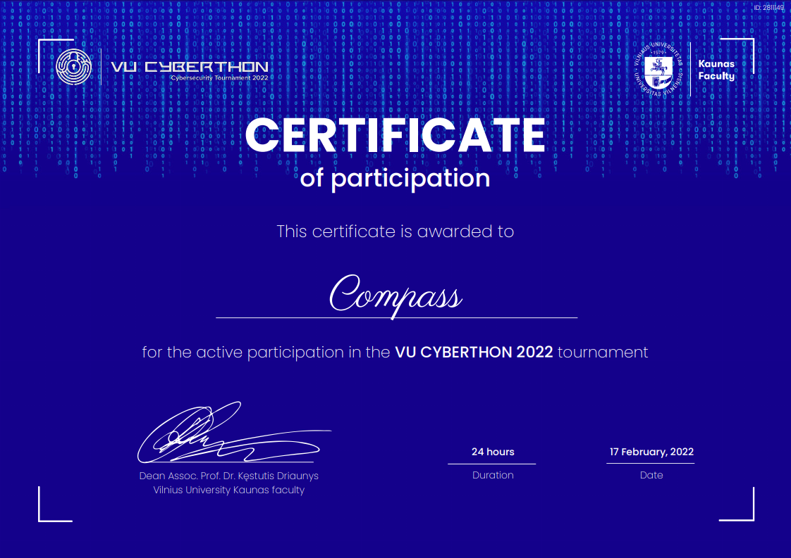
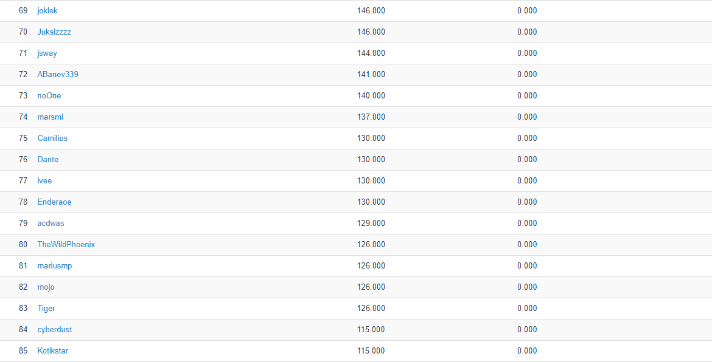

# CTF Week Meeting 2022-02-24

1. Review of the last week.
1. Recent competitions: VU CTF 2022 & TQL CTF 2022.
1. First offline activity for this semester.
1. Competitions this weekend.

## Review of the last week

### XSRC Platform

https://xsrc.its.sustech.edu.cn/

Not working properly now. Having asked the developers from ITS. They have given instructive advice:

`Use email then.`

itsserver#sustech.edu.cn

### Wiki/Blog Collection

https://github.com/tanjiti/sec_profile

A repo about security profile.

Gonna use information from this list first. All the blog and personal websites would be added soon.

`Project: TG Sec Bot`

The project information and the initial proposal would be posted on GitHub and invite you (if interested).

### Improvement

Working on the security analysis and CVE post. Found several vulnerabilities from ThinkPHP and its plugins.

sqlmap analysis shows it's not vulnerable. Doing some SCA recently.

### Communication

I have emailed several top teams and waiting for their response.

The experience from top teams is really important. Besides, not only for CTF, but also for security developers and engineers.

* Nu1L
* GML-SEC
* AAA
* 雷神众测
* 平安银河实验室

## Competition Rank

### VU CTF 2022

Rank 78

As an exercise competition got in the top 100.

### TQL CTF 2022

Rank 37

Doesn't have enough participants. Maybe better.

## First Offline Activity

Our first offline competition activity would be held this Saturday.

According to the recently COVID-19, shall the offline activity move to online?

1. If offline: I'm going to order the meeting room 515 Southern Tower, Engineering Department. Welcome to participate.
2. If online: we would have an online meeting for competition and sharing this Saturday, which lasts 4 hours.

The sharing would be given by myself this week. I'd like to talk about the Rust programming language.

If you want to share anything else, it's highly recommended to give a talk this weekend.

## Competitions

### Codegate CTF 2022 Preliminary

星期六, 26 二月 2022, 18:00 CST — 星期日, 27 二月 2022, 18:00 CST

http://www.codegate.org/

We are going to participate in the `General` team. The top 9 teams from the General group would be allowed to the final competition.

The maximum team size is 4 members

### Ugra CTF Quals 2022 (Optional)

星期六, 26 二月 2022, 15:00 CST — 星期二, 01 三月 2022, 15:00 CST

https://2022.ugractf.ru/

The event would be in Russia. Maybe we need to use some translation tools.

### SUSCTF 2022 (Optional)

星期六, 26 二月 2022, 09:00 CST — 星期一, 28 二月 2022, 09:00 CST

https://susctf2022.xctf.org.cn/

By SUSr. The name is very likely SUSTC. So, maybe you are interested.

## Note

1. 题目平台环境挂了，考虑维护和docker-compose

   A. 服务器环境自动启动

   B. SaaS用户启动方案

2. CTF Book动态更新，整理章节目录和材料
3. 跟进Black Hat Submission的信息
