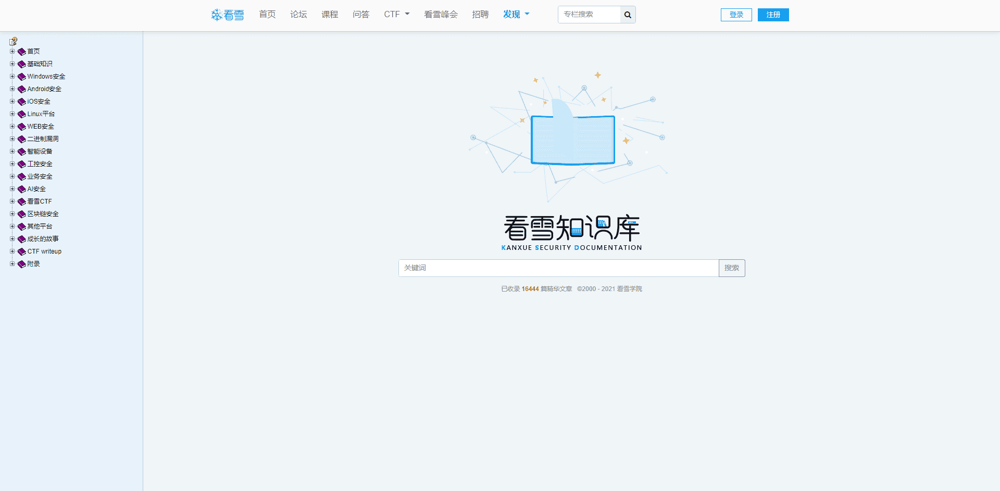

# 看雪学院

Kanxue Security Documentation is a forum to post all things about cybersecurity from operating systems to web security, from binary exploitation to wiki and IoT security.

The knowledge base contains good posts in forum.

## Reference

Link: https://www.kanxue.com/chm.htm

