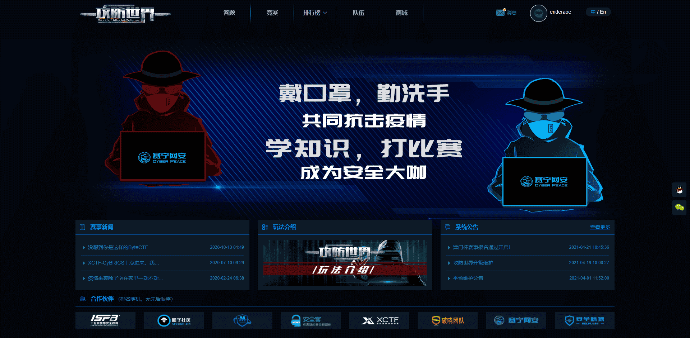

# World of Attack&Defense

World of Attack&Defense (Aka 攻防世界) is another fully constructed CTF platform of challenges and event schedule.

The challenge environment of WAD constructed from deployed machines that you need to deploy environment before solving the challenge.

That is, in some time, the deployment environment of WAD is failed and users can not finish challenges.

However, the challenge quality is pretty good and writeups submitted by users are also good to read.

## Reference

World of Attack & Defense link: https://adworld.xctf.org.cn/