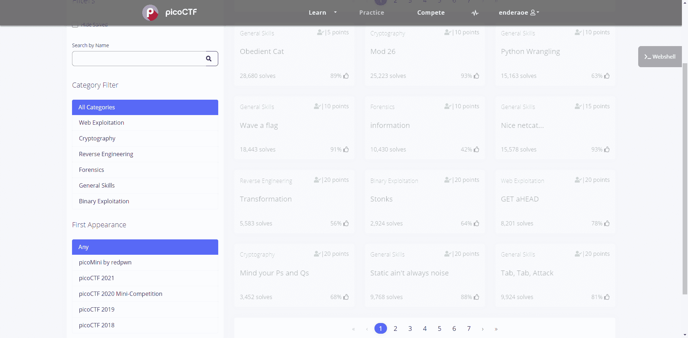

# picoCTF

picoCTF is a series of CTFs focus on the high school students. Nowadays, picoCTF adds more difficult challenges that face to all gamers besides high school students.

The picoCTF platform provides most of the challenges in picoCTF these years and you can try to solve those challenges online.

The challenges are from very easy to advanced. Some beginner challenges are friendly for CTF beginners and some advanced challenges may take you some time to solve.

The binary challenges are hard for beginners and picoCTF doesn't provide beginner-friendly binary (pwn) challenges. For those who are starting their travel in binary field, maybe other platform is better than picoCTF.

## Reference

Link: https://play.picoctf.org/practice