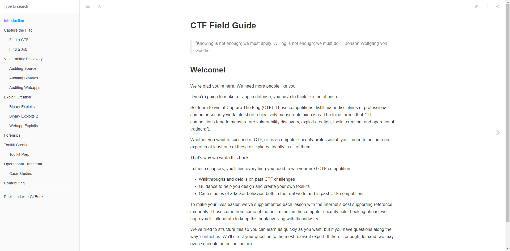

# CTF Field Guide

In these chapters, you’ll find everything you need to win your next CTF competition:

- Walkthroughs and details on past CTF challenges
- Guidance to help you design and create your own toolkits
- Case studies of attacker behavior, both in the real world and in past CTF **competitions**

Consists of several introduction to each categories.

## Reference

Link: https://trailofbits.github.io/ctf/

