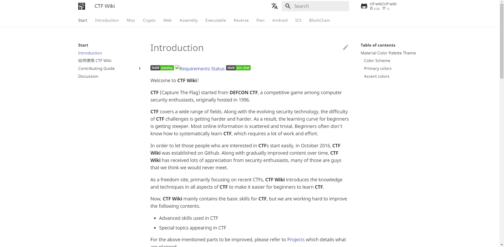

# CTF Wiki

As a freedom site, primarily focusing on recent CTFs, **CTF Wiki** introduces the knowledge and techniques in all aspects of **CTF** to make it easier for beginners to learn **CTF**.

Now, **CTF Wiki** mainly contains the basic skills for **CTF**, but we are working hard to improve the following contents.

- Advanced skills used in CTF
- Special topics appearing in CTF

For the above-mentioned parts to be improved, please refer to [Projects](https://github.com/ctf-wiki/ctf-wiki/projects) which details what are planned.

Although now **CTF Wiki** mainly focus **CTF**, it is not strictly limited to **CTF** topics. In the future, **CTF Wiki** will include

- Tools used in security research
- Increased discussion of security in the world

In addition, given the following two points

- Information about technology should be openly shared.
- As new techniques are always being developed, old techniques will start to fade over time and they should be replaced with new techniques.

Therefore, **CTF Wiki** will never publish books.

Finally, originating from the community, as an independent organization, **CTF Wiki** advocates **freedom of knowledge**, will **never be commercialized**, and will always maintain the character of **independence and freedom**.

## Reference

Link: https://ctf-wiki.org/

