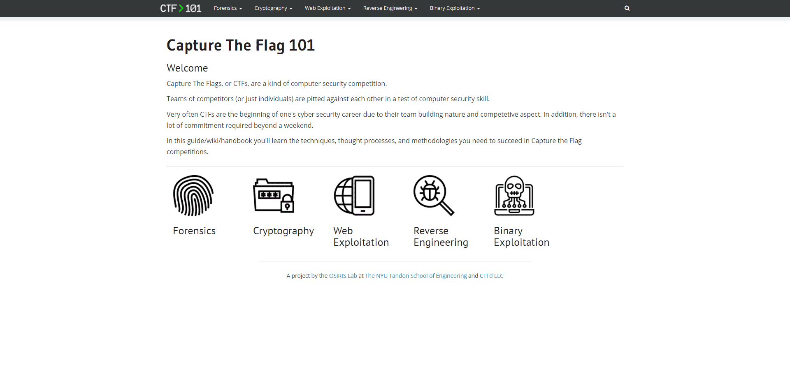

# Capture The Flag 101

Capture The Flags, or CTFs, are a kind of computer security competition.

Teams of competitors (or just individuals) are pitted against each other in a test of computer security skill.

Very often CTFs are the beginning of one's cyber security career due to their team building nature and competitive aspect. In addition, there isn't a lot of commitment required beyond a weekend.

In this guide/wiki/handbook you'll learn the techniques, thought processes, and methodologies you need to succeed in Capture the Flag competitions.

**CTF 101 is the perfect website for CTF beginners.**

## Reference

Link: https://ctf101.org/

