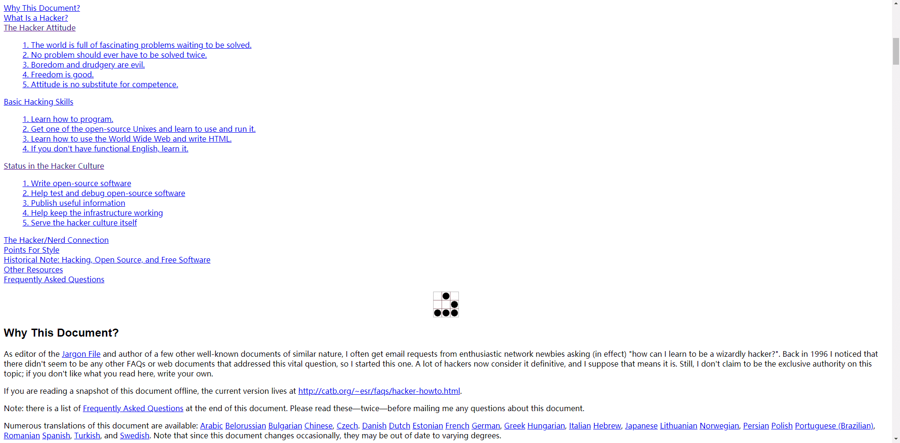

# How To Become A Hacker

An article of "how to" series written by Eric Steven Raymond.

In this article, you can learn how to become a hacker, and what should you learn to contribute to the cybersecurity and hacking field.

Remember the hacker attitudes:

1. The world is full of fascinating problems waiting to be solved.
2. No problem should ever have to be solved twice.
3. Boredom and drudgery are evil.
4. Freedom is good.
5. Attitude is no substitute for competence.

## Reference

Link: http://www.catb.org/~esr/faqs/hacker-howto.html

