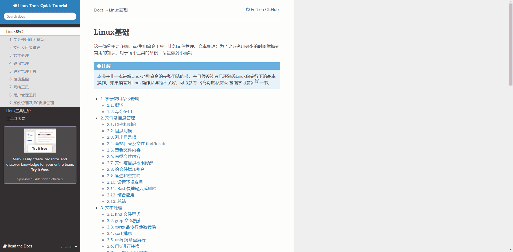

# Linux Tools Quick Tutorial

A website for linux beginners to learn with linux command and tools.

This website is only a brief introduction to the linux. After learning the tutorial of linux, you can use linux just like using any other operating systems.

If you want to find more details of Linux instead of just learning of features and tutorials to usage, you may want to read 《鸟哥的Linux私房菜》. The reference to the blog is attached below this tutorial.

## Reference

Link: https://linuxtools-rst.readthedocs.io/zh_CN/latest/base/index.html

鸟哥的Linux私房菜: http://linux.vbird.org/
