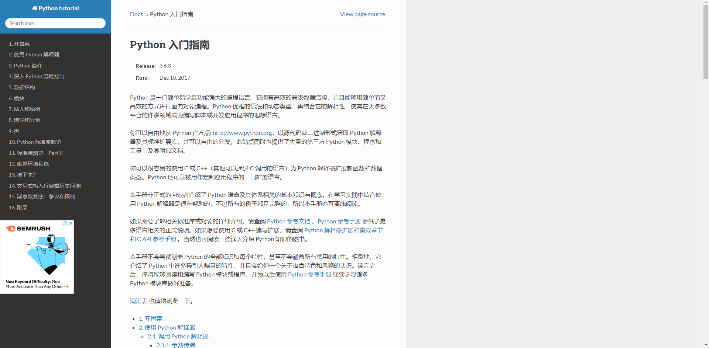

# Python

Yet an introduction of Python3.

if you want to learn Python2, you can find Python2 version of this doc in Python document.

## Reference

Link: http://www.pythondoc.com/pythontutorial3/index.html